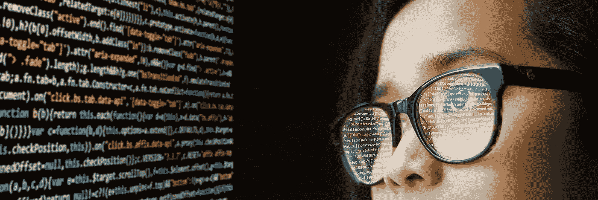

# 软件可靠性第 2 部分:为最坏的情况做准备，为最好的情况编码

> 原文：<https://levelup.gitconnected.com/software-reliability-pt-2-code-for-the-best-by-preparing-for-the-worst-9f4109f608e1>

构建伟大的软件就像下棋。有什么相似之处？嗯，就像在这项运动中一样，你必须在你的每一个动作中都将主要目标放在你脑海的最前面，在我们的情况下，就是我们编写的代码行。然而，任何一个像样的棋手都会告诉你，如果你想赢，仅仅知道你必须做什么是不够的，你必须同样重视你如何去尝试赢。例如，为了设计世界级质量的软件，程序员必须在他们的方法中使用策略。简而言之，编码前要思考。但这只是这个过程中重要的一步，建立可靠性需要的不仅仅是程序员戴上思考的帽子(向 Edward De Bono 大喊)。那么一个团队可以采取哪些实际的步骤来达到这个目标呢？这是我的两分钱…

**用可靠性规格做最坏的打算**

为最坏的情况做准备是我们在生活的大多数方面都会做的事情，软件开发应该也不例外。想想优步和特斯拉的自动驾驶汽车，我很确定它们是由软件组成的，最基本的形式是带有一组指令的程序，比如决策结构。你能想象如果他们的算法只考虑完美的场景会是什么结果吗，比如路上没有交通，没有路线重定向，燃料永远不会耗尽，停车位总是可用，等等？工程团队必须问这样一个问题，“最坏可能会发生什么？”，并在那里工作。如果你想在这个过程中激励你的团队，最好不要在你的演讲中提及墨菲定律。

> “任何可能出错的事情都会出错”——墨菲定律

软件规范必须不仅仅包括系统应该做什么，它们必须考虑系统在异常情况下应该如何表现。我认为优秀的工程师应该遵循最佳实践来开发在这种情况下采取有意义和有用的行动的软件。正如在这个简短系列的第 1 部分中提到的，影响可靠性的是软件故障，而不是软件错误。软件故障的后果取决于故障的性质，因此重要的是要有一个文档来概述这些可能出错的事情，以及在它们确实发生的情况下可能产生的成本。

大多数软件系统是由其他子系统或子组件组成的，每个系统都应该有可靠性要求。我知道由于时间因素，这个过程可能会非常昂贵。降低成本的一种方法是测量这些不同子系统中故障的影响，并以此来确定每个子系统的可靠性要求。例如，在基本模块或子系统上强加与支付交易子系统相同的最大可靠性水平可能不是明智之举。

可靠性规范应该有确定的子系统，每个子系统中可能发生的不同软件故障，以及对这些故障后果的评估。

**用异常处理做最坏的打算**

我猜你已经知道什么是异常，但是我还是要继续定义它。它是指在程序执行过程中发生意外事件，通常但不总是错误。曾经编写(或编码)一个函数来发出一个 API 请求，并且没有考虑任何类型的失败发生吗？对于这类事情，异常处理非常有用。幸运的是，今天大多数编程语言都有内置特性来帮助解决这个问题。根据用例的不同，您可以选择使用决策结构(if 语句)或者更流行的“Try”和“Catch”块。Try/catch 块是专门为处理异常而设计的，可能更常用。

人们可以简单地在整个展示中编写 try/catch 块，但这不一定有帮助。你可能会在你的软件中制造一个低效的问题；我们不想浪费系统资源，比如内存。这就是为什么可靠性规格如此重要，它告诉我们如何进行异常编程，系统的哪些部分需要它，以及需要到什么程度。软件系统的某些部分可能需要嵌套的 try/catch 块，而其他部分则不需要。

这就是为什么可靠性规范如此重要，它告诉我们如何进行异常编程。软件系统的某些部分可能需要嵌套的 Try/Catch 块，而其他部分则不需要。

**用防御程序做最坏的打算**

我相信你以前听说过这句话，也许这句话已经有点老生常谈了，但我认为这对开发人员来说是一个教训:

> 防守赢得冠军——贝尔·布莱恩特(阿拉巴马州传奇足球教练)

这不仅仅是一个可爱的引用。尽管如此，我们确实要问这样一个问题，“这在编程中看起来像什么？”

> 防御性编程是一种程序开发方法，通过这种方法，程序员假设他们的程序中可能存在未被发现的错误或不一致之处

例如，永远不要相信用户的输入。你不需要我告诉你，是吗？如果你已经有了几年(甚至几个月)的开发经验，我相信你的经验是这方面的好老师。我们必须以这样一种方式编程，即我们的系统以一种严格和防御性的方式处理任何传入的数据。

外部输入不是我们需要警惕的唯一事情。如果你在一个团队中工作，可能最好是以积极的态度对待其他开发人员的代码，以及你自己的代码。我在上一篇文章中提到的等式应该成为你的新咒语:

*糟糕的软件工程===糟糕的软件质量*

程序员有不同的思维方式和应用逻辑的方式，这不是一件坏事。然而，这种逻辑或思维方式可能会以不好的方式转化为代码。因此，加强某些风格、模式和组织代码的方式可能是一个好主意，这有助于防止软件故障，以及从故障中恢复。

防御性编程的目标是防止错误，以便我们开发的软件保持高水平的质量和性能，即使在意外输入和用户操作的情况下，这种情况也会发生。

嗯……我还没碰过测试。我想我闻到了第三部分的味道。

**话虽如此…**

构建可靠的软件是一项艰巨的工作。不仅如此，这是一个昂贵的过程，因为它需要大量的时间来计划，以及为它编程。这不是一个人的工作，因为软件开发生命周期有不同的方面，当谈到质量时，他们必须朝着同一个方向努力。你可能不得不面对在你的开发伙伴或者团队的其他成员中被贴上理想主义者的标签。但我们需要能够看到过去，因为构建可靠的软件是那些高度重视工艺并理解它对最终产品及其用户的影响的人的任务。

参考资料:

伊恩·萨默维尔的软件工程

 [## 防御性编程的艺术

### 为什么开发者不写安全代码？我们在这里不再讨论“干净的代码”了。我们正在谈论…

medium.com](https://medium.com/web-engineering-vox/the-art-of-defensive-programming-6789a9743ed4)  [## 异常编程

### 你很特别。你的代码不也应该是吗？

medium.com](https://medium.com/pointer-io/exceptional-programming-62ea8150f61f)