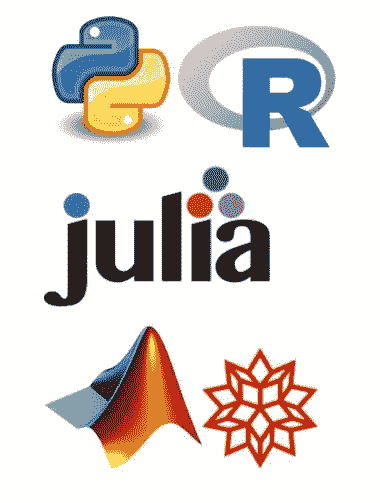

# 数学家的软件工具

> 原文：<https://levelup.gitconnected.com/software-tools-for-mathematicians-ac1cfdfe6c8>



如果您在工作或学习中使用数学，并且对开发自己的数学相关软件感兴趣，那么本文适合您。通常，大多数精通形式科学的人都会写一些代码。然而，从编写一些代码到开发功能性的、可共享的软件解决方案并不总是一帆风顺的。我希望这本指南能对你的旅行有所帮助。

## 操作系统

让我们从最不值得担心的决定开始。除非你是微电子爱好者，否则只有三种选择:Mac、Windows 或 Linux。Linux 当然有许多不同的风格，并被认为是高级用户的操作系统，主要是因为大量的选择给了你足够的绳索以不同的方式吊死自己。

我的建议是坚持你所知道的。忠实的 Mac 用户不太可能喜欢使用 Windows 或 Linux，反之亦然。你迟早会需要使用一些类似 Unix 的命令语言。如果您使用的是 Windows，这只是一个问题，但事实证明有很多选项:

*   Windows 10 有一个“用于 Linux 的 Windows 子系统”，可以在 Windows PowerShell 上启用 Linux 命令。这里有一篇关于如何安装的好文章:[https://www . how togeek . com/249966/how-to-install-and-use-the-Linux-bash-shell-on-windows-10/](https://www.howtogeek.com/249966/how-to-install-and-use-the-linux-bash-shell-on-windows-10/)
*   如果你安装了 Git(稍后会详细介绍)，它会附带一个 Git Bash Shell，可以理解 Linux 命令:[https://www . stanleyulili . com/Git/how-to-install-Git-Bash-on-windows/](https://www.stanleyulili.com/git/how-to-install-git-bash-on-windows/)
*   [Cygwin](https://www.cygwin.com) 是一个完整的类似 Linux 的 windows 环境，可以让你根据需要安装软件包，并在 Windows 上编译 Linux 程序。我想说，这是为那些由于某种原因而受困于 Windows 的更高级的 Linux 用户提供的一个解决方案。

## 码头工人

大多数成熟的软件都被移植到所有流行的操作系统中。如果您发现您需要的工具没有移植到您选择的操作系统，您还有一些选择:

1.  寻找一个别人已经创建的 docker 映像，您可以下载并使用它。
2.  尝试从源代码构建它。你不一定需要知道你在做什么，因为通常有指示来指导你。然而，如果构建由于某种原因失败了，你可能会走进死胡同。
3.  找一家提供虚拟实例的云提供商，你可以在那里安装和运行软件。几乎肯定会有与此相关的小成本。

Docker 是这些解决方案中最不痛苦的，因此它是值得添加到您的工具箱中的东西。Docker 是一个开发、发布和运行应用程序的开放平台。一旦安装了 docker，通常很容易找到一个预构建的应用程序(称为映像)并在您的机器上运行它。

下面是一个例子，说明如何用两个命令安装和运行 elastic-search:

```
docker pull docker.elastic.co/elasticsearch/elasticsearch:7.11.1docker run -p 9200:9200 -p 9300:9300 -e "discovery.type=single-node" docker.elastic.co/elasticsearch/elasticsearch:7.11.1
```

应该注意的是，在 Docker 上运行的应用程序会比本地运行的慢。

## 编程语言

选择一种编程语言很大程度上取决于你的个人偏好和目标。学习任何语言都需要很大的投入，因为困难不在于适应语法和习惯用法，而在于掌握语言周围的库和开发生态系统。幸运的是，专门面向科学计算的语言屈指可数。如果你不确定该选择哪一个，以下是我推荐的流程:

1.  决定你想从事什么类型的项目。
2.  通过搜索 [GitHub](https://github.com) 、 [Kaggle](https://www.kaggle.com) 、 [Stack Overflow](https://stackoverflow.com) 等等，在开源领域寻找相关项目
3.  看看大多数其他人在这些项目中使用哪种语言。

此语言列表及其描述也可能对您有所帮助:

*   [**Python**](https://www.python.org) 是一种非常流行的通用编程语言，它为科学计算提供了数量惊人的资源。Python 被广泛用于数据科学、金融应用、工程、物理，但也用于许多非科学应用。它巨大的灵活性和丰富的资源使它成为一门很难掌握的语言，但好消息是，你遇到的每一个问题都可能已经有了解决方案。
*   R 把自己标榜为一种用于统计计算的语言，但是它有大量的库用于任何种类的科学应用。它可以在所有主要的操作系统中使用，只有几个 ide 可以使用，最流行的是 RStudio。软件包非常容易安装，而且大部分工作都没有问题。如果您主要对数据科学和/或统计应用感兴趣，并且希望快速获得结果，请选择 R。
*   [**朱丽娅**](https://julialang.org) 是街区里的新小子。它是专门为现代科学和分布式计算而设计的。它拥有越来越多的爱好者，但截至目前，它远不如 Python 或 r 受欢迎。如果你喜欢处于风口浪尖，但预计资源稀缺，请选择 Julia。
*   [**Matlab**](https://www.mathworks.com/products/matlab.html) 是一种为数学应用而设计的语言，带有非常直观的语法、大量的软件包和漂亮的图形。它在学术界很受欢迎，在那里它以很低的价格出售，但在企业界，它的订阅费很高。您将需要为额外的软件包支付更多的费用，甚至为部署在服务器上支付更多的费用。还有一个开源的替代品叫做 [**八度**](https://www.gnu.org/software/octave/index) 。我已经在一些玩具项目中使用了它，看起来效果不错，但是我没有感觉到它受到了广泛的欢迎。
*   [**Mathematica**](https://www.wolfram.com)**是另一款为数学应用设计的高质量产品，包括符号计算，也需要付费订阅或一次性购买。与 Matlab 一样，在学术界获得它更便宜。**

## **开发流程资源**

**无论您选择哪种语言，相同的不变量将适用于开发过程:**

*   **您希望确保您构建的代码能够正常工作**
*   **您希望每次进行更改时代码都能继续工作**
*   **或者，您可能希望其他人理解您的代码并与您合作**

**实现这些目标的关键是**源代码控制**。源代码管理是一个存储库，您不仅可以在其中存储代码，还可以跟踪整个变更历史。这个工具对于软件项目的合作是必不可少的。这对于孤独的程序员来说也非常有用，以防你破坏了一些东西，你需要参考上一个工作版本来找出哪里出错了。**

**最流行的源代码控制工具是 [Git](https://git-scm.com) ，所以你不需要探索任何其他选项，除非你有具体的理由。Git 分为两部分:安装在计算机上的部分和实际存储代码的部分，后者是一个在线存储库。幸运的是，有一些存储库可以让你免费托管你的代码:**

*   **GitHub 是托管开源项目的最流行的存储库。你可以获得无限的公共存储库和一个免费的私有存储库。如果你有付费订阅，你可以获得更多的私人资料库和其他服务。**
*   **如果你更隐秘，想让你的项目保持私密，那么 [GitLab](https://github.com) 提供无限量的免费私有库。**

**这些托管服务提供的不仅仅是纯粹的源代码控制。他们最重要的产品之一是**持续集成**。为了理解这个概念的巨大好处，考虑一下你需要做什么来保证你的代码每次都能正确运行。**

1.  **对于您开发的每个软件模块，编写一个或多个测试来验证它是否按预期工作。测试应该是这样的，每次你运行它，你得到相同的结果。**
2.  **由于软件模块不是孤立存在的，而是经常相互作用的，所以您还需要确保所有其他模块继续正确运行。这可以通过重新运行您为其他模块编写的所有测试来实现。**
3.  **如果有任何失败，获取问题的描述，以便您可以修复它并重复该过程。**

**GitHub 和 GitLab 提供了一些机制，一旦你提交了新的修改，它们会自动编译你的代码并运行测试。如果此操作失败，将会通知您。这个过程保证了只有工作代码最终会出现在存储库中。这篇[文章](https://medium.com/software-science/keeping-a-secret-a0d7028c6607)包含了如何使用 GitHub 的概述。尽管本文引用了 Java，但是相同的机制也适用于各种语言。**

## **其他资源**

**最后，我列出了一些对软件科学家实践非常有用的额外资源:**

*   **Kaggle 最初是一个机器学习竞赛平台，现在它已经发展成为一个数据科学社区，人们可以在这里获得数据集，检查其他人的解决方案，阅读文章，教程等等。**
*   **[Wolfram Alpha](https://www.wolframalpha.com) 是一款在线超级计算器，可用于计算复杂的数学表达式，包括积分、幂级数、微分方程等的解析解。**
*   **[Jupiter 笔记本](https://jupyter.org)为展示和分享你的想法提供了一个很好的方式。笔记本结合了代码、故事和图表，使其成为一种可读性很强的资源。它们过去只用于 Python，但现在已经扩展到其他语言，包括 R 和 Julia。**
*   **Latex 是一个高质量的排版系统，用于制作科学文档。它包含了几乎所有你能想到的数学符号。**