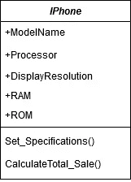
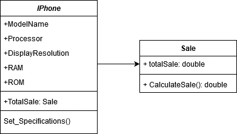
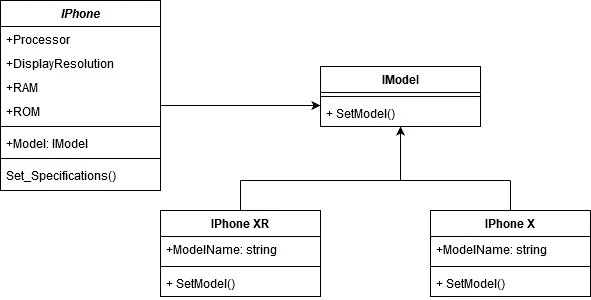
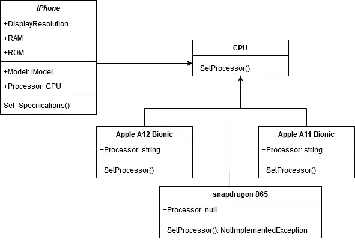
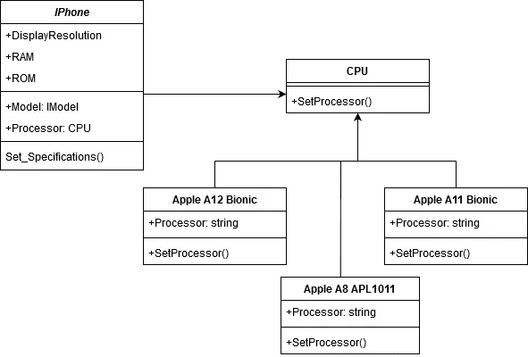
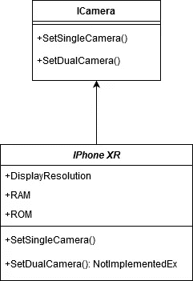
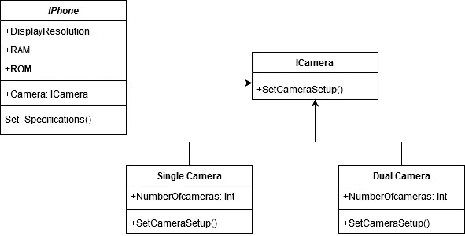
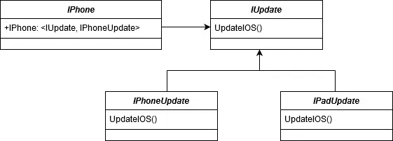
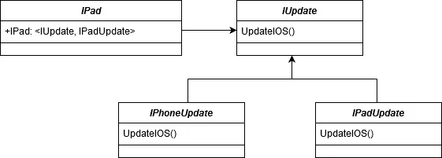

# 用 UML 简化了可靠的设计原则

> 原文：<https://levelup.gitconnected.com/solid-design-principles-simplified-with-uml-8432a3406248>

> 让我们用一个大例子来学习坚实的原理。这也是最常见的面试问题。首先，我们需要分解缩写。

S. 单一责任原则

O. 开放封闭原则

L. 利斯科夫替代原理

I. 界面偏析原理

D. 依存倒置原则

# 很酷吧？让我们逐一探究。

1。 **单一责任原则:**一个类必须有一个具体的责任，没有别的。它应该改变只有一个原因。因此责任实际上被封装在类中，说我们的类有一个责任。

正如您在这个 UML: class 中看到的，IPhone 具有可以定义 IPhone 的属性。但是等等，CalculateTotal_Sale()在这里做什么？

你看出问题了吗？计算总销售额不是 IPhone 类的责任

**问题:**如果明天我有 IPad 类，我将不得不为那个类重新编写相同的方法。

**解决方案:**相反，我们可以将计算总销售额的责任转移到新的 sale 类中。IPhone 可以封装销售额来计算其总销售额。

这里，现在一个销售正在管理计算 TotalSale()的责任。而我们的 IPhone 类只是简单的重用这个责任而不是自己创造一个。因此 IPhone 有了 TotalSale() 。

2。 **开-关原理:**开为扩展，关为修改。软件实体(对象、*模块、功能*)应该对扩展开放，但对修改关闭。这仅仅意味着一个实体应该容易扩展而不需要修改它们自己。

**问题:**我们知道不同的 IPhone 型号有不同的规格，对吧？ **IPhone XR** 与**IPhone x**的规格不同

**解决方案:**我们必须抽象我们的问题，以便我们的 IPhone 类可以基于模型类型委托它的实现。

现在，IPhone 可以要求特定的型号，并根据它得到的型号设置规格。

这里的 IPhone 类是封闭的修改，但它是开放的扩展。请注意，IPhone 类现在封装了一个 IModel。所以 ModelName 属性不再是 IPhone 类的责任。我们再次使用我们的第一个设计原则(单一责任)。我们的抽象足够通用，可以满足苹果创造的任何模型。

我们的客户:一部 IPhone 不需要仅仅因为苹果决定推出新型号**(关闭修改)**而改变。苹果现在可以有“n”个型号**(开放延期)**。

3。 **利斯科夫的替换原则:**父类应该很容易被它们的子类替换。

在我们上面的 UML 中，我们可以看到，我们已经创建了 IModel 接口，现在任何继承 IModel 的类都必须定义它的所有方法，以满足 IS-A 关系，否则会出现编译时错误。但是当你继承类而不是接口时，你的编译器就不存在了。

IPhone 有一个 CPU 类，IPhone 可以有仿生芯片，但没有一个 IPhone 与骁龙兼容。

**问题:**你见过有骁龙的 IPhone 吗？**见鬼不！！！，对吧？**

因此，当我们试图将骁龙的 CPU 组装到我们的 IPhone 类时，它会抛出一个错误，正如你在 Snapdragon865 类中看到的那样，它会抛出未实现的异常。因为 IPhone X & XR 只兼容仿生芯片。

**解决方案:**我们不应该拥有没有完全实现其父类行为的子类。

苹果用 A8 代替骁龙，用于 IPhone 6。因此，它与 Iphone 兼容。

4。 **界面隔离原则:**记住单责任原则？这是相同的原则，但这一原则适用于接口。

**问题:**我们不应该有更一般化的接口。也就是说，我们必须避免在一个单一的接口中混淆所有的东西，然后强迫它们的具体类定义那些它们可能不需要的方法，它们最终会抛出 NotImplementedException。

相反，我们必须有许多特定于客户端的接口，而不是一个通用接口。

我们有 2 部 Iphone XR & X:**Iphone XR 有单摄像头**而 **IPhone X 有双摄像头**。因此，IPhoneXR 定义双摄像头是错误的，因为它没有双摄像头。这里 IPhone XR 只定义了单摄像头，DualCamera 抛出了一个异常。

**解决方案:**如前所述，我们不应该有一个一般化的接口。我们可以有顶级的抽象，但是实现必须根据他们的需求分解成小块。

在这里类 IPhone 可以设置相机基于他们的模型。

类别 IPhone 有一个摄像头，根据型号类型可以是单双摄像头。对于 XR，它是单摄像头设置&对于 X，它是双摄像头设置。

5。 **依赖反转原则:**我们的应用必须是松耦合的。类应该依赖于抽象而不是具体。因为随着应用程序的增长，紧密耦合的应用程序会变得更加复杂。

**问题:**我们在 IOSUpdate & IPhone 之间有紧密耦合。因此，如果明天苹果需要为 IPad 进行 IOS 更新，那么我们将不得不建立一个更紧密的耦合关系，随着应用程序越来越多，维护变得越来越困难。

IOSUpdate 与 IPhone 紧密耦合。

**解决方案:**一个抽象。应该有松散耦合的类，而不是直接与具体的类通信。

IUpdate:抽象。IPhoneUpdate 和 IPadUpdate 是抽象的具体类。

正如你在上面看到的，IUpdate 是一个有 2 个具体类的接口。当我们的客户端(在本例中是 IPhone)请求更新时，我们可以简单地在构造函数或方法中注入 IPhoneUpdate 依赖项。

对于一个 IPad 来说，就是注入了 IPadUpdate 依赖。

所以将来，当苹果需要一个新产品，比如 MacBook，我们可以简单地创建一个 MacBookUpdate 类，它将是 IUpdate 接口的具体表示。而客户端 MacBook 可以解决<iupdate macbookupdate="">依赖。</iupdate>

> 依赖倒置本身是一个需要学习的广泛话题。
> 
> 我已经在我的另一个博客中提到过，如果你想了解它的工作原理，请随意访问:

 [## 什么是依赖注入，依赖注入有哪些类型？如何实现 DI？

### IOC 和 DI 帮助我们摆脱对代码的依赖。为什么我应该使用依赖注入？假设我们有一个…

www.c-sharpcorner.com](https://www.c-sharpcorner.com/blogs/what-is-dependency-injection-and-what-are-its-types2) 

# 与我联系:

> [**https://github.com/RikamPalkar**](https://github.com/RikamPalkar)
> 
> [***https://www.linkedin.com/in/rikampalkar/***](https://www.linkedin.com/in/rikampalkar/)
> 
> [**【https://www.c-sharpcorner.com/members/rikam-palkar】T21**](https://www.c-sharpcorner.com/members/rikam-palkar)
> 
> [***https://twitter.com/rikam_cz***](https://twitter.com/rikam_cz)