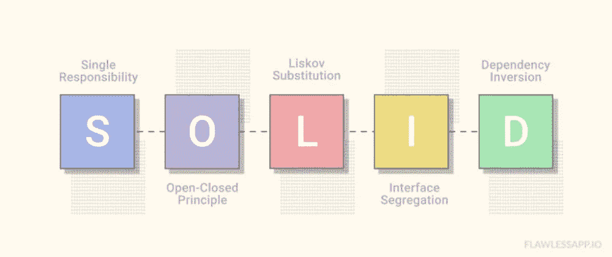
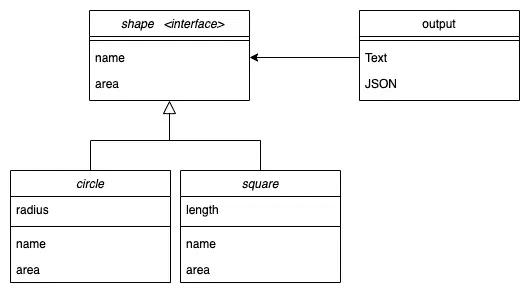

# 举例说明戈兰语中的固体原理

> 原文：<https://levelup.gitconnected.com/solid-principles-in-golang-explained-by-examples-4a4cccf47388>

[源链接](https://dev.to/josuerodriguez98/introduction-to-solid-principles-4o2d)

对于有经验的程序员来说，这些坚实的原则并不陌生。它们为我们提供了如何安排函数和数据结构以及如何组织互连类的指导方针。

在这一系列的帖子中，我们要用 Go 写的例子来谈谈如何正确实现。

这篇文章将关注第一个原则，即**单一责任原则** (SRP)

## SRP 是什么？

> 一个模块、类或函数应该只对一个利益相关者负责。
> 
> 罗伯特·马丁

只有一个利益相关者有权更改模块、类或函数。

理解这一原则的最好方法是看一个违反这一原则的臭名昭著的例子。

## 例子

我们可以看到，函数(#12-#15) `area()`违背了单一责任原则。因为它会因为两个原因而改变。首先，面积的计算可能会因为某种原因而改变。第二，输出的显示格式也可能改变。

将两个在不同时间因不同原因而变化的事物联系在一起是一个糟糕的设计。

SRP 说一个问题的两个方面是两个独立的责任。因此，它们应该在单独的类或模块中。

## 更多考虑事项…

在解决上述问题之前，让我们考虑一些其他问题

*   如果我们想在不影响面积计算的情况下改变演示文稿呢？
*   如果我们也想输出 JSON 这样的另一种数据格式呢？
*   如果我们添加另一个*正方形*形状会怎么样？

要处理以上问题，银弹就是**把可换的部分分开。**

让我们开始做代码**重构**！

## 怎么做重构？

现在，我们组织新的源代码依赖关系，以确保对其中一个职责的更改不会导致另一个职责的更改。

正方形/正方形问题架构

*   `Output`有两个功能:`Text`和`JSON`。它们是两种独立的表示格式。
*   `Output`依赖于`shape`接口，该接口有两个方法`name`和`area`
*   `Circle`和`Square`是`shape`接口的两个实现

我认为下面的代码是不言自明的。

发现这篇文章很有用👏？看看我下面的其他文章吧！

1.  [如何永远记住所有这些分类概念](https://medium.com/swlh/how-to-remember-all-these-classification-concepts-forever-761c065be33)
2.  [Golang 频道是如何运作的？](/how-does-golang-channel-works-6d66acd54753)