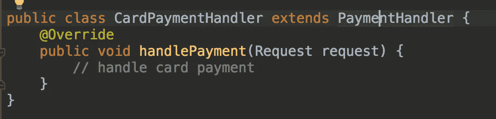
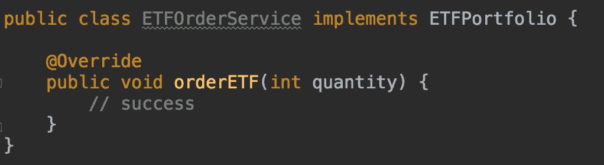

# 坚实的原则—用插图简化

> 原文：<https://levelup.gitconnected.com/solid-principles-simplified-with-illustrations-fe5265f68ec6>

神盾局原则的重要性

**S.O.L.I.D 原则**

# **简介**

作为开发人员，我们总是与遗留代码库打交道。大多数遗留代码库都有紧密耦合的类、冗余代码和较少的测试覆盖率。这使得开发人员在快速浏览代码时很难理解代码库的功能。

想象一下，为了修复一个 bug 而遍历一个类中无穷无尽的代码行是多么痛苦。开发人员可能最终读的代码比写的代码多。此外，修复一个流可能会导致破坏另一个流。这让我想起了下面这个著名的迷因。

**修复一个 bug &你还有 10 个准备好了**

由于在遗留软件中没有积极的开发，这使得开发人员和管理人员进退两难。然后，团队考虑重写整个服务，放弃旧的服务。

# **为什么是软件设计原则？**

在当今不断发展的世界中，客户需求以前所未有的速度不断变化。对于软件团队来说，适应新的需求并快速发布变更变得至关重要。为了实现这一点，有必要减少软件开发和测试时间。

同时，每隔一年推出新技术。通过替换现有技术来试验更优化、更高效的技术是很常见的。因此，编写的代码必须灵活和松散耦合，以引入任何变化。

写得好的代码容易掌握。一个新的开发人员不必花更多的时间阅读代码，只需修改其中的一部分。维护良好的软件因此提高了开发人员和团队的生产力。此外，高测试覆盖率增加了部署新变更的信心。

南 O.L.I.D 是 Michael Feathers 创造的首字母缩略词，是 Robert Martin(鲍勃大叔)发表的原则子集。我们将详细介绍这五项原则，并逐一进行说明。

# **S —单一责任原则**

这是最容易理解的原则之一。它声明“一个类只能有一个改变的理由”。很多时候，你可能会发现一个类执行了比它应该做的更多的功能。

让我们假设你正在为银行软件写代码。该功能是为给定用户显示一条语句。该代码从数据库中获取数据，并以用户选择的格式显示数据。你最终会写出下面的代码。

**银行声明管理器**

从上面的代码片段可以看出，类'***BankStatementMgr***'正在同时执行多项任务。它从数据库获取数据，解析结果，然后以用户指定的格式显示。您可以观察到以下缺陷:

*   没有责任分离。如果引入了新的格式或添加了新的数据库列，这个类将需要更改
*   该类与数据库驱动程序紧密耦合。DB 驱动程序或 SQL 查询中的任何更改都将导致该类的修改
*   不能孤立地测试事务的格式，因为它不是由 *BankStatementMgr* 公开的
*   代码不是模块化的，因为多个功能交织在一起

上述缺点可以通过以下方法来克服

*   定义一个单独的格式化程序，其职责是格式化事务
*   添加一个数据库访问对象或 DAO，它将封装数据库驱动程序并完成所有繁重的查询工作
*   *BankStatementMgr* 将请求委托给 DAO 获取数据，然后将响应传递给格式化程序进行修饰
*   通过这种方式，我们可以隔离测试 DAO 和 Formatter，并实现松耦合。因此，通过分离责任，它将使代码模块化

以下是我们修改后的代码:-

**银行声明经理**

**语句格式化程序**

**交易道**

仍然有很大的改进空间，我们将在接下来的章节中看到我们如何重构并做得更好。

# **O —开闭原理**

这个原则规定代码应该对扩展开放，对修改关闭。如果需要添加新的功能，必须扩展该类。此外，为了使系统可扩展，它的行为应该被隔离。

我们将通过一个例子来理解这一点。假设你是一个接受不同模式付款的电子商务商家。你整合了 Paypal、Wepay、Google Pay 等不同模式，开发了支付处理器。你想出了下面的代码。

**支付处理器**

**支付处理员**

***支付处理程序*** 处理支付请求。***payment processor***确定模式并将其委派给正确的操作。该代码违反了开闭原则，因为任何功能都需要修改 *PaymentProcessor* 和 *PaymentHandler。此设计不可扩展，因为每个新的支付模式都会在 switch 语句中引入一个新的 case 块。*

为了使代码可扩展，我们可以使 *PaymentHandler* 抽象并定义一个处理支付的方法。为了处理新的支付模式，我们可以扩展这个基类并覆盖它的 handlePayment 方法。下面是新代码。

**摘要支付处理程序**

**谷歌支付处理程序**

**CardPaymentHandler**

我们现在将创建一个工厂类，它将负责存储特定的处理程序并根据模式返回它。

**支付工厂**

**支付处理器**

我们的新代码现在符合开闭原则。要添加新的行为，我们只需要扩展我们的抽象类 *PaymentHandler* ，并在工厂中进行相同的配置。没有必要修改 PaymentProcessor。

# **L —利斯科夫替代原理**

乍一看，这个名字听起来很吓人。该原则指出，同一超类的对象应该能够在不破坏现有代码的情况下相互替换。

我们将以开发电影的 scrapper 为例。scrapper 提供了一个按电影名或演员搜索电影的界面。

**电影搜索**

**IMDB 搜索**

**烂番茄搜索**

**使用电影搜索接口的客户端代码**

我们有两种不同的实现。一个是烂番茄，另一个是 IMDB。它们都是可替换的，可以使用相同的界面访问。

如果派生类中的方法没有实现，则违反了该原则。以下是违反利斯科夫原则的一个例子。

**all movie search**

在这种情况下，我们不能用所有电影替换其他派生类，如 IMDB 和烂番茄。它没有实现方法*searchbymovinename*，因此不会在客户端代码中产生一致的行为。

# **I —界面分离**

根据这个原则，客户机不应该实现它不需要的方法。如果您定义了客户机不使用的方法，那么接口会变得太大并且被污染。

如果一个混合功能的接口变得太大，将它分离成多个较小的接口是有意义的。让我们看一个投资组合服务的例子，它允许客户订购股票、ETF、期权等

**界面组合**

我们已经定义了一个接口 ***投资组合、*** ，允许客户订购股票、ETF 以及两者的组合。

**ETFOrderService**

**StockOrderService**

我们有两个不同的 ***组合*** 服务实现。观察到***StockOrderService***没有实现 *orderETF* 和*orderstocandetfs*方法。这同样适用于***ETFOrderService***，它只实现 *orderETF* 方法。

如果我们决定在订购股票时将价格作为一个参数。它需要修改 *orderStocks* 方法来接受价格作为参数。此外，这种变化将不得不由 ***ETFOrderService、*** 来合并，即使它不支持 *orderStocks* 方法。

为了克服这一点，我们可以将界面分成两个部分——a)股票投资组合 b)ETF 投资组合

***股票组合***

**ETFPortfolio**

有了新的接口，StockOrderService 不需要处理 ETF 的订购。这同样适用于 ETFOrderService。

**ETFOrderService**

**StockOrderService**

界面分离与单一责任和利斯科夫替代原理有一些相似之处。

在上面这个庞大接口的例子中，我们在 StockOrderService 中抛出了一个异常。这违反了利斯科夫替代原理。在这种情况下，派生类没有扩展功能。

如果在接口中定义了不相关的方法，那么该类将有多种理由进行更改。这违反了单一责任原则。

# **D —依赖性反转**

根据依赖倒置，程序中的高级模块不能与低级模块紧密耦合。两个模块都必须依赖于抽象。这个原则提供了一种机制来构建松散耦合的软件模块。

让我们看看下面的例子。在这个例子中，类 *OrderHistory* 从 PostgreSQL 数据存储中获取数据。

**订单历史**

***OrderHistory*** 类必须知道 PostgresDB 依赖的实现细节。如果我们决定使用不同的数据库驱动程序，我们需要用新的依赖关系替换所有的 ***PostgresDB*** 的实例。

此外，数据库驱动程序的一个功能是什么？还需要修改调用 DB 驱动方法的***order history****类。*

*这种耦合可以通过声明接口***DataStore****来移除。*该接口将公开消费者将调用的 API。我们可以有多个 ***数据存储***——a)Postgres 数据存储 b) MySQL 数据存储 c) S3，等等*

**

***数据存储***

**

***PostgresDataStore***

**

***订单历史***

*我们的消费者类现在不必处理正在使用的数据存储的底层细节。高级模块 ***订单历史*** 依靠接口数据存储来访问数据。下级 ***DataStore*** 实现中的任何变化对***order history****没有任何影响。**

*此外，由于这些模块是松散耦合的，它们可以被独立测试。使用依赖注入，可以很容易地在高级模块中注入新的实现。*

# ***结论***

*以上五个原则构成了软件工程中遵循的最佳实践的基石。在日常工作中实践上述原则有助于提高软件的可读性、模块化、可扩展性和可测试性。*

*最终，它有助于构建易于理解的维护良好的软件。遵循上述实践有助于提高开发人员的生产力和工程团队的敏捷性。*

# ***参考文献***

*   *[Android 中的坚实原理](https://proandroiddev.com/exploring-s-o-l-i-d-principle-in-android-a90947f57cf0)*
*   *[固体原理简化版](https://itnext.io/solid-principles-explanation-and-examples-715b975dcad4)*
*   *[利斯科夫替代原理](https://dev.to/erikwhiting88/liskov-substitution-principle-in-3-minutes-2dc6)*
*   *[通过应用坚实的原则成为更好的开发人员](https://www.youtube.com/watch?v=rtmFCcjEgEw)*
*   *[五分钟扎实原理](https://medium.com/swlh/s-o-l-i-d-principles-explained-in-five-minutes-8d36b1da4f6b)*
*   *[封面照片](https://www.google.com/url?sa=i&url=https%3A%2F%2Fwww.pinterest.com%2Fpin%2F393220611216597358%2F&psig=AOvVaw1wiqQHCovfFQCcWfgVQYc1&ust=1591728875201000&source=images&cd=vfe&ved=0CAIQjRxqFwoTCNiTpO7z8ukCFQAAAAAdAAAAABAF)*

* [## 编写面试问题

### 一个完整的平台，在这里我会教你找到下一份工作所需的一切，以及…

技术开发](https://skilled.dev)*