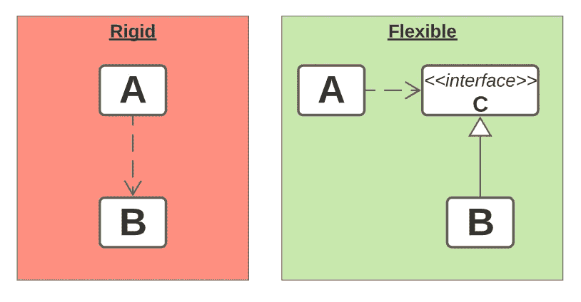
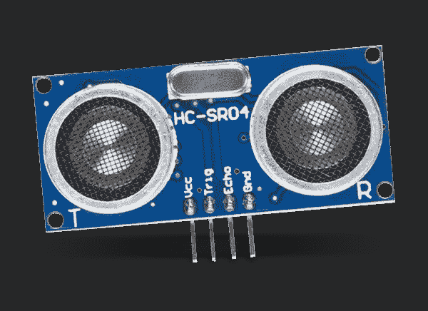
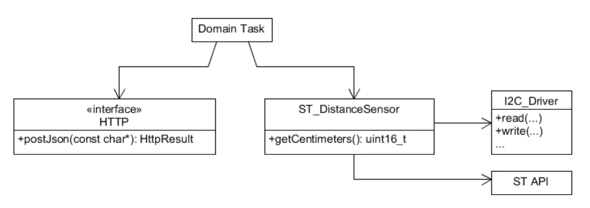
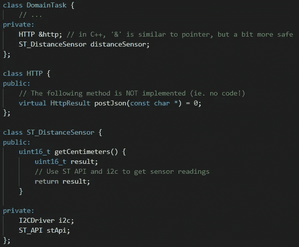
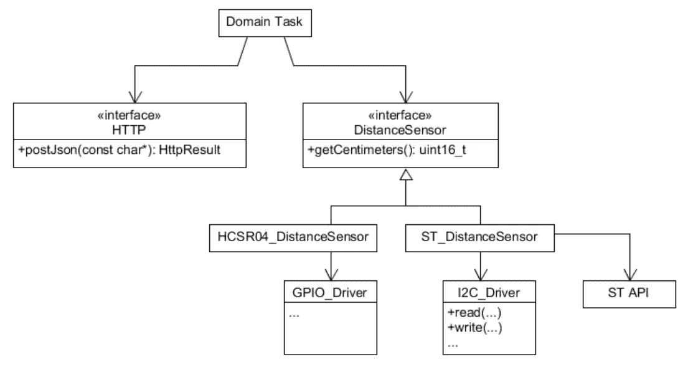

# Arduino 的实体编程:依赖倒置原则

> 原文：<https://levelup.gitconnected.com/solid-programming-for-arduino-the-dependency-inversion-principle-4ce3bdb787d1>

## 面向对象程序设计在业余嵌入式系统中的应用。

如今，越来越多的人坚信，将有意识的软件开发实践应用到微控制器编程中即使不是有害的，也是很困难的。

首先， [OOP(面向对象编程)](https://en.wikipedia.org/wiki/Object-oriented_programming#:~:text=Object%2Doriented%20programming%20(OOP),(often%20known%20as%20methods).)可能成本很高:使用抽象是简单性和效率的折中。此外，不必要的抽象可能会导致代码更加复杂！

最后但并非最不重要的一点是，我们还必须考虑到，并不是每个摆弄 Arduino 兼容微控制器的人都有很强的电子、信息学或 STEM 背景。由于这个原因，当他们看到更高级的开发技术时，可能会感到有点害怕。

## *今天我将为你提供一个有用的、易于遵循的经验法则，让你的 Arduino 相关代码在不同平台之间更加灵活和可移植。*

# ase 研究

几个月前，我不得不在我们的一个嵌入式项目中进行距离测量。在最初的步骤中，我认为一个普通的 *HCSR04* 就足以满足我们的需求。

然而，深入研究领域概念，我意识到我们需要一个防水解决方案，显然简单的 HCSR04 不再能解决我们的问题。

HC-SR04 超声波传感器

几天后，我们换上了 ST[和](https://www.st.com/content/st_com/en.html)生产的激光飞行时间(ToF)传感器，使用别人生产的 Arduino 库草拟了一些代码让它工作，一切都很顺利。

不用说，当我开始将传感器 API 集成到我们的定制固件中时，事情变得更加复杂:我在网上找到的库与并发代码不兼容，我利用了很多并发代码，因为我使用的是 FreeRTOS。

此外，由于传感器寄存器映射太难处理，ST 提供了一个用 C 编写的 API 来与设备交互。你所要做的就是把一个低级驱动程序和 ST 库连接起来，祈祷，希望一切都像预期的那样工作。

但是这有什么意义呢？

## 这里的焦点是清晰易懂的代码:我们的整个应用程序应该关心不同类型的距离传感器吗？我会说不

## 相反，我们应该利用已经确立的原则，比如[依赖倒置原则](https://deviq.com/principles/dependency-inversion-principle):我不会在这里复制和粘贴定义，但是让我用我们的案例研究来重申一下。

# S 系统建模

S 假设您有一个 C/C++模块，它必须与 st 传感器交互以执行读取，然后将结果发送到 HTTP 端点。对于那些熟悉[统一建模语言(UML)](https://en.wikipedia.org/wiki/Unified_Modeling_Language) 的人来说，依赖关系可以用下面的类图来表示。

我们最初的模型

基本上，图表代表这段代码:

我们初始模型的(简化)代码

这里的主要问题是，DomainTask 中的每一段代码都可能容易受到 ST_DistanceSensor 中的更改的影响，这可能是一个正在开发中的自定义类！

## 代码没有清楚地表明 DomainTask 唯一感兴趣的是*获得距离测量的方式*:据我们所知，这可能像读取常量变量一样简单，也可能像发射航天飞机一样困难！

使用 DIP 的一个可能的解决方案是将前面的类图转换成下面的这个:

我们的精致模型

这里，DistanceSensor 代表*“一种获得距离测量的方法”。* 代码方面，会是一个抽象类，没有具体的方法。
是的，我说的是和 Java/C#接口一模一样的东西！

因为 DistanceSensor 接口不包含可执行代码，所以让其他模块依赖它并不容易。
此外，具体的类可以实现我们的抽象所要求的行为，我们的系统将感觉更像一个干净、可理解的即插即用架构:为了说明这一点，我已经展示了如何通过添加一个实现抽象传感器的新类来表达 HC-SR04 传感器。

# 包扎

总而言之，每当你觉得你的代码被不明显和不合理的依赖所纠缠，考虑声明一个额外的类(即接口)，它表示您的系统模块必须满足才能与您的应用程序域兼容的协定。

非常感谢您的关注，我希望这篇文章对您的需求有用。关于进一步的细节，我真的向你推荐这本由罗伯特·c·马丁也就是鲍勃叔叔写的很棒的书。