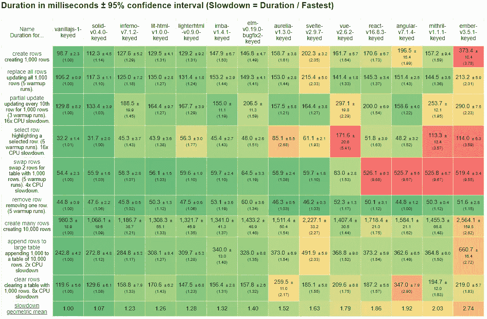

# solid——你从未听说过的最好的 JavaScript UI 库

> 原文：<https://levelup.gitconnected.com/solid-the-best-javascript-ui-library-youve-never-heard-of-297b22848ac1>


来自 Shutterstock

任何人都不希望看到另一个 JavaScript UI 库/框架。持续的决策和追逐独角兽的沉重负担已经超出了疲劳。做东西变得如此容易。Web 组件似乎每隔一天就要负责一个新的“框架”。所以为什么要这么麻烦呢？

我每一步都意识到这个问题。它始于一个明确的目标。

> 证明细粒度的变化检测在现代 JavaScript UI 中占有一席之地。

我知道这是雄心勃勃的，所以我必须把标准定得很高。仅仅有趣或优秀是不够的。我显然认为[的世界是坚实的](https://github.com/ryansolid/solid)，但是我希望在这篇文章之后你会有同样的感觉。

# 表演

虽然这应该是你考虑库的最低标准，但我知道这是我需要开始的地方。有很多选择，为了让这个库值得任何人花费时间，它必须要快。不。快还不够。它无疑是最快的。

你所知道的最快的 UI 库是什么？是 Vue，React，Inferno，Svelte，lit-html，Imba？许多图书馆都声称，至少有一些好的基准。我个人遵从 [JS 框架基准](https://github.com/krausest/js-framework-benchmark)。我写了一篇关于我的基准测试方法的文章，你可以[在这里阅读](https://medium.com/@ryansolid/b-y-o-f-part-4-rendering-the-dom-753657689647)。与此同时，这里是 Chrome 72 官方回购的几个选择框架的截屏:



最下面一行实际上是平均分数。如你所见，与流行的库相比，Solid 的性能完全不同。

# 应用程序接口

Solid 建立在细粒度的变化检测之上，KnockoutJS 和 MobX 也是建立在同样的基础之上。这是一种基于可组合原语的开发体验。有了这样的系统，就不需要虚拟 DOM 了。在许多方面，组件边界是一种去优化，这些原语可以管理自己的更新周期。

我还想借用 Reacts 对读写隔离的使用，因为至少给人以不变性的印象是非常强大的。这种控制解决了这种方法的许多传统缺点。我知道我想让它变得现代和可编译，所以我选择 JSX 作为我的模板语言。这提出了一个有趣的挑战，因为虽然控制流可以在 JS 中完成，但我想抽象记忆化和细粒度执行的细节。解决方案是对控制流使用 JSX 标记。

我确实觉得我做这件事有点疯狂，既不是反应也不是典型的细粒度的。但在过去的 5 个月里，React 的方向肯定验证了我的方法。首先是使用非常相似的原语的 React 钩子，最近是由[所描述的](https://medium.com/u/d9b1a61823fa#what-is-react-velcro)。除了我觉得固体做得更好。

```
const App = () => {
  const [state, setState] = createState({ counter: 0 }),
    timer = setInterval(() =>
      setState({ counter: state.counter + 1 })
    , 1000);
  onCleanup(() => clearInterval(timer));
  return <div>{( state.counter )}</div>
}
```

每个框架都有它的“反”例子，所以这看起来应该是相似的，除非你将它与 React 挂钩进行比较，你会注意到缺少了一些，但它仍然工作。你可以在这里看到它的作用[。这就是 Solid 的特点，它始终以最少的代码开发解决方案。](https://codesandbox.io/s/solid-counter-8no2n9k94l)

# 哲学

设计 Solid 归结为几个原则。这些来自于在 React 的设计哲学的视角下进行细粒度变更管理的基础。

1.  **声明性数据(不仅仅是视图)。这是一种描述数据行为及其定义的方法。通过将数据行为的所有方面打包在一个地方，这使得组合变得容易。**
2.  **数据流与 UI 模块性没有紧密耦合。如何模块化代码的决定不应该受到性能或数据更新问题的限制。你应该能够根据用户界面的需要分解组件。**
3.  **读/写隔离。**这是 React 的核心要点。单向流和不可变数据只是实现。只要您以这种粒度控制访问，大型系统就可以变得更加可预测。
4.  **简单胜于容易。对于细粒度的魔法来说，这是一个难以接受的教训。明确和一致的约定即使需要更多的工作也是值得的。目的是提供最少的工具作为构建的基础。**

我发现这些原则是非常强大的基石，它们使 Solid 开发变得可预测，并为如何解决任何需要解决的潜在问题提供了强有力的指导。

# 特征

这绝对是一个可能成为陷阱的领域，就像它最大的影响 KnockoutJS 和 React 一样，Solid 使它变得简单。这只是一个库，不是框架。像挖空视图一样，旧组件的模型只是功能。因为 Solid 使用细粒度的更新，并且组件只完整地呈现一次，所以可以简单地通过使用闭包来包装状态。一方面，Solid 只是提供了一组简单的原语，如 createState、createEffect、createMemo 等..这些可以被组合以创建更强大的行为。另一方面，它使用控制流的思想，不仅实现了条件和回退循环，还实现了入口和悬念。当这一切走到一起时，意味着支持大多数 JSX 惯例，如跨页、引用和作为标签的组件。

更重要的是，这种实体不会遭受与大型不可变数据快照进行细粒度反应的传统弱点。Solid 提供了一个数据协调器，它像虚拟 DOM 区分节点一样区分数据，从而允许与 Redux 或 Apollo 等不可变数据存储进行干净的集成，并能够使用类似的模式来管理状态。

```
const useReducer = (reducer, init) => {
  const [state, setState] = createState(init),
    [getAction, dispatch] = createSignal();
  createEffect((prevState = init) => {
    let action, next;
    if (!(action = getAction())) return prevState;
    next = reducer(prevState, action);
    setState(reconcile(next));
    return next;
  }, [ getAction ])
  return [state, dispatch];
}
```

但这还不够。我希望这是 Web 组件友好的。这是大多数虚拟 DOM 库不支持的一件事。这意味着暗影王国意识到半合成事件委托。让模态与 Web 组件一起正常工作也很重要，所以让门户与它们自己的影子根一起工作是必须的。

那还剩下什么？带时间切片的异步渲染？Solid 是细粒度的，因此独立地安排更新是轻而易举的。不需要特殊的构造来异步应用更新。Solid 自己的原语可以推迟和控制更新的传播方式。查看 Solid 对 Sierpinski 的三角形演示的实现，该演示由 React Fiber 推广。

# 我为什么要在乎？

这是最难的。尽管 Solid 已经取得了一些成就，但在一个过度饱和的市场中，它仍然是一个挑战者。仍有许多领域需要关注。CLI 和开发工具是显而易见的。这也需要证明。但这只是伴随着一个寻求改进的社区。我并没有将 Solid 定位为一个真正有竞争力的选项，只是可能是你从未听说过的最好的选项。

现在 Solid 是一个让你自己尝试的好地方，看看你是否喜欢它。如果我在本文中涉及的任何方面看起来有趣，请到 Github 上查看并给它一颗星。我现在最大的挑战是试图建立势头，通过现有的比较继续推广它。我已经花了 4 年多的时间来研究这个，即使这些碎片仅仅在一年多前才真正全部组合在一起。我在这方面花了很多时间，并不断寻找改进的方法。如果有任何值得做的地方，请表示你的支持，我会一如既往地欢迎任何反馈。

[](https://github.com/ryansolid/solid) [## 瑞安固体/固体

### 一个用于构建用户界面的声明式、高效且灵活的 JavaScript 库。-瑞安固体/固体

github.com](https://github.com/ryansolid/solid) 

使用 Solid 构建 Todo 应用程序:

[](/building-a-simple-javascript-app-with-solid-ff17c8836409) [## 用 Solid 构建一个简单的 JavaScript 应用——你从未听说过的最好的 JavaScript UI 库

### 使用 Solid JS 库构建待办事项列表应用程序的指南

levelup.gitconnected.com](/building-a-simple-javascript-app-with-solid-ff17c8836409)