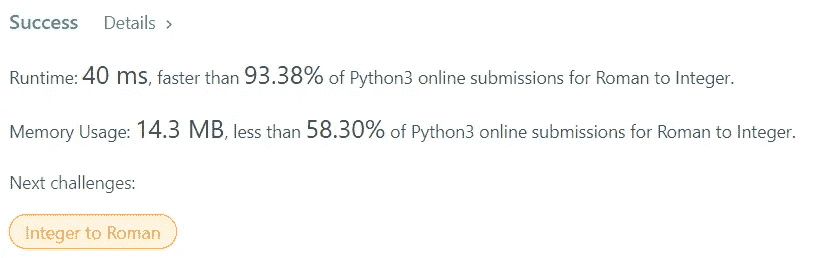

# 解决方案:罗马到整数(Python)

> 原文：<https://levelup.gitconnected.com/solution-roman-to-integer-python-30b01b182655>


罗马数字由七种不同的符号表示: **I，V，X，L，C，D，**和 **M.**

```
**Symbol**       **Value**
I             1
V             5
X             10
L             50
C             100
D             500
M             1000
```

例如，`2`在罗马数字中写成`II`，只是两个 1 加在一起。`12`写成`XII`，简单来说就是`X + II`。数字`27`写成`XXVII`，就是`XX + V + II`。

罗马数字通常从左到右由大到小书写。但是，四的数字不是`IIII`。而是把数字四写成`IV`。因为 1 在 5 之前，我们减去它，得到 4。同样的道理也适用于数字九，写为`IX`。有六种使用减法的情况:

*   `I`可以放在`V` (5)和`X` (10)之前，做成 4 和 9。
*   `X`可以放在`L` (50)和`C` (100)之前，做成 40 和 90。
*   `C`可以放在`D` (500)和`M` (1000)之前，做成 400 和 900。

给定一个罗马数字，将其转换为整数。

***来看看:***[***https://leetcode.com/problems/roman-to-integer/***](https://leetcode.com/problems/roman-to-integer/)

**例 1:**

```
**Input:** s = "III"
**Output:** 3
```

**例二:**

```
**Input:** s = "IV"
**Output:** 4
```

**例 3:**

```
**Input:** s = "IX"
**Output:** 9
```

**例 4:**

```
**Input:** s = "LVIII"
**Output:** 58
**Explanation:** L = 50, V= 5, III = 3.
```

**例 5:**

```
**Input:** s = "MCMXCIV"
**Output:** 1994
**Explanation:** M = 1000, CM = 900, XC = 90 and IV = 4.
```

**约束:**

*   `1 <= s.length <= 15`
*   `s`只包含字符`('I', 'V', 'X', 'L', 'C', 'D', 'M')`。
*   **保证**在`[1, 3999]`范围内`s`是有效的罗马数字。

**解决方案:**

```
roman = {'I':1,'V':5,'X':10,'L':50,'C':100,'D':500,'M':1000}
class Solution:
    def romanToInt(self, S: str) -> int:
        summ= 0
        for i in range(len(S)-1,-1,-1):
            num = roman[S[i]]
            if 3*num < summ: 
                summ = summ-num
            else: 
                summ = summ+num
        return summ
```



**解释:**

乍一看，这似乎很容易，但当你真正思考它时，尤其是当涉及到较大的罗马数字或重复的罗马符号或数字，如 **IV** 、 **IX** 等时，可能会有点棘手。我们需要发展一种逻辑，它既可以加法，也可以减法，这取决于数字。以**【IV】**为例，从**【V】****5**的值中减去**【I】****1**的值。否则，您只是简单地将所有数字的值相加。

关于减法数字的一件很酷的事情是，它们出现在一个更大的数字之前，这意味着如果我们从右向左比从左向右更容易识别它们。

因此，给定一个罗马数字字符串**“S”，**我们将通过字符串“S”向后迭代，并将它添加到另一个变量，比如说**“SUMM”。** h(注意:不要忘记声明一个字典，在那里我们将基本的罗马数字映射到其适当的值)，但是到目前为止，我们只研究了加法运算，如果我们遇到一个字母值小于迄今为止看到的最大值，它应该被减去而不是相加，对吗？

标准的方法是使用一个单独的变量来记录看到的最高值。但是有一个更简单的窍门，我在网上找到的。由于数字通常以罗马数字符号从右到左递增，所以任何减法数也必须小于我们当前的**“SUMM”**变量。

但它并不适用于所有的数字，尤其是当它重复或非常大时，例如， **"III"** 给出的是**" T25 "**" 3】，**当我们试图将数字翻倍时，同样的情况会发生，但当我们将数字乘以 3 或 4 时，我们可以克服这个问题，因为数字的值至少会以**5 倍的增量跳跃！！****

一旦我们知道了如何识别一个减法数字，问题就差不多解决了。现在你要做的就是通过 S 向后迭代并返回**“SUMM”**。

[GitHub](https://github.com/ritchiepulikottil)

[领英](https://www.linkedin.com/in/ritchie-pulikottil-6876341aa)

[推特](https://twitter.com/itsritchie1005)

[Instagram](https://instagram.com/ritchiepulikottil)