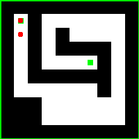

# 如何在 Python 中使用 BFS 解决迷宫

> 原文：<https://levelup.gitconnected.com/solve-a-maze-with-python-e9f0580979a1>

## 广度优先搜索算法

《反恐精英》里机器人是怎么找到你的，《吃豆人》里怪物是怎么找到你的？

在这篇文章中，我将解释如何在迷宫中找到一条路。代码附有可视化算法的动画。

## 设置一个迷宫

我们的迷宫将是一个矩阵，0 代表空间，1 代表墙壁。

```
a = [
    [1, 1, 1, 1, 1, 1, 1, 1, 1, 1],
    [1, 0, 1, 0, 1, 0, 0, 0, 0, 1],
    [1, 0, 1, 0, 1, 0, 0, 0, 0, 1],
    [1, 0, 1, 0, 1, 1, 1, 1, 0, 1],
    [1, 0, 1, 0, 0, 0, 0, 1, 0, 1],
    [1, 0, 1, 0, 0, 0, 0, 1, 0, 1],
    [1, 0, 0, 0, 0, 0, 0, 1, 0, 1],
    [1, 0, 1, 0, 0, 0, 0, 0, 0, 1],
    [1, 0, 1, 0, 0, 0, 0, 0, 0, 1],
    [1, 1, 1, 1, 1, 1, 1, 1, 1, 1],
]
```

我们还设置了起点和终点:

```
start = 1, 1
end = 2, 5
```

所以，我们有一个如图所示的迷宫:


迷宫的起点和终点

## 该算法

解决这个迷宫的算法如下:

*   我们创建一个具有相同大小的零的矩阵
*   把一个`1`放到起点
*   在`1`周围到处都是我们放的`2`，如果没有墙的话
*   在`2`周围的每个地方，如果没有墙，我们就放`3`
*   诸如此类…
*   一旦我们在终点输入一个数字，我们就停下来。这个数字实际上是最小路径长度

## 创建矩阵

这既简单又直接。也许有功能，像`zeros`之类的，但我只知道 NumPy 有一个。因此，我们手动创建一个矩阵并设置起点:

```
m = []
**for** i **in** range(len(a)):
    m.append([])
    **for** j **in** range(len(a[i])):
        m[-1].append(0)
i,j = start
m[i][j] = 1
```

我们得到了这个矩阵:

```
0  0  0  0  0  0  0  0  0  0  
0 ** 1**  0  0  0  0  0  0  0  0  
0  0  0  0  0  0  0  0  0  0  
0  0  0  0  0  0  0  0  0  0  
0  0  0  0  0  0  0  0  0  0  
0  0  0  0  0  0  0  0  0  0  
0  0  0  0  0  0  0  0  0  0  
0  0  0  0  0  0  0  0  0  0  
0  0  0  0  0  0  0  0  0  0  
0  0  0  0  0  0  0  0  0  0
```

## 迈步

现在我们只为一个步骤创建一个函数:

```
**def** make_step(k):
  **for** i **in** range(len(m)):
    **for** j **in** range(len(m[i])):
      **if** m[i][j] == k:
        **if** i>0 **and** m[i-1][j] == 0 **and** a[i-1][j] == 0:
          m[i-1][j] = k + 1
        **if** j>0 **and** m[i][j-1] == 0 **and** a[i][j-1] == 0:
          m[i][j-1] = k + 1
        **if** i<len(m)-1 **and** m[i+1][j] == 0 **and** a[i+1][j] == 0:
          m[i+1][j] = k + 1
        **if** j<len(m[i])-1 **and** m[i][j+1] == 0 **and** a[i][j+1] == 0:
           m[i][j+1] = k + 1
```

该函数将步骤号`k`作为参数。它的功能非常简单:

*   用双 for 循环扫描矩阵。
*   如果我们找到与步骤号`k`对应的数字，查看周围的单元格，并检查是否:
    1。还没有号码
    2。没有墙
    并将`k+1`设置到该单元格。

所以，如果我们运行这个函数 8 次:

```
make_step(1)
make_step(2)
make_step(3)
make_step(4)
make_step(5)
make_step(6)
make_step(7)
make_step(8)
```

我们将得到下面的矩阵:

```
0  0  0  0  0  0  0  0  0  0  
0  1  0  0  0  0  0  0  0  0  
0  2  0  0  0  0  0  0  0  0  
0  3  0  0  0  0  0  0  0  0  
0  4  0  0  0  0  0  0  0  0  
0  5  0  9  0  0  0  0  0  0  
0  6  7  8  9  0  0  0  0  0  
0  7  0  9  0  0  0  0  0  0  
0  8  0  0  0  0  0  0  0  0  
0  0  0  0  0  0  0  0  0  0
```

这与这张图片相对应:


前 8 步

所以，让我们继续这样做，直到我们的终点被填满:

```
k = 0
**while** m[end[0]][end[1]] == 0:
    k += 1
    make_step(k)
```

我们现在得到了这个矩阵:

```
0  0  0  0  0  0  0  0  0  0  
0  1  0  13 0  0  22 21 20 0  
0  2  0  12 0  22 21 20 19 0  
0  3  0  11 0  0  0  0  18 0  
0  4  0  10 11 12 13 0  17 0  
0  5  0  9  10 11 12 0  16 0  
0  6  7  8  9  10 11 0  15 0  
0  7  0  9  10 11 12 13 14 0  
0  8  0  10 11 12 13 14 15 0  
0  0  0  0  0  0  0  0  0  0
```

这张图片是:


找到重点

## 路径是什么？

现在我们需要根据这个矩阵找到最短路径。

这是按如下方式完成的:

*   转到终点，比如说，那里的数字是`k`
*   找到一个值为`k-1`的相邻单元，到那里，将`k`减 1
*   重复上一步，直到到达起点，即`k=1`

```
i, j = end
k = m[i][j]
the_path = [(i,j)]
**while** k > 1:
  **if** i > 0 **and** m[i - 1][j] == k-1:
    i, j = i-1, j
    the_path.append((i, j))
    k-=1
  **elif** j > 0 **and** m[i][j - 1] == k-1:
    i, j = i, j-1
    the_path.append((i, j))
    k-=1
  **elif** i < len(m) - 1 **and** m[i + 1][j] == k-1:
    i, j = i+1, j
    the_path.append((i, j))
    k-=1
  **elif** j < len(m[i]) - 1 **and** m[i][j + 1] == k-1:
    i, j = i, j+1
    the_path.append((i, j))
    k -= 1
```

现在，我们的路径包含坐标:

```
[(2, 5), (2, 6), (2, 7), (2, 8), (3, 8), (4, 8), (5, 8), (6, 8), (7, 8), (7, 7), (7, 6), (6, 6), (6, 5), (6, 4), (6, 3), (6, 2), (6, 1), (5, 1), (4, 1), (3, 1), (2, 1), (1, 1)]
```

这是它的样子:


结果呢

## 更长的迷宫

现在让我们在其他迷宫中尝试这个算法。

首先，我们稍微改变一个迷宫:



然后让它变长:


我希望你喜欢它！

如果你想像上面的图片一样可视化，安装`Pillow`库并继续:

我不打算分享完整的代码，所以它很脏。我们的想法是将算法可视化，而不是展示如何去做:)

如果你喜欢这篇文章，也看看这个:

[](/an-animated-guide-to-implementing-dfs-in-python-to-find-a-path-1e939b7b8599) [## Python 中深度优先搜索路径的动画指南

### 深度优先搜索教程。递归算法介绍。

levelup.gitconnected.com](/an-animated-guide-to-implementing-dfs-in-python-to-find-a-path-1e939b7b8599)