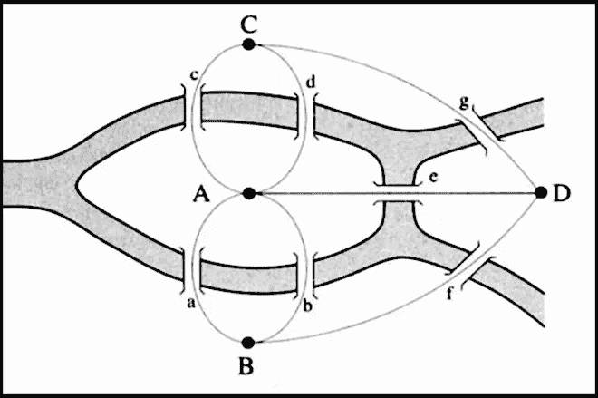

# 用 Python 解决项目欧拉问题—简介和问题 1–3

> 原文：<https://levelup.gitconnected.com/solve-and-understand-the-project-euler-problems-in-python-introduction-and-problems-1-3-32625d1633f7>



我们名义上的英雄的著名桥梁

如果你刚刚开始编程，那么你可能没有听说过 [Project Euler](https://projecteuler.net/) 。如果你没有，先去看看吧！你会发现这是一个超级酷的混合了数学和计算机科学的系列问题。该网站列出的目标受众为:

> “基础课程无法满足他们学习欲望的学生，背景并非主要是数学但对数学感兴趣的成年人，以及希望让自己的问题解决和数学处于前沿的专业人士。”

我还将添加两个规定来形成这篇文章的预期读者:

1.  互联网上有很多免费的解决这些问题的方法，所以我们将专注于尽可能简单地解释一种特定的方法是如何工作的，而不是试图提供最好/最纯粹/计算效率最高的变体。不管怎样，你都会喜欢这些问题，但这主要是为学习者准备的。
2.  我们将使用 Python。

对于每一个成功通过跳跃的人，很高兴有你:让我们开始吧！

# **问题 1——3 和 5 的倍数:**

你可以在这里找到原问题[的文字，内容如下:](https://projecteuler.net/problem=1)

> 如果我们列出所有 10 以下的自然数，它们都是 3 或 5 的倍数，我们得到 3、5、6 和 9。这些倍数之和是 23。
> 
> 求 1000 以下所有 3 或 5 的倍数之和。

如果你使用 Python 内置的模操作符，这是一个免费的赠品。对于那些不知道的人来说，模运算符(你可能知道它是百分号，看起来像这样%)产生第一个参数除以第二个参数的余数。举个例子，

```
5 % 3 = 28 % 2 = 0
```

诸如此类。

如果你想了解更多，你可以在这里查看官方文档。这是一个非常方便的小工具，但我们将在这里使用它的功能与常规 ole 整数。我们的方法非常简单。由于小于 1000 的数字在内存中很容易处理，所以我们将构建一个包含所有小于 1000 且能被 3 或 5 整除的数字的列表，然后使用 numpy 中的 sum 函数。为了增加趣味，我们将演示三种不同的方法来实现本质上相同的方法(剧透一下:最后一种方法不会完全“构建”列表)。看看你最喜欢哪一个，或者分享你的解决方案作为评论！

# 问题 2——偶数斐波纳契数:

原来问题是[这里的](https://projecteuler.net/problem=2)，文字如下:

> “斐波纳契数列中的每一个新项都是通过将前两项相加而生成的。从 1 和 2 开始，前 10 项将是:
> 
> 1, 2, 3, 5, 8, 13, 21, 34, 55, 89, …
> 
> 考虑斐波纳契数列中值不超过四百万的项，找出偶数项的总和。"

这一个只是有点棘手，但是我们将利用相同的模技巧来识别每个偶数来求和，就像上一个问题一样。这一次我们将使用 while 循环来保持快速，我们将删除列表，一次只跟踪两个 Fibonacci 数和运行总和。准备好了吗？

因为斐波那契数列有一些非常有趣(而且漂亮！)[属性](https://en.wikipedia.org/wiki/Fibonacci_number)，实际上有很多不同的方法来解决这个问题。如果您不喜欢模操作符，可以尝试一些变通方法，但是我们将把这一个作为练习。提示:试着从 1，1 而不是 1，2 开始写出前 10-12 个斐波那契数列。你注意到偶数有什么规律吗？

# 问题#3 —最大质因数:

如果你已经做到了这一步，那么你一定同时热爱数学和编程，所以给自己一点鼓励吧！这一个只是比前两个稍微复杂一点，因为它处理的不是很大，而是一个很大的数字，所以我们将使用几个技巧来使它快速运行。你可以在这里找到原文。让我们来看看下面的文字:

> “13195 的质因数是 5、7、13 和 29。
> 
> 600851475143 这个数的最大质因数是多少？"

我并不是说你*不能*用清单来做这件事，但是…如果你不这样做，你的电脑会感谢你的。像斐波那契数列一样，质数有许多简洁的特征，我们可以用它们来缩小这个问题的范围。别担心，我们在这里不会用到高中数学以外的东西，这不是一篇论文。事实上，想出这个方法的人，你猜对了，是我们的老朋友斐波那契！他[早在 1202 年就发表了这个想法，远在任何人对积分或导数嗤之以鼻之前。如果你真的只是为了代码，跳过这一点，如果你不明白为什么我们只测试我们最终测试的东西的数量，你可以回来再看一遍。你可以在下面的 gif 后面找到代码。](https://en.wikipedia.org/wiki/Liber_Abaci)

…不过还是挺酷的；)

也就是说，在我们深入研究之前，让我们看看能否找到潜在答案的一些自然界限，让这个问题变得简单一些。如果你反过来考虑这个问题，最小的质因数实际上也限制了最大的质因数，对吗？也就是说，因为因子必须是整数，所以我们寻找的最大数不能大于 600851475143 除以 2(例如，即使数字 11 是质数，因为它不能被数字 20 整除，所以它不是 20 的“因子”)。

有点令人震惊，但根据或多或少相同的逻辑，我们甚至可以更进一步说，无论我们寻找的这个数字是多少，它也不能超过 600851475143 的*平方根*。你能看出为什么吗？

它归结到一个数字的因式分解意味着什么。基本上，任何数字都可以分解成质数，因为一个质数因子要么是质数，要么是可分解的。比如:3 * 4 = 12，但这也可以写成 3 * 2 * 2 = 12。

那么让我们取一个任意的数 ***x*** ，也说 ***x*** 能被某个质数*和某个更小的质数 ***z: (x = y * z)*** 整除。这也可以是几个更小的质数，但重点是， ***y*** 任意最大，其余因子都是小于等于 ***y*** 的质数，如上图所示，如果不是质数，可以化为质数。*

*我们的基本计划是找出每个小于 600851475143(现在是 600851475143 的一半)的素数，看它是否能被这个大数整除。如果是这样，我们将再次以相同的因子减少我们测试的数量，直到我们不能再因子化它。例如，如果我们寻找最大的质因数，比如说 100，我们从测试数字 2 开始，我们会注意到 100 实际上可以被 2 整除。然而，由于 100/2 等于 50，它可以被 2 进一步分解成 2 * 25，我们的最大质因数的新候选不是 2，而是 25。你说二十五不是质数？你是正确的！我们将在二(三)之后测试下一个数字，看看它是否能分解成 25(它不能)。同样是 4，但是当我们到 5 时，我们将 25 除以 5，现在 5 是我们最大素数的新候选。如果你非常小心地跟随并且反对我们现在检查六个，不要担心，答案在下面的代码段中。*

*但是等等！如果我们以递增的顺序检查每个数字，(例如，首先是 2，然后是 3，然后是 4 和 5，等等。，但不是第一个 5，然后是 4 和 3…)，我们可以说一些关于我们的质数 ***y*** 和 ***z.*** 的有趣的事情，即，如果 ***z*** 小于 ***y*** ，尽管它可能是质数，但我们已经测试过了，如果 ***y*** 是质数，它一定是我们的最大质数的新候选*

*不卖？那么， ***z*** 实际上是*等于*对 ***y*** 的特殊情况呢？有没有我们没有测试过的更大的素数也是 ***x*** 的一个因子？当然不是，否则我们已经通过测试较小的质因数遇到它了，所以我们可以停止测试数字。或者，当我们已经减少了 ***x*** 时，我们将停止，直到它等于我们正在测试的 ***y*** 。如果在这种方法下 ***x*** 等于 ***y*** ，那么 ***x*** 又名 ***y*** 一定是质数，因为否则一些较小的数会被计入其中，明白吗？*

**

*告诉过你这很酷！*

*那都是乡亲们！恭喜你和我一起完成了前三个欧拉问题。如果你喜欢这篇文章，请告诉我，一定要关注它，这样你就能赶上下一篇文章。如果看起来有不错的兴趣，在可预见的未来，我会每周发布这些内容。在那之前，快乐解决每个人。*