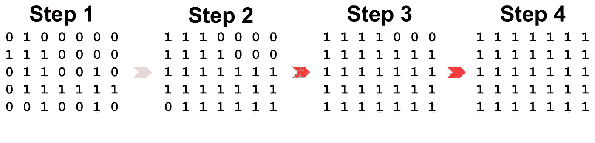

# 求解填充一个二维数组需要多少步

> 原文：<https://levelup.gitconnected.com/solve-how-many-steps-is-required-to-fill-a-2-dimensional-array-9b9e500ff2>



# 问题

给定数组 A，m 行 x n 列的 0 和 1

```
0 0 0 0 0 0 0 
0 1 0 0 0 0 0
0 0 0 0 0 0 0
0 0 1 0 0 1 0
0 0 0 0 0 0 0
```

对于每一步，所有的 1 元素将使它们周围的 4 元素变成 1

```
Step 1 

0 1 0 0 0 0 0 
1 1 1 0 0 0 0
0 1 1 0 0 1 0
0 1 1 1 1 1 1
0 0 1 0 0 1 0

Step 2 

1 1 1 0 0 0 0 
1 1 1 1 0 0 0
1 1 1 1 1 1 1
1 1 1 1 1 1 1
0 1 1 1 1 1 1

Step 3

1 1 1 1 0 0 0 
1 1 1 1 1 1 1
1 1 1 1 1 1 1
1 1 1 1 1 1 1
1 1 1 1 1 1 1

Step 4

1 1 1 1 1 1 1 
1 1 1 1 1 1 1
1 1 1 1 1 1 1
1 1 1 1 1 1 1
1 1 1 1 1 1 1
```

写一个程序来回答用全 1 填充 A 需要多少步

*   a)求解 m，n <= 100 的问题
*   b)告诉我们如何解决 m，n <= 1，000，000 的问题

# 测试案例

## 测试 1

```
Input
a = [ [1,0,0,0], 
      [0,0,0,0], 
      [0,0,0,0], 
      [0,0,0,1] ]Output
3
```

## 测试 2

```
Input
a = [ [0,0,0,0,0,0,0],
      [0,1,0,0,0,0,0],
      [0,0,0,0,0,0,0],
      [0,0,1,0,0,1,0],
      [0,0,0,0,0,0,0] ]Output
4
```

# Python 解决方案

## 蛮力

求解在 Python Bruteforce 中填充一个 2d 数组需要多少步骤

## 高效的

用 Python 高效求解填充一个 2d 数组需要多少步骤

# 戈朗的解决方案

## 高效的

# 基准

## Python 蛮力(大小:100)

```
real 0m0.046s
user 0m0.033s
sys 0m0.013s
```

## Python 蛮力(大小:1000)

```
real 0m4.339s
user 0m3.557s
sys 0m0.776s
```

## Python 蛮力(大小:10000)

```
Killedreal 3m36.693s
user 1m27.774s
sys 2m8.164s
```

## Python 高效(大小:100)

```
real 0m0.091s
user 0m0.030s
sys 0m0.026s
```

## Python 高效(大小:1000)

```
real 0m3.994s
user 0m3.806s
sys 0m0.168s
```

## Python 高效(大小:10000)

```
Killedreal 2m49.018s
user 2m33.503s
sys 0m7.575s
```

## Golang 高效(容量:100)

```
real 0m 0.00s
user 0m 0.00s
sys 0m 0.00s
```

## Golang 高效(容量:1000)

```
real 0m 0.10s
user 0m 0.08s
sys 0m 0.05s
```

## Golang 高效(容量:10000)

```
real 0m 7.69s
user 0m 8.04s
sys 0m 1.82s
```

# 外卖食品

我希望这篇博文能帮助正在努力解决这个问题的人。敬请关注更多帖子！和平！✌️