# 用 Python 求解两个不同长度链表的交集

> 原文：<https://levelup.gitconnected.com/solve-intersection-of-two-linked-lists-of-different-lengths-in-python-ab3de7ee0a52>

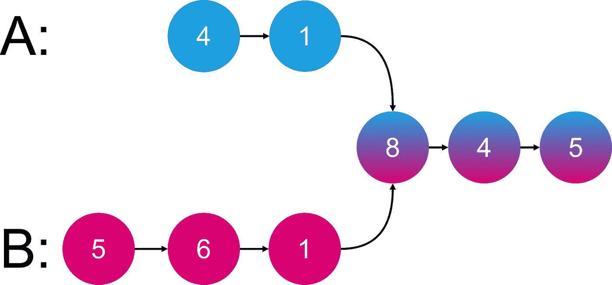

# 问题

给定两个单链表的头`headA`和`headB`，返回两个链表相交的节点*。如果两个链表没有交集，返回`null`。*

*例如，下面两个链表在节点`c1`开始相交:*

**

*保证在整个链接结构中没有循环。*

***注意**在函数返回后，链表必须**保持它们原来的结构**。*

## *例子*

*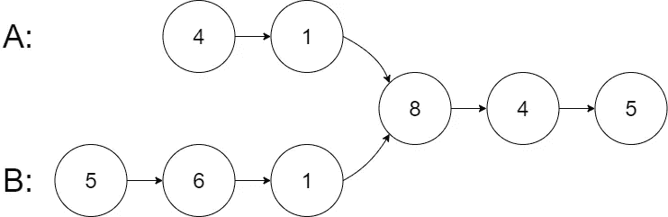*

```
***Input:** intersectVal = 8, listA = [4,1,8,4,5], listB = [5,6,1,8,4,5], skipA = 2, skipB = 3
**Output:** Intersected at '8'
**Explanation:** The intersected node's value is 8 (note that this must not be 0 if the two lists intersect).
From the head of A, it reads as [4,1,8,4,5]. From the head of B, it reads as [5,6,1,8,4,5]. There are 2 nodes before the intersected node in A; There are 3 nodes before the intersected node in B.*
```

# *解决办法*

*有几种方法可以解决这个问题，*

1.  *使用一个映射或集合来存储链表 A 的对象引用，然后遍历链表 B 以尝试将其自己的对象引用与映射或集合相匹配。*
2.  *用一种天才的方式交换每个链表的指针。*

*我知道已经有多篇文章或博客文章描述了方法 2 的算法和源代码。但他们的问题是，我很难想象并最终理解这种方法。因此，这篇博文展示并描述了方法 2 的一步一步的方法。*

# *形象化*

## *初始化*

*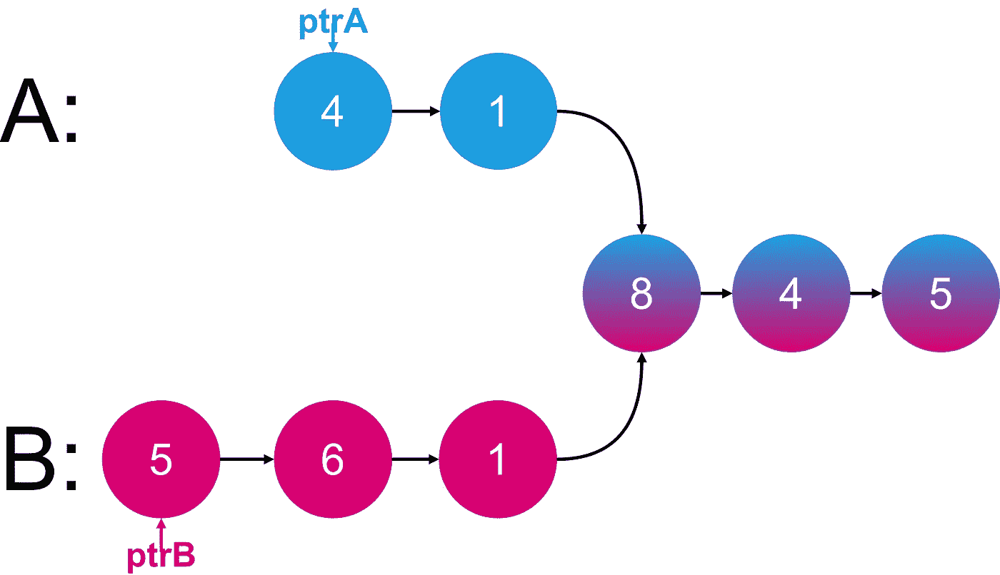*

*我们将 ptrA 设置为链表 A 的头，将 ptrB 设置为链表 b 的头。*

## *迭代 01*

*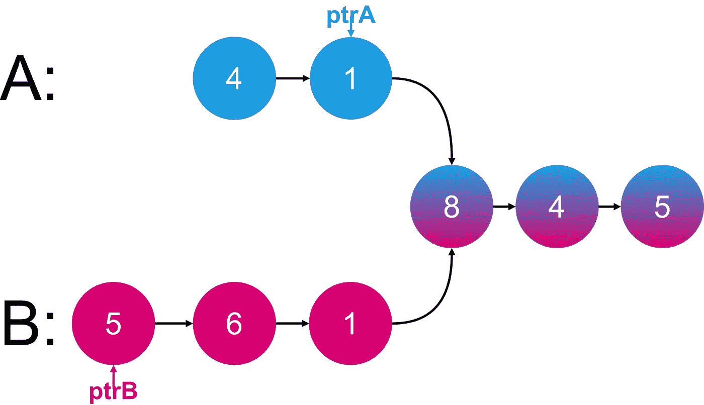*

*在迭代 01 中，我们将 **ptrA** 指向**链表 A** 中的**下一个节点**。*

*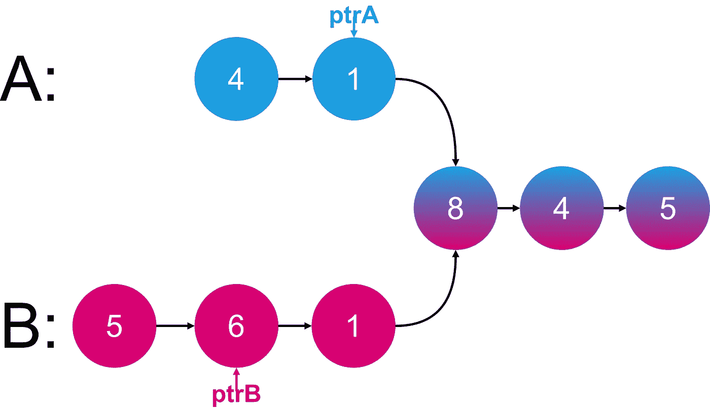*

*我们将 **ptrB** 指向**链表 B** 中的**下一个节点**。*

## *迭代 02*

*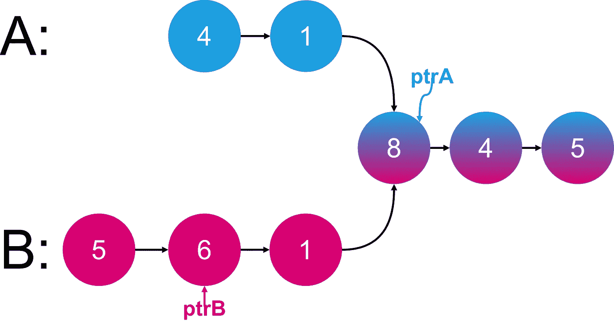*

*在迭代 02 中，我们将 ptrA 指向链表 a 中的下一个节点。*

**

*我们将 ptrB 指向链表 b 中的下一个节点。*

## *迭代 03*

*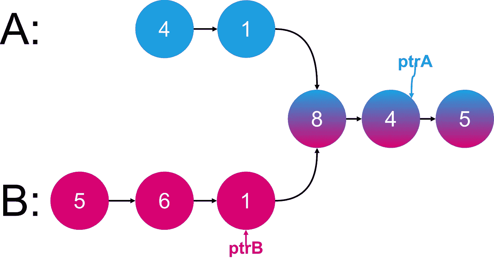*

*在迭代 03 中，我们将 **ptrA** 指向**链表 A** 中的**下一个节点**。*

*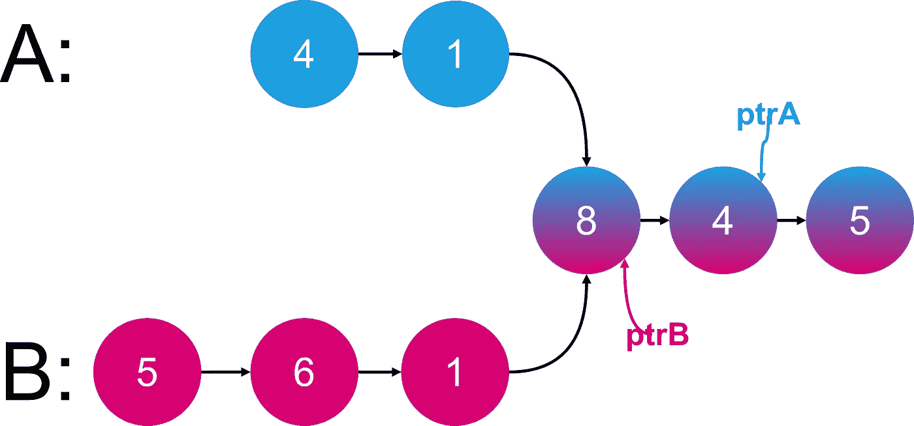*

*我们将 **ptrB** 指向**链表** B 中的**下一个节点**。*

## *迭代 04*

*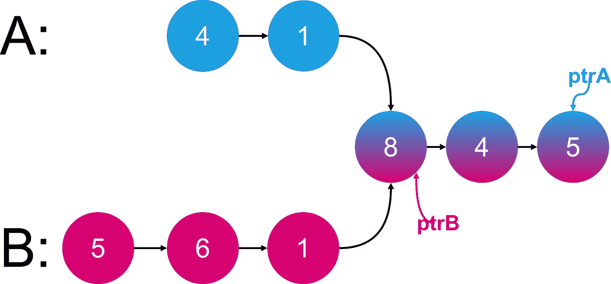*

*在迭代 04 中，我们将 **ptrA** 指向**链表 A** 中的**下一个节点**。*

*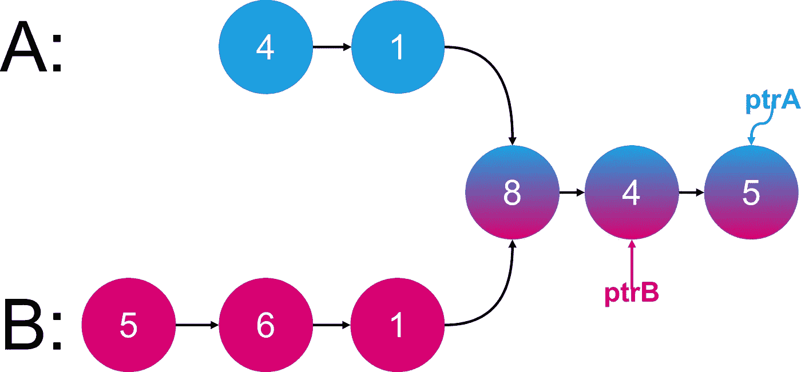*

*我们将 **ptrB** 指向**链表** B 中的**下一个节点***

## *迭代 05*

*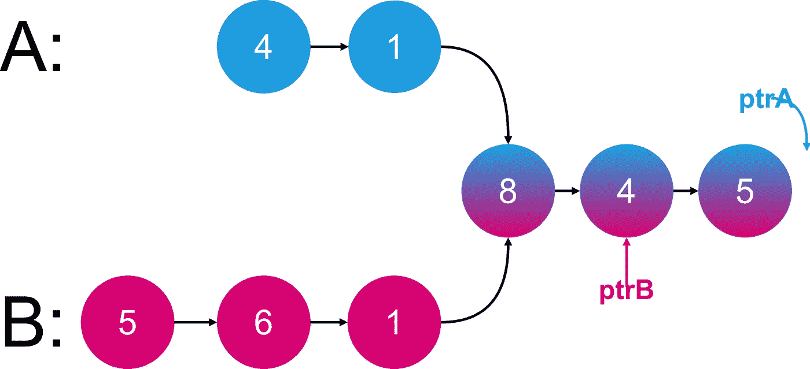*

*在迭代 05 中，我们将 **ptrA** 指向**链表 A** 中的 **Null/None** 。*

*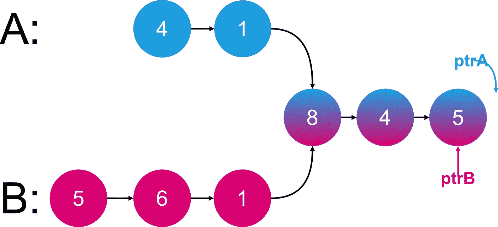*

*我们将 **ptrB** 指向**链表 B** 中的**下一个节点**。*

## *迭代 06*

*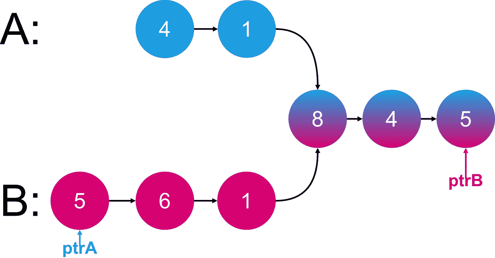*

*在迭代 06 中，事情变得有趣了。我们将 **ptrA** 指向**链表 B** 的**头节点**。*

*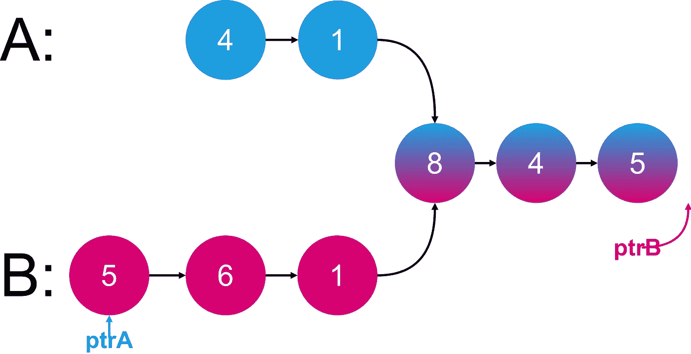*

*我们将 **ptrB** 指向**链表 B** 中的 **Null/None** 。*

## *迭代 07*

*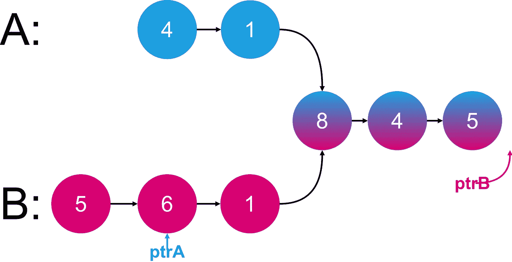*

*在迭代 07 中，我们将 **ptrA** 指向**链表 B** 中的**下一个节点**。*

*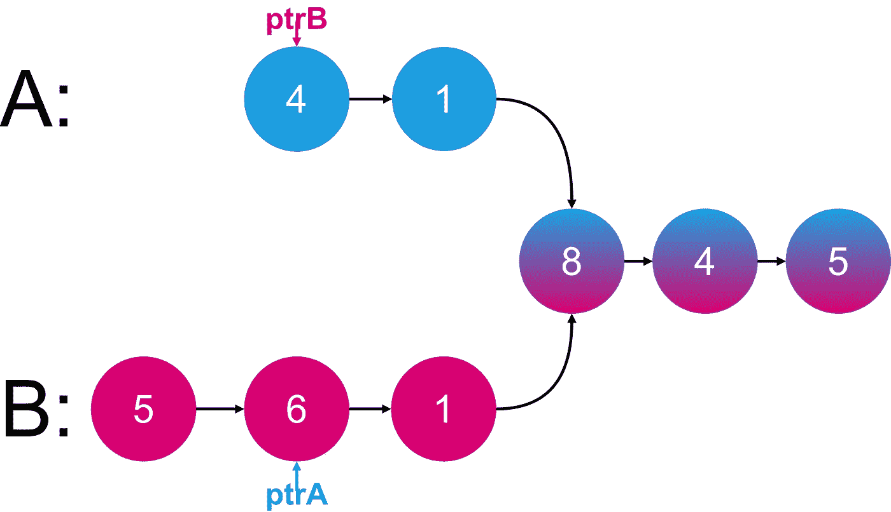*

*我们将 **ptrB** 指向**链表 A** 中的**头节点**。*

*在这个时间点上，我们已经基本上**交换了**我们在两个链表中的指针 **ptrA** 和 **ptrB** 。*

## *迭代 08*

*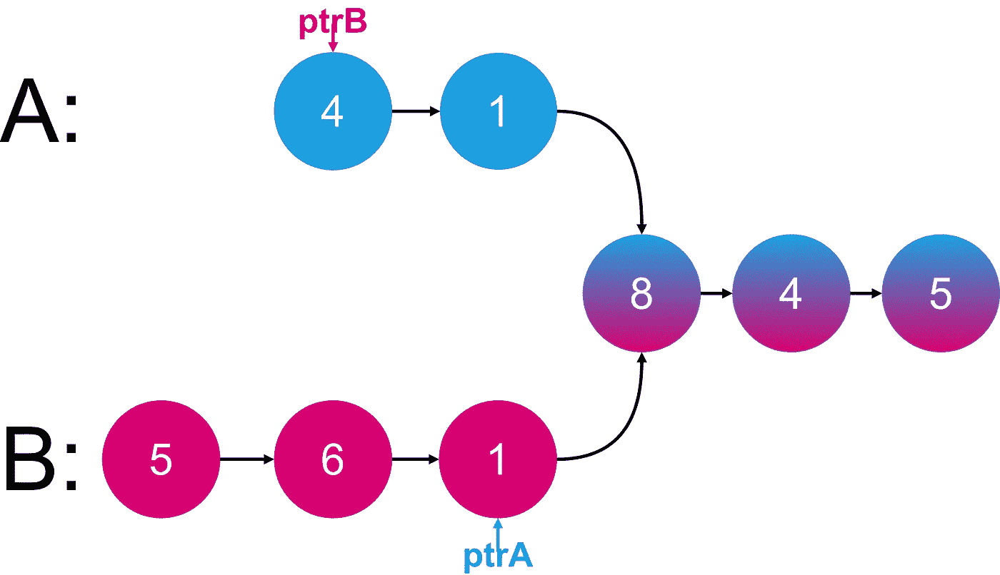*

*在迭代 08 中，我们将 **ptrA** 指向**链表 B** 中的**下一个节点**。*

*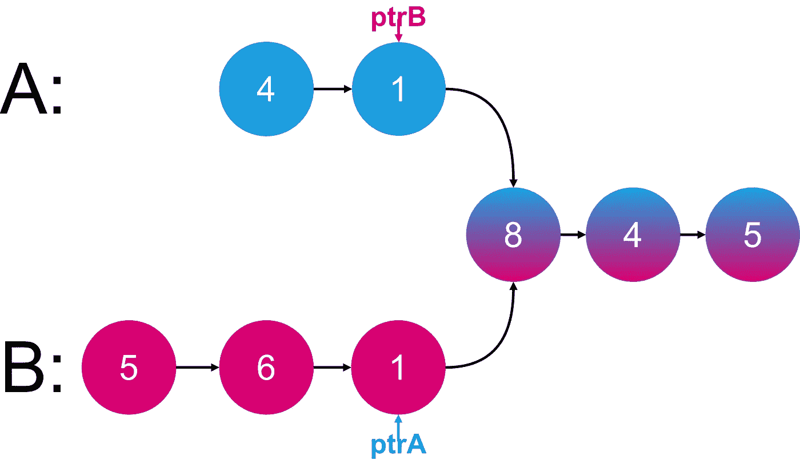*

*我们将 **ptrB** 指向**链表 A** 中的**下一个节点**。*

## *迭代 09*

*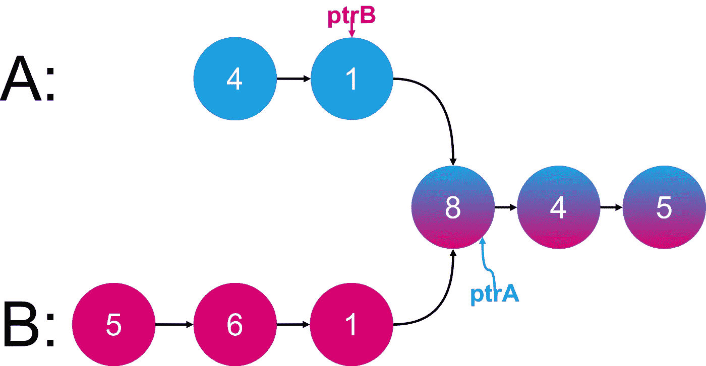*

*在迭代 09 中，我们将 **ptrA** 指向**链表 B** 中的**下一个节点**。*

*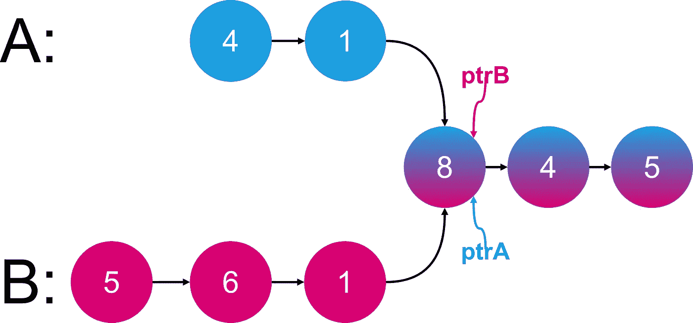*

*我们将 **ptrB** 指向**链表 A** 中的**下一个节点**。*

*终于！！！ **ptrA** 和 **ptrB** 都是**指向**同一个节点**与****链表 A** 和**链表 B** ！！！*****

# ***用 Python 实现***

***这里有一个 Python 语言的简单实现。***

```
***def getIntersectionNode(self, headA, headB):
    if headA is None or headB is None:
        return None

    ptrA = headA
    ptrB = headB

    while ptrA is not ptrB:
        # if either pointer hits the end, switch head and continue the second traversal, 
        # if not hit the end, just move on to next
        ptrA = headB if ptrA is None else ptrA.next
        ptrB = headA if ptrB is None else ptrB.next

    return ptrA # only 2 ways to get out of the loop, they meet or the both hit the end=None***
```

# ***外卖食品***

***我希望这篇博文对那些正在努力将算法可视化的人有用。有趣的是，这个问题是如何以如此优雅和优化的方式解决的。祝你的编码面试测试好运。和平✌️！！！***