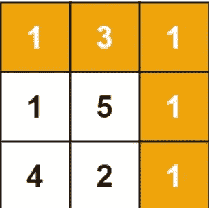

# Leetcode 问题 64:最小路径和

> 原文：<https://levelup.gitconnected.com/solve-leetcode-problems-and-get-offers-from-your-dream-companies-13949a80d2ab>

## 解决 Leetcode 问题，获得你梦想中的公司的报价


在这个系列中，我将和我的朋友一起解决 Leetcode 媒体问题，你可以在我们的 youtube 频道上看到。今天我们要做问题 Leetcode: 64。最小路径和

稍微介绍一下我，我过去有来自**优步**印度和**亚马逊**印度的 offers，目前在阿姆斯特丹**Booking.com**工作。

# 学习算法的动机

[](https://medium.com/leetcode-simplified/solve-leetcode-problems-and-get-offers-from-your-dream-companies-2786415be0b7) [## 解决 Leetcode 问题，获得你梦想中的公司的报价

### 练习 Leetcode 背后的介绍和动机

medium.com](https://medium.com/leetcode-simplified/solve-leetcode-problems-and-get-offers-from-your-dream-companies-2786415be0b7) 

# 问题陈述

给定一个填充有非负数的 m x n 网格，找出一条从左上到右下的路径，使沿其路径的所有数字之和最小。

> 注意:在任何时间点，您只能向下或向右移动

## **例 1:**



```
**Input:** grid = [[1,3,1],[1,5,1],[4,2,1]]
**Output:** 7
**Explanation:** Because the path 1 → 3 → 1 → 1 → 1 minimizes the sum.
```

## 示例 2:

```
**Input:** grid = [[1,2,3],[4,5,6]]
**Output:** 12
```

## **约束:**

*   `m == grid.length`
*   `n == grid[i].length`
*   `1 <= m, n <= 200`
*   `0 <= grid[i][j] <= 100`

# Youtube 讨论

# 解决办法

## 方法 1:暴力

强力方法包括递归。对于每个元素，我们考虑向右和向下的两条路径，并找出这两条路径的最小和。它指定了我们是需要采取正确的步骤还是向下的步骤来最小化总和。

`**cost(i, j) = grid[i][j] + min(cost(i+1, j), cost(i, j+1))**`

以下代码实现了该算法:

# C++解决方案

# Java 解决方案

## 复杂性分析

**时间复杂度为 o(2^(m+n)**

时间复杂度为 O(m+n)

# 我们可以在 O(n*m)时间复杂度内解决这个问题。

想法是计算，对于每个索引(I，j ),找到从左上角到索引(I，j)的最小路径。

**第一行和第二列案例**

在第一行中，我们只能向右移动，因此要到达第一行中的任何索引，最小路径和是从左上角到该索引的所有元素的和。

对于第一列，我们只能向下移动，因此要到达第一行中的任何索引，最小路径和是从左上角到该索引的所有元素的和。

**任何其他情况**

为了达到指数(I，j ),我们有两个选择

1.  我们从指数(i-1，j)出发
2.  或者我们从指数(I，j-1)开始

我们将选择这两个指数中的最小值。如果我们对网格的其余部分应用同样的直觉，我们将找到从左上到右下的最小路径和。

# C++解决方案

# Java 解决方案

# 复杂性分析

**时间复杂度为 O(n*m)**

空间复杂度为 O(1)

# 感谢您的阅读，并关注此出版物以了解更多 LeetCode 问题！😃

[](https://medium.com/leetcode-simplified) [## LeetCode 简体

### 我们将现场解决 Leetcode 问题，您可以在我们的 youtube 频道上观看

medium.com](https://medium.com/leetcode-simplified)