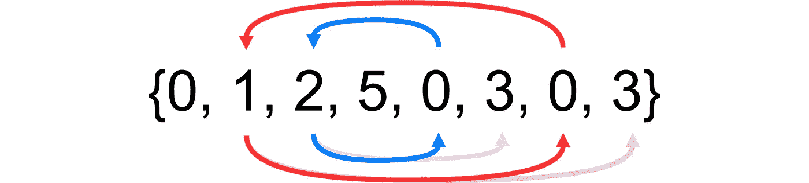

# 求解将所有的零移到数组的左边

> 原文：<https://levelup.gitconnected.com/solve-move-all-the-zeroes-to-the-left-of-the-array-b39d13890f4b>



# 问题

给定一个随机正数数组，将所有的零移到数组的左边。

## 情况

1.  必须就地完成(空间有限，即无法分配新数组)
2.  右边非零元素的顺序无关紧要

## 例子

```
Input : arr[] = {0, 1, 2, 5, 0, 3, 0, 3};
Output : arr[] = {0, 0, 0, 2, 1, 3, 3, 5};
```

# 解决办法

## 计算机编程语言

在 Python 中求解将所有零移动到数组的左侧

## 戈朗

在 Golang 中将所有的零移动到数组的左边

# 外卖食品

我希望这篇博文能帮助那些正在努力理解如何解决这个问题的人。敬请关注下期帖子！和平✌️