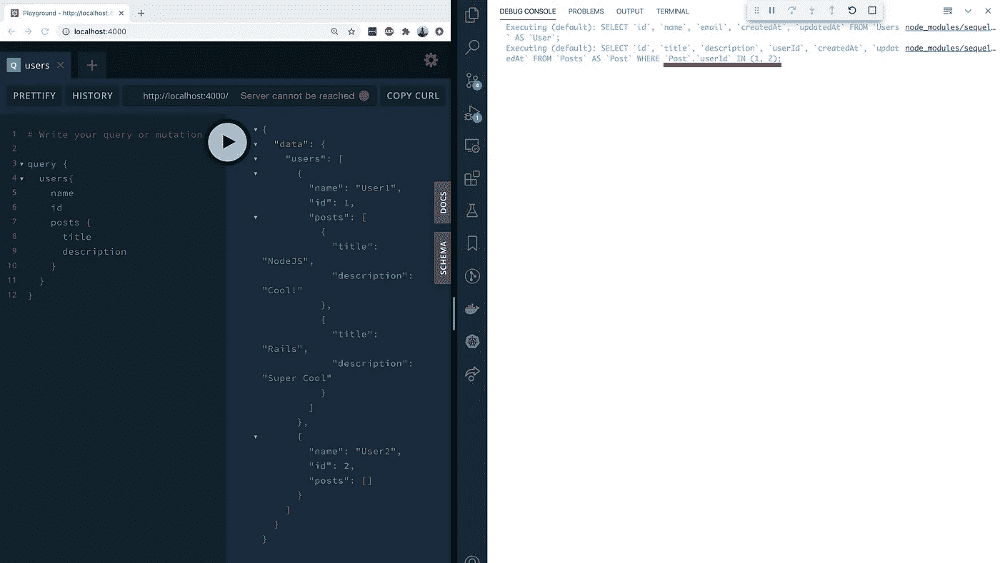

# 用 Dataloader 解决 GraphQL 中的 N+1 查询问题

> 原文：<https://levelup.gitconnected.com/solve-n-1-query-problem-in-graphql-with-dataloaders-18e16ac17b21>

*这是我的* [*上一篇博客*](/do-not-resolve-your-graphql-fields-like-a-rest-endpoint-ac43242f269) *的延续，我的博客解释了一种更好的方法来解析 GraphQL 查询的字段。该博客以一篇关于在解析字段时所面临的 N+1 查询问题的注释结束。*

在这篇博文中，我们将看到如何使用[数据加载器](https://github.com/graphql/dataloader)解决 N+1 查询问题。

# 什么是数据加载器？

Dataloader 是一个库，它可以批量处理连续的请求，并在后台生成单个数据请求。这个请求可以发送到任何数据源，比如数据库或 web 服务。

> Dataloader 接受一个数组作为参数，使用该参数处理数据并返回一个对象数组。

dataloader 会将返回数组的第 n 个索引处的元素视为输入参数中第 n 个元素的数据。

现在让我们实现 postsLoader。

我们现在将使用这个 postsLoader 来解析帖子。更新后的`resolvers`如下:

当客户端查询用户以及帖子字段时，那么对于在“用户”查询中解析的每个用户，将调用这个“帖子”解析器，其父参数等于用户对象。使用这个用户，我们可以找到文章。

正如您从“帖子”字段的解析器中看到的，我们仍然在使用数据加载器的“load”API 查询单个帖子。

> 将对多个 postsLoader.load()调用进行批处理，然后只调用一次“postsLoader”。

下面的屏幕截图显示了当客户端请求用户数据以及他们的帖子数据时，数据库查询的命中率。

这确保了我们只访问数据库一次来获取数据，从而解决了我们的 N+1 查询问题。

# 不过，对于 dataloader 的这种实现，有一点需要注意。

Dataloader 不仅批处理请求，还缓存响应。它进行缓存以确保不会进行另一个查询来获取相同的数据。

这种缓存的问题是，如果另一个请求的解析器也命中这个数据加载器(当第一个请求被处理时)，那么**缓存的结果也将返回给第二个请求**。如您所见，将缓存的数据返回给完全不同的请求是一个严重的问题。

***因此，数据加载器应始终根据请求进行定义。***

这样，不同的请求将使用不同的数据加载器实例。最好的方法是在 GraphQL 请求的上下文中定义它们。

因此，数据加载器的新实现如下所示:

希望这对你有帮助。看看这个 [repo](https://github.com/shrirambalakrishnan/blog-graphql-optimizations) ，它使用 Apollo GraphQL 服务器实现了上述`users` resolver。