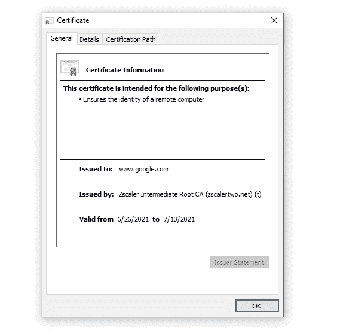

# 解决 Python 请求模块中可怕的证书问题

> 原文：<https://levelup.gitconnected.com/solve-the-dreadful-certificate-issues-in-python-requests-module-2020d922c72f>

## 现实世界的问题并解决它们

最近，我一直在使用 Python 请求模块来保护使用服务器证书的 API 调用。

我真的被困在了一个点上，了解到我做了什么来解决这个问题是很棒的，这让我在[带 SSL 证书的深度潜水](https://medium.com/geekculture/story-of-ssl-certificates-161f29df8b65?sk=c0142802cc51cb91b2fda2dd607965c0)上创建了一个帖子。


图片来自 [Pexels](https://www.pexels.com/photo/young-ethnic-male-with-laptop-screaming-3799830/?utm_content=attributionCopyText&utm_medium=referral&utm_source=pexels) 的[安德里亚·皮亚卡迪奥](https://www.pexels.com/@olly?utm_content=attributionCopyText&utm_medium=referral&utm_source=pexels)

# 问题是

我正在使用请求模块，这里是 API 调用。

```
response = requests.post(url, files=files, headers=headers)
```

并得到一个错误:

```
***/ (Caused by SSLError(SSLCertVerification(1, '[SSL: CERTIFICATE_VERIFY_FAILED] certificate verify failed: unable to get local issuer certificate (_ssl.c:1108)'))***
```

# 试图

## 1.使用 verify=False 进行不安全的调用

我的第一次尝试是使用 verify 标志作为`False`并尝试。

```
response = requests.post(url, files=files, headers=headers, verify=False)
```

虽然我得了 200 分，但我收到了一个令人不快的警告，确认我正在做一份糟糕的工作，没有提供证书。所以我必须找到正确的方法。

## 2.提供服务器证书

首先，我想，如果我可以在验证密钥中提供服务器证书，就可以了。所以我做了，

```
response = requests.post(url, files=files, headers=headers, verify='server.cer')
```

> 这是一个 **DER** 编码的证书

我得到了另一个错误:

```
***/ (Caused by SSLError(SSLError(136, '[X509] no certificate or crl found (_ssl.c:4232)'))***
```

## 3.覆盖 CA_REQUESTS_BUNDLE

模块 requests 使用***certify***来访问 CA 包并验证安全 SSL 连接，我们可以使用 **CA_REQUESTS_BUNDLE** 环境变量来覆盖 CA 包位置。于是我想，如果我能手动提供那个变量里的 ***server.cer*** 我就实现开悟了。但令我绝望的是，这也失败了。

## 4.转换为不同的证书编码

然后我想请求模块一定没有接受 DER 编码的证书。所以我转换成了 PEM，它是明文，但是是 64 进制编码的。

```
openssl x509 -in server.cer -inform DER -outform PEM -out server.pem
```

又打了一次电话

```
response = requests.post(url, files=files, headers=headers, verify='server.pem')
```

又一个错误。

```
***/ (Caused by SSLError(SSLCertVerification(1, '[SSL: CERTIFICATE_VERIFY_FAILED] certificate verify failed: unable to get local issuer certificate (_ssl.c:1108)'))***
```

是的，这和**错误 1** 一样。所以我们又回到了起点。我试着在网上搜索，但没有人有一个有意义的解决方案。有人

然后我想这不是办法，我会解决这个问题。所以我对证书做了很多研究，最后我拿到了。我写了《深潜》这篇文章，把所有东西都放在那里。

# 回归基础

这个问题以及互联网上所有类似的与证书相关的问题(在任何语言中，不仅仅是 python)都需要对证书链有一个清晰明了的理解。我已经在我的深潜帖子中非常清楚地解释了一切。

通常，证书链由三方组成。

1.  根证书颁发机构
2.  一个或多个中间认证机构
3.  服务器证书，要求对证书进行签名。

授权的责任是:

> 根癌标志→中间癌
> 
> 中间 CA 签名→服务器证书

来自根 CA 的根证书通常具有很长的有效期(超过 20 年)，并且作为 CA 包捆绑在所有计算机和服务器中，并且在严格的规则下非常安全地保存，使得没有人能够在任何机器中更改它们。

因为根 CA 是非常非常神圣的，所以他们需要中介 CA 来委派责任，以便在任何人通过提供 CSR 来请求它时签署服务器证书。这些中介称为中间 ca。证书链中可能有多个中间 ca。

# 解决办法

在我们的例子中，当我们将证书文件转换为 PEM 格式时，我们犯了一个错误，

```
***unable to get local issuer certificate (_ssl.c:1108)***
```

这有两个原因:

*   中间 CA 证书在 **server.pem** 文件中不可用
*   由于我们通过指定***verify = server . PEM****，*来手动指定使用哪个证书文件，因此 python 请求模块将不会使用已经存在的 CA 包，而是将只使用 **server.pem** 并且**期望它包含链中的所有证书、server.cer、中间证书和根证书**

所以我像这样手工剥离了服务器证书:



如何从证书链中剥离所有证书的示例

这是在 windows 中完成的，但是类似的事情也可以在 Mac 或 Linux 中完成。

从 server.cer 中剥离所有证书后，我们将拥有不同的。所有 ca 的 cer 文件。所以对于上面的例子，我们有 4 个。cer 文件。

*   根 CA(Zeescalar 根 CA)
*   中间 CA 1(Zscalar 中间根 CA)
*   中间钙(Zscalar 中间根钙)
*   谷歌服务器。cer 文件

现在我们要做的就是把这些**全部转换过来。cer** 文件到**文件。pem** 文件，并将它们添加到一起，以创建一个合并的 **pem** 文件，并将其提供给 python 请求。

因此，对于所有 cer 文件，运行以下命令 4 次。

```
openssl x509 -in server.cer -inform DER -outform PEM  >> consolidate.pem
```

> 我们在这里所做的就是创建一个完全成熟的 CA 包，它拥有所有的证书，无论如何我们都可以做到这一点，这很好。

就这样，我们将新的 CA pem 文件提供给 python 请求，它很高兴。

```
response = requests.post(url, files=files, headers=headers, verify='consolidate.pem')<Response [200]>
```

如果你喜欢这个帖子，请分享或评论这个帖子。任何形式的互动都是非常受欢迎的。如果你想支持我，并获得所有伟大的事情，请加入并成为会员。这是我的推荐链接:

[](https://susamn.medium.com/membership) [## 通过我的推荐链接加入媒体

### 作为一个媒体会员，你的会员费的一部分会给你阅读的作家，你可以完全接触到每一个故事…

susamn.medium.com](https://susamn.medium.com/membership) 

# 分级编码

感谢您成为我们社区的一员！升级正在改变技术招聘。 [**在最好的公司**找到你最理想的工作](https://jobs.levelup.dev/talent) **。**

[](https://jobs.levelup.dev/talent) [## 提升——改变招聘流程

### 🔥让软件工程师找到他们热爱的完美角色🧠寻找人才是最痛苦的部分…

作业. levelup.dev](https://jobs.levelup.dev/talent)