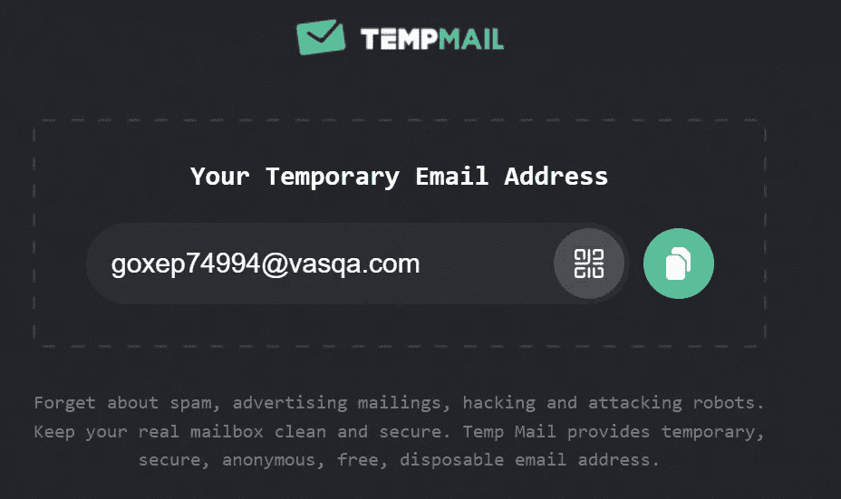
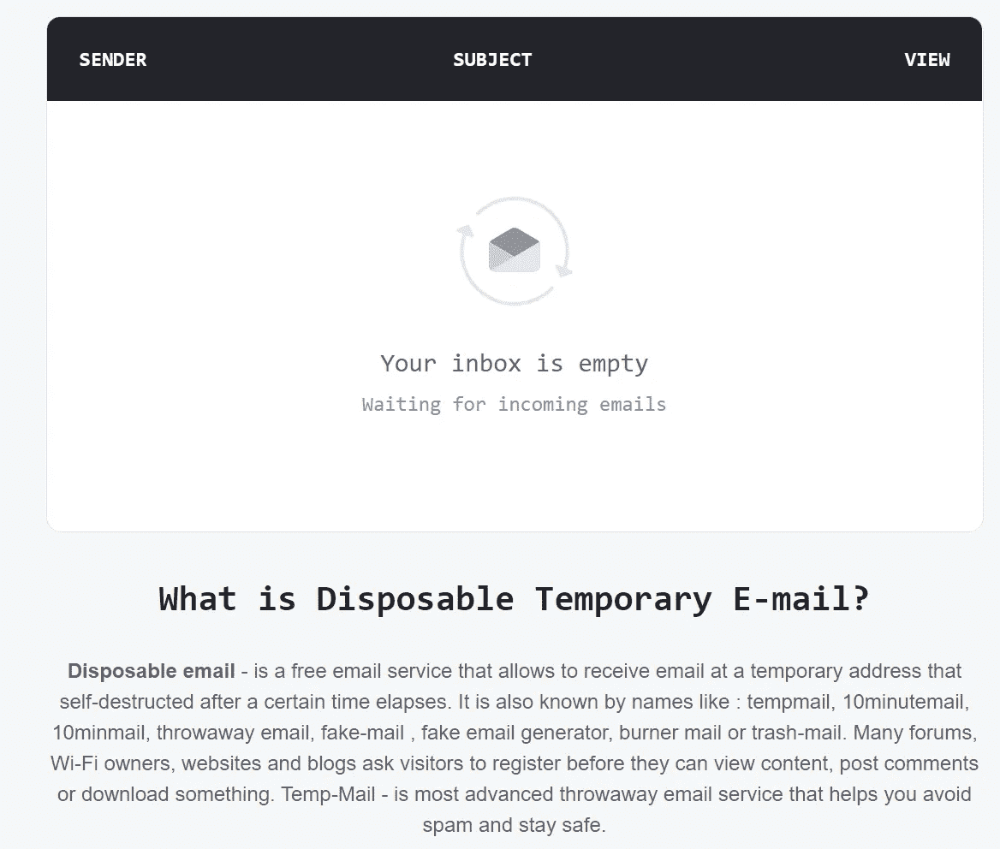

# 用有效的电子邮件解决注册问题

> 原文：<https://levelup.gitconnected.com/solve-the-registration-with-a-valid-email-problem-ff5779f7c23e>

如果你厌倦了使用你的个人电子邮件去尝试每一项服务，看看这篇文章。这里我有解决方案给你。

戴维·冯迪马尔在 [Unsplash](https://unsplash.com?utm_source=medium&utm_medium=referral) 上拍摄的照片

## 插入有效的电子邮件地址

你可以通过使用一个临时的“假”电子邮件服务来满足这个要求。
打开你最喜欢的浏览器，输入“假邮件”之类的东西，查看互联网能提供什么。有很多服务，但这里我将使用临时邮件([https://temp-mail.org/en/](https://temp-mail.org/en/))

这项服务将生成一个假的电子邮件，你可以自由地使用它来注册任何你想要的服务。
如果你尝试注册的服务会向你发送一封确认邮件，没问题，在临时邮件页面上向下滚动一点，你会看到你的收件箱

临时邮件收件箱

这是一个功能齐全的电子邮件，只是要记住，你的临时电子邮件，这项服务，将只持续 10 分钟，然后它会自毁。

老规矩，感谢阅读！