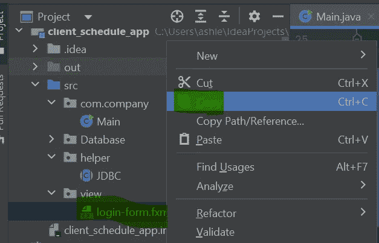
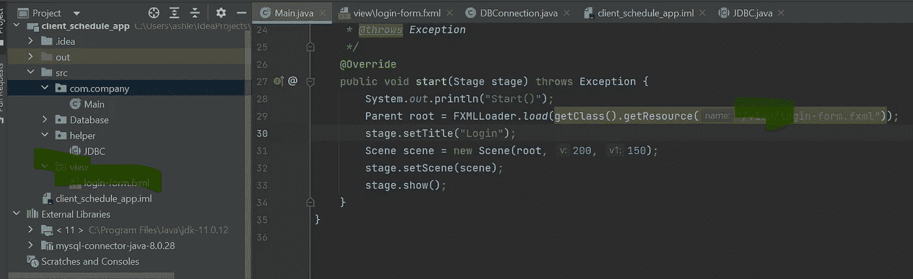

# [已解决]无法从不同的包加载 Java FXML 文件

> 原文：<https://levelup.gitconnected.com/solved-cant-load-java-fxml-file-from-different-package-346f41886c49>

## 快速解决方案

完整的错误消息:

```
Exception in Application start method
java.lang.reflect.InvocationTargetException
 at java.base/jdk.internal.reflect.NativeMethodAccessorImpl.invoke0(Native Method)
 at java.base/jdk.internal.reflect.NativeMethodAccessorImpl.invoke(NativeMethodAccessorImpl.java:62)
 at java.base/jdk.internal.reflect.DelegatingMethodAccessorImpl.invoke(DelegatingMethodAccessorImpl.java:43)
 at java.base/java.lang.reflect.Method.invoke(Method.java:566)
 at javafx.graphics@18.0.1/com.sun.javafx.application.LauncherImpl.launchApplicationWithArgs(LauncherImpl.java:465)
 at javafx.graphics@18.0.1/com.sun.javafx.application.LauncherImpl.launchApplication(LauncherImpl.java:364)
 at java.base/jdk.internal.reflect.NativeMethodAccessorImpl.invoke0(Native Method)
 at java.base/jdk.internal.reflect.NativeMethodAccessorImpl.invoke(NativeMethodAccessorImpl.java:62)
 at java.base/jdk.internal.reflect.DelegatingMethodAccessorImpl.invoke(DelegatingMethodAccessorImpl.java:43)
 at java.base/java.lang.reflect.Method.invoke(Method.java:566)
 at java.base/sun.launcher.LauncherHelper$FXHelper.main(LauncherHelper.java:1051)
Caused by: java.lang.RuntimeException: Exception in Application start method
 at javafx.graphics@18.0.1/com.sun.javafx.application.LauncherImpl.launchApplication1(LauncherImpl.java:901)
 at javafx.graphics@18.0.1/com.sun.javafx.application.LauncherImpl.lambda$launchApplication$2(LauncherImpl.java:196)
 at java.base/java.lang.Thread.run(Thread.java:834)
Caused by: java.lang.NullPointerException: Location is required.
 at javafx.fxml@18.0.1/javafx.fxml.FXMLLoader.loadImpl(FXMLLoader.java:3324)
 at javafx.fxml@18.0.1/javafx.fxml.FXMLLoader.loadImpl(FXMLLoader.java:3287)
 at javafx.fxml@18.0.1/javafx.fxml.FXMLLoader.loadImpl(FXMLLoader.java:3255)
 at javafx.fxml@18.0.1/javafx.fxml.FXMLLoader.loadImpl(FXMLLoader.java:3227)
 at javafx.fxml@18.0.1/javafx.fxml.FXMLLoader.loadImpl(FXMLLoader.java:3203)
 at javafx.fxml@18.0.1/javafx.fxml.FXMLLoader.load(FXMLLoader.java:3196)
 at com.company.Main.start(Main.java:29)
 at javafx.graphics@18.0.1/com.sun.javafx.application.LauncherImpl.lambda$launchApplication1$9(LauncherImpl.java:847)
 at javafx.graphics@18.0.1/com.sun.javafx.application.PlatformImpl.lambda$runAndWait$12(PlatformImpl.java:484)
 at javafx.graphics@18.0.1/com.sun.javafx.application.PlatformImpl.lambda$runLater$10(PlatformImpl.java:457)
 at java.base/java.security.AccessController.doPrivileged(Native Method)
 at javafx.graphics@18.0.1/com.sun.javafx.application.PlatformImpl.lambda$runLater$11(PlatformImpl.java:456)
 at javafx.graphics@18.0.1/com.sun.glass.ui.InvokeLaterDispatcher$Future.run(InvokeLaterDispatcher.java:96)
 at javafx.graphics@18.0.1/com.sun.glass.ui.win.WinApplication._runLoop(Native Method)
 at javafx.graphics@18.0.1/com.sun.glass.ui.win.WinApplication.lambda$runLoop$3(WinApplication.java:184)
 ... 1 more
```

这是我的启动函数代码:

```
@Override
public void start(Stage stage) throws Exception {
    System.*out*.println("Start()");
    Parent root = FXMLLoader.*load*(getClass().getResource("login-form.fxml"));
    stage.setTitle("Login");
    Scene scene = new Scene(root, 200, 150);
    stage.setScene(scene);
    stage.show();
} 
```

基本上，这个错误消息告诉我的是它不能加载 login-form.fxml

为了快速测试，将您试图加载的 fxml 文件复制到与加载函数的文件相同的项目目录中。把所有东西都放在同一个文件夹里。我在 IntelliJ 的项目查看器中使用复制/粘贴来做这件事。



只要确保您的项目“看到”该文件。您可能需要将 fxml 项目导入到文件中。

它现在将加载。

现在，让我们解决这个“正确的”ie。“不那么粗鲁”的方式。

相对路径不是一个好主意，因为只有当应用程序没有被部署为 jar 时,“向上”导航才有效。您需要在类路径根目录下以`/ **[1]**`开始路径



您可以在我的 screencap 中看到，我有一个我想要导入的 fxml 文件，它位于一个名为“view”的不同的包中。在 Java 项目中,“包”基本上是一个“文件夹”,所以我可以使用“/view/login-form.xml”作为我可以传递到的路径

```
FXMLLoader.*load*(getClass().getResource("/view/login-form.fxml"))
```

请记住，这里的“/”是项目的根目录，而不是整个硬盘的根目录。

如果您想尝试使用稍有不同的 load 函数，可以在 Oracles 文档中找到 load()函数的链接:

[https://docs . Oracle . com/javase/8/Java FX/API/Java FX/fxml/fxml loader . html](https://docs.oracle.com/javase/8/javafx/api/javafx/fxml/FXMLLoader.html)

# 参考

[1] [从不同的包中查找 fxml 文件](https://stackoverflow.com/questions/59668055/locating-fxml-file-from-a-different-package)。[https://stack overflow . com/questions/59668055/locating-fxml-file-from-a-different-package](https://stackoverflow.com/questions/59668055/locating-fxml-file-from-a-different-package)

如果你还没有加入 Medium，但你想加入，请点击这里。通过我的推荐链接注册 Medium，我将获得一小笔佣金。

# 分级编码

感谢您成为我们社区的一员！更多内容见[级编码出版物](https://levelup.gitconnected.com/)。
跟随:[推特](https://twitter.com/gitconnected)，[领英](https://www.linkedin.com/company/gitconnected)，[通迅](https://newsletter.levelup.dev/)
**升一级正在改造理工大招聘➡️** [**加入我们的人才集体**](https://jobs.levelup.dev/talent/welcome?referral=true)