# 用 Python 数值求解 2D 热方程

> 原文：<https://levelup.gitconnected.com/solving-2d-heat-equation-numerically-using-python-3334004aa01a>

几年前在大学学物理的时候，记得有一个任务是对一些简单的问题解析求解热方程。在下一个学期，我们学习了解决一些偏微分方程的数值方法。看到我们如何用数字来解决这些问题，并将解决方案可视化为热图，这真的很有趣，而且真的很酷(双关语)。我还记得，上个学期我们学了 C 编程语言，所以用 C 数值求解偏微分方程对我们来说是很自然的，尽管有些学生很难掌握 C，而不是解决偏微分方程本身。如果我当时知道如何用 Python 编码，我会用它来代替 C(我不是说 C 不好)。在这里，我将展示我们如何用数值方法求解 2D 热方程，并看看将方程“翻译”成 Python 代码是多么容易。

在我们做 Python 代码之前，让我们先谈谈热方程和有限差分法。热量方程基本上是一个偏微分方程，它

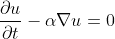

如果我们想在 2D(笛卡尔)中求解，我们可以这样写上面的热方程

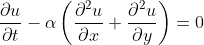

其中 *u* 是我们想要知道的量， *t* 是时间变量， *x* 和 *y* 是空间变量， *α* 是扩散系数常数。所以基本上我们要在 *x* 和 *y* 中处处寻找 *u* 的解，并且随着时间的推移 *t* 。

现在让我们简单地看看有限差分法(FDM)。有限差分法是一种用有限差分逼近导数来求解微分方程的数值方法。记住导数的定义是

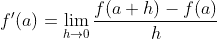

在有限差分法中，我们近似它并去掉极限。因此，我们不使用微分和极限符号，而是使用 delta 符号，即有限差分。请注意，这过于简单，因为我们必须使用泰勒级数展开，并通过假设某些项足够小来推导它，但我们得到了这种方法背后的粗略想法。

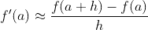

在有限差分法中，我们将对空间域和时间间隔 *x* 、 *y* 、 *t* 进行“离散化”。我们可以这样写

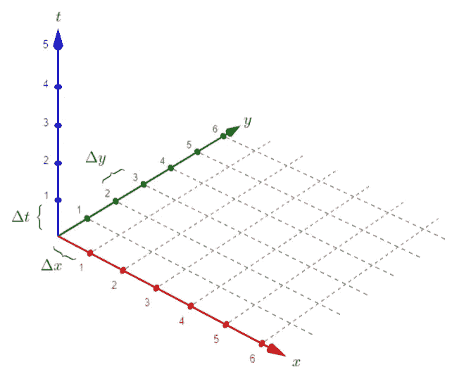

笛卡尔坐标，其中 x 和 y 轴代表空间变量， *t* 代表时间变量(坐标轴来自 [GeoGebra](https://www.geogebra.org/) ，作者编辑)

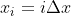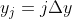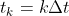

我们可以看到， *i* 、 *j* 、 *k* 分别是 *x* 、 *y* 和 *t* 的每个差值的步长。我们想要的是解决方案 *u* ，也就是

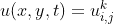

注意 *k* 是上标，表示 *u* 的时间步长。我们可以用有限差分法写出上面的热方程，就像这样

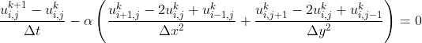

如果我们用δ*x*=δ*y*来排列上面的等式，我们得到这个最终的等式

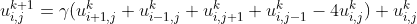

在哪里

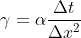

我们可以使用这个模板来记住上面的等式(空间步长见下标 *i* ， *j* ，时间步长见上标 *k*

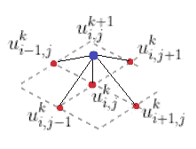

显式方法模具(图片由作者提供)

我们使用显式方法来得到热方程的解，所以它在任何时候都是数值稳定的

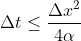

一切准备就绪。现在我们可以求解上面代数方程近似的原始热方程，这是计算机友好的。对于一个习题，我们假设一个边长为 50 个单位长度的薄正方形板。板内各处的温度原本是 0 度(在 *t* = 0)，让我们看看下图(这不太现实，但有利于锻炼)

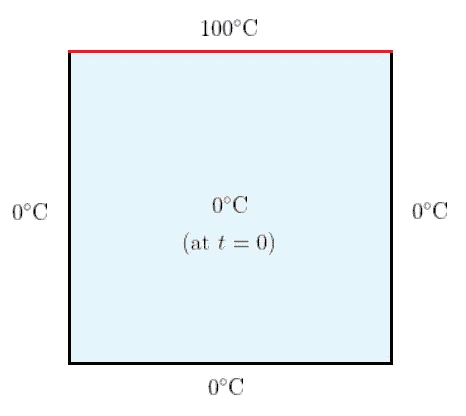

我们练习的边界和初始条件(图片来自作者)

对于我们的模型，我们取δ*x*= 1，α*= 2.0。现在我们可以用 Python 代码来数值解决这个问题，以查看各处的温度(用 *i* 和 *j* 表示)以及随时间的变化(用 *k* 表示)。让我们首先导入所有必要的库，然后设置边界和初始条件。*

*我们已经设置了初始条件和边界条件，让我们根据上面推导的有限差分法来编写计算函数。*

*让我们准备绘图函数，这样我们可以将解决方案(对于每个 *k* )可视化为热图。我们使用 Matplotlib 库，它很容易使用。*

*我们需要的另一件事是将结果动画化，因为我们希望看到板内的温度点随时间的变化。因此，让我们创建函数来激活解决方案。*

*现在，我们完成了！让我们看看下面的完整代码并运行它。*

*就是这样！这是结果*

*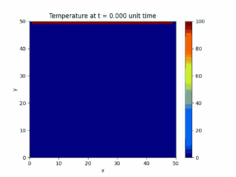*

*我们简单热方程练习的数值解*

*很酷不是吗？顺便说一下，您可以使用这个 Python 在线编译器[https://repl.it/languages/python3](https://repl.it/languages/python3)来尝试上面的代码，确保您在运行代码之前将 *max_iter_time* 更改为 50，以使迭代结果更快。*

*好了，我们现在有了代码，让我们玩一些更有趣的东西，让我们把所有的边界条件设置为 0，然后把内部网格的初始条件随机化。*

*这是结果*

*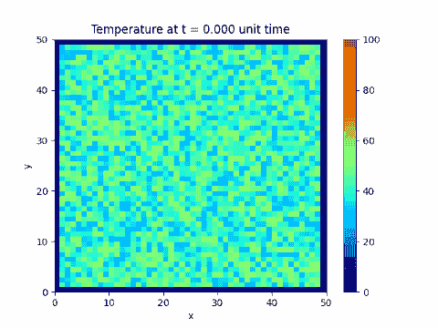*

*网格内所有边界条件均为 0 且初始条件随机的数值解*

*与其他编程语言相比，Python 对于初学者来说相对容易学习。我建议使用 Python 来解决计算问题，就像我们在这里所做的那样，至少对于原型来说是这样，因为它有非常强大的数字和科学库。这个社区也在变得越来越大，当我们陷入困境时，这可以让谷歌搜索变得更容易。Python 可能没有 C 或 C++快，但使用 Python 我们可以更专注于解决问题本身而不是语言，当然我们仍然需要在某种程度上了解 Python 语法及其简单的数组操作，但一旦我们掌握了它，它将非常强大。*

# *分级编码*

*感谢您成为我们社区的一员！升级正在改变技术招聘。 [**在最好的公司**找到你最理想的工作](https://jobs.levelup.dev/talent) **。***

* [## 提升——改变招聘流程

### 🔥让软件工程师找到他们热爱的完美角色🧠寻找人才是最痛苦的部分…

作业. levelup.dev](https://jobs.levelup.dev/talent)*