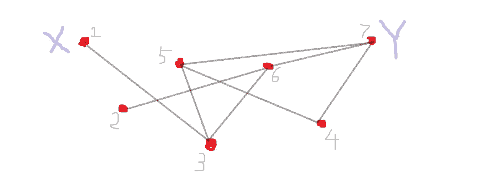
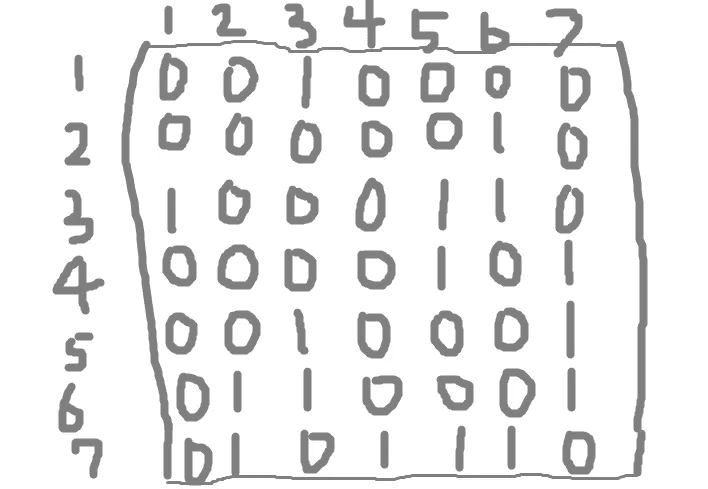

# 用矩阵解决谷歌面试中关于路径计数的难题

> 原文：<https://levelup.gitconnected.com/solving-a-hard-google-interview-question-about-path-counting-using-matrices-f3149bfd6ff4>

在谷歌面试很难。用这个过去面试中有趣而富有挑战性的问题来测试你的编码和数学能力。

# 这个问题

给定一个图 G，对于每对节点 X 和 Y，计算从节点 X 到节点 Y 的唯一 k 步路径的数量。

样本图 g

# 解决方案 1

第一步是构造图的邻接矩阵。邻接矩阵是由 1 和 0 组成的矩阵，对图的连通性信息进行编码。如果存在边，则图中相应的条目为 1，否则为 0。

上面给出的 7 个顶点上的样本图 G 的邻接矩阵是:

g 的邻接矩阵 A。

现在来看看诀窍:我们可以用邻接矩阵的矩阵幂来计算从一个节点到另一个节点的不同路径的数量。如果你需要复习矩阵乘法，请查看本页。

对于 k=2(两步路径)，我们可以对矩阵求平方，并考虑入口(I，j)。

A 乘以 A 的第(I，j)项

这个量正是我们想要的，因为它计算了节点 I 到中间节点 k 到节点 j 之间的路径数，其中 k 的范围在所有可能的中间节点 k 之间。如果边(I，k)和(k，j)都存在，则 a_ik 和 a_kj 都等于 1，这将总和加 1。如果其中一条边不存在，那么乘积为零，和不增加。

这个问题的一般版本的答案是

矩阵求幂(A 乘以自身 k 次)。I，j 指的是结果矩阵的条目(I，j)

这可以用归纳法来证明。

## 时间复杂性分析

对于 k 步的情况，如果我们将矩阵一个接一个地相乘(例如使用 For 循环)，那么时间复杂度为

n 是矩阵中的节点数，k 是路径中的步数

因为矩阵乘法的时间复杂度是立方的。然而，这种解决方案是次优的，因为当 k 很大时，所需的操作相当大！

# 解决方案 2 —优化

我们可以应用[快速取幂](https://mathstats.uncg.edu/sites/pauli/112/HTML/secfastexp.html)，而不是天真地做乘法，这可以被视为动态编程、记忆或递归。我们通过递归地取 a 的较小幂来计算 a 的幂。例如，要计算⁶，我们可以写一个⁶ = (A⁸)(A⁸).然后 A⁸ = (A⁴)(A⁴).然后是 A⁴=(A)(一)。所以我们只需要做 a，(a)，(A⁴)和(A⁸)，这是 4 次矩阵乘法，而不是 15 次！

时间复杂度是

相当不错！

# 解决方案 3 —更快

最佳解决方案是预先计算矩阵 A 的特殊分解:A 的[奇异值分解](https://en.wikipedia.org/wiki/Singular_value_decomposition)。由于 A 是对称矩阵，这对应于正交分解

其中 D 是对角矩阵，Q 是正交矩阵。所有这些都是说 A 的 k 次方由下式给出

因为 D 是对角线，所以可以快速计算！如果我们使用快速取幂技巧来计算 D 的对角元素的幂，我们也可以在对数时间内计算 D 的 k 次幂。

因为形成分解的时间复杂度是 N 的立方，所以该方法的总时间复杂度是

# 结论

谷歌和其他科技公司喜欢通过询问时间复杂度(和空间复杂度)来跟进问题。在这个问题中，我们看到了大量的时间复杂度分析、矩阵代数和使用图的邻接矩阵的推理。

# 分级编码

感谢您成为我们社区的一员！更多内容请参见[升级编码出版物](https://levelup.gitconnected.com/)。
跟随:[推特](https://twitter.com/gitconnected)，[领英](https://www.linkedin.com/company/gitconnected)，[通迅](https://newsletter.levelup.dev/)
**升一级正在改造理工大招聘➡️** [**加入我们的人才集体**](https://jobs.levelup.dev/talent/welcome?referral=true)