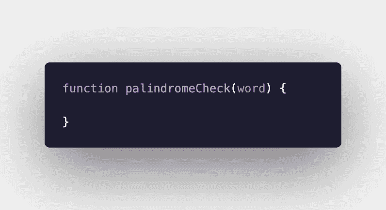
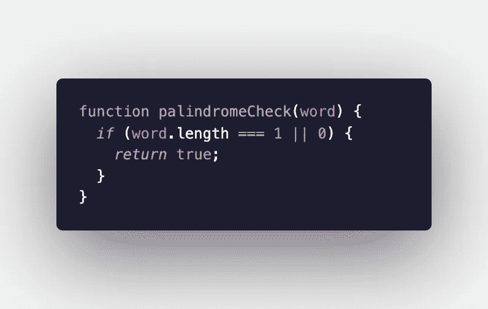
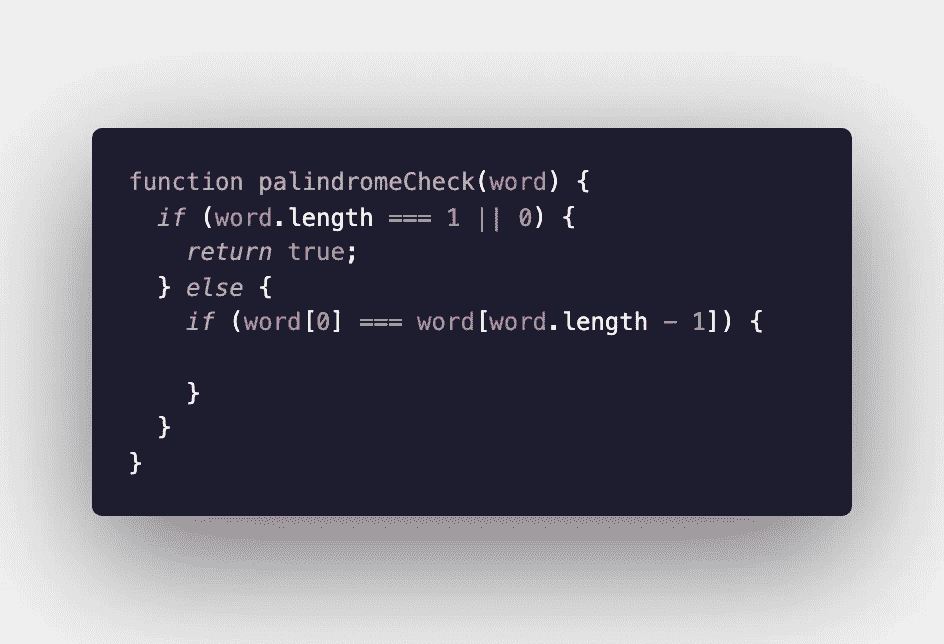
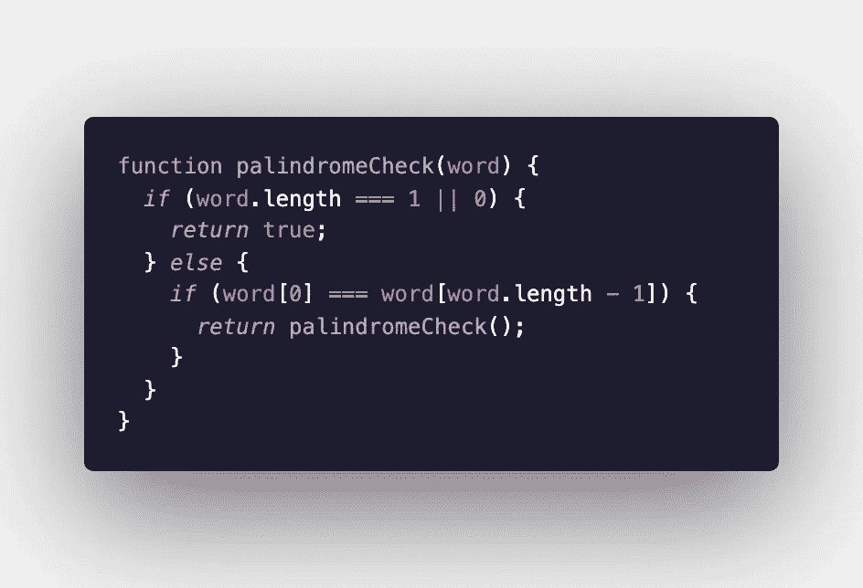
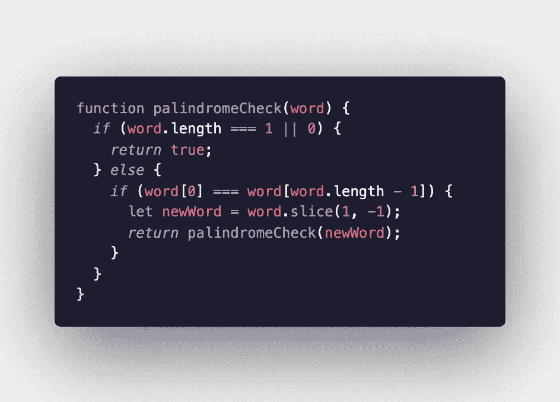
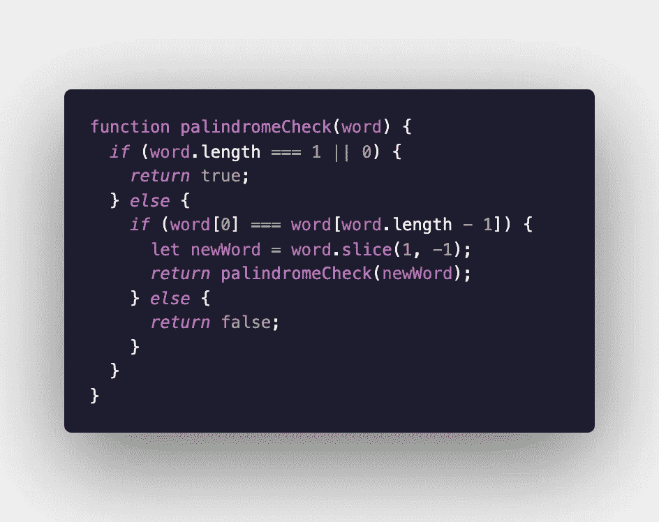

# 利用递归求解回文算法

> 原文：<https://levelup.gitconnected.com/solving-a-palindrome-algorithm-using-recursion-f228ac816bcd>

这听起来可能令人生畏，但是当你学习解决算法时，递归可能是一个有用的工具。简单地说，递归算法是一种在函数结束前调用自身的算法。当它这样做时，它每次传递一个更小或更短的输入。在再次调用自身之前，该函数的目的是缩短输入或缩小结果范围。

初学者可能被要求解决的一个常见算法是检查一个单词是否是回文。递归是解决这个问题的有效方法。我将尽可能简单地一步一步解释这个过程。我将在本指南中使用 JavaScript。

*   和往常一样，首先要做的是声明一个函数。我们还想传入我们的输入，在本例中是一个单词。

*   因为这个函数会反复调用自己，所以我们想为它提供一个条件来打破这个循环。我们为此编写的相同的“if”语句也将处理输入到函数中的单字母单词实例的边缘情况。因为一个单字母单词总是一个回文，如果我们检查一个这么短的单词，函数可以自动返回 true。此外，由于我们将使用越来越短的输入来重复调用函数，我们最终将只使用一个字母来调用它。如果发生这种情况，我们将再次知道我们找到了一个回文。我们还想检查函数是否在没有任何输入的情况下被调用。

*   如果字长既不是 1 也不是 0，我们要处理在‘if…else’语句的‘else’半部分做什么。为了开始检查单词是否是回文，我们可以在第一个语句中嵌套另一个“if…else”语句。我们想检查单词的第一个字母和最后一个字母是否相同。

*   如果单词两端的字母相同，我们想再次调用这个函数。

*   如果我们想做任何事情，除了反复核对第一个和最后一个字母之外，我们不能再次传递同一个单词。我们需要缩短我们正在传递的单词。我们可以去掉已经检查过的字母，然后输入新的更短的单词。我们通过使用 slice 函数来实现这一点。

*   如果这个函数在任何时候检查两个不匹配的字母，那么我们知道这个单词不是回文，函数必须返回“false”我们需要做的最后一件事就是设置这个。

现在你知道了！一个利用递归的简单算法，帮助你掌握它的窍门。去试试吧！

阿曼达·特劳特勒

**关注我们的** [**推特**](https://twitter.com/joinfaun) 🐦**和** [**脸书**](https://www.facebook.com/faun.dev/) 👥**和**[**insta gram**](https://instagram.com/fauncommunity/)**📷**并加入我们的** [**脸书**](https://www.facebook.com/groups/364904580892967/) **和**[**Linkedin**](https://www.linkedin.com/company/faundev)**群**💬**。****

****加入我们的社区 Slack team chat** 🗣️ **阅读我们每周的农牧神话题**🗞️**并与社区联系**📣**点击 here⬇****

****

## **如果这篇文章有帮助，请点击拍手👏按钮下面几下，以示你对作者的支持！⬇**