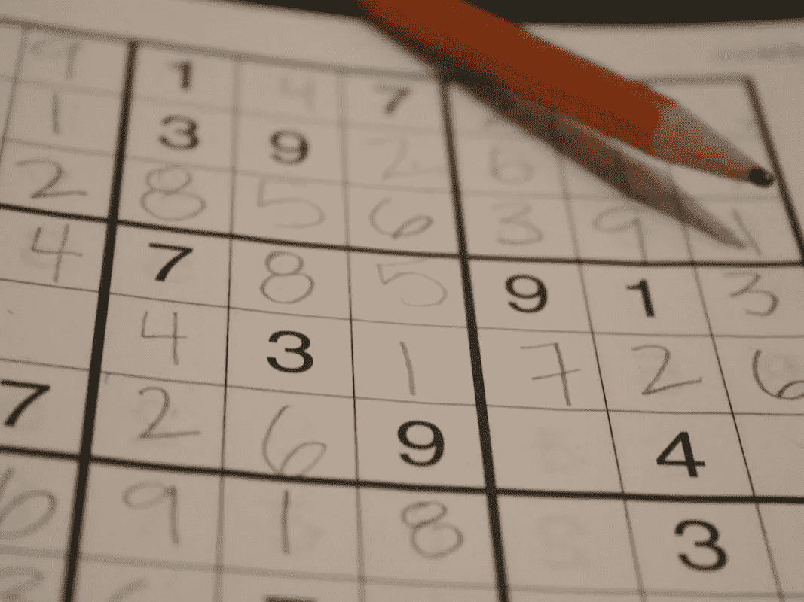
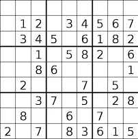
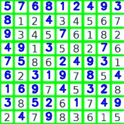
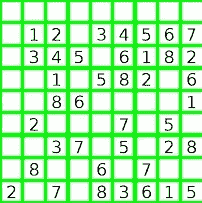
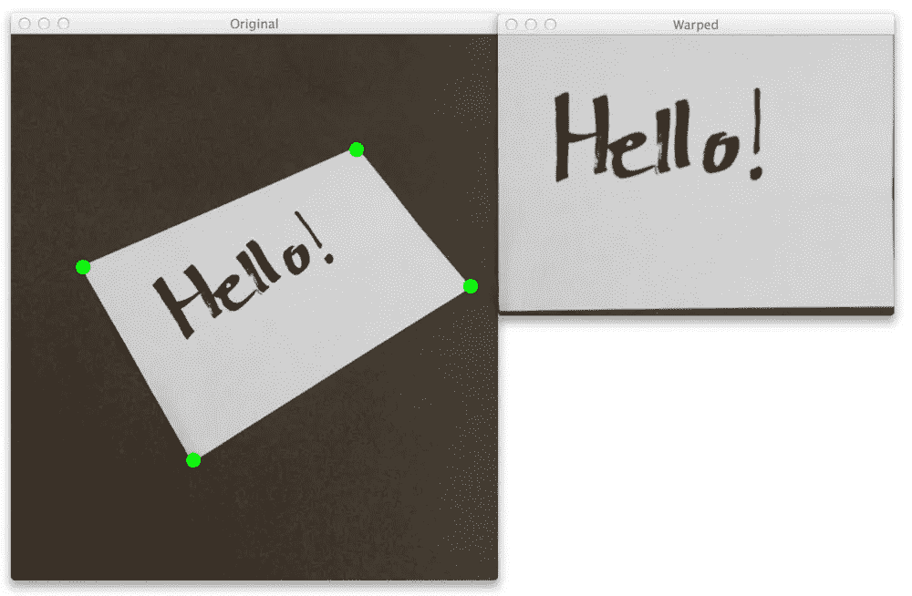
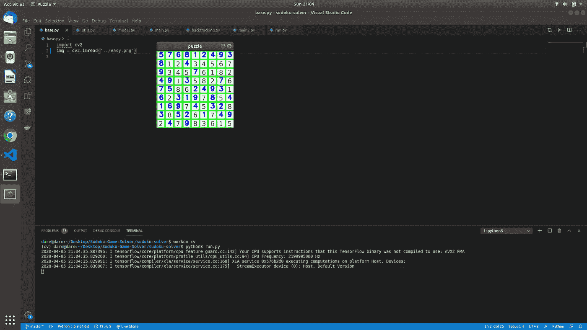

# 使用深度学习和回溯算法解决数独难题

> 原文：<https://levelup.gitconnected.com/solving-a-sudoku-puzzle-using-deep-learning-and-backtracking-algorithm-c6cef475ae3>

数独游戏

早上八点零五分。警报嗡嗡响。向窗外望去，天不像往常那么亮，前一天晚上一定下雨了。床很暖和。

但是我起床了。我勇敢地面对清晨，像冠军一样站在冰冷的地板上。

为什么？

因为我很兴奋。

很高兴今天能和大家分享一些特别的东西。

在过去的几周里，我一直在做这个惊人的项目，现在我想公布并给出一个完整的分析。

# 简要概述

这个项目是一个计算机视觉应用程序，它使用**深度学习**、*解决了一个 9x9 数独难题，深度学习是更广泛的机器学习家族的一部分，也是人工智能*和**回溯算法**的子集，后者是一种用于解决难题的流行递归算法。

在这个项目中有两种主要的方法来解决这个难题；上传难题的图像或通过计算机的网络摄像头解决它。

我将带你经历解决这个难题的 5 个主要阶段。

我假设每个人都知道什么是数独以及如何玩数独，否则检查这个[链接](https://sudoku.com/how-to-play/sudoku-rules-for-complete-beginners/)。应用程序的结果如下所示。

解决前的数独难题

数独解谜后

# 快速入门

## 阶段 A:图像预处理

让我们从最开始说起，语言选择。Python 是这种情况下选择的语言，因为它的简单性、可移植性和 OpenCV 的创造性，尽管它的运行时间比 C/C++慢。项目中使用的一些重要库包括:

> OpenCV、Tensorflow、Keras、Pillow、Numpy 和 Matplotlib

**读取灰度图像**

使用 OpenCV 的输入函数读取图像，颜色通道从 3 个减少到 1 个，以满足一些尚未使用的图像库的适当要求。

**高斯模糊减少背景噪声**

高斯滤波器是一种低通滤波器，可以去除图像中的高频成分，即噪声。在我们的例子中，由于噪声较少，使用了(1，1)的核大小

**逆二进制阈值**

如果对应的源像素大于阈值，则将目标像素设置为零，如果源像素小于阈值，则将目标像素设置为 maxValue。在这种情况下，我们的阈值是 0-255 范围内的 180。霍夫变换库需要这种图像格式。

**概率霍夫变换**

概率霍夫变换是霍夫变换的一种优化。它用于图像中互连为边缘的线条的稳健检测。这有助于检测数独板的网格形式。

霍夫变换在数独图像上的应用

**透视变换**

这是这个阶段的一个有趣的部分，因为无论棋盘在图像中的什么位置，获得棋盘的“自上而下”的视图都是非常重要的。`order_points`函数接受一个参数`pts`，它是一个包含四个点的列表，指定矩形中每个点的 *(x，y)* 坐标。

`four_point_transform`函数接受要转换的图像和新点作为参数。新图像的宽度和高度分别通过计算它们的水平点和垂直点之间的最大距离来导出。我们利用`cv2.getPerspectiveTransform` 函数，它需要两个参数，`rect,`是原始图像中 4 个 ROI 点的列表，而`dst`是我们转换后的点的列表。函数返回`M`，这是实际的变换矩阵。

`cv2.warpPerspective` 的输出是我们的扭曲图像，这是我们自上而下的视图。

这一过程在 CamScanner 应用中广泛使用，以获得要扫描的纸张的准确边角，并将其重新整形为图像的原始形状。这是用于这个项目的情况下，你的数独图像有一些背景！

透视变换

## 阶段 B:卷积神经网络模型

训练了 Keras MNIST 手写数字分类模型并用于该模型，准确率为 98.7%。这是深度学习初学者非常常见的模型。要掌握它，请跟随这个[链接](https://www.sitepoint.com/keras-digit-recognition-tutorial/)。

最初，模型建立在来自 [Chars 74k 数据集](http://www.ee.surrey.ac.uk/CVSSP/demos/chars74k/)的自定义图像上，该数据集包含来自具有 4 种变体(斜体、粗体和正常组合)的计算机字体的字符。在[迁移学习的帮助下，](https://towardsdatascience.com/a-comprehensive-hands-on-guide-to-transfer-learning-with-real-world-applications-in-deep-learning-212bf3b2f27a)我能够获得 91%的准确率，这对于预测谜题中的数字来说还不够准确。

## 阶段 C:数字提取

这是项目中最具挑战性的阶段，但我还是挺过来了。执行的第一步是编写一个函数，以二维数组的形式获取拼图中所有 81 个单元格的位置。

下一步是编写一个有两个参数的函数，单元格位置和图像。使用单元格位置中的`cv2.findContours`函数，可以定位精确的数字位置，并且模型能够预测图片的这一部分。在空单元格上，`cv2.findContours`函数返回空位置，因此，该逻辑用于在空位置放置 0。

最后一步是创建另一个函数，它接受图像作为参数。它遍历从`getCellPositions`函数获得的单元格位置，并调用上一步中的`predictDigit`函数对所有单元格进行预测。

## 阶段 D:回溯

> 回溯算法是一种递归算法，它试图通过测试通向解决方案的所有可能路径来解决给定的问题，直到找到解决方案。每次测试一条路径时，如果没有找到解决方案，则该算法返回测试另一条可能的路径，依此类推，直到找到解决方案或所有路径都已测试完毕。

我们的函数 solve 使用了两个额外的辅助函数；`valid` & `find_empty`采用这种算法解决谜题。为了更深入地了解回溯，您可以查看这个[链接](https://www.geeksforgeeks.org/backtracking-algorithms/)。下面显示了一个片段。

## 阶段 E:手指放置

这是项目的最后阶段。它包括在原始图像中放置新发现的数字。一个名为`detectEmptyCell`的函数将图像作为参数，使用轮廓方法扫描图像中的空单元格，并返回所有单元格的位置

同样将图像作为参数的`placeSudokuDigits`函数调用`detectEmptyCell`函数。它遍历所有的空单元格，并将新找到的数字放在适当的位置。

笔记本的其余部分可以在我的 Github repo [这里](https://github.com/Pydare/Sudoku-Game-Solver)找到。网络摄像头功能是在阅读实时图像时上述所有阶段的应用。

# 如何使用该应用程序

包含应用程序完整目录的 repo 在这个[链接](https://github.com/Pydare/Sudoku-Game-Solver)中。

**上传**

*   首先，用 git 克隆[https://github.com/Pydare/Sudoku-Game-Solver.git](https://github.com/Pydare/Sudoku-Game-Solver.git)克隆存储库，并进入克隆的文件夹。
*   从 requirements.txt 文件创建一个包含所需库的虚拟环境，并激活它。
*   上传一个你想解决的数独图像。一些样本图像在回购，3 个主要困难(容易，中等和困难)
*   打开 sudoku-solver 目录，在 base.py 文件中，在第二行输入图像文件的名称。
*   在您的终端/bash 中使用 python run.py 解决这个难题

求解 easy.png 的输出

目录里还有另外两张中难度和硬难度的数独拼图图片，也可以测试。

**网络摄像头**

*   首先，用 https://github.com/Pydare/Sudoku-Game-Solver.git 的 git 克隆[克隆仓库，并进入克隆的文件夹。](https://github.com/Pydare/Sudoku-Game-Solver.git)
*   从 requirements.txt 文件创建一个包含所需库的虚拟环境，并激活它。
*   面对你的摄像头和拼图的图像，在你的终端输入 python sudokuWebcam.py，拼图就解决了

笔记本文件也可以用来执行以上两种操作。

合作对游戏开发者是开放的，他们可能有额外的功能可以添加到适当的应用程序中。你可以通过 [Linkedin](https://www.linkedin.com/in/joseph-adewumi-66ab3914b/) 联系我。

这个季节保持安全。