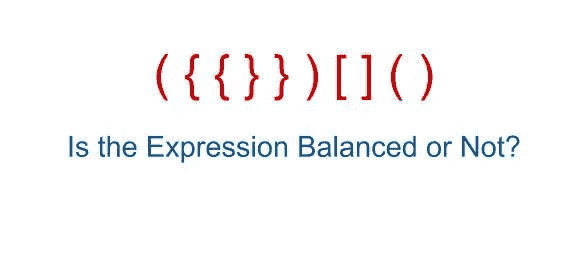
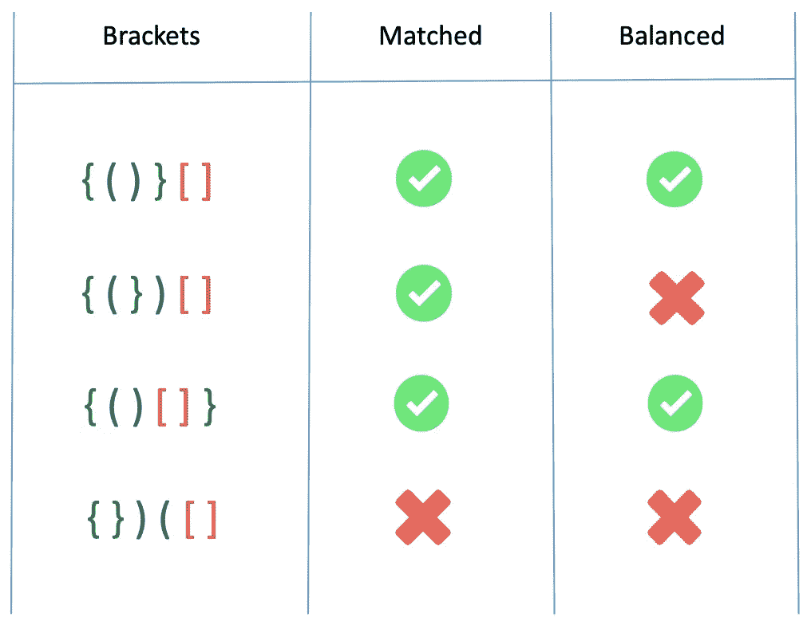
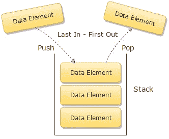

# 用栈解决 Javascript 中的平衡括号

> 原文：<https://levelup.gitconnected.com/solving-balanced-brackets-in-javascript-with-stacks-edbc52a57309>

## [GitHub Repo，包含完整的解决方案代码和测试套件](https://github.com/noamsauerutley/balanced-brackets)

平衡括号算法挑战的目的是什么？

> 给定一个包含括号的字符串，确定是否所有的括号都有匹配的对应物。如果字符串中的所有括号形成平衡对，则返回 true。如果不是，则返回 false "

***注*** *:我这里用的是“* [*括号*](https://en.wikipedia.org/wiki/Bracket) *”这个词，指的是圆括号、花括号、方括号、尖括号(')、{、[、<、>、]、}、)')。不是每个挑战都要求你包括所有四种类型！*

我第一次看到这个问题时，我的第一反应是尝试根据每个字符是左括号还是右括号将字符串排序为子字符串，并比较子字符串的长度。

这种方法可能对偶尔出现的简单字符串有效，但很快就会失效。我们不仅要知道每个开括号都有一个闭括号，还要知道开括号和闭括号的具体类型是相互匹配的。不仅如此，如果我们希望这个函数对任何类型的 IDE 语法突出显示或其他实际应用程序都有用，那么它不仅需要识别开括号和闭括号的数量和类型是否正确，还需要识别它们的排列顺序是否正确——每个开括号在字符串中的正确位置都有一个匹配的闭括号，以便实际上关闭它。

这就是所谓的括号“平衡”的含义——它们不仅存在于正确数量的匹配对中，而且这些对排列正确，以便右括号可以平衡左括号。

我最初的想法是将字符串整理成子字符串，并比较子字符串的长度，这种想法在挑战的多个间隔中显然会失败。

我需要另一种方法。

# 大量

我最终用来解决这个算法的工具是一个我以前没有用过的数据结构。

我已经在之前[写过](/solving-the-ransom-note-algorithm-in-javascript-72ebe8acb268) [关于使用](/find-all-permutations-of-a-string-in-javascript-af41bfe072d2)[散列表](https://en.wikipedia.org/wiki/Hash_table)和[递归树](https://en.wikipedia.org/wiki/Master_theorem_(analysis_of_algorithms))分解复杂任务的好处。我知道[数据结构](https://www.geeksforgeeks.org/data-structures/)可以为解构需要[算法解决方案](https://en.wikipedia.org/wiki/Algorithm)的问题制造惊人的工具。

但是在尝试解决这个特殊的问题之前，我并没有遇到太多的堆栈。

在 Javascript 中，我喜欢把它们想象成一个带有一些限制性规则的[数组](https://www.geeksforgeeks.org/arrays-in-javascript/)。

通常，Javascript 中的数组可以用多种方式操作。这就是它们如此方便的原因。这就是为什么我用空数组开始大多数算法解的原因。我们几乎总是需要一个环境来操作或组织我们的数据。

Javascript 中的堆栈仅通过使用 [**push**](https://www.geeksforgeeks.org/javascript-array-prototype-push-function/) 和 [**pop**](https://www.geeksforgeeks.org/javascript-array-prototype-pop/) 方法对数组进行操作来利用。这些方法会分别把一个新元素推到栈顶，或者把它从栈顶弹出。

虽然可以从任何方向访问常规数组的元素(从前面移开、推到后面、从中间切进去或切出来，或者只是就地编辑)，但我认为堆栈是一个被密封的数组，除了一扇门之外，它是不可访问的。新的东西可以通过门推入，但是只有最近添加的东西，即直接在门前的东西，可以以任何方式访问或操作。如果使用 ***array.pop()*** 移除该元素，那么它后面的元素现在可以被更改或移除。然而，如果它没有被移除，而是通过门推入了新的元素，则先前可访问的元素再次变得不可访问。

这种方法被称为 **FILO、**或**先进后出**。

*(这种缩写可能对在厨房工作或在厨房周围工作的任何人都很熟悉，厨房不可避免地受到相关但相反的法律****FIFO****或* ***先进先出*** *的管辖，以避免食物浪费和腐败。)*

但是，为什么我们要故意像这样限制我们可爱的通用数组呢？

这个过程保留了一个特定的顺序——元素只能按照它们最初被添加的顺序被删除，保留了原始的顺序或模式。

这正是我们需要对括号做的事情——不仅要确定字符串中包含的括号的数量和类型，还要确定它们的具体顺序。

所以，我们知道栈允许你操作数组中的数据，同时保留数据的原始有序模式，这听起来像是我们需要做的。让我们开始实际使用这个工具，在算法上解决我们的挑战。

所以，用一点伪代码让我们开始:

我知道使用一个**堆栈**，我可以保存我的括号顺序的记录，这将允许我检查它们是否都正确平衡(所有的开始和结束括号都有一个匹配，并且它们以正确的顺序相互平衡)。

首先，我为自己制作了一些重要的变量。

我将列出所有可能的开括号和闭括号的字符串保存到一个名为**括号**的变量中。

> ***注*** *:我在这个字符串里把左右括号配对在一起。*
> 
> ***这个很重要。***
> 
> *我的特殊解决方案* ***无法工作*** *例如，如果括号字符串被写成“****[{(<]})>****”。*
> 
> *括号可以按类型按任何顺序排列(例如****()[]{ }<>****【和】****<>(){ }[]****"都很好)，但是* ***左右括号必须写在一起*** *。*

我创建的下一个变量只是一个空数组，我们可以称之为**堆栈**，因为这将是我们的堆栈。

我已经通过我们的输入字符串画出了一个初始循环，此时只填充了伪代码。

***注意*** *:这个循环是遍历输入的元素，而不是索引。就我个人而言，我喜欢使用*[***for…在****/****for…的****loops*](https://alligator.io/js/for-of-for-in-loops/)*中，但是你总是可以使用一个更传统的 for 循环(例如* ***for(让我= 0；i < input.length，i++)*** *”)，如果您愿意的话，只要稍加修改就可以使用这个解决方案。*

我们函数剩下的唯一工作就是在循环结束时返回 true 或 false。

是时候真正开发我们的堆栈并投入使用了！

首先，循环本身的另一个重要变量:

**我们正在迭代 ***输入*** ，传递给函数进行测试的括号字符串。**

> ****括号索引*不是当前*括号*的*输入*中的*索引*。*****

*****括号索引*** 在我们之前保存的 ***括号*** 变量中查找当前 ***括号*** 的**索引**。所以如果*中的第一个 ***括号*** 是一个 **(** ，它的 ***括号 Index*** 就会是 **4** 。其 ***索引**输入*** 当然是 **0** ，但是*的 ***索引******中的*括号*** 是 **4** ，所以其**括号*索引*是*****

*****还记得括号字符串中括号的顺序有多重要吗？我们快到了。*****

*****那么现在，我们有一个变量，***bracketsIndex***，它可以在 ***括号*** 变量中查找我们当前的括号。*****

*****现在，我们终于可以开始使用我们的堆栈了。*****

*****因为我们组织我们的 ***括号*** 引用字符串的方式，我们知道开括号有偶数索引(0，2，4，& 6)，闭括号有奇数索引(1，3，5，7)。*****

*****所以，如果我们当前的 ***括号 Index*** 是偶数，我们知道当前的 ***括号*** 是开括号。*****

*****我们可以使用[模操作符](https://en.wikipedia.org/wiki/Modulo_operation)来测试这一点。模运算，在 Javascript 中由**模运算符**调用，即 **%** (通常称为百分号)，将第一个数字除以第二个数字，然后返回余数。因此，测试偶数或奇数的一种方法是运行 *number % 2 === 0。* Two 将被偶数整除，余数为零(返回真)，而不会被奇数整除(返回假)。*****

*****然后，我们可以通过找到索引为 ***的括号 Index*** + 1 的括号，将所需结束括号在 ***括号*** 中的位置推到堆栈上。同样，由于我们编写方括号*字符串的方式，一个开括号后面总是紧跟着与之匹配的闭括号。得益于此，我们可以增加任何一个开始括号的***brackets index***来找到其结束匹配的地址。******

******现在，当我们遍历输入时，我们的堆栈将记录输入字符串平衡所需的右括号。******

*********注意*** *:括号****index****，一个整数，是被推到堆栈上的东西，而不是右括号本身。*******

> *********例如:*** *如果我们的循环遍历了元素"* ***(，<，["*** *)，那么堆栈将保存******)*，>******中的索引************

********只要我们一直点击左括号，我们的循环就会继续这个任务。********

********太酷了。当我们碰到一个右括号时会发生什么呢？********

********如果*的当前 ***括号*** 是一个闭括号，因此有一个奇数索引，那么(由于我们的条件是基于对其 ***括号的奇偶测试运行)索引*** ，一个新的任务将运行。*********

*******Array.pop() 从堆栈中移除最近添加的内容，改变数组的长度，并返回移除的元素，允许我们在需要时引用该元素。*******

*******因此，如果当前括号关闭，我们将弹出堆栈中的最后一个元素，并比较两者。如果我们的括号是平衡的，它们应该匹配。*******

*******这就是使用堆栈的全部目的——当我们遍历输入字符串时，需要的结束括号被推送到堆栈上，用于每个开始括号，然后当到达匹配的结束括号时弹出。如果堆栈中的某个东西打破了这种模式，那么我们知道我们的输入字符串是不平衡的。*******

> **********例如:*** *如果我们的循环遍历了元素"* ***(，<，["*** *)，那么堆栈将保存"****、或"* **) *、>、】*** *中的索引，因此将是****【5，7，1】************
> 
> ********如果下面的迭代命中了元素"* ***]*** *"，那么我们的表达式将检查* **stack.pop()** *(即* ***1*** *)对照当前* **括号** *(当前括号为) 当它们确实相等时，将返回 true，允许它移动到* **输入** *中的下一个元素。* **栈** *将会被****【5，7】****，随着* **stack.pop()** *的执行，从****栈中永久删除****1****。**********

*******不过我们还需要检查一件事——当这个循环结束时，堆栈应该是空的。如果不是，这意味着有一个额外的不平衡括号或更多的剩余。*******

*******所以，我检查 ***栈*** 在最终的布尔返回中长度为零。表达式 *stack.length === 0* 将返回我们这里需要的布尔值。*******

*******如果整个循环运行时没有返回 false，并且在解析时堆栈是空的，我们知道输入字符串是平衡的，函数应该返回 true。否则，我们的函数将返回 false。*******

*******让我们在控制台中运行这个函数，看看我们会得到什么！*******

*******太好了！🌟我针对各种平衡和不平衡的字符串测试了***is balanced()***函数，它为每个字符串返回了正确的布尔值！与我的第一个想法不同，这个函数不仅可以成功地检查括号的正确数量和类型，还可以检查它们的特定顺序，以确保它们正确匹配。*******

*******我仍然想在我们的函数中增加一个功能元素。目前，如果输入包含除了纯括号之外的任何内容，我们的函数将会中断。如果我们真的想创建我们自己的语法括号高亮器或其他函数的实际应用，那对我们没有太大帮助。所以，我们可以在循环中增加一个条件。*******

*******如果当前元素不在 ***括号*** 中(这将产生-1 的索引)，我们只需指示循环继续前进到输入字符串中的下一个字符。这一变化使我们的功能更具适应性！*******

*******这个算法挑战让我真正喜欢使用堆栈，尽管在我以前的经验中，这种特殊的数据结构被忽略了。有其他方法可以解决这个问题，但是很多方法都需要编写大量重复的代码来测试每一个单独的括号类型，这给了我很多机会来输入错误和感到厌烦。*******

*******如果你在可视化栈的操作方面有困难，我建议在这段代码中添加一些[调试器](https://www.geeksforgeeks.org/debugging-in-javascript/)或 [console.log()](https://www.geeksforgeeks.org/javascript-console-log-with-examples/) ，并在你的控制台中观察循环的运行。*******

*******不确定从哪里开始？您可以尝试以下方式:*******

*******希望这个算法挑战给你和我一样的机会——理解堆栈如何工作的机会，以及为什么它们对于需要保留和检查特定顺序的问题是如此有用的工具。*******

**************

1.  *******本文还讨论了**队列**数据结构，这与这个特殊的挑战并不完全相关，但了解一下还是很好的。虽然这篇文章并不专门关注堆栈，但它是我最喜欢的堆栈摘要之一。我也喜欢[这个](https://medium.com/@_jmoller/javascript-data-structures-stacks-and-queues-ea877d72a5f9)。*******
2.  *******这些字符串是我在这篇文章的 [GitHub Repo](https://github.com/noamsauerutley/balanced-brackets) 中的测试套件中使用的，而[测试文件](https://github.com/noamsauerutley/balanced-brackets/blob/master/test/balancedBrackets.spec.js)包含的注释可以给你更多关于每个不同字符串测试函数的信息。*******