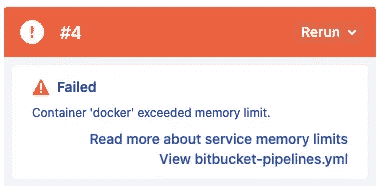

# 解决位桶管道内存问题

> 原文：<https://levelup.gitconnected.com/solving-bitbucket-pipelines-memory-issues-62c5a236ef96>


照片由[扬西·敏](https://unsplash.com/@yancymin?utm_source=medium&utm_medium=referral)在 [Unsplash](https://unsplash.com?utm_source=medium&utm_medium=referral) 上拍摄

由于我们的团队越来越多地使用位桶管道，我们更经常遇到的是位桶管道因错误`Container ‘docker' exceeded memory limit`而失败。在这篇文章中，我将告诉你如何解决这个问题。本文的范围是解决在 Bitbucket 管道中使用 Docker 服务容器时的内存问题，但是当您不使用这个特定的服务容器时，肯定可以使用特定的部分。



超出内存错误位桶管道

# **TL；博士**

使用*bit bucket-pipelines . yml*中的`(option).size`和`definitions.services.docker.memory`来增加管道和服务容器中的内存限制。

```
...definitions:
  services:
    docker:
      memory: 7128pipelines:
  branches:
    master:
      - step:
          size: 2x
          name: 'PIPELINE NAME'
          script:
            - ...
...
```

# 一些背景

我们将位桶管道用于几个任务；自动化测试、林挺代码、版本控制(增加版本号+创建/更新发布分支)以及构建和部署工件。后者可以是，例如；

*   构建 Docker 映像(Python)并将它们上传到 AWS ECR，然后在 ECS 上触发服务的“强制新部署”。
*   构建 Python 库并将它们发布到我们的私有 PyPI 注册中心。
*   构建 Angular 应用程序并将构建文件上传到 S3，然后触发 CloudFront 失效。

大多数时候，在 Bitbucket 管道中构建 Docker 容器会导致我们的问题。我们是一个数据科学实验室，对大型机器学习和深度学习包并不陌生。有时，在 Docker 容器中安装这些包可能需要很长时间，没有什么比长时间等待最终失败更令人沮丧的了。

## bitbucket-pipelines.yml 示例

让我们假设如下，我们有一个内容如下的`bitbucket-pipelines.yml`。该文件定义了在管道中采取的操作。我们在资源库的根目录下还有一个`Dockerfile`，包含一个需要大量内存的进程，这个`Dockerfile`实际上将在管道中构建。

**bit bucket-pipelines . yml**

```
pipelines:
  branches:
    master:
      - step:
          name: 'Deploy'
          script:
            - curl -O [https://bootstrap.pypa.io/get-pip.py](https://bootstrap.pypa.io/get-pip.py) && python get-pip.py && pip install awscli
            - docker build -t $PROJECT_NAME .
            - docker tag $PROJECT_NAME:latest $ACCOUNT_ID.dkr.ecr.eu-west-1.amazonaws.com/$PROJECT_NAME:latest
            - docker push $ACCOUNT_ID.dkr.ecr.eu-west-1.amazonaws.com/$PROJECT_NAME
          services:
            - docker
```

这条管道的作用:

*   安装 pip
*   安装 awcli 以与 AWS 通信(我们已经设置了包含 AWS 凭证的存储库变量)
*   建立形象
*   标记图像
*   将图像推送到 AWS ECR

`services: — docker`行允许我们在这个管道中使用 Docker。

**注意:**我们实际上已经构建了我们自己的映像，包含了我们在管道中需要的所有需求(awscli、林挺等等)，所以我们脚本中的第一行`curl -0..`在我们当前的设置中实际上已经被淘汰了。

# 增加记忆

> 用于管道中 Docker 操作的 Docker-in-Docker 守护进程被视为服务容器，因此默认内存限制为 1024 MB。这也可以通过在定义部分更改内置 docker 服务的内存设置来调整为 128 MB 和 3072/7128 MB 之间的任何值。
> 
> 来源:[support.atlassian.com](https://support.atlassian.com/bitbucket-cloud/docs/databases-and-service-containers/)

每步的默认可用内存是 4096 MB。在上面的引用中可以看到，Docker 被视为一个服务容器，默认情况下，它将这个服务容器的限制设置为 1024 MB。我们可以做的第一件事是尝试将这个限制增加到 3072 MB。这是您可以在管道中使用的剩余内存，另外 1024 MB 已经为开销预留了。如果您没有使用服务容器，那么您可以跳过这一部分，因为在您的步骤中已经有了最大的可用资源。

增加内存而不调整`size`值不会影响构建时间。您可以通过在现有的`bitbucket-pipelines.yml`文件中添加以下内容来增加 Docker 服务容器的内存限制。

```
definitions:
  services:
    docker:
      memory: 3072pipelines:
  branches:
    master:
      - step:
          name: 'Deploy'
          script:
            - curl -O [https://bootstrap.pypa.io/get-pip.py](https://bootstrap.pypa.io/get-pip.py) && python get-pip.py && pip install awscli
            - docker build -t $PROJECT_NAME .
            - docker tag $PROJECT_NAME:latest $ACCOUNT_ID.dkr.ecr.eu-west-1.amazonaws.com/$PROJECT_NAME:latest
            - docker push $ACCOUNT_ID.dkr.ecr.eu-west-1.amazonaws.com/$PROJECT_NAME
          services:
            - docker
```

当调整 Docker 服务容器的内存不足，并且您的管道仍然由于内存问题而失败时，您可以使用`size`将管道内的资源加倍(总共 8192 MB)。请注意，这实际上会使构建时间加倍，所以默认情况下不要增加大小。您可能希望寻找其他方法来减少管道中所需的内存。

您可以为整个管道设置`size`,也可以分步设置。如果您的管道中有许多步骤，但只有一个步骤由于内存问题而失败，我建议只为需要额外资源的步骤加倍资源，这样您在该特定步骤中只需花费两倍的构建时间。如果您将整个管道的资源增加一倍，您将为整个管道的构建分钟数支付两倍的费用，这可能是不必要的。下面举个例子来增加单个步骤的记忆。

```
definitions:
  services:
    docker:
      memory: 7128pipelines:
  branches:
    master:
      - step:
          size: 2x
          name: 'Deploy'
          script:
            - curl -O [https://bootstrap.pypa.io/get-pip.py](https://bootstrap.pypa.io/get-pip.py) && python get-pip.py && pip install awscli
            - docker build -t $PROJECT_NAME .
            - docker tag $PROJECT_NAME:latest $ACCOUNT_ID.dkr.ecr.eu-west-1.amazonaws.com/$PROJECT_NAME:latest
            - docker push $ACCOUNT_ID.dkr.ecr.eu-west-1.amazonaws.com/$PROJECT_NAME
          services:
            - docker
```

如您所见，我们在步骤中添加了一个新属性，名为`size`，并赋予其值`2x`。你现在可以在`1x`和`2x`之间选择，默认为`1x`。你可能也注意到了，我把`definitions.services.docker`的内存增加到了 7128 MB(总共 8192 MB——预留 1024 MB)。就像我之前提到的，如果您没有使用服务容器，将`size`设置为值`2x`就足以在一个步骤中使资源翻倍。还要注意，如果您在另一个步骤中使用 Docker 服务容器，您也需要增加该步骤的大小。

如果您想增加整个管道的资源，您可以简单地执行以下操作。就像我之前说的，你将为你的整个管道支付两倍的建造时间。

```
options:
  size: 2xdefinitions:
  services:
    docker:
      memory: 7128pipelines:
  branches:
    master:
      - step:
          name: 'Deploy'
          script:
            - curl -O [https://bootstrap.pypa.io/get-pip.py](https://bootstrap.pypa.io/get-pip.py) && python get-pip.py && pip install awscli
            - docker build -t $PROJECT_NAME .
            - docker tag $PROJECT_NAME:latest $ACCOUNT_ID.dkr.ecr.eu-west-1.amazonaws.com/$PROJECT_NAME:latest
            - docker push $ACCOUNT_ID.dkr.ecr.eu-west-1.amazonaws.com/$PROJECT_NAME
          services:
            - docker
```

# 其他方法

当您使用大量需要特定包的图像时，如 tensorflow、fbprophet 或 pytorch，创建已经包含特定组合的基础图像可能也很有趣，如 Python 的 X 版本与 fbprophet X 版本的组合。如果您这样做，您将不必在特定项目的管道中反复安装这些包，这将减少特定项目的构建时间。请记住在需要时更新这些基础映像，并使用基础映像更新每个`Dockerfile`。

# 问题、建议或反馈

如果您对本文有任何问题、建议或反馈，请告诉我！