# 利用 Autocode 上的 JavaScript 函数解决编码难题

> 原文：<https://levelup.gitconnected.com/solving-coding-challenges-with-javascript-functions-on-autocode-8bd8ae059f6f>


在我的第一个博客中，我写了许多影响我决定加入大会编码训练营的因素。我还致力于在博客上记录我的旅程和撰写教程，因为教学是强化学习的最佳方式。正如我所承诺的，这是我在为期 12 周的大会软件工程沉浸式项目中的最新进展。本教程将涵盖我在第一单元最喜欢的话题——JavaScript 和函数！

在本教程中，我们将应用我在汇编语言中学到的一些技巧来加强我们的 JavaScript 技能并解决编码挑战。

我们开始吧！🧑🏽‍💻👩🏽‍💻 👇🏼

# JavaScript 函数简介

JavaScript 是一种基本的编程语言。如今，您可以用它做任何事情:从选择和操作网站上的元素到设置每秒可以处理数百万个请求的 Node.js 服务器。但是在我们开始利用 JavaScript 的能力之前，我们需要掌握函数。

函数是 JavaScript 的基本构件。它们是可重用的代码块，我们可以根据需要在应用程序中多次利用它们来创建我们想要的功能。今天我们将练习用函数解决 **3** **挑战 JavaScript 问题。**我们将遵循四个步骤来解决每个问题:

1.  仔细阅读问题以理解它
2.  使用伪代码来构思解决问题的计划
3.  在[自动编码](https://autocode.com/)上进行编码
4.  在 [Autocode](https://autocode.com/) 上测试和部署您的解决方案

我选择在 [Autocode](http://AUtocode.com) 上编码，以帮助我们更好地理解函数的力量。 [Autocode](http://Autocode.com) 是一个在线代码编辑器和托管平台，它将允许我们轻松地发布我们的功能，并通过 web 访问它们，而无需担心通过第三方服务设置托管。Autocode 会自动将我们的 JavaScript 函数转换成 HTTP(S) **端点**。🤯

我们开始吧！👩🏽‍💻

# 首先…在 Autocode 上设置您的免费帐户

前往 Autocode.com 注册一个免费账户。选择将托管您的项目的子域，并设置密码。

注册后，导航到您的 [**项目管理**](https://autocode.com/manage/apps/) 仪表板，然后单击**新项目。**

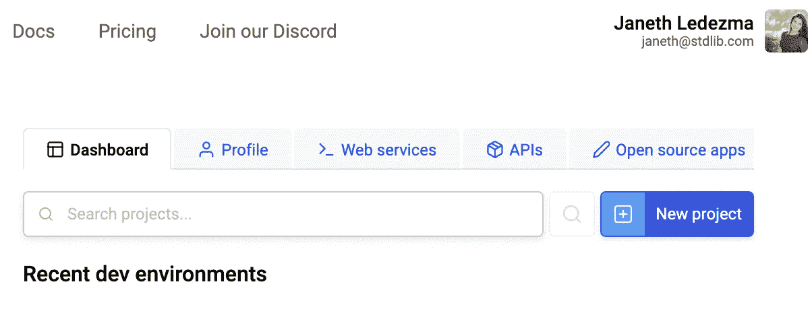

我们将为将要编码的 3 个函数中的每一个函数创建端点。端点是您和其他外部应用程序与您的系统通信的一种方式，通过向代表它的 URL 发出 HTTP 请求来执行某些操作。

你将被带入 [Autocode 的](http://autocode.com)IDE；我们将在这里编写解决 3 个挑战性问题的逻辑。

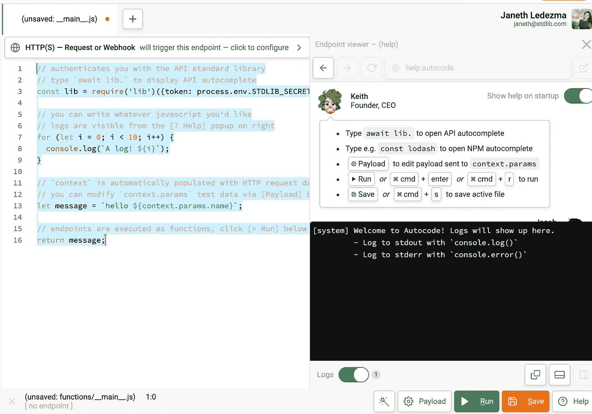

从这里，有几件要指出来；

*   **事件选择器在顶部**。在这里，您可以选择什么类型的事件将在您的端点中执行代码。对于本教程，我们将使用缺省值，这是一个普通的 HTTP 请求。

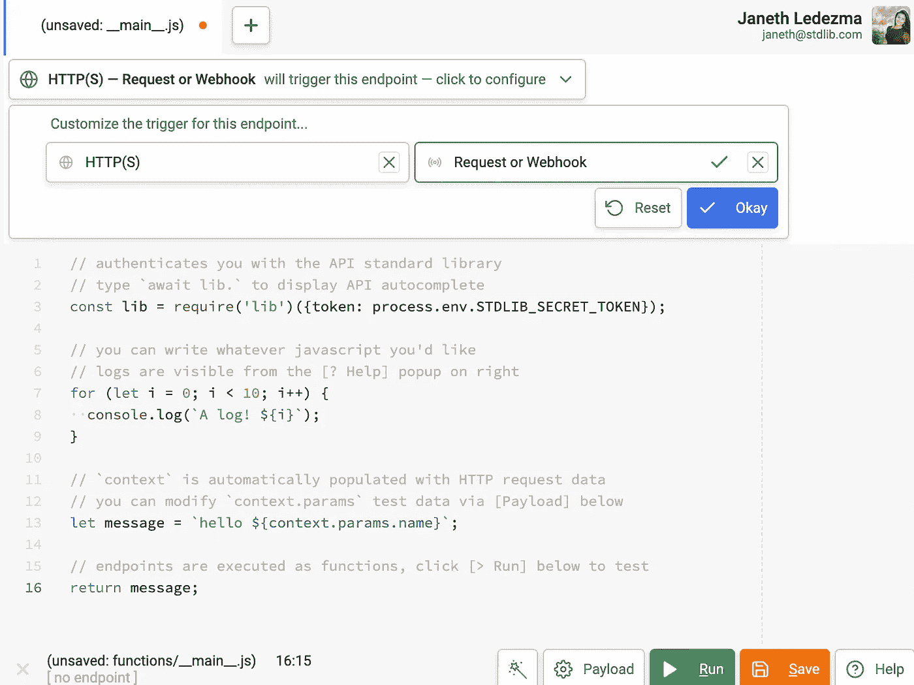

*   当您按下绿色的“运行”按钮时，系统会提示您为项目命名。将它命名为教程的`functions`，点击**保存新项目**。

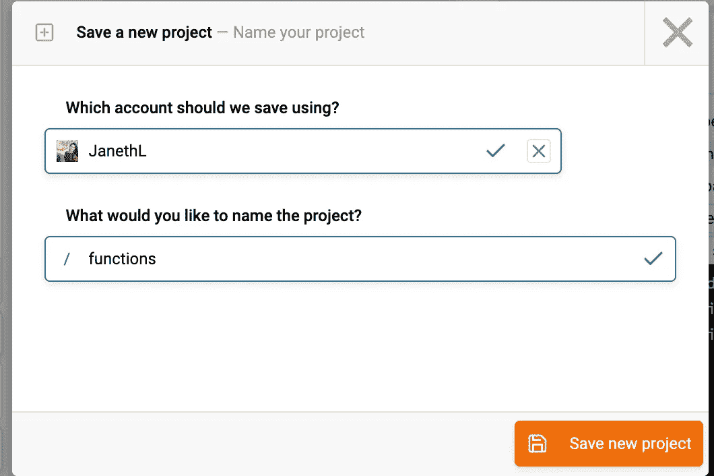

*   您会注意到端点 URL 出现在文件的底部。这是您的端点在 web 上的位置。

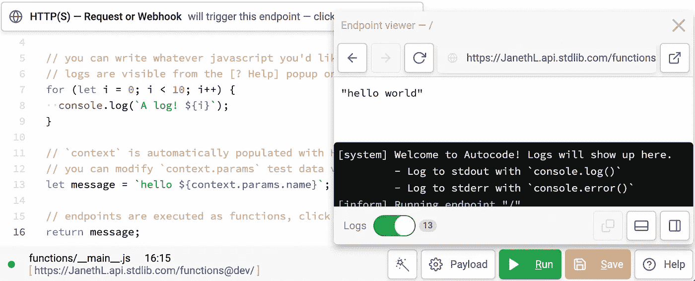

*   端点查看器窗口显示在右下角。这将向您显示端点执行的结果。您也可以使用它来查看日志。
*   所有 Autocode 端点一旦保存，就可以立即在 web 上使用。

很好，现在你已经设置好了你的编码环境，我们可以从挑战问题#1 开始了！

让我们一起来解决它！🤜🏼🤛🏼

# 挑战问题#1:最大公约数:

**第一步:仔细阅读问题，理解问题**

```
Write a function that returns the greatest common factor between **num1** and **num2**. This means that the function should return the largest number that divides both **num1** and **num2**.For example, if we pass in the number 6 and number 10 into our function, our function should return 2\. Inputting 4 and 8 should return 4 etc...(6, 10); // => 2
(4, 8); // => 4
(45, 30); // => 15
```

让我们准备我们的编码环境。返回到[自动编码](http://autocode.com)。右键单击浏览器左侧的`functions`文件夹并选择`New endpoint file`，创建一个新的端点。

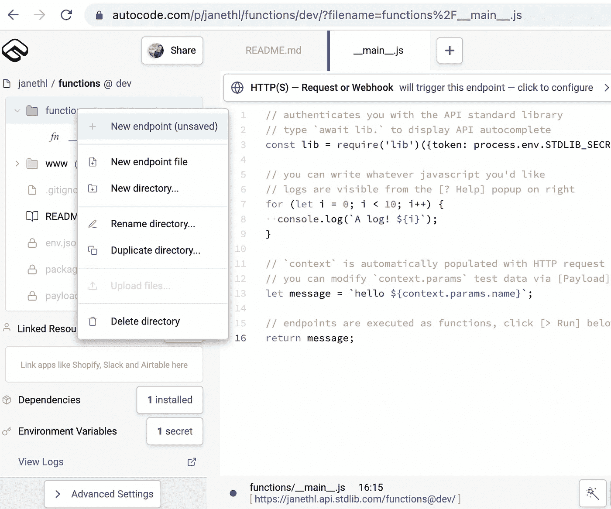

将您的文件命名为`functions/greatestCommonFactor.js`,如我所知:

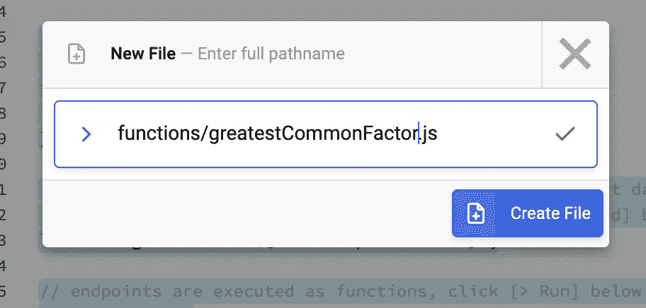

您会注意到您的新文件已经预先填充了一个示例 hello world 函数。

让我们花一点时间来分析和理解这个函数是如何创建的。

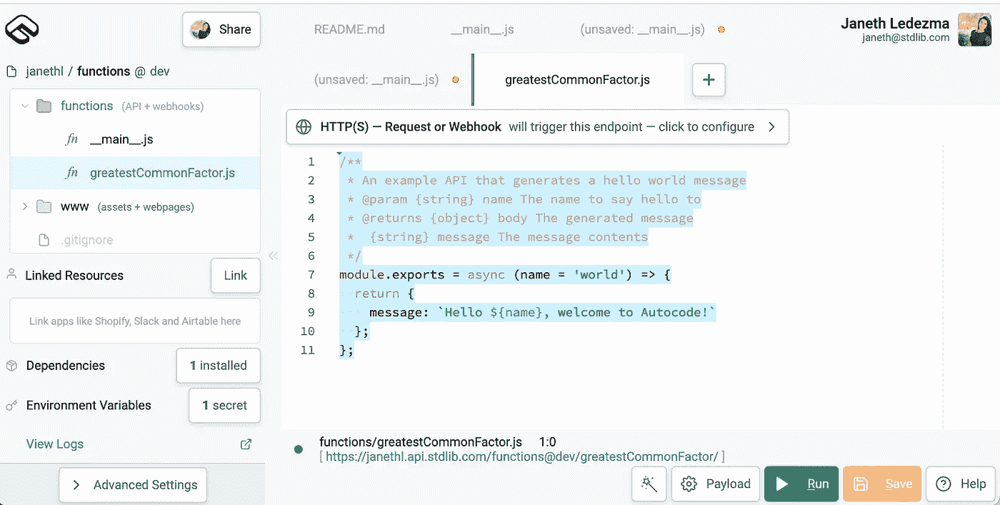

`line 1–6` 中的注释定义了函数采用的`parameter`类型和`return`类型。在这个示例中，函数需要一个类型为`string`的`name`参数，它将返回一个类型为`object.`的`body`

`line 7`正在用`module.exports`方法导出我们的函数。我们去看看。把`line 7`里的名字改成我截图里的你的名字。

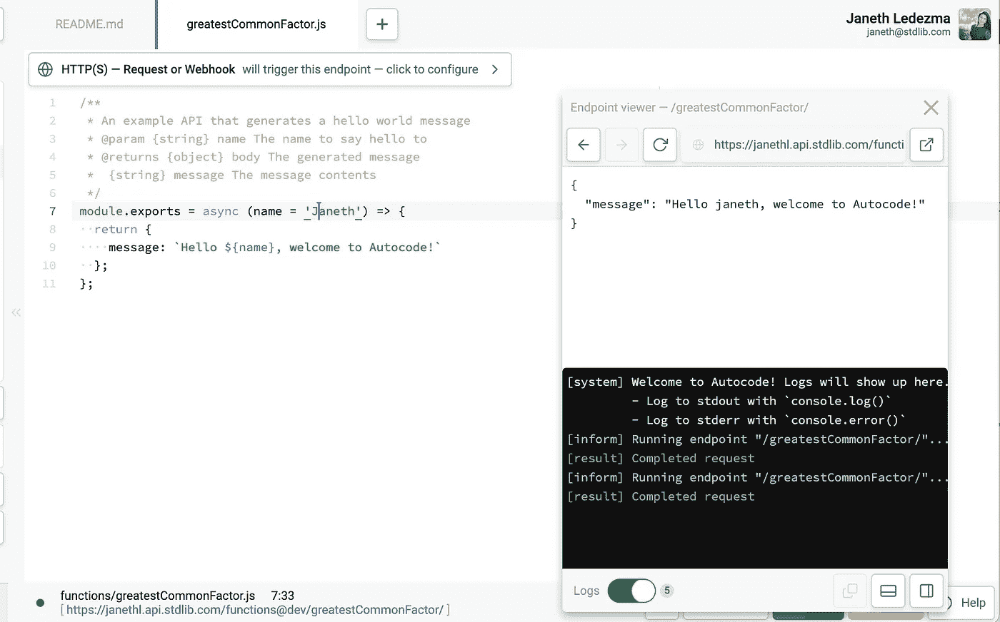

按下绿色的`run`按钮测试该样本功能。您将在端点查看器窗口中看到您的代码被执行，并显示“您好`<yourName>`，欢迎使用 Autocode！”消息。

您还可以单击左下方自动生成的端点 URL，浏览器中将会打开一个新窗口，显示以下消息:

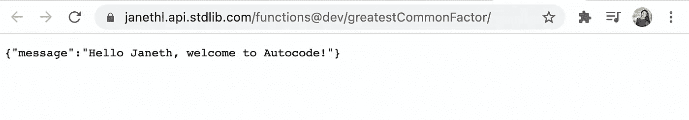

你可以通过 URL 测试传递一个`name`参数到你的函数中，然后按回车键重新加载页面，我有:`?name=Student`

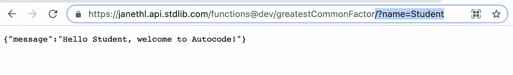

通过 [Autocode](http://Autocode) 部署可重用功能就是这么简单！如果你想更深入地了解 Autocode 的框架，请查看 Github 上的 [FunctionScript！](https://github.com/acode/FunctionScript)

既然我们已经了解了如何在 [Autocode](http://autocode.com) 上设置函数，让我们开始解决我们的第一个挑战问题！

**第二步:使用伪代码制定解决问题的计划**

首先，让我们开始用伪代码规划我们的执行。伪代码是一种帮助程序员以易于理解的方式设计算法的技术。伪代码不使用任何编码语法，但它完整地描述了构建我们的函数所必需的逻辑。这有助于实现，因为我们将使用 JavaScript 语法将每一行翻译成代码…很简单，对吗？

我们试试吧！

根据需要多次重读问题，准备好后开始伪代码:

```
Write a function that returns the greatest common factor between **num1** and **num2**.This means that the function should return the largest number that divides both **num1** and **num2**.For example, if we pass in the number 6 and number 10 into our function, our function should return 2\. Inputting 4 and 8 should return 4 etc...(6, 10); // => 2
(4, 8); // => 4
(45, 30); // => 15
```

伪代码:

```
//First we need to define the functions expected parameters and return types in a comment//Then we use module.exports to export our function and pass in two numbers (num1, num2) as parameters//We will set a for loop with the iterator (i) set to num1//As long as i is greater or equal to 1 continue the for loop//Everytime the for loop continues decrement i by 1//As we decrement we check to see if num1 modulo i is equal to zero 
and if num2 modulo i is equal to zero//If both conditions are met then we will return i//If the conditions aren't met then we have our for loop continue decrementing until both are both are met
```

**第三步:在** [**上打码**](http://Autocode.com) **！**

既然我们已经计划好了如何解决我们的挑战问题，我们准备编码出来。

删除 ide 中的示例 hello world 函数。


将您的伪代码方法翻译成 ide 中的 JavaScript 语法，如下所示:

```
/**
* My greatestCommonFactor function 
* [@param](http://twitter.com/param) {number} num1 First number
* [@param](http://twitter.com/param) {number} num2 Second number
* [@returns](http://twitter.com/returns) {number} i
*/module.exports = async(num1, num2) => {
  for (let i = num1; i >= 1; i--) {
    if (num1 % i === 0 && num2 % i === 0) {
      return i;
    }
  }
}
```

**步骤 3:在**[**Autocode**](http://Autocode.com)上测试和部署您的解决方案

选择右下方的**有效载荷**按钮。通过创建一个对象来设置测试参数，将`num1`和`num2`设置为您的键，并给它们任意两个您喜欢的数字。我选了`1550 and 1000`。

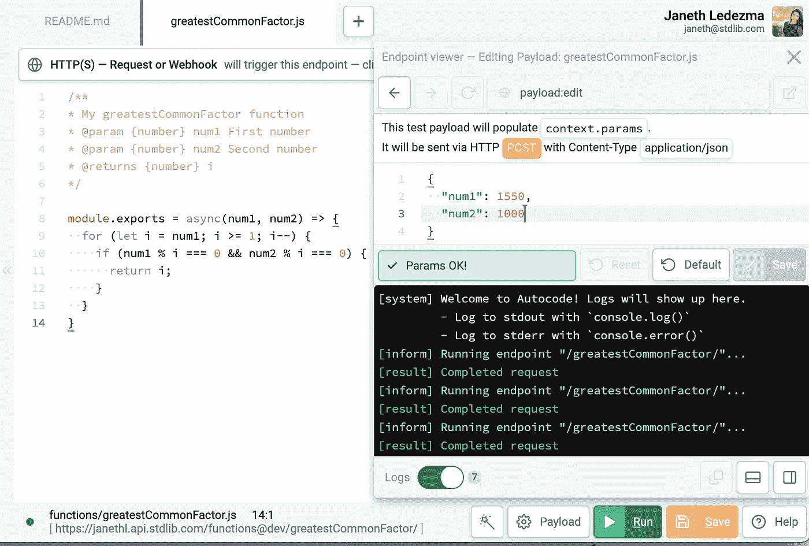

设置好测试参数后，选择绿色的**运行**按钮。`1550`和`1000`的最大公约数其实是`50`！干得好。⭐️

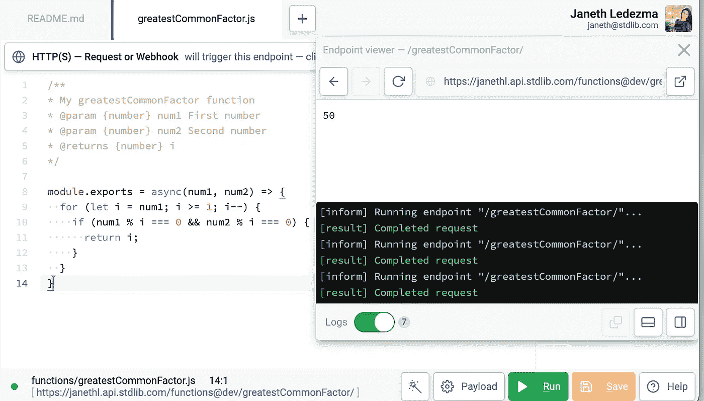

您可以通过您的功能文档点击左下方自动生成的 URL 来实时查看您的功能。要查看文档，选择左下角**的**高级设置**，然后选择**生成 API 引用。****

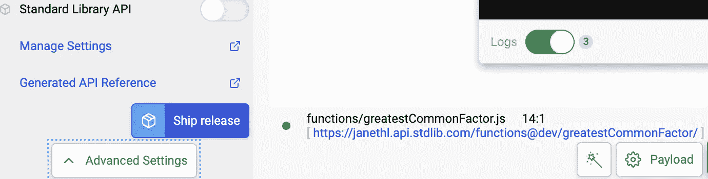

你可以在参数部分测试传入不同的数字，然后**运行**你的函数来检查最大公因式。

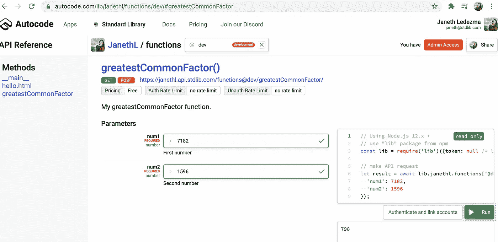

**挑战问题#1 的解决方案分解:**

**第 1–6 行:**我们为`num1`和`num2`设置了类型`number`，为`i`设置了返回类型`number`

**第 8 行:**我们用`module.exports`导出我们的异步函数，传入我们的两个参数`(num1, num2).`

**第 9 行:**我们使用一个`for loop` 并声明`num1`为我们的迭代器`i`，只要`i`大于或等于`1`我们就运行我们的 for 循环并递减`1.`

**第 10 行:**我们的`if`语句检查`num1`模`i`是否等于零，以及`num2`模`i`是否等于零。

**第 11 行:**如果条件`num1 % i === 0`或`num2 % i === 0`返回`false`，我们的循环继续，下面的`return`语句被忽略。当我们的`if`条件返回`true,`时，意味着两个条件都满足，然后我们`return`迭代器`i`。迭代器`i`是我们在`num1`和`num2`之间最大的公因数。

我们做到了！🙌恭喜你。我们解决了第一个问题。既然您已经熟悉了 Autocode，剩下的工作应该是轻而易举的了。

# 挑战问题#2:

**第一步:慢慢看问题**

```
Write a function that takes in a name as a string and returns a string representing their nickname. A nickname is the name up to the second vowel repeated twice. See the examples.Examples:(Jacob); // => 'JACO-JACO'(pikachu); // => 'PIKA-PIKA'(janeth); // => 'JANE-JANE'
```

**第二步:用伪代码开始制定战略！**

```
//First define the functions expected parameter and return type in a comment above the function//Use module.exports to export the function and pass in a a name as a string//Create a variable that defines all vowels inside an array//Create a variable to keep count of vowels and set it equal to 0//Use for loop to count through every letter in the string (name)//Create an intermediate variable to save every character in the string//Inside the for loop condition use indexOf() method to check and count if character is in the index of vowels//Use toUpperCase() method to convert string to uppercase//return a string with characters from index 0 to i (including i)
```

**第三步:在** [**上码出来**](http://Autocode.com) **！**

通过右键单击浏览器左侧的`functions`文件夹并选择`New endpoint file`来创建一个新端点。

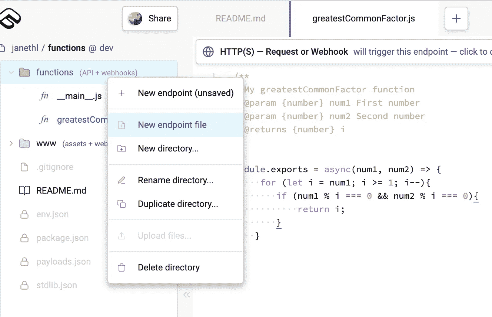

将你的文件命名为`functions/nickname.js`，并将你的伪代码翻译成 JavaScript 语法。

```
/**
* My nickname function 
* [@param](http://twitter.com/param) {string} name 
* [@returns](http://twitter.com/returns) {string} str
*/module.exports = async(name) => { 
  let vowels = 'AEIOUaeiou'.split(''); 
  let vowelCount = 0; 
  for (var i = 0; i < name.length; i += 1) { 
    let char = name[i]; 
    if (vowels.indexOf(char) > -1) { 
      vowelCount += 1; 
      if (vowelCount === 2) { 
        break;
      }
    }
  }let str = name.slice(0, i + 1).toUpperCase(); 
  return str + '-' + str; 
}
```

**步骤 3:在**[**Autocode**](http://Autocode.com)上测试和部署您的解决方案

传入一个测试`name`参数，选择[自动编码](http://Autocode.com)上的绿色`Run`按钮，在控制台上查看结果。

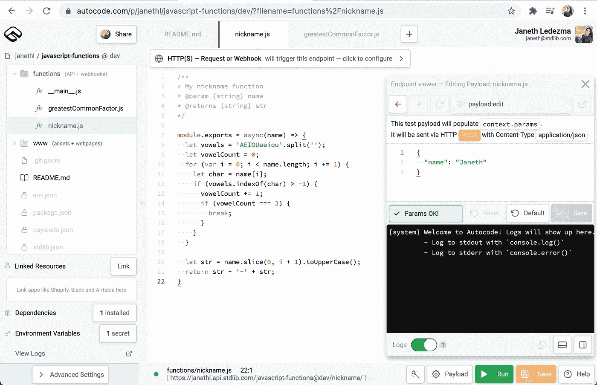

果然，测试时不同的名字会产生昵称！😃

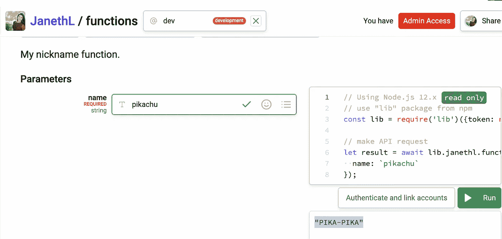

```
(Jacob); // => 'JACO-JACO'(pikachu); // => 'PIKA-PIKA'(janeth); // => 'JANE-JANE'
```

**我们的解决方案分解:**

**第 1–5 行**:我们为`name`设置了一个参数类型`string`和一个返回类型`string`

**第 7 行:**我们用`module.exports`导出我们的异步函数，并传入我们的`(name)`参数

**第 8 行:**我们定义我们的元音字母，并使用 split 方法将我们的元音字母串分解成一个数组

元音= [ 'A '，' E '，' I'…，' A '，' E '，' i'…]

第 9 行:我们将计数设置为零

**第 10 行:**我们使用一个`for loop`来遍历`name`中的每个字符

第 11 行:我们设置了一个中间变量来返回字符串中的每个字符

**第 12 行:**if 条件检查是否在元音索引中找到字符:`vowels.indexOf(char)`并返回元音数组中的字符位置。如果这个字符不在元音的索引中，那么返回-1，循环继续到下一个字符。如果其位置大于-1，则逻辑继续。

**第 13 行:**如果位置大于`-1`，我们将`vowelCount`加 1。

**第 14 行:**我们检查`vowelCount`是否为 2，如果`false`被返回，我们跳过`if`语句，继续下一个字母，如果`true`被返回，这意味着我们现在已经统计了两个元音，我们跳出`for loop.`

**第 20 行:**我们使用`slice()`方法获取从`index 0`开始到`i`结束的字符，我们将`1`添加到`i`中，因为`slice`方法不包括结束值。我们还使用`toUpperCase()`方法将字符串中的所有字母转换成大写。

**第 21 行:**我们`return`这个字符串加上一个破折号再加上另一个字符串，这样我们的结果就像问题中的例子

# 挑战问题#3:排除奇数

第一步:仔细阅读。

```
Write a function that takes in an array of strings and returns a new array containing only elements that appeared an even number of times in the input array.Examples:const arr1 = [‘a’, ‘b’, ‘b’, ‘c’, ‘d’, ‘c’, ‘c’, ‘d’]
oddOnesOut(arr1); // => [ ‘b’, ‘d’ ]const arr2 = [‘fish’, ‘fish’, ‘dog’, ‘cat’, ‘dog’, ‘dog’]
oddOnesOut(arr2); // => [ ‘fish’ ]
```

**第一步:伪代码**

让我们运筹帷幄！

```
//Create a helper function to count our elements in an array//The helper function has one parameter that takes in an array of strings//Use a for loop in the helper function to count our elements in the array//Create and export a second function with a for loop to count the even elements//Push the even elements into a new array//Return that new array
```

**第二步:在** [**上码出来自动码**](http://Autocode.com) **！**

右键单击浏览器左侧的`functions`文件夹，选择`New endpoint file`，创建一个新的端点。

将其命名为`functions/oddOnesOut.js.`删除示例函数，并将您的伪代码翻译成 JavaScript 语法，如下所示:

```
/**
* My oddOnesOut function 
* [@param](http://twitter.com/param) {array} array 
* [@returns](http://twitter.com/returns) {array} str
*/function elementCount(array) { 
  let countObj = {};for (let i = 0; i < array.length; i += 1) { 
    let key = array[i];

    if (countObj[key] === undefined) { 
      countObj[key] = 1; 
    } else { 
      countObj[key] += 1; 
    }
  }return countObj; 
}module.exports = async(array) => { 
  let count = elementCount(array);
  const result = [];for (let key in count) { 
      let value = count[key] 
    if (value % 2 === 0) {
      result.push(key); 
    }
  }return result;
}
```

**步骤 3:在** [**自动编码**](http://Autocode.com) 上测试和部署您的解决方案

在有效载荷窗口内传入一个测试`array`参数:

```
{
  "array": ['fish', 'fish', 'dog', 'cat', 'dog', 'dog']
}
```

选择[自动编码](http://Autocode.com)上的绿色`Run`按钮，在控制台上查看结果:

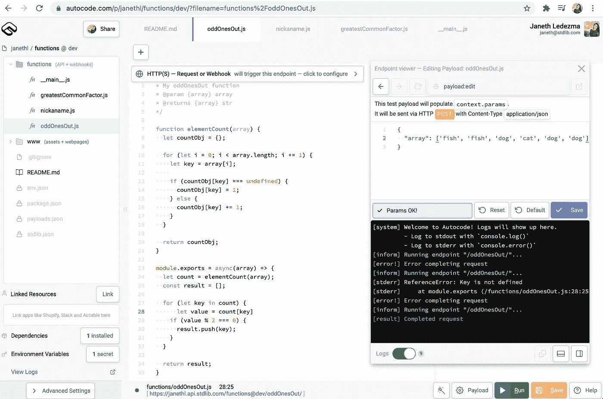

您的函数将过滤掉奇数元素，并返回以下内容:

```
[
  "fish"
]
```

干得好！

**解决方案分解:**

**第 1–5 行**:我们为`array`设置了一个参数类型`array`，为`str`设置了一个返回类型`array`

**第 7 行:**我们定义了一个助手函数`elementCount`，它接受一个`array`字符串

**第 8 行:**我们声明了一个`countObj`变量，并将其初始化为一个空对象。这是我们存储数组中不同元素计数的地方。

**第 10 行:**我们使用一个`for loop`遍历数组。我们声明`0`是我们的迭代器(`i`)，只要`i`小于我们数组的长度，我们就运行我们的 for 循环并递增`1`。

**第 11 行:**我们将`key`设置为一个中间变量，当我们遍历`for loop`时，它将提供对元素的访问。

**第 13 行:**我们添加了一个条件，检查索引`key`处的`countObject`是否未定义。如果`countobject`不包含我们传入的`Key`(元素),这个条件将返回`true`。

**第 14 行:**当条件返回`true`时，我们设置`countObj[Key]`等于`1`如果条件为`false`，这意味着我们的`key`已经在对象中，那么我们忽略这个语句，继续下一个。

**第 15- 16 行:**如果我们的`key`已经存储在了`countObj`中，那么我们将键计数增加`1.`

**第 20 行:**我们返回`coutObj`

**第 23 行:**我们导出了第二个函数，它接受了一个我们想要计数的元素数组

**第 24 行:**我们声明一个变量`count`，并将其设置为从之前的帮助函数`elementCount(array)`返回的对象

第 25 行:我们定义了一个变量`result`，并将其初始化为一个空数组，在这个数组中，我们将推送出现偶数次的元素

**第 27 行:**我们在循环中使用一个**for……来遍历`count`对象，并检查键的值是否为模 0。**

*在循环中的**for…适合于遍历对象中的所有键值对。**

**第 28 行:**我们将变量`value`设置为`count[key]`

**第 29 行:**检查`key`是否有`value`模`0`

**第 30 行:**如果条件为真，那么我们将那个`key`推送到我们的`result`变量

**第 34 行:**返回`result`

# 感谢您阅读并跟随我的旅程！

就这些了，谢谢你的阅读！我希望这篇教程对你有所帮助。如果您有任何问题，我很乐意收到您的来信。欢迎给我发电子邮件到 ledezmajane@berkeley.edu。我很乐意帮忙！