# 求解递归复杂度

> 原文：<https://levelup.gitconnected.com/solving-for-recursive-complexity-736439987cb0>

一道 Leetcode 难题的解析


几天前我在 leet code[上碰到一个问题，看到一堆人挠头。这是题目为正则表达式匹配难度标签`Hard`的第 10 题。这个练习的解决方案本身并不直观，需要有效地利用之前解决的子问题，但这并不是评论中每个人都感兴趣的。毕竟这个解决方案是每个人都可以看到的。](https://leetcode.com/)

真正有趣的是计算出的但无法解释的时间复杂度，这是一个只使用递归，没有动态编程的低效解决方案。毕竟[动态规划](https://en.wikipedia.org/wiki/Dynamic_programming)使得时间和空间复杂度相当容易计算，只要解是正确的，就不能超过所有可能子问题的复杂度。在我开始之前，这里是原问题的轮廓，也可以在这里找到[**https://leetcode.com/problems/regular-expression-matching/**](https://leetcode.com/problems/regular-expression-matching/)

如果在解释过程中我听不清你的话，请留下评论，这样我可以修改一下。

# 问题是:

给定一个输入字符串(`s`)和一个模式(`p`)，实现支持`'.'`和`'*'`的正则表达式匹配。

```
'.' Matches any single character.
'*' Matches zero or more of the preceding element.
```

匹配应该覆盖整个**输入字符串(不是部分)。**

**注:**

*   `s`可以为空，只包含小写字母`a-z`。
*   `p`可以为空，只包含小写字母`a-z`，以及类似`.`或`*`的字符。

# 一些例子:

**例 1:**

```
**Input:**
s = "abcda"
p = "ab.d"
**Output:** false
**Explanation:** The . matches the c but the pattern ends before matching to the entire text.
```

**例 2:**

```
**Input:**
s = "aab"
p = "c*a*b"
**Output:** true
**Explanation:** c can be repeated 0 times, a can be repeated 2 times. Therefore, it matches "aab".
```

**例 3:**

```
**Input:**
s = "ab"
p = ".*"
**Output:** true
**Explanation:** ".*" means "zero or more (*) of any character (.)".
```

上面的例子总结了你在测试过程中可能会遇到的情况。因为这篇文章的标题是“解决递归复杂性”而不是“如何解决递归问题”,所以我不会深入讨论如何解决这类问题。取而代之的是，我会用一段伪代码来解释我们的算法在到达这段文本末尾的过程中将要经过的 3 个递归门。我建议你试着自己解决这个问题，去我上面的链接，一旦你对这个问题有了一定程度的理解，再回到这里，因为我马上就要给你捣乱了。

# **解伪码:**

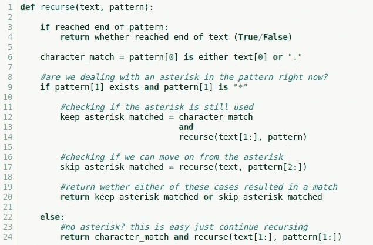

# 快速解释

如果你不太熟悉递归，这个代码块可能看起来还是很吓人。要点是我们只做两件事:1)检查文本的当前字符是否与模式匹配，2)询问如果我们对剩余字符稍微修改文本或模式，或者两者都修改，模式是否与文本匹配。

***第 12 行:* keep_asterisk_match** 如果我们不改变模式，而是沿着文本的长度移动( **text[1:]** )。这就是在递归中处理`*`的方式，我们简单地移动到文本的下一个字符，就像当前字符从未存在过一样，并在模式中保留星号。

***第 17 行:*如果文本匹配不带星号的模式( **pattern[2:]** )，即如果我们匹配前面元素的 0，则为真。还记得在示例 2 中，c*不需要匹配任何东西，这也是我们如何跳出之前为自己设置的 **keep_asterisk_match** 陷阱。**

***第 20 行:*** 在运行 **keep_asterisk_match** 和 **skip_asterisk_match** 之后，一旦我们得到是保留还是跳过星号时得到匹配的答案，我们返回如下表所示的结果。

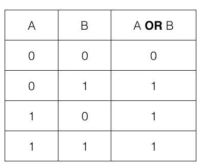

[https://dyclassroom.com/logic-gate/universal-logic-gate-nor](https://dyclassroom.com/logic-gate/universal-logic-gate-nor)

***第 24 行:*** 如果我们没有看到星号，我们就用 **character_match** 检查第一个字符是否与模式匹配，我们通过减少输入文本和模式中的第一个匹配字符( **text[1:]，pattern[1:]** )来保持递归，并递归地检查字符串的其余部分是否匹配。

***第 4 行:*** 具有讽刺意味的是，递归的最后一部分通常被定义在函数的顶部，也就是我们的递归的底部。如果我们有一个空模式和一个空字符串作为我们的输入，我们有神圣的知识，模式将匹配字符串，因为空匹配空肯定。如果其中只有一个是空的，我们就知道没有匹配。

# 考虑到复杂性

这个问题的时间复杂度似乎很难确定。毕竟有两个递归点和一个句号。就像我之前说的，复杂性的答案在解决方案中给出了，没有进一步的解释。对于长度为 T 的文本和长度为 P 的模式，在文本[i:]和模式[2j:]处对文本进行索引，这个问题的时间复杂度是…* **鼓声***

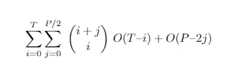

嗯，真了不起。

通常情况下，您会期望类似 O(T*P)或其他类似的结果，事实上，这些解决方案确实提出了一个更简洁的上界，同样没有任何解释(这并不奇怪)，但我们将在稍后讨论这个问题。现在我们手头上已经有足够的工作了。

# 线性与指数复杂性

复杂度不像[冒泡排序](https://en.wikipedia.org/wiki/Bubble_sort)那样简单的原因是因为我们没有对文本和模式进行线性处理。相反，我们递归地做事情，在我们的文本和模式的部分越来越深地潜水，并对相同的子问题进行任意次数的重新审视。我之所以提出复杂度为 O(n)的冒泡排序，是因为当我们对越来越多的数字进行排序时，它的复杂度会以金字塔的形状降低。

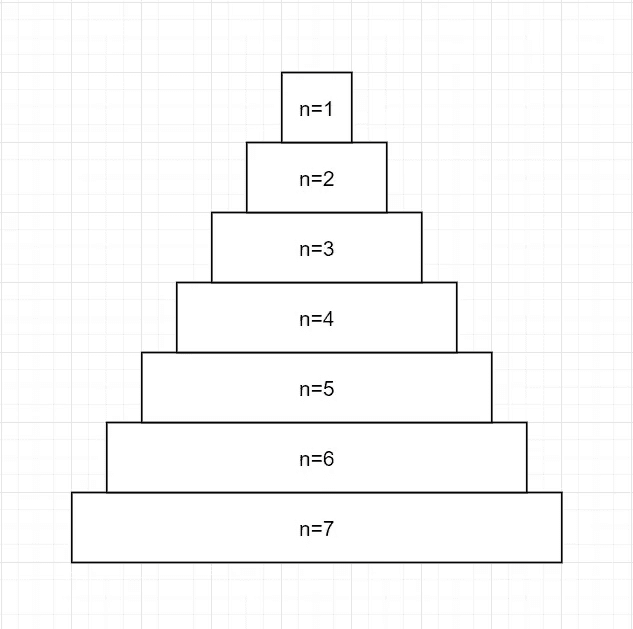

另一方面，由于函数可以在多个地方调用自身，递归具有经典的树形结构。

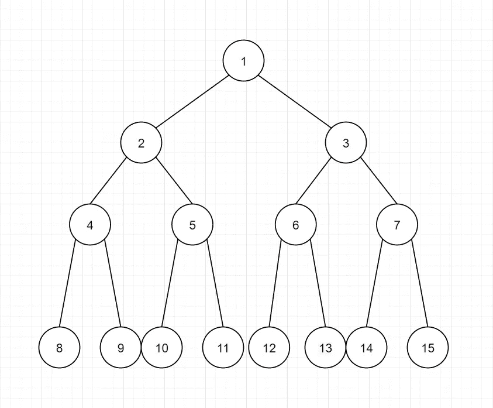

这些结构看起来似乎很相似，但关键的区别在于，金字塔呈线性递减，而树呈指数增长。当分析时间和空间的复杂性时，这创造了一个不同的世界。

# 我们最坏的情况

当分析最坏情况复杂性时，我们必须考虑最坏情况输入。因为我们有两个输入，文本和模式，我将把重点放在模式上，因为一个依赖于另一个，至少对我来说，考虑规则比结果更容易。在这个问题中，我们添加到模式中的每个新字符可以是一个`.*`或`.`，其中`.`可以是任何字符。从代码中可以清楚地看出哪种选择会导致更多的计算。如果我们包含了`*`字符，我们的代码将分成两个流，这两个流都必须被计算，直到它们不可避免地应该返回是否有匹配，同时，如果我们匹配一个字符，乐趣会很快停止，因为我们只采取一个单一的路线，线性。

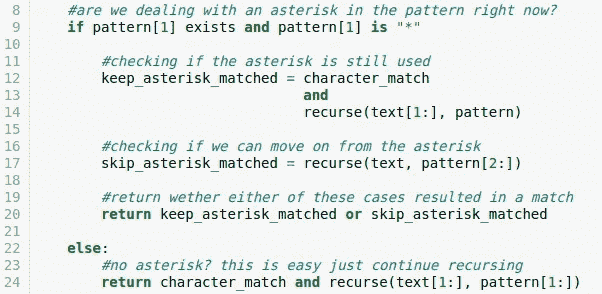

很明显，最糟糕的模式是由许多`.*`组成，以创建尽可能多的分叉路径，最终的文本字符与模式匹配或不匹配。

**正文:aaaaaaaaaaaaab**

**图案:a * a * a * a * a * a * a * a * a * a * a * a ***

在这种情况下，我们必须同时到达模式的末尾和字符串的末尾，以确定没有匹配，同时从文本的第一个索引开始分支 2 ⁰次。

# 可视化计算

为了计算时间复杂度，我们必须找出每个子问题需要计算多少次。因为我们不像在动态编程中那样保存结果，这将在很大程度上导致运行时爆炸。每个子问题包括回答文本[i:]和模式[2j:]是否匹配。我们使用 pattern[2j:]是因为我们在最坏的情况下在我们的模式中重复使用了`.*`，每次我们采用 **skip_asterisk_matched** 路径时，我们跳过了占据两个空格的`.*`中的一个。为了形象化 **skip_asterisk_matched** 和 **keep_asterisk_matched** 的两个分支，我们将绘制一个树形图来说明所有访问过的子问题。每个节点将具有格式(I，j ),用于在每个时间点对文本和模式进行索引。

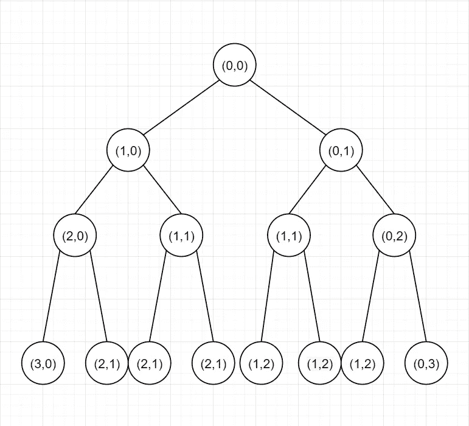

关于这一点，在执行递归时，该算法将通过在每次迭代中首先采用左侧路径来执行[深度优先搜索](https://en.wikipedia.org/wiki/Depth-first_search)。这并没有太大的区别，因为在最坏的情况下，我们将不得不遍历整个树。让我们举一个子问题的例子，我们想看看文本[2:]和模式[2:]是否匹配。这将在我们的树上显示为(2，1):

*   i=2，因为我们在文本[2:]处
*   j=1，因为我们处于模式[2:]，在最坏的情况下，这意味着我们只有一个占用两个空格的星号。以下模式[2j:]表示 j=1。

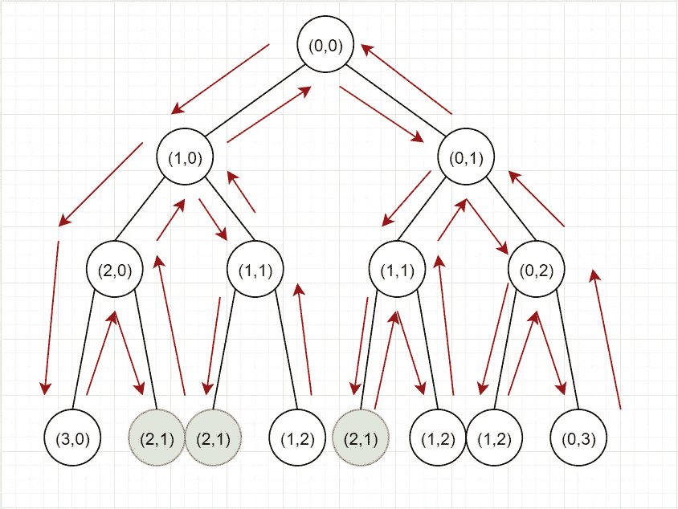

我们可以看到，这个子问题在计算过程中遇到了 3 次。树形格式有利于查看何时会遇到这些子问题，但它不太擅长确定这些子问题会发生多少次。

# 组合

系统地考虑一个子问题会被遇到多少次的方法是，首先考虑这些子问题为什么会重复出现。为了在我们的树上得到(2，1)，我们必须左转两次，右转一次。

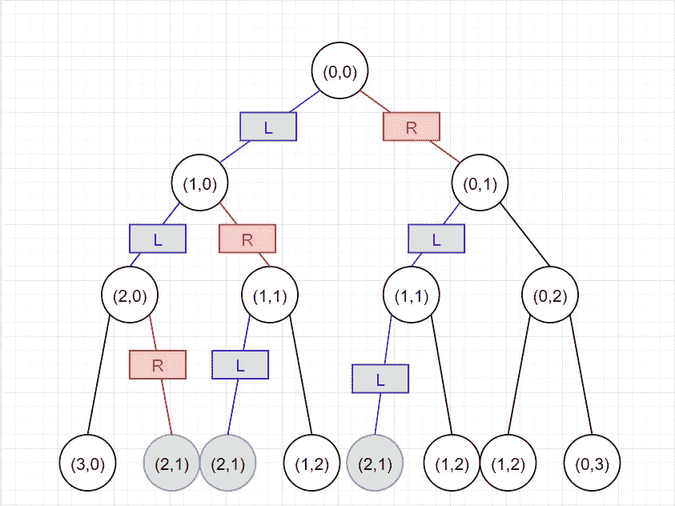

我们可以看到，如果我们按照 LLR、LRL 和 RLL 的顺序遍历这棵树，这种情况会以三种方式发生。

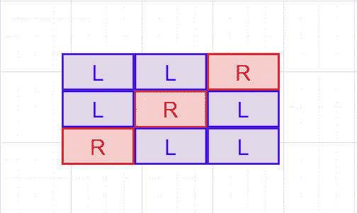

在(2，1)的示例中，我们知道我们将有 2+1=3 个占位符，其中 2 个占位符将是 L，1 个将是 r。为了找出有多少种[组合](https://en.wikipedia.org/wiki/Combination)是可能的，我们可以简单地计算 3C2，其中 3 个占位符中我们将选择 2 个作为 L，其余的将自动成为 rs。

这意味着对于子问题(I，j ),我们有 i+j 个占位符，其中 I 在左边，j 在右边。这就是为什么解决方案中包含了所遇到的子问题(I，j)的数量的组合符号(i+j 选择 I)。

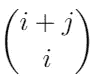

顺便说一句，这也相当于(i+j 选择 j ),因为无论你是选择左边的 I 增量还是右边的 j 增量，不同组合的数量都是一样的。

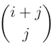

# 子问题复杂性

既然我们知道了每种类型会遇到多少子问题，我们就应该计算出完成这些子问题需要多长时间。对于递归问题来说，这种事情往往很容易做到，就像在这种情况下，我们只做一件事，比较单个字符，并将结果存储在 **character_match** 中。这可能会让您认为每个子问题的运行时间是常数 O(1)，但是为了调用函数，我们必须首先提供 text[i]和 pattern[j:]参数。如果字符串很长，这个过程就不简单了，特别是在 python 中，为了传递子字符串，必须创建一个新字符串。因此，对于每个子问题，都有一个常量时间 O(1)用于检查字符是否匹配，O(T-i)用于传入字符串中我们还不知道是否匹配的部分，O(P-2j)用于传入模式中我们还不知道是否匹配的部分。将所有东西加在一起，我们得到了解决方案中给出的复杂性。


# **简洁的解决方案**

还记得我之前说过，解决方案提出了一个更一般的界限，没有复杂的组合符号和 sigma 符号。

这就是了。

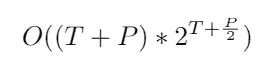

在我们结束之前，让我们回顾一下这背后的想法。

将时间复杂度简化为这种形式背后的想法是，在我们可能会遇到多少子问题以及我们计划计算这些子问题需要多长时间这两个方面进行过度的尝试。

**子问题数量**

不要使用组合来精确计算我们将会遇到多少子问题，基于我们的组合计算，这些子问题将只是我们树的叶节点的一部分，让我们只考虑树的整个底层。让树完全充满，深度是 i+j 能取的最大数，也就是(T+P/2)。t 代表文本的长度，P/2 代表最坏情况模式中的所有`.*`实例

深度为(T+P/2)的树在最低层具有 2^(T+P/2 节点。

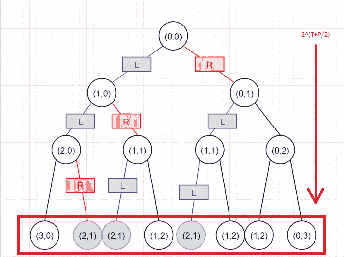

在图像中，我们可以看到前面的文本[2:]和模式[2:]的示例被计算(2+1 选择 2) = 3 次，但是因为我们知道所有这些示例都发生在同一级别上(因为 Ls 的#和 Rs 的#总是 3)，所以我们可以计算该级别上所有子问题的数量，即 2^(2+2/2) = 2 = 8。

整个级别上的节点数(本例中为 8)将总是大于(i+j choose j)个节点(本例中为 3)，因此我们可以在更一般的上限中使用此计算。因此，我们已经确定，我们的上限将假设我们将经历 **2^(T+P/2)子问题**，尽管我们真的永远不会，但它确实使我们的公式更加简洁。

**子问题复杂度**

在我们传入参数之前，不要计算参数有多大，让我们假设我们传入的是文本和模式的整个字符串。这将给我们 **O(T+P)** 每个子问题的时间复杂度，消除了在每一步计算 O(T-i)和 O(P-2j)的需要。

**最终答案**

将子问题的复杂性乘以子问题的数量，得到最终答案:


# 动态规划的一个例子

对我们和计算机来说，这都是令人难以置信的乏味和耗时。在某些时候，你可能认为计算相同的问题(i+j 选择 I)次有点浪费，如果我们只是存储结果，这将节省我们很多麻烦。你是对的。

(I，j)只有 T*P 个不同的组合，每个组合只需要恒定的时间来验证，所以简单地将它们全部存储在一个网格中会使我们的计算量大大降低。

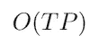

我希望你喜欢这个计算复杂性的练习。既然你已经走到了最后，一定要表扬一下自己，因为这是你应得的。