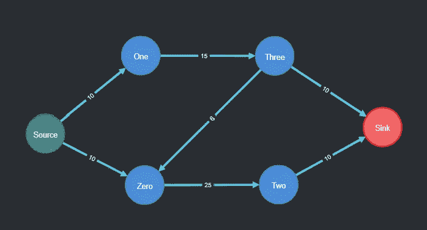
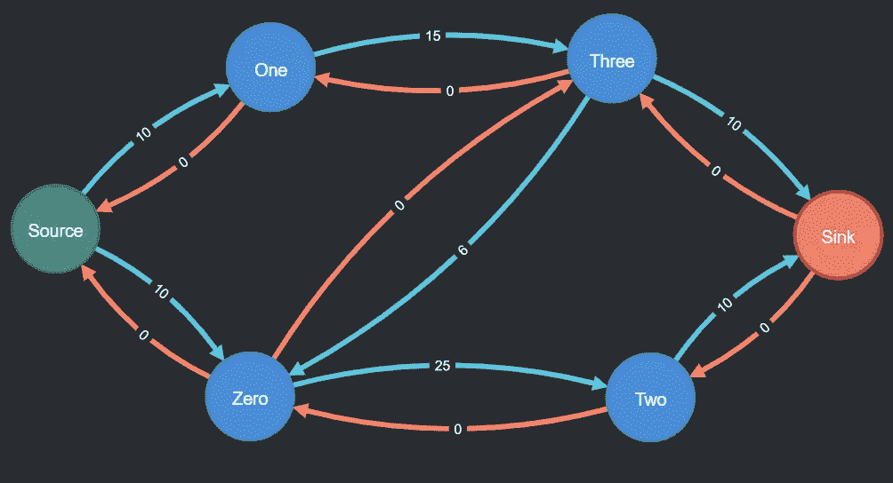
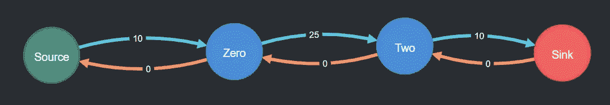
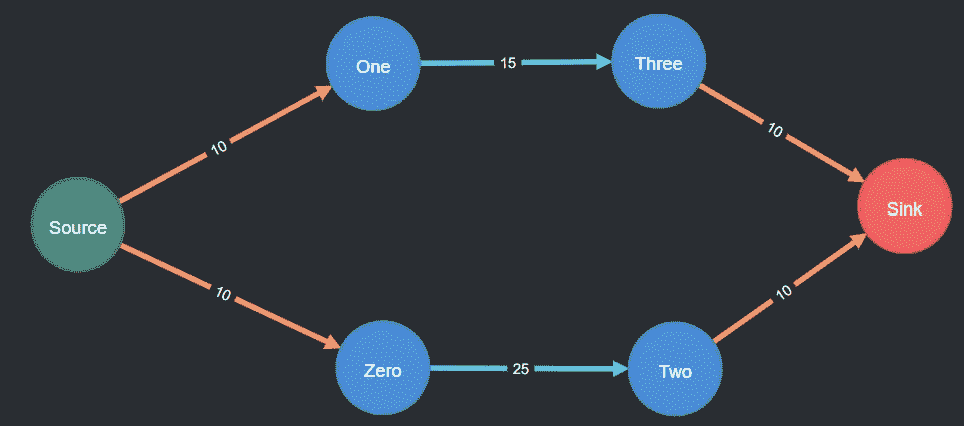

# 用 Neo4j 解决最大流问题

> 原文：<https://levelup.gitconnected.com/solving-maximum-flow-problems-with-neo4j-ea227f8b798>



**图 1** 在 Neo4j 中创建的由源节点(绿色)、汇聚节点(红色)、附加节点(蓝色)和边容量(浅蓝色)组成的简单流网络:*图片作者*

流网络可用于许多现实世界的应用中。从制造材料移动到运输路线到二部图匹配，最大流问题非常普遍，我期望在 Neo4j 中找到它的实现，但是没有。

Neo4j 是一个图形数据库，它将信息存储为节点和关系，而不是像传统的表格数据库那样存储为表格中的行和列。这对于用有向图表示的流网络问题(如最大流)非常有益。

流网络是以起始节点(“源”)开始，以终止节点(“汇”)结束的图。其他几个节点用边(也称为关系)连接，但都是“流”(在生产线的情况下可以指材料，在管道的情况下可以指水，在电路的情况下可以指电，等等。)最终从源头转移到了汇点。每条边都有一个容量，决定了有多少流量可以从一个节点移动到另一个节点(见图 1)。

最大流问题的思想是确定流可以采取的适当路径，同时最大化从源头到汇点的流量。在图 1 中，可以推断出最大流量是 20，所采用的路径应该是外围(s->1->3->t 和 s->0->2->t)。然而，在包含更多节点和更多连接这些节点的边的更复杂的流网络中，这可能很快变得太复杂而难以推理。

幸运的是，有许多已知的算法可以解决最大流问题。下面在 Neo4j 中实现的是 Ford-Fulkerson 算法。但是在开始之前，您需要设置您的环境。

# 在 Neo4j 中实施

如果你是 Neo4j 的新手，你可以在网上创建一个账户，并在你的浏览器中建立一个沙盒环境。这样做只需要几分钟，不需要任何下载。一个空白的沙盒就可以了。从这里开始: [Neo4j 沙盒](https://neo4j.com/sandbox/)

## 设置环境

要找到一个网络的最大流量，你首先需要一个可以玩的网络。首先创建初始流网络的节点，包括一个源、一个汇和四个附加节点。

```
UNWIND ['Source', 'Zero', 'One', 'Two', 'Three', 'Sink'] AS nodeName
CREATE (s:point {name:nodeName});
```

接下来，为源节点和接收节点添加一些标签，使将来的查询更容易。

```
MATCH(ns:point{name:'Source'})
SET ns:Source
RETURN ns;MATCH(nt:point{name:'Sink'})
SET nt:Sink
RETURN nt;
```

创建每个节点之间的关系，并为`MaxCapacity`、`Flow`和`AvailableFlow`设置初始值。这些关系被称为`[:CAPACITY]`，因为它们的流量小于它们的最大容量。

`MaxCapacity`是您正在建模的流动网络所固有的。如果您将流动网络想象为不同直径的管道，水流通过这些管道，则最大容量就像最大流速，即在任何给定时间内可能有多少水通过每个管道。该值不会改变。

`Flow`是当前通过每根管道的水量。在问题开始时，没有水流过网络，因此所有值都从 0 开始。该值将不断变化，直到问题得到解决。

`AvailableFlow`就是`MaxCapacity`和`Flow`的区别。给定流过其中一条管道的电流，在管道达到其最大容量之前，还有多少水可以被推过该管道。该值将不断变化，直到问题得到解决。

```
MATCH(ns:point{name:'Source'})
MATCH(n0:point{name:'Zero'})
MATCH(n1:point{name:'One'})
MATCH(n2:point{name:'Two'})
MATCH(n3:point{name:'Three'})
MATCH(nt:point{name:'Sink'})MERGE(ns)-[c1:CAPACITY]->(n0)
SET c1.MaxCapacity = 10,
c1.Flow = 0,
c1.AvailableFlow = 10MERGE(ns)-[c2:CAPACITY]->(n1)
SET c2.MaxCapacity = 10,
c2.Flow = 0,
c2.AvailableFlow = 10MERGE(n0)-[c3:CAPACITY]->(n2)
SET c3.MaxCapacity = 25,
c3.Flow = 0,
c3.AvailableFlow = 25MERGE(n1)-[c4:CAPACITY]->(n3)
SET c4.MaxCapacity = 15,
c4.Flow = 0,
c4.AvailableFlow = 15MERGE(n2)-[c5:CAPACITY]->(nt)
SET c5.MaxCapacity = 10,
c5.Flow = 0,
c5.AvailableFlow = 10merge(n3)-[c6:CAPACITY]->(n0)
SET c6.MaxCapacity = 6,
c6.Flow = 0,
c6.AvailableFlow = 6merge(n3)-[c7:CAPACITY]->(nt)
SET c7.MaxCapacity = 10,
c7.Flow = 0,
c7.AvailableFlow = 10;
```

此时，您已经建立了流网络。事实上，稍微重新排列一下，它看起来应该和图 1 中的流网络一模一样。

## **设置初始残留边缘和属性**

有了新的流量网络，您需要找到最大流量。第一步是在每个现有关系的相反方向上创建边。这有点不直观，但是允许使用残留边缘。

残留边存在于不良扩充路径选择的全部或部分撤销中(稍后将详细介绍扩充路径)。在流动网络中，它们是来自所选扩充路径的方向相反的边。在该算法的第一次迭代中，从源到接收器选择的路径将或多或少是随机的，并且很可能该第一路径不会导致最大流量。剩余边为算法创建了一种在节点之间向后移动并撤消或放回流程的方式。每当扩充路径被更新时，相应的剩余边也将被更新。

所有这些值最初将被设置为 0，直到选择了第一个扩充路径。这些关系被称为`[:SATURATED]`，因为它们的流量值等于它们的最大容量值。

```
MATCH(ns:point{name:'Source'})
MATCH(n0:point{name:'Zero'})
MATCH(n1:point{name:'One'})
MATCH(n2:point{name:'Two'})
MATCH(n3:point{name:'Three'})
MATCH(nt:point{name:'Sink'})MERGE(ns)<-[c1:SATURATED]-(n0)
SET c1.MaxCapacity = 0,
c1.Flow = 0,
c1.AvailableFlow = 0MERGE(ns)<-[c2:SATURATED]-(n1)
SET c2.MaxCapacity = 0,
c2.Flow = 0,
c2.AvailableFlow = 0MERGE(n0)<-[c3:SATURATED]-(n2)
SET c3.MaxCapacity = 0,
c3.Flow = 0,
c3.AvailableFlow = 0MERGE(n1)<-[c4:SATURATED]-(n3)
SET c4.MaxCapacity = 0,
c4.Flow = 0,
c4.AvailableFlow = 0MERGE(n2)<-[c5:SATURATED]-(nt)
SET c5.MaxCapacity = 0,
c5.Flow = 0,
c5.AvailableFlow = 0MERGE(n3)<-[c6:SATURATED]-(n0)
SET c6.MaxCapacity = 0,
c6.Flow = 0,
c6.AvailableFlow = 0MERGE(n3)<-[c7:SATURATED]-(nt)
SET c7.MaxCapacity = 0,
c7.Flow = 0,
c7.AvailableFlow = 0;
```



**图 2 f** 低网络显示容量(浅蓝色)和饱和(橙色)边缘:*图片作者*

## 实现福特-富尔克森算法

下面是你将在最近创建的流网络上实现的福特-富尔克森算法的概要。

**循环开始——重复直到找不到新的扩充路径:**
1。找到一个增加的路径
2。在增补路径内，找到瓶颈值，`Bottleneck`
3。增加`Flow`作为当前流量加上`Bottleneck`4。将`AvailableFlow`增加为`MaxCapacity`减去`Flow`
5。设置一个临时标志，指示该边缘不是残留边缘
6。找到残留边缘
7。将剩余边的`Flow`增加为`Flow`减去`Bottleneck`8。将剩余边缘的`AvailableFlow`增大为`MaxCapacity`减去`Flow`9。移除所有残留的标记
10。基于以下内容重构关系类型:
10.1 如果`AvailableFlow`为 0，则将关系类型更改为`[:SATURATED]`10.2 如果`AvailableFlow`为> 0，则将关系类型更改为`[:CAPACITY]`

如果你没有按照总结做，不要担心。每一步都将被分解和解释。

注意:下面的密码都是一个查询。我将它分成不同的部分来描述查询的每个部分在做什么，但是如果您试图单独运行每个部分，您将会收到错误。在文章的最底部，你会找到完整的代码。

## 1.找到一条增强的道路

扩充路径是仅使用`[:CAPACITY]`关系从源节点到汇聚节点的路径。之所以称之为增加路径，是因为你将改变，或增加路径中每个边的流动。使用 Neo4j 解决最大流问题的一个巨大好处是路径查找变得很简单。Ford-Fulkerson 算法的一半复杂性是实现深度优先或呼吸优先搜索，以找到从源节点到汇聚节点的路径。在 Neo4j 中，非常简单:

```
MATCH AugmentingPath = (source:Source)-[:CAPACITY*]->(sink:Sink)
WITH AugmentingPath LIMIT 1
...
```

## 2.在增加的路径中，找到瓶颈

瓶颈值是扩充路径中任何边上最小的`AvailableFlow`。例如，在下面的图 3 中，这个扩充路径的瓶颈是 10，因为源和接收器之间最小的蓝色(`[:CAPACITY]`)边是 10。这意味着即使连接节点“0”和“2”的边可以处理 25 个(水、材料、电流等)，因为另一条边只能处理 10 个，所以整个路径必须限制为 10 个。两条边并列成为瓶颈只是巧合。



**图 3** 从信源到信宿的增补路径:*作者图片*

```
...
WITH relationships(AugmentingPath) AS rels
UNWIND rels as r
WITH apoc.coll.sort(collect(r.AvailableFlow)) AS AvailableFlows, rels
WITH AvailableFlows[0] AS Bottleneck, rels
...
```

## 3.增加流量

现在`Bottleneck`已知，通过为每个`[:CAPACITY]`边沿添加`Flow`到`Bottleneck`来使用它增加电流。

```
...
UNWIND rels AS r
SET r.Flow = r.Flow + Bottleneck
...
```

## 4.增加可用流量

您已经使用了沿着这些边中的每一条边的一些可用流，因此您需要调整`AvailableFlow`,方法是为扩充路径中的每一个`[:CAPACITY]`关系从`MaxCapacity`中减去`Flow`。

```
...
WITH r, Bottleneck
SET r.AvailableFlow = r.MaxCapacity - r.Flow,
...
```

## 5.设置临时残留边缘标志

您需要找到这个扩充路径的剩余边，虽然它们在图 3 中显示为橙色关系，但它们实际上并不出现在查询结果中——Neo4j 只是在可视化中自动连接节点。要找到剩余边，首先要做的是将增加的路径关系标记为非剩余。

```
...
r.Residual = 'No'
...
```

## 6.找到残留的边缘

要找到剩余边，首先要匹配构成当前扩充路径的节点，然后再次匹配，寻找没有设置“剩余=否”标志的关系。

```
...
WITH r, Bottleneck
MATCH (n1)-[r]-(n2)
WITH n1,n2,Bottleneck
MATCH(n1)-[res]->(n2) WHERE res.Residual IS NULL
...
```

## 7.增加剩余边的流量

现在你可以对剩余边的`Flow`进行类似的更新，就像对扩充路径所做的那样。请注意，在这种情况下，瓶颈被从流程中减去，导致流程为负。这是因为残留边的最大流量为 0(请记住，残留边的存在是为了撤销流量)。

```
...
WITH res, Bottleneck
SET res.Flow = res.Flow - Bottleneck
...
```

## 8.增加剩余边缘的可用流量

要设置剩余边缘的`AvailableFlow`，取`MaxCapacity`和`Flow`的差值。请注意，在这种情况下`AvailableFlow`将为正，因为您正在减去一个负数，并且该边现在将有流可用于下一次循环迭代的路径查找。

```
...
WITH res
SET res.AvailableFlow = res.MaxCapacity - res.Flow
...
```

## 9.移除所有残留的边缘标志

残留边缘标志是临时的，并且需要在该循环的下一次迭代之前被移除。匹配所有关系并将所有残差值设置为`NULL`。

```
...
WITH res
MATCH(n)-[rel]-(n2)
SET rel.Residual = NULL
...
```

## 10.重构关系类型

最后要做的最后一件事是检查关系，如果必要的话，将它们从`[:CAPACITY]`改为`[:SATURATED]`，反之亦然。

您不希望遍历一条容量已达到最大值(或饱和值)的路径，因此，如果在增加流的过程中，您达到了边的最大容量，那么关系类型应该更改为`[:SATURATED]`。

类似地，如果你从一个已经饱和的边上释放了容量，那么该边类型应该翻转到`[:CAPACITY]`。

您可以通过查看每个关系的可用流来做到这一点。如果`AvailableFlow`为 0，则将关系类型改为`[:SATURATED]`。如果`AvailableFlow`为> 0，则将关系类型改为`[:CAPACITY]`。不应该是负的。

```
...
CALL apoc.refactor.setType(rel,
CASE WHEN rel.AvailableFlow = 0 THEN 'SATURATED'
WHEN rel.AvailableFlow > 0 THEN 'CAPACITY' END)
YIELD output
...
```

## 将它们循环在一起

执行上面的所有操作将只找到一条扩充路径，并进行一组更新。但是你会想一遍又一遍地做这件事，直到再也找不到增加的路径。一旦发生这种情况，你就会知道你已经达到了最大流量！为此，您可以将所有内容包装在一个`apoc.periodic.commit()`函数中，该函数将继续迭代代码，直到没有返回任何内容。仅此而已。最大流量问题解决了。

```
CALL apoc.periodic.commit(
"MATCH AugmentingPath = (source:point{name:'Source'})-[:CAPACITY*]->(sink:point{name:'Sink'})
WITH AugmentingPath LIMIT 1
WITH relationships(AugmentingPath) AS rels
unwind rels AS r
WITH apoc.coll.sort(collect(r.AvailableFlow)) AS AvailableFlows, rels
WITH AvailableFlows[0] AS Bottleneck, rels
UNWIND rels AS r
SET r.Flow = r.Flow + Bottleneck
WITH r, Bottleneck
SET r.AvailableFlow = r.MaxCapacity - r.Flow,
r.Residual = 'No'
WITH r, Bottleneck
MATCH (n1)-[r]-(n2)
WITH n1,n2,Bottleneck
MATCH(n1)-[res]->(n2) WHERE res.Residual IS NULL
WITH res, Bottleneck
SET res.Flow = res.Flow - Bottleneck
WITH res
SET res.AvailableFlow = res.MaxCapacity - res.Flow
WITH res
match(n)-[rel]-(n2)
SET rel.Residual = NULL
WITH rel
CALL apoc.refactor.setType(rel,
CASE WHEN rel.AvailableFlow = 0 THEN 'SATURATED'
WHEN rel.AvailableFlow > 0 THEN 'CAPACITY' END)
YIELD output
RETURN count(*)");
```

# 评价

既然你已经解决了这个问题，你会怎么做呢？上面的循环实际上没有返回任何东西。

## 显示最大流动路径

以下查询将返回网络中的最大流路径。但是，请确保在 Neo4j 设置中关闭“连接结果节点”,否则会显示不相关的关系。

```
MATCH path = (s:Source)-[rels*]-(t:Sink)
WHERE ALL(r in relationships(path) WHERE r.Flow > 0)
RETURN path;
```



**图 4** 解决了显示饱和边(橙色)和容量边(浅蓝色)的最大流量问题:*作者图片*

## 获取最大流量值

以下查询将返回网络的最终最大流量值。

```
MATCH ()-[r]->(t:Sink)
RETURN sum(r.Flow) as MaxFlow
```

# 结论

我花了很多时间在谷歌上搜索，试图找到 Neo4j 中最大流量问题的解决方案，但没有成功，所以我决定自己开发自己的实现。我希望这篇文章可以帮助指导其他发现自己处于类似境地的人。

# 分级编码

感谢您成为我们社区的一员！在你离开之前:

*   👏为故事鼓掌，跟着作者走👉
*   📰查看[升级编码出版物](https://levelup.gitconnected.com/?utm_source=pub&utm_medium=post)中的更多内容
*   🔔关注我们:[Twitter](https://twitter.com/gitconnected)|[LinkedIn](https://www.linkedin.com/company/gitconnected)|[时事通讯](https://newsletter.levelup.dev)

🚀👉 [**将像你这样的开发人员安置在顶级创业公司和科技公司**](https://jobs.levelup.dev/talent/welcome?referral=true)