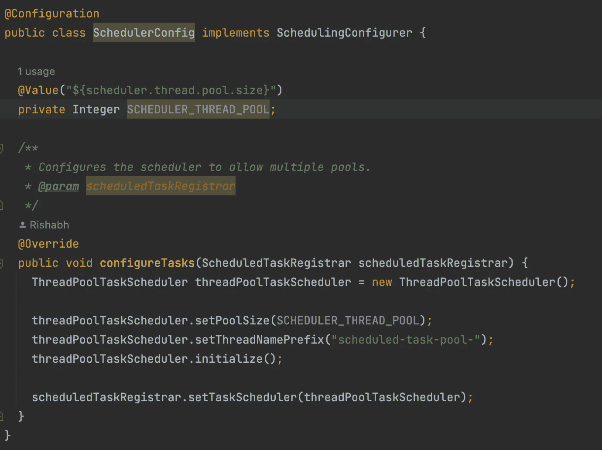

# 即使使用谢德洛克-Spring Boot，也能在多个节点上解决@Scheduled 任务的多次执行

> 原文：<https://levelup.gitconnected.com/solving-multiple-executions-of-scheduled-tasks-across-multiple-nodes-even-with-shedlock-spring-2b1d26db9356>

假设您在运行于多个节点上的 spring boot 应用程序中配置了许多@Scheduled 任务，并且您添加了 [ShedLock](https://github.com/lukas-krecan/ShedLock) 来确保一个任务在多个节点上一次只执行一次。

但是令人惊讶的是，您注意到任务仍然在多个 pod 上运行，不是在预定的时间，而是有随机延迟。同样在几天后，您注意到大多数计划的任务突然停止运行，并且这种情况持续到您重新部署 pod。

计划任务停止运行，直到重新部署

为了理解发生了什么，我们需要理解 spring 调度和 ShedLock 是如何工作的。

**spring boot 中的日程安排是如何工作的？**

通过使用@Scheduled 注释，我们可以很容易地在 spring boot 中调度任务。然后我们需要通过向 spring 配置类添加@EnableScheduling 注释来启用调度。Spring 使用 [ThreadPoolTaskScheduler](https://docs.spring.io/spring-framework/docs/current/javadoc-api/org/springframework/scheduling/concurrent/ThreadPoolTaskScheduler.html) 来调度任务，它在内部委托给一个 ScheduledExecutorService。默认情况下，ThreadPoolTaskScheduler 的线程池大小为 1，这意味着应用程序的所有调度任务都由一个线程执行(线程名— scheduling-1)。

**shed lock 是如何工作的？**

ShedLock 使用连接到所有实例的持久存储来存储关于计划任务的信息。实现这个 ***LockProvider*** 有多种方式，因为 ShedLock 支持众多数据库，如 *MongoDB* 、 *PostgreSQL* 、 *MySQL* 等。我们对 LockProvider 使用 PostgreSQL 数据库。ShedLock 在数据库中用来管理锁的表非常简单。它只有四列:

*   ***名称*** :用户为计划作业提供的唯一名称
*   ***lock _ until****:锁定当前正在执行的作业的时间*
*   ****locked _ at****:实例获得锁时的时间戳**
*   *****locked _ by****:获取锁的标识符(pod 名称)***

***这样，ShedLock 仅在作业第一次运行时为每个计划任务创建一个条目。之后，当任务再次执行时，相同的数据库行被更新，而不删除或重新创建条目。***

******

***用于计划任务的@SchedulerLock 批注***

***当我们将***【lock _ until】***列设置为未来日期时，锁定一个预定任务就会发生。当我们的调度任务执行时，所有正在运行的节点都尝试更新该任务的数据库行。但是只有一个人成功做到了，当**(*lock _ until<= now()*)**。更新 ***lock_until、* *locked_at、locked_by*** 的列的实例拥有该执行周期的锁，并将 *lock_until* 设置为***now()+lock atmostf for****。*任务执行后 ShedLock 更新 *lock_until* 列与***now()****仅当任务完成时间为>***lockAtLeastFor***时。如果是一个短时间运行的任务，任务完成时间为<***lockatleast for****那么 ShedLock 设置****lock _ until****to****locked _ at+lockatleast for****。*默认情况下，我们使用的 ShedLock 工作在 AOP 代理集成模式，它试图在 TaskScheduler 即将执行任务之前获取任务的锁。********

****

**ShedLock AOP PROXY_METHOD 模式集成**

**发生了什么事？**

**所以每个节点中只有一个调度器线程在工作。我们的应用程序中有 80 多个计划任务，其中一些是长期运行的(运行 2-4 小时),每隔 2-4 小时运行一次。因此，当一个长时间运行的任务正在执行时，在此期间调度的所有其他任务都会排队，最终被延迟执行。**

**假设我们有 2 个节点(A & B)正在运行，我们有一个包含以下配置的计划任务，需要大约 6–7 分钟:**

****

**因此，这个*测试作业*将被安排在上午 10 点在两个节点上执行，但是假设节点 A 的 scheduling-1 线程已经在执行另一个长时间运行的任务，该任务在上午 8 点开始，需要 3 个小时才能完成，并且节点 B 的 *scheduling-1* 线程空闲。**

**在这个场景中，节点 B 将能够在上午 10 点获取 testJob 的锁，并更新 db 中的行，如下所示。**

****

**但是节点 A 中的 *testJob* 任务将等待上午 11 点完成的前一个任务。因此在上午 11 点*节点 A 的调度-1* 线程将尝试获取锁，并将成功地将锁作为 *lock_until < now()* ，并将再次执行任务*。***

**同样的事情也发生在我们的多节点系统中，任务在多个节点中的执行频率超过了配置的频率。由于我们有许多长时间运行的任务，而且这些任务的执行频率也超过了要求，这最终会导致任务在队列中堆积。因此，大多数计划任务似乎在几天后停止运行。**

## ****解！****

**现在是时候增加调度程序线程的数量了。因为单个线程不足以处理我们在应用程序中配置的大量调度任务。为此，我们将调度器配置为并行运行任务，这样任务在队列中的等待时间将会最短。**

****

**调度程序配置**

****我们学到了什么？****

**我们应该始终根据需求配置/调整调度程序的线程池大小，否则我们会注意到意外的行为。分析线程转储有助于调整线程池的大小。**

**另一个导致我们问题的因素是 *@SchedulerLock* 的 *lockAtLeastFor* 和*lock Atmos for*配置不当。所以我们应该始终考虑以下几点:**

*   ***lock Atmos for*应始终大于任务的执行时间，否则任务可能会执行多次。**
*   ***对于短期运行的作业，应始终添加*的锁定。如果节点之间的时钟差大于 *lockAtLeastFor* ，则任务可以以高于配置的频率执行。**

****有益文章****

*   **[https://docs . spring . io/spring-framework/docs/current/reference/html/integration . html # scheduling-task-namespace-scheduler](https://docs.spring.io/spring-framework/docs/current/reference/html/integration.html#scheduling-task-namespace-scheduler)**
*   **[https://Java repos . com/lib/lukas-kre can-shed lock-Java-job-scheduling](https://javarepos.com/lib/lukas-krecan-ShedLock-java-job-scheduling)**
*   **[https://crmepham . github . io/spring-boot-multi-thread-scheduling/](https://crmepham.github.io/spring-boot-multi-thread-scheduling/)**