# 一点一点地解决 N 皇后/车

> 原文：<https://levelup.gitconnected.com/solving-n-queens-rooks-bit-by-bit-1f3f3a08fda8>

大家最喜欢的递归问题对吧？当我还是老师的时候，我喜欢把这个问题分配给我聪明的学生，因为我知道这会让他们慢下来，这样我就可以把注意力集中到别的地方。几个月前，在研究一些 LeetCode 问题时，我又一次碰到了这个问题，并且很享受回忆之旅。上周，作为 [HackReactor](https://www.hackreactor.com/) 的一部分，我再次遇到了这个问题，但这次我的任务是使用按位运算符来解决它，以减少一些计算时间。谷歌搜索让我看到了一位前人力资源毕业生发的这条[推文](https://twitter.com/spellrp/status/332992908565295104)。这是一个非常厚颜无耻的实现，但是作为一个教过不同编程技能的学生的人，我认为最好让它更具可读性。

# **代码**

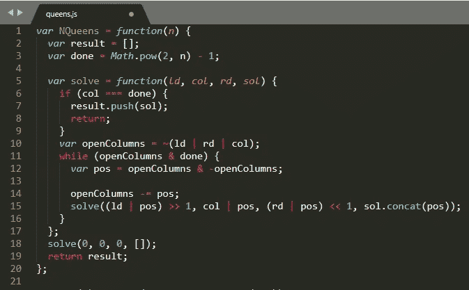

谁不喜欢递归呢？

# **哗**

这个算法是从马丁·理查德的[论文](http://citeseerx.ist.psu.edu/viewdoc/download?doi=10.1.1.51.7113&rep=rep1&type=pdf)中推导出来的，他比我聪明得多。这张图片应该可以直观地展示这个算法。

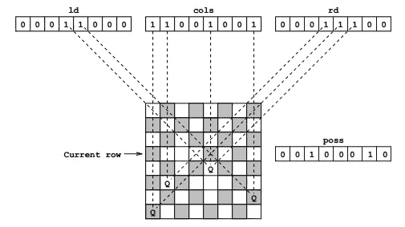

简单对吗？

如果这就是你所需要的，请随意继续，也许可以看看他论文的其余部分…否则，请留下来听听更多的细节。

**入门**

该函数接受一个数字 n，它决定了我们要搜索有效解的板子的大小。我们首先声明一个结果数组来存储我们在算法中遇到的所有解。然后我们声明一个变量 done 等于 2^n -1。例如，对于大小为 4 的棋盘，2⁴-1 产生 15，在二进制中是 1111。这将用于我们递归中的基本情况。然后，我们通过传递几个 0 和一个空数组来开始我们的递归之旅。

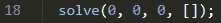

**寻找我们的解决方案**

重要的是要记住，我们将以自下而上的方式解决这个问题，如上图所示。通过一次尝试一行的解决方案，我们可以跳过检查来查看该行是否已经被另一个 Queen 占用。

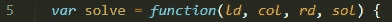

ld 是左对角线的缩写，我们将使用它来跟踪当前行中被当前行下一行的皇后阻挡的位置。不出所料，rd 将被用于跟踪右对角线上被前女王阻挡的位置。col 将用于跟踪当前由下面一行中的皇后占据的所有列。这些值都从 0 开始，因为我们还没有放置皇后。

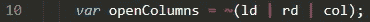

openColumns 将用于跟踪当前行中我们可以安全放置皇后的位置。它是使用按位“或”(|)和按位“翻转”(~)计算的。我们首先或我们的三个跟踪变量在一起，看看所有的位置，目前是不安全的一个新的女王。然后，我们使用~翻转所有的位，将所有的空位设置为 1，以备将来使用。我们第一次遇到这种情况时，没有设置皇后，因此所有位置都是安全的，OR 返回 0，然后我们对其求反，得到全 1，表示我们可以将皇后放在任何位置。

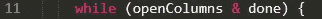

这个 while 循环允许我们在新行中放置皇后时检查所有可能的位置。只要 openColumns 中至少还有一个位置，按位 AND(&)将返回 true，因为 done 被设置为全 1，即。0b1100 & 0b1111 将返回第一位，并为 0b0100 返回 true。这是一个真值，所以循环继续。当我们一次删除一列时，openColumns 将被更新，直到没有位置需要检查，它将为 0。0b0000 & 0b1111 将返回 0，一个 falsy 值，我们将退出 while 循环。开始 0b1111 & 0b1111 返回 true，我们开始搜索。

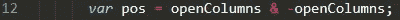

上面的线用于选择要检查的位置。在 openColumns 上使用[二进制补码](https://en.wikipedia.org/wiki/Two%27s_complement)运算符(-)，将其转换为 0b1111 到 0b0001。当我们把这些值加在一起，我们得到 0b0001。因此，我们将尽可能在第一列中放置一个女王。pos 更新为 1。

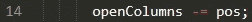

然后我们更新 openColumns，告诉它我们将尝试这个位置。0b 1111–0b 0001 产生 0b1110。这个值不是 0，所以我们知道在 while 循环中有更多的列要检查。但是下一行是大的。

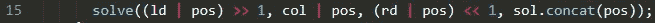

这是一个让我停下来的问题，所以我会试着一点一点地分解它。让我们看看传递给 solve 的第一个参数。

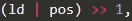

首先，我们将 ld 中的当前值与我们想要检查的位置进行比较。0b0000 | 0b0001 = 0b0001。>>是按位移位运算符，它将一个数字中的所有位向右移位该运算符后面的数字。0b0001>>1 = 0b0000。1 已被移出，因此，ld 在下一次调用 solve 时将保持为 0。这应该是有意义的，因为如果一个皇后在棋盘的左下角，那么左边就没有什么了。

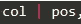

然后，我们将 col 的当前值与我们想要检查的位置进行比较。0b0000 | 0b0001 = 0b0001。这将防止我们在以后的递归中在该列中放置另一个皇后。

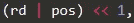

接下来，我们将 rd 中的当前值与我们想要检查的位置进行比较。0b0000 | 0b0001 = 0b0001。<

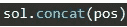

最后，我们将当前位置连接到我们的工作解决方案数组中，并将所有更新的值传递给 solver，以便进行下一次递归调用。

**第二轮**

在我们的下一次 solve 迭代中，在第 10 行之后，我们在 openColumns 中剩下 0b1100。通过执行按位“或”然后求反，我们可以看到只有两个可能的列，我们需要尝试放置一个新的皇后。这是对我以前实现的 NQueens 问题的巨大改进。通常，我会尝试在第 1 列放置一个皇后，检查它是否有效，移除它，尝试在第 2 列放置一个皇后，等等。

**基地案例**

我们的 col 变量一次只更新一位。因此，如果我们对 col 进行了 4 次“或”运算，这意味着已经成功放置了 4 个皇后。我们可以通过比较 col 和设置为 0b1111 的变量 done 来检查这一点。

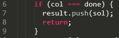

成功！！

这意味着我们已经找到了一个有效的解决方案，并可以将其推送到我们的结果数组中供以后使用。原谅我跳过了一些中间的回合，但是如果你在跟随算法的步骤上有困难，我会推荐我所做的。在第 14 行后放置一个 degugger 语句，并单步执行代码，查看变量是如何更新的。

# **白车**

我在标题中加入了车，但是一次都没有提到它们。这是因为如果你了解事情是如何进行的，那么修改代码来求解 N-Rooks 是很容易的。在第 5、10 和 15 行删除 rd 和 ld，然后在第 18 行从第一个调用中删除相应的 0…嘭！你刚刚解决了 N-Rooks。

# **不浪费时间**

我从这个算法中得到的最大收获是，它是解决这个问题的一个更好的方法。当我用 n=8 运行我的原始实现时，计算 N-Rooks 的所有解花了将近 2 秒，计算 N-ques 的所有解花了大约 100 毫秒。上述解决方案都没有打破 10ms。这个故事的寓意是位运算速度很快。

# **输出**

如果你运行上面的代码，你会发现结果看起来很有趣。最初的实现只是用来计算解决方案的数量，而不是跟踪解决方案实际是什么。我想把它提高一个档次，并跟踪它们，所以我把它们存储在一个数组中，而不是仅仅增加一个计数器。解决方案是一个长度为 n 的数组，如下所示(n=4)

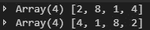

如果你想很好地打印它，你可以使用下面的代码。解决方案中的索引按位值存储(0=>1，1=>2，2=>4，3=>8 等)。2^index =价值。在我们使用它们来索引数组之前，必须对它们进行转换。

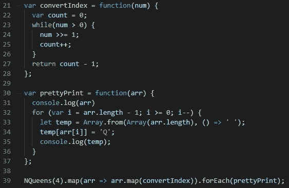

这将产生以下结果。

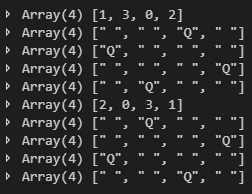 [## 学习 JavaScript -最佳 JavaScript 教程(2019) | gitconnected

### 前 65 名 JavaScript 教程-免费学习 JavaScript。课程由开发人员提交并投票，从而实现…

gitconnected.com](https://gitconnected.com/learn/javascript)