# 用遗传算法求解破棋盘难题

> 原文：<https://levelup.gitconnected.com/solving-the-broken-chessboard-puzzle-with-a-genetic-algorithm-19be3fff8213>

为好奇者提供的 Python 实现

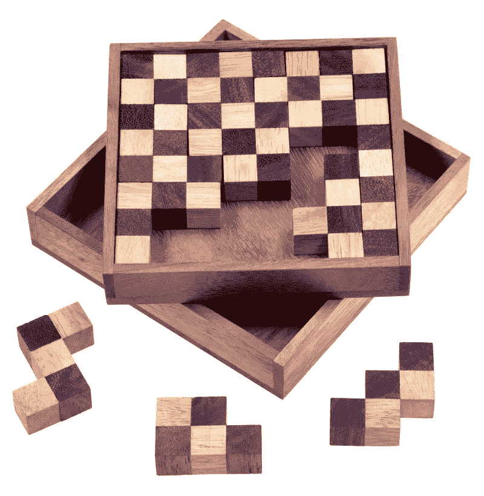

[来源](https://www.logoplay-holzspiele.de/schach-puzzle-pentomino-puzzle-denkspiel-knobelspiel-geduldspiel-aus-holz/knobelspiele_27_1011)

我总是对人类的懒惰程度感到惊讶。在解决这个难题大约 30 秒后，我开始思考如何实现一个搜索算法来找到(或一个)解决方案。懒惰才是真正的创新之父*。*

# 谜题

该拼图由类似俄罗斯方块的棋子组成，其中一个人需要以特定的方式将所有的棋子放在一起，这样你就可以得到一个完全填满的 8×8 棋盘，所有的棋子都正确对齐。相信我，这比看起来要难。

荷马知道我的感受。

这实际上是[背包问题](https://en.wikipedia.org/wiki/Knapsack_problem)的一个变种，这是一个标准的计算问题，不同形状和大小的物品必须最优地装入一个固定给定体积的容器中。有许多变化，其中一个可以集中在体积，重量，成本等。如果有人找到你并声称他们有解决方案，这种问题很容易验证，但解决起来并不容易，因为随着问题规模的增加，它们通常需要指数级的时间。

例如，如果这个谜题由 3 块组成，你可以很快解决它，但是如果它由更多块组成，那么你必须尝试的变化的数量(最坏的情况)会迅速开始呈指数上升！

在我们的问题中，有很大的可变性，因为每个部分都可以被平移、旋转、翻转……对多个部分进行这样的操作很快就成了问题。所以我们总共有 13 块拼图，每块拼图的自由度如下:

*   棋盘上大约 8×8 的位置
*   2D 平面中的 4 次旋转
*   2 个翻转方向(原始或镜像版本)

做一些“[快速 mafs](https://www.urbandictionary.com/define.php?term=quick%20mafs) ”，这等于(8×8×4×2) = (512) ~10 个⁵组合来尝试。如果你以每秒 100 万例的速度盲目地分别检查每个配置，你仍然需要 10 年以上的时间。哦…对不起，这个数字对你来说毫无意义吗？那么如果我告诉你这个怪异的宇宙的年龄是 13.8×10⁹年呢？是吗？我想是的…

神智不清

当然，盲目检查每个组合不是我们做的事情。有些方法——由我们的大脑实现——我们可能认为是理所当然的，但一旦你试图为它编写代码，你就会看到隐藏在背后的复杂性。在一瞬间，我们丢弃了大量的案例子集，这些案例在解决这个难题时毫无意义，考虑到了重叠、越界位置、空白空间、跳棋排列等等。

与我们大脑采用的方法更相似的方法是[回溯算法](https://en.wikipedia.org/wiki/Backtracking)。medium 上已经有一个帖子，用这个算法解决了同样的难题。你可以在这里阅读更多关于它的[，作者@andreaiacono 对此做了很好的总结:](https://medium.com/@andreaiacono/backtracking-explained-7450d6ef9e1a)

> 这个想法是我们可以使用递归一步一步地建立一个解决方案；如果在这个过程中，我们意识到这不是一个有效的解决方案，那么我们停止计算这个解决方案，并返回到上一步(*回溯*)。

但是我想尝试一下遗传算法的应用。如果你问为什么，我真的不能给你一个好的答案，除了它听起来真的很酷。

# 逻辑

遗传算法是一种受自然选择过程启发的搜索解决方案的方法。在我们拼图的上下文中，所有块的每个配置都代表一个具有一定适合度的潜在候选者。在我们的例子中，我们称这样的候选人为*个体*。适应水平越好(即剩下的碎片数量越少)，我们就越接近找到最佳个体，换句话说，就是解决方案。

遗传算法通常依赖于受生物启发的算子，如[突变](https://en.wikipedia.org/wiki/Mutation_(genetic_algorithm))、[选择](https://en.wikipedia.org/wiki/Selection_(genetic_algorithm))和[交叉](https://en.wikipedia.org/wiki/Crossover_(genetic_algorithm))。**突变**代表一个个体的配置发生了微小的变化，意味着这个个体变异成了一个具有相似配置设置的不同个体，尽管具有潜在的非常不同的适应水平(更好或更坏，大自然并不真正关心)。**选择**是根据个体的适合度水平选择个体进行后期育种的阶段。想到了“适者生存”这句话。最后，**交叉**在从选择的亲代个体产生新的后代的步骤中起着引入变异的重要作用，其中它们的遗传信息向前分布。

到目前为止，这篇文章一直很抽象。让我们进入有趣的细节和代码的实际实现。我准备好了。准备好了吗？

不相关:如果你还没看过《宇宙》,我真的推荐它。

# 设置

为了找到解决方案，让我们以与实际拼图相同的方式定义我们的构建模块。在 Python 中，我们使用库包`[shapely](https://pypi.org/project/Shapely/)`来实现这一点，这使我们能够在笛卡尔平面中操作几何对象。这里是破碎棋盘的所有棋子，其中的洞代表白色的跳棋。

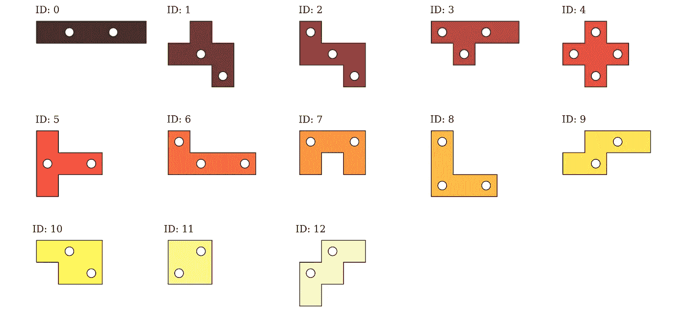

拼图的所有部分。这些洞代表初始图像中的白色方格。

许多关于如何着手解决这个问题的非常有用的信息已经从这篇文章中摘录出来，所以向作者致敬！文章指出，我们放入碎片的顺序非常重要。这暗示了一个方向，即有序序列是代表我们个体的遗传信息——染色体——的一个很好的候选者。

这是一个随机的个体，有一条染色体`[4,3,6,8,5,10,0,9,11,2,1,12,7`。这条染色体对这个个体来说是独一无二的，这意味着我们首先把带有`ID = 4`的棋子放在棋盘上，然后是`3`，然后是`6`，以此类推。但是如何确定以何种方式将每一个棋子放置在棋盘上呢？

## 最优布局算法

这个想法是棋盘上的一些地方比其他地方更合适。使用`shapely`多边形，我们通过从画布本身减去形状来将该块“放”在画布上，这产生了一个新的几何图形，我们称之为*轮廓*。

这里有一组很好的例子来说明如何放置拼图的第一部分:

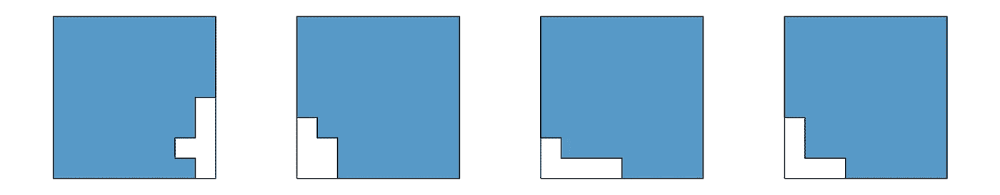

这些都是很好的例子！

虽然这一集展示了一个白痴(或者，在最后一种情况下，一个天才)将如何开始:

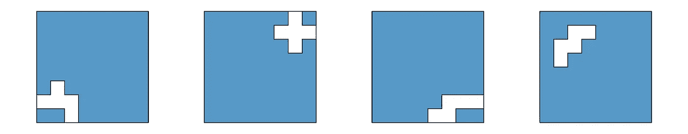

几年后，一个医生会告诉我，我的智商是 48。

为了获得最佳位置，我们搜索产生具有**最短边界长度**(外部和内部)的轮廓的配置。这有点像寻找具有最低势能的构型。下面是几个计算出的边界长度的例子，分别从左到右按最好到最差的顺序显示。

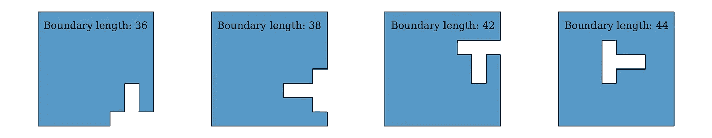

放置第一个截面梁后的新截面梁，根据边界长度从左到右分别排序为最佳和最差。

为了找到最佳位置，我们遍历给定工件的所有配置。这包括检查剩余的位置，也考虑了检查器。

所有形状的数量也取决于棋子的形状，因为一些比另一些更对称。我们用下面的代码检查有效的方向(旋转和镜像),其中我们丢弃了导致相同方向的配置。

这产生了以下配置:

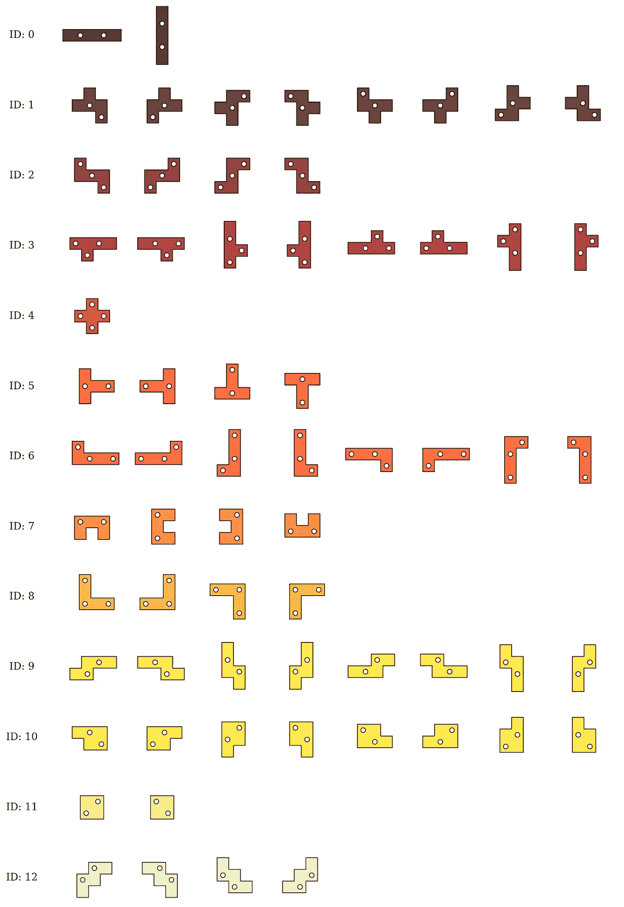

所有独特的旋转和镜像的每一块拼图。

当找到所有唯一的方向时，在所有有效位置测试每个方向。如果满足以下条件，则板上的位置被定义为有效:

*   该片段应包含在轮廓中
*   该零件不应将轮廓分割成两个不相连的部分
*   棋子的方格应与轮廓的方格对齐(第一个棋子设置轮廓的方格)

最后检查单件所有构型时，也可能发生有多个最优摆放，我们只是随机选取其中一个。

## 将碎片拼在一起

每次我们将一个棋子放到它的最佳位置时，都会计算出一个新的轮廓，然后用它来确定第二个棋子的最佳位置，以此类推，直到我们要么达到下一个棋子不再适合棋盘的位置，要么我们用完所有的棋子并找到解决方案。这是一个没有解决方案的流程示例，因为最后一个带有`ID = 6`的棋子不能再插入棋盘了。

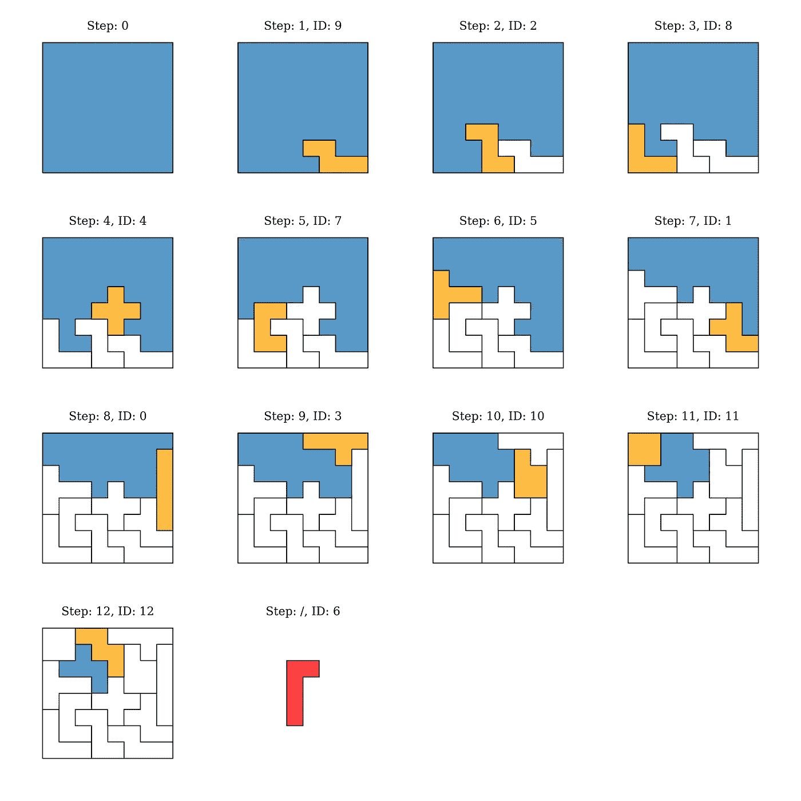

以连续的方式将每个棋子放到棋盘上的过程。ID=6 的最后一块不能再放在板上，以形成最后一个轮廓的形状。

## 健康水平计算

当最优放置算法完成其工作时，计算个体的适应水平。从最终的配置中，我们提取棋盘中未填充的区域、剩余的棋子数以及最终轮廓的轮廓。然后将这些数字相加，最佳健康水平等于 0。在上面的例子中，我们缺少一个面积为 5 个单位的区域和 12 个单位的轮廓，总计健康水平为 18。

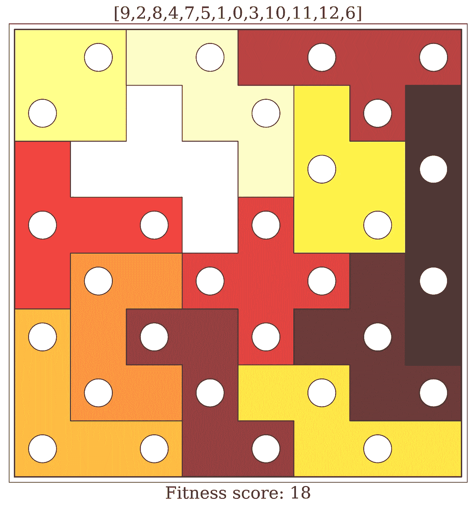

如此接近！

# 该算法

遗传算法的实现可以因应用而异，特别是在变异、选择和交叉的方法方面。方法的选择会极大地影响算法的效率，因为这会影响新后代的质量。

> 交叉运算符还必须产生彼此不太相似或与父代不太相似的子代。如果发生这种情况，群体中的所有染色体将在几代之后开始看起来相似，这将导致退化或乱伦群体，该群体不能搜索解空间。

## 突变方法

对整个种群执行一次变异。它通过随机交换两个基因(两个片段的顺序)来影响染色体。发生这种情况的概率是一个外部参数，它被设置为影响群体中所有基因的 1%。

前面显示了一个例子，其中突变交换了 id 为 1 和 6 的片段的位置。

突变前:
`[ 9, 2, 8, 4, 7, 5, ***1***, 0, 3, 10, 11, 12, ***6***]`
突变后:
`[ 9, 2, 8, 4, 7, 5, ***6***, 0, 3, 10, 11, 12, ***1***]`

染色体变异的代码。

## 选择方法

从整个群体中选择两个个体。一个个体被选中的概率与其健康水平成正比。这种方法也为健康水平较低的人群提供了繁殖的机会。

考虑到群体的适合度，选择双亲的代码。

## 交叉方法

选择[顺序交叉](http://mat.uab.cat/~alseda/MasterOpt/GeneticOperations.pdf)方法作为繁殖过程，因为从染色体相对顺序的角度来看，它的破坏性最小。让我们看一个例子。我们有两个个体，爱丽丝和鲍勃，他们都被选中参与下一代个体的创造。爱丽丝和鲍勃彼此相爱，然后鸟儿和蜜蜂发生了。

下面是爱丽丝和鲍勃的两条染色体:
爱丽丝:`[ 7, 10, 6, 1, 3, 5, 0, 8, 12, 9, 11, 4, 2]`
鲍勃:`[ 1, 11, 8, 4, 7, 10, 6, 3, 0, 2, 5, 12, 9]`

首先，我们随机选择两个交叉点，标记为`|`。爱丽丝的交叉点之间的染色体部分被复制到第一个后代:
查德:`[ x, x, x | 1, 3, 5 | x, x, x, x, x, x, x]`

然后我们取 Bob 的染色体，去掉 Chad 已经拥有的基因，把剩下的基因放到 Chad 的染色体上，从左到右。同样，我们重复这个过程来创造第二个后代，迪克。
查德:`[11, 8, 4, ***1, 3, 5***, 7, 10, 6, 0, 2, 12, 9]`
迪克:`[ 6, 1, 3, ***4, 7, 10***, 5, 0, 8, 12, 9, 11, 2]`

我们看到，父母通过这种方式传递了关于相对顺序的信息，同时仍然创造出相对不同的后代。

复制的代码。

# 解决方案

最后，我们准备扮演上帝，做非凡的事情。

承认吧。这是你要做的第一件事。

在第一步中，我们初始化一个由 *N* 个随机产生的个体组成的群体，其中 *N* 也是算法的一个外部参数。在检查他们的健康水平之后，我们检查是否满足终止条件(这在第一步中不太可能发生)。如果不满足，我们继续进入创造新一代的第二个循环:

1.  选择 2 个人
2.  创造新的后代

重复该循环，直到达到群体大小 *N* ，在这种情况下，这是在 *N* /2 步之后。新的一代产生后，变异发生，然后循环完成。重复该过程，直到找到适合度水平为 0 的最佳候选。

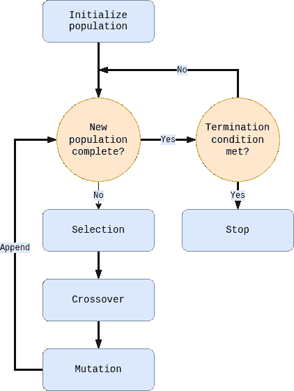

所实现的遗传算法的进化过程。灵感来自:【http://etd.fcla.edu/UF/UFE0000907/pasha_a.pdf? FB clid = iwar 2 e 6 OPG fo 8 VW 81 rmdllqel-sT-kn 20 Wu gj-oxo gu 4 van 6 cuyy 8 vtbakp 0 u

这是一个随机进化过程的图表，其中产生了一个 50 人的种群。它显示了在一系列代( *x* 轴)中新产生的个体( *y* 轴)的适应度水平，直到找到解决方案(在本例中为第 15 代)。

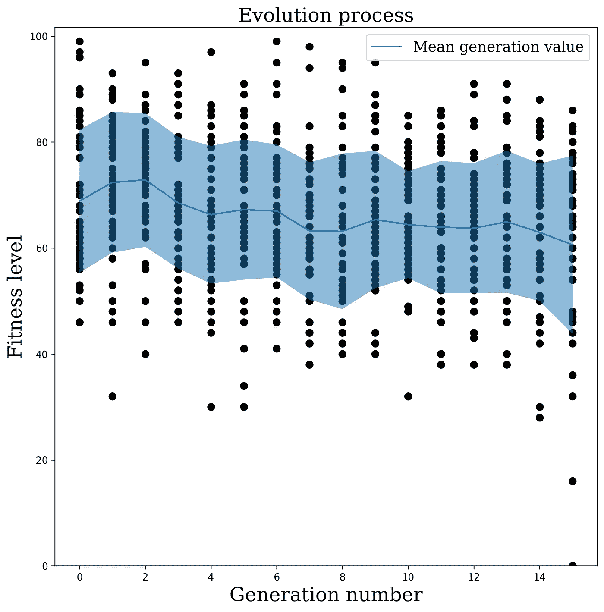

进化的过程，在 y 轴上的*显示了每个个体和他们在 x 轴上几代人的健康水平。蓝线和蓝色区域显示了每一代的健康水平的平均值和标准偏差。*

解决方案如下所示:

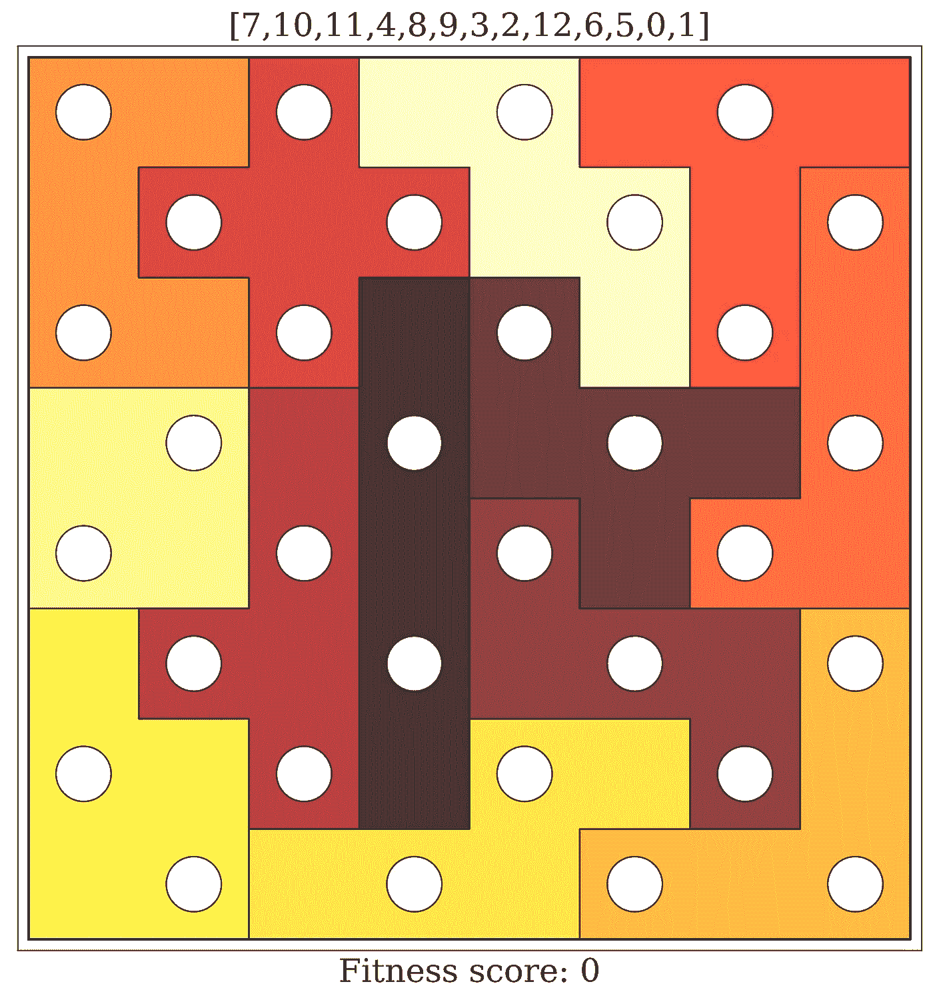

解决方法！

当然，这只是解决方案之一，多次运行该过程可能会得到不同的结果，所有结果都符合预期的结果，但也可能需要不同的时间/代数来收敛。

最后。现在我可以安心睡觉了。

# 代码

最有可能的是，您已经对获得代码的想法感到兴奋和垂涎。

冷静下来，放松。

你可以在[这个回购](https://github.com/mlubej/chessboard)里找到。检查它，运行它，看着进化在你眼前折叠。

```
$ python run_solution.pyGeneration: 0: Initialising
Best candidate score: 40.0
Chromosome: [2,3,10,0,7,8,12,11,9,1,4,5,6] Generation: 1
Best candidate score: 40.0 
Chromosome: [2,3,10,0,7,8,12,11,9,1,4,5,6] Generation: 2
Best candidate score: 40.0
Chromosome: [2,3,10,0,7,8,12,11,9,1,4,5,6] Generation: 3
Best candidate score: 40.0
Chromosome: [2,3,10,0,7,8,12,11,9,1,4,5,6] Generation: 4
Best candidate score: 32.0
Chromosome: [5,6,12,11,7,4,1,3,10,0,9,2,8]...
```