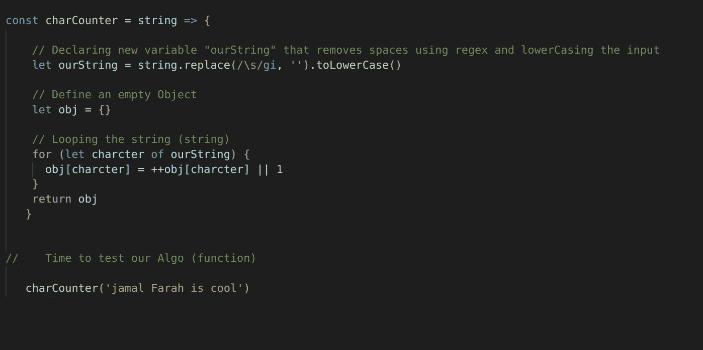
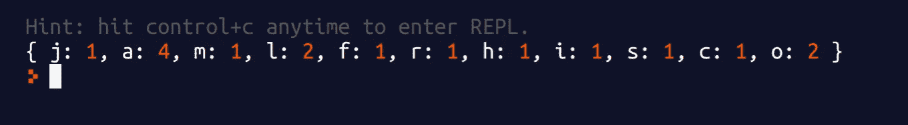

# 求解字符计数器算法

> 原文：<https://levelup.gitconnected.com/solving-the-character-counter-algorithm-f357c33455b3>

解决算法问题的技能是任何程序员最重要的技能之一。

伟大的程序员总是能够通过优化和将问题分解成更小的部分来提出解决方案。

有时在工作面试中，我们会遇到**字符计数器算法，**我们将在这篇博文中尝试解决这个问题。

> **问题**

尝试编写一个函数，它接受一个字符串并返回其中使用的每个字母的编号，不计算空格字符。

> **理解问题**

因此，我们需要编写一个函数，它接受一个字符串并返回该字符串中使用的每个字母的编号

> **解决方案**

> **输出/测试**

快乐编码…