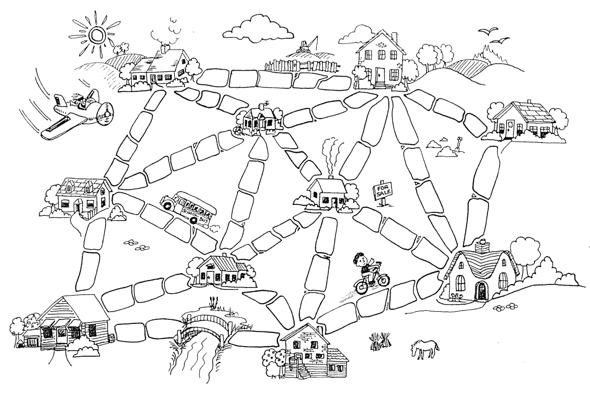
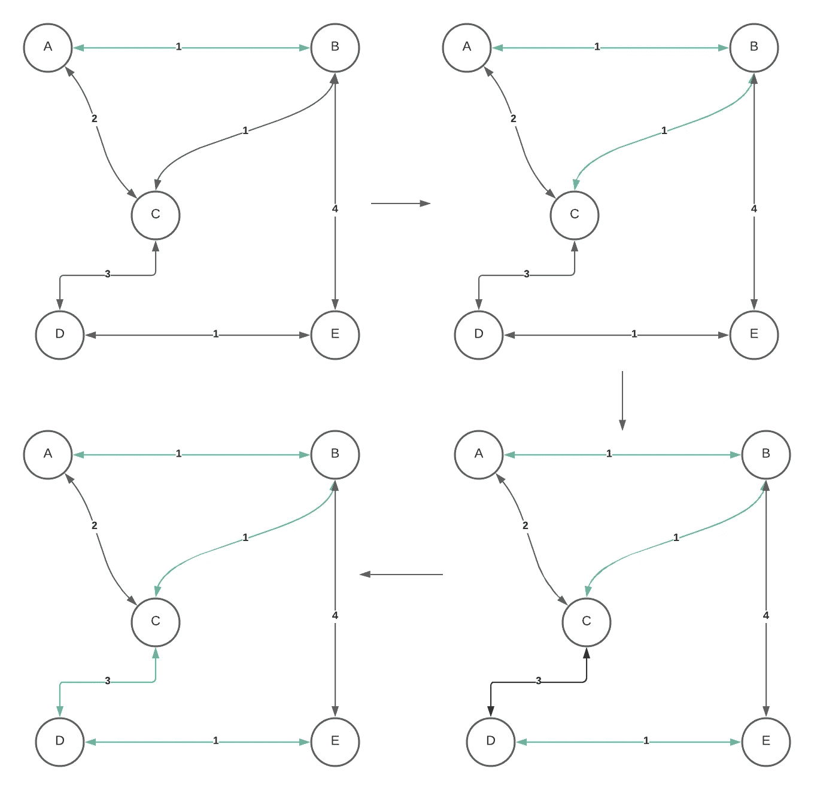
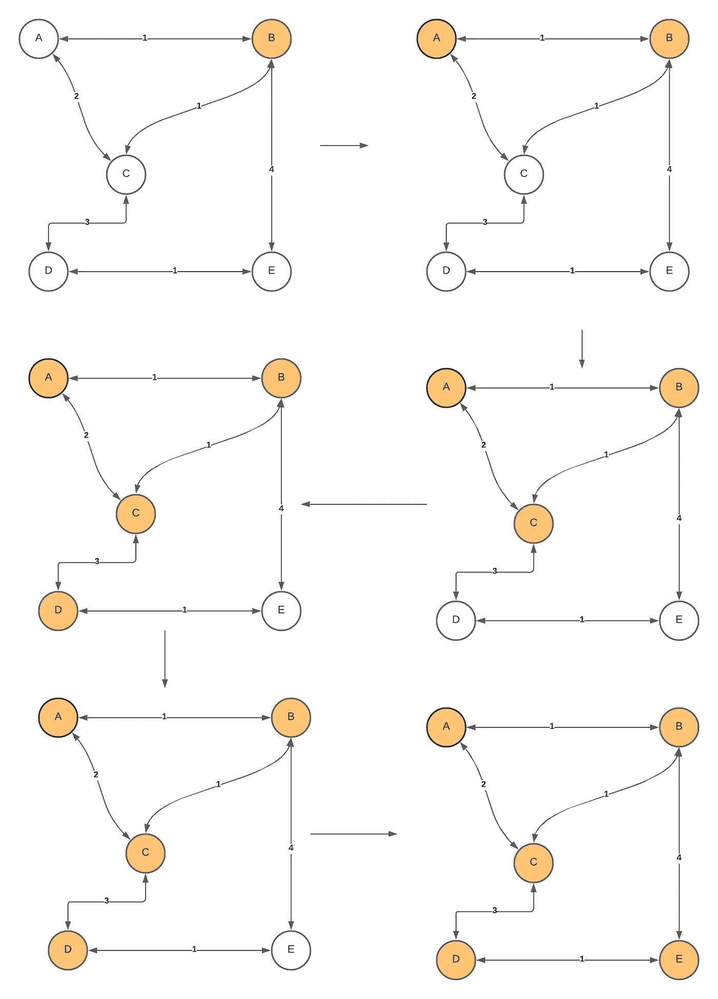

# 解开最小生成树之谜

> 原文：<https://levelup.gitconnected.com/solving-the-muddy-city-problem-with-minimum-spanning-tree-57d5eef88d65>

从前，有一座城市没有路。暴雨过后，在城市里四处走动特别困难，因为地面变得非常泥泞。汽车陷在泥里，人们把靴子弄脏了。市长想改造这座城市，但他不想花不必要的钱，因为它还想建设其他东西。因此，迈耶规定了两个条件:

1.  必须铺设足够多的街道，这样每个人都可以沿着铺设好的道路从自己的家到别人的家
2.  铺路的费用应该尽可能低。

上图是城市的布局。如何才能以尽可能少的铺路成本来确定铺路路线？

哇哦！这是最小生成树的经典问题。每个目的地可以是一个顶点，道路可以用边来表示。我们希望在图中创建一个边集合，该边可以到达所有顶点，并且构建这些边的成本尽可能小。

什么是生成树？给定一个图 G，生成树是图 G 中的一个子图。这个子图是一棵树，并且连接所有的顶点。一个图可以有多个生成树。

既然是树，那就无环。

生成树的开销是生成树每条边上的总权重。因此，最小生成树是图中所有生成树中价格最小的生成树。一个图中也可以有许多极小生成树。

求最小生成树的两个著名算法是 Kruskal 和 Prims。这些算法是计算图中生成树的最小成本的贪婪算法。我想解释两种算法以及两者之间的区别。

# 克鲁斯卡尔算法

Kruskal 的算法通过将边添加到不断增长的生成树中来计算生成树的最小成本。底层算法是迭代并不断从剩余边列表中寻找池的最小成本边。将边添加到不断增长的生成树中。

算法是这样的:

1.  根据权重将边按升序排序。
2.  初始化一个增长生成树的空集。
3.  遍历排序后的边，做这两个操作:1。检查将这条边添加到不断增长的生成树集合中是否会花费任何周期。如果它形成了循环，跳过这条边，并通过下一条边。如果它不能创造一个循环，那么就把边加到列表中。
4.  一旦你遍历完所有的边，生成树将由最小生成树组成。

在上面的例子中，我们根据权重对边进行排序。最小边是`A -> B`、`B->C`和`D->E`，由权重 1 组成。我们选`A -> B`吧。然后，我们找到第二条边，在这种情况下，`B -> C`，并检查`B -> C`是否会形成任何循环。然后，我们检查`C->D`，看看`C->D`是否会在生长的生成树中形成任何循环。然后第二小的边是`A->C`，权重为 2。但是，我们不能添加`A -> C`，因为它在不断增长的生成树中形成了一个循环。跳过`A -> C`。然后，下一个最小的权重是`C -> D`。`C->D`不会导致生成树的循环增长。将`C->D`添加到生成树中，我们就完成了算法。

由于生成树的边总数将是 V-1 条边，所以您可以使用通过边的任一循环，直到增长的生成树具有 *V-1 条边。*

# 普里姆算法

Prim 的算法通过向不断增长的生成树添加顶点来计算生成树的最小成本。底层算法将类似于 Kruskal 的算法，除了它将遍历所有顶点，直到所有顶点都在不断增长的生成树中。

算法是这样的:

1.  维护两个不相交的集合。一个是成长生成树，一个不是成长生成树。
2.  选择与增长生成树集合相邻的最小加权顶点，该顶点不在增长生成树中，并将其添加到不断增长生成树集合中。使用 PriorityQueue 可以从非增长生成树中选择最小权重的顶点。我们可以将生长生成树中顶点的所有邻居添加到优先级队列中。优先级队列将根据顶点的最小权重值对顶点进行排序。我们从队列中取出最小权重值。检查它是否在生长生成树中。如果不是，我们可以增加生成树的价值。然而，我们还需要考虑一件事，这将在第 3 步。
3.  检查周期。为了做到这一点，我们可以用一个布尔数组来记录所有添加到生成树中的顶点。一旦节点被选中，我们将布尔数组中的顶点标记为 true。因此，在探索它的邻居时，我们只将该节点添加到优先级队列中当且仅当该值尚未被选择时。

让我们看看这个算法是如何生成最小生成树的。

起始顶点不重要。让我们选择起始顶点为`B`。我们探索邻居 B，并添加优先级队列中的所有值。它由`(C,1)`、`(A,1)`和`(E,4)`组成。从 min-heap 中弹出，这就是`(A,1)`。标记顶点，探索其邻居，并将尚未标记的邻居添加到最小堆中。在下一次迭代中，优先级队列中最小的权重是`(C,1)`。标记顶点 C 并探索它的邻居。将邻居添加到优先级队列。现在，我们有权重为 3，2，4 的边。最小堆将弹出两个，因为它的权重是所有堆中最小的。但是，我们不把它添加到正在增长的生成树中，因为顶点会导致循环。跳过操作，从最小堆中取出下一个最小的权重。所以我们选择`(D,3)`。探索相邻的顶点 D，并将其邻居添加到最小堆中。最小堆现在具有权重为 1.4 的边。Prim 的算法会选择`(1,E)`。最后，它将弹出最小堆中的剩余值，并完成算法。

# 差别

算法区别在于，Kruskal 的算法用一条边来求最小生成树，Prim 的算法用顶点。

就时间复杂度而言，这是差不多的，取决于你想如何实现该算法。但是，如果使用斐波那契堆，prims 会比 Kruskal 运行得更好。

对于 Kruskal 的算法来说，找到最小生成树所需的时间将是`ElogE`。首先，我们需要根据权重对边进行排序，这将花费`ElogE`。然后，我们将遍历所有的边，从每条边开始，我们检查添加这条边是否会导致循环。如果使用 union-find 通过秩和路径压缩用 union 来检测循环，每个`find`操作都可以取`LG*N`，分摊到常数。如果你正在按等级做唯一的联合，每个`find`方法将花费不相交集合树的高度`logV`。因此，第二个操作是遍历所有边并检查添加一条边是否会在生成树成本增长中形成一个循环`Elg*V`——这相当于`E`。由于我们正在寻找总运算的一个上界，所以它将是`ElogE + E`，它将是`ElogE`。从`logE = logV^2`开始，我们可以得出`ElogV`的结论。

对于 Prim 的算法，找到最小生成树所需的时间将是`(V + E)logV`。因为我们是基于顶点而不是边来构建生成树的，所以我们需要遍历所有的顶点和边。我们将把所有的边推到堆中，并从堆中移除所有的边。在遍历每个顶点和边的过程中，我们还会推送所有不在生成树中的相邻顶点。因此，优先级队列具有不同权重的重复顶点。在这个算法中，我们最终会将所有与边相关的顶点添加到优先级队列中。所以运行时间是`VlogE+ElogE = (V+E)logE`。然而，一个连通图可以拥有的最大边数是`V^2`。如果我们用`logE = logV^2`代替，就是`2logV`——相当于`logV`。所以是`(V+E)logV`。在连通图中，`V`可以等于`E`，因为 max `E`是`V^2`。我们可以断定是`ElogV`。

我们可以通过使用斐波那契堆而不是二进制堆来进一步优化。我们仍然会遍历图中的所有顶点和边。但是，因为在 Fibonacci 堆中，插入需要常数时间，移除需要对数时间。所以总操作可以变成`E+VlogV`。

何时使用一种算法而不是另一种算法？

这取决于用例。

如果图是稠密的，那么 Prims 将具有比 Kruskal 更好的性能。如果图是稀疏的，Kruskal 将是一个更好的选择，因为它比 Prim 的更容易实现。

# 结论

最小生成树是指可以到达图中所有顶点的边的最小成本。求解最小生成树的算法有很多种，最流行的两种是 Kruskal 的算法和 Prim 的算法。这两种算法都使用贪婪方法来寻找最小生成树。然而，技术是不同的。Kruskal 的使用一条边将每条边放入生长的生成树中，而 Prim 的使用顶点将每个具有最小权重的顶点添加到生长的生成树中。

# 资源

有一些关于最小生成树的很好的资源，以及它的使用案例。如果您想了解更多信息，请查看下面的参考资料！

*   [最小生成树教程&注释](https://www.hackerearth.com/practice/algorithms/graphs/minimum-spanning-tree/tutorial/)
*   [Prims 算法的时间复杂度？—堆栈溢出](https://stackoverflow.com/questions/20430740/time-complexity-of-prims-algorithm#:~:text=Given%20that%20the%20total%20time,can%20conclude%20O(ElogV)%20.)
*   [最小生成树的应用](https://personal.utdallas.edu/~besp/teaching/mst-applications.pdf)

【https://edward-huang.com】最初发表于**。**