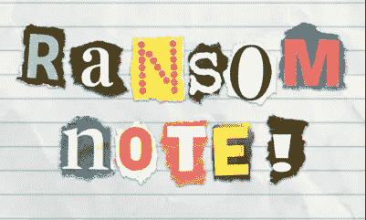
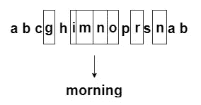
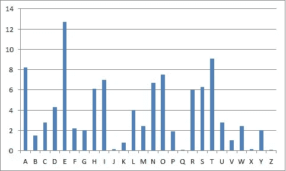

# 用 Javascript 实现勒索信算法

> 原文：<https://levelup.gitconnected.com/solving-the-ransom-note-algorithm-in-javascript-72ebe8acb268>

## [**GitHub repo，包含完整的解决方案代码和测试套件**](https://github.com/noamsauerutley/ransom-note)

什么是勒索信挑战？

> 给定两个字符串:
> 
> 1.源字符串，即“页面”
> 
> 2.所需的字符串，即“音符”
> 
> 确定是否可以仅使用在源“页面”中找到的字母创建所需的“注释”字符串。'

我们正在寻找的一个直观示例是这样的:

因此，如果我们有一页文字，我们可以把它分割成所有独立的字母，然后把它们粘在新的一页上，形成我们选择的新单词或短语。

好，那我们开始吧！

我喜欢从一点伪代码开始，这样我就可以在编程环境中写出我的目标。

所以这里我们有一个名为`**canMakeNote**`的函数，它的工作是查看 ***源*** 字符串是否包含创建所需的 ***音符*** 字符串所需的所有字母。如果为真，则返回 ***真*** ，否则返回 ***假*** 。

然而，“如果源代码包含创建注释所需的所有字母”在上面的伪代码中做了大量的**工作。让我们从头开始。**

我们马上就知道一件事:如果 ***源*** 弦比 ***音符*** 弦短，我们就无法做出音符。我们不可能得到我们需要的所有信件。

首先，我们需要比较两个字符串的长度。如果 ***源*** 字符串太短，我们就不需要再为别的事情费心了，并且可以立即返回 ***假*** 。

然而，弦可能会…很乱。

它们可以包括空白，我不会像跟踪字母一样跟踪它们——如果我从报纸或杂志上剪下字母并粘贴到纸上，我不会剪下并粘贴空白。将每个空格都计为一个字母可能是这个挑战的一个有趣的变体，但是我不打算在这个解决方案中探究这个问题。

所以，如果空格不能算作字母，它们会扭曲我们测量字符串长度的能力。不太好。

另外，字符串可能包含大写和小写字母。这不会影响我们对字符串长度的判断，但当我们开始尝试比较字符串的内容时，这将成为一个问题。出于我们的目的，“ **A** 与“ **a** 相同”。毕竟，标志性的勒索信是由大小写字母的混乱组合定义的。另一方面，计算机认为“ **A** 和“ **a** 是完全不同的字符。

因此，在比较输入字符串时，我们需要考虑两件事，空格和字符大小写。

***注*** *:这个挑战的一些变体将以字母数组的形式提供输入和期望的输出参数，一切都井井有条，蓄势待发。太好了！如果你遇到这样的挑战，你可以跳过这一步！然而，我想提供一个解决方案，以字符串形式说明输入/期望的输出。*

为了清理我们杂乱的字符串并将它们转换成对我们的目的更方便的东西，让我们创建一个[辅助函数](https://vanillajstoolkit.com/helpers/)。

我需要考虑空格和字符的情况，并且，由于这是一个算法上的挑战，我将继续把我们的字符串转换成数组，这样每个字符将是单独的，我们的数据将是一种便于迭代、操作和比较的形式。

首先，我将伪代码出来:

所以我们有了一个方便的列表，列出了我们的字符串清理助手函数需要做的事情。

首先，空白。

每当我需要识别和操作字符串中的某个或某些字符时，我就会想到 [RegEx](https://www.regular-expressions.info/) 。RegEx 是“[正则表达式](https://en.wikipedia.org/wiki/Regular_expression)”的简写引用。那是什么？

## 正则表达式

> 一个**正则表达式**、 **regex** 或 **regexp** (有时称为**有理表达式**)是一系列[字符](https://en.wikipedia.org/wiki/Character_(computing))，它们定义了一个*搜索* [*模式*](https://en.wikipedia.org/wiki/Pattern_matching) 。通常这些模式被[字符串搜索算法](https://en.wikipedia.org/wiki/String_searching_algorithm)用于对[字符串](https://en.wikipedia.org/wiki/String_(computer_science))的“查找”或“查找和替换”操作，或者用于输入验证。

正则表达式搜索模式能做什么？它们擅长收集字符串中符合给定搜索条件的所有字符，然后按照指示收集或操作它们。这非常方便，让原本费力复杂的事情变得相对快捷。代价是执行正则表达式查找和替换操作的计算开销会很大！当考虑使用 RegEx 操作非常大的字符串时，应该考虑这一点。然而，对于我们此时的目的来说，RegEx 正是医生所要求的。

老实说，我不是一个能记住所有不同正则表达式模式及其含义的专家。我知道的足够多，可以很快回忆起我最常用的模式，但主要是，我已经在开发识别能力方面取得了巨大的成功，当我在寻找一个可以通过使用 RegEx 来缓解的问题时。然后，用关键字“RegEx”快速搜索我想要执行的查找和替换操作类型，也许是我当前正在编写的代码的语言，通常会在前几个链接中产生结果。

在这种情况下，我在 googled 上搜索“JavaScript regex remove all white spaces from string ”,很快就找到了适合我需要的 RegEx 模式。

好了，关于正则表达式说得够多了！回到我们的字符串清理辅助函数。

我可以将 Javascript 的[***replace***](https://www.w3schools.com/jsref/jsref_replace.asp)方法与我选择的正则表达式模式相结合，将字符串中的每一个空格替换为空，从而将它们完全去除。我选择的 RegEx 搜索模式还删除了换行符，以及可能遇到的任何其他类型的“空白”字符。

***输入*** 是我们参数的名称，可以是传入函数的任何字符串。 ***/\s/g*** 是识别所有空白/空白字符的正则表达式搜索模式，后面的空字符串告诉 ***input.replace*** 我们想什么也不替换空白。总之，这个组合将从我们的输入字符串中去掉所有的空白字符。

已处理空白。✔️

下一个是性格案例。

幸运的是，Javascript 自带了自己的[***to lower case***](https://www.w3schools.com/jsref/jsref_tolowercase.asp)方法，该方法基本上实现了它所描述的功能。当在字符串上调用时，它会将字符串中的所有大写字母转换为小写字母。所以，我们的***clean****函数可以通过调用这个方法来完成我们伪代码列表上的下一个任务。*

*好的，最后，我们想把我们剥离的小写字符串变成一个字符数组，并返回最终结果。*

*同样，Javascript 已经准备好了相关的方法等待我们，因为这正是[***string . split()***](https://www.w3schools.com/jsref/jsref_split.asp)方法的确切目的。我们必须告诉方法我们希望它在哪里拆分字符串，这可以通过在方法名后面的括号中用引号括起触发字符来实现。然而，因为我们想要分开每个单独的字符(而不是在每个空格处分开，例如，分开单词，或者在最后的标点符号处分开句子)，所以我们在引号内什么也不放。*

*因此，我们最终的清理函数如下所示:*

*虽然本文的 [GitHub 库](https://github.com/noamsauerutley/ransom-note)包括一个测试套件，但我也喜欢使用浏览器控制台来快速检查我的函数，并确保它们返回我想要的结果。让我们看看这个 ***clean*** 函数在给定一个报价时返回什么。*

*🌟太好了！这正是我们想要的结果。我们现在有了一个清理函数，它可以接受一个字符串，缩小所有的大写字母，删除所有的空格，并返回一个方便的数组来满足我们的比较需要。*

*为了有效地比较我们现在转换的字符串，我们需要跟踪两个数据元素:我们可用或需要的单个字符，以及我们可用或需要的每个字符出现的频率。*

*例如，源文本可能包含字母“e”，但是如果我们想要的输出文本需要五个“e”呢？仅仅一个匹配字母的实例不足以确定源文本有我们需要的内容。*

*在[频率分析](https://en.wikipedia.org/wiki/Frequency_analysis)中，这是一个常规挑战，经常会遇到使用[直方图](https://en.wikipedia.org/wiki/Histogram)，这与[条形图](https://en.wikipedia.org/wiki/Bar_chart)非常相似。*

**

*这些图形工具是我们需要跟踪的两种数据的可视化表示——字母和出现频率。*

*不幸的是，我不能简单地在电脑上显示直方图。但是，我可以使用非图形数据结构来传达直方图中的相同信息。*

*说到[数据结构](https://www.geeksforgeeks.org/data-structures/)，我解的算法越多，就越欣赏[哈希表](https://www.hackerearth.com/practice/data-structures/hash-tables/basics-of-hash-tables/tutorial/)。允许存储[键值对](https://javascript.info/object)的数据结构在需要比较大量小数据的任务中通常是一个有效且高效的工具。如果你想看另一个例子，我的关于两个和问题的解决方案[包括一个基于散列的解决方案，这是目前为止我探索的三个解决方案中最有效的。](/solving-the-two-sum-problem-in-javascript-three-ways-4d43067fcfc7)*

*因此，当我看到需要存储成对数据的挑战时，直观的感觉是至少尝试将这些数据存储为键-值对。*

*让我们对这个特定的任务进行伪代码化，就像我们以前做过的那样:*

*所以我们开始创建一个散列对象，它可以模仿频率出现直方图。其中，我们希望将每个字符保存到一个键中，然后将该字符的出现频率(重复的次数)存储到该键的值中。*

*因为我们需要检查每个字母，所以我们应该从遍历输入开始。我假设输入是一个相关小写字符的数组，因为这是我们之前的 ***clean*** helper 方法返回的内容。*

*对于每个字母，我需要确定我们以前是否遇到过它。如果这是该字母在数组中的第一个实例，我们需要在我们的 ***直方图*** 散列对象中创建一个新的键，并为其赋值 ***1*** ，以进行一次匹配。如果该字母在数组中较早出现，因此已经为它创建了一个键，我们不应该创建一个新的键，而是将 ***1*** 添加到现有键的值中。*

*因此，再用一点伪代码，我们就可以勾画出我们的循环结构:*

*因为我只有两种行为模式可供选择，所以我可以使用一个[三元运算符](https://www.tutorialsteacher.com/csharp/csharp-ternary-operator)写出[条件语句](https://en.wikipedia.org/wiki/Conditional_(computer_programming))。*

*在这段代码中， ***之前的部分？*T19 是 [if 语句](https://www.w3schools.com/js/js_if_else.asp)。这就是我们在遍历输入数组时要检查的内容——对于输入的每个字母，我们检查它是否已经存在于 ***直方图*** 中。如果是，紧接在 ***之后的第一个操作是什么？应执行*** (对应字母键的值加 1)。否则，应执行 ***:*** (为字母创建一个键并为其赋值 1)之后的第二个操作。***

*就像我们对 ***clean*** helper 函数所做的一样，让我们把它扔进控制台，看看它会输出什么。*

*🌟太好了！这将返回一个 hash 对象，其中包含给定输入中的每个字母作为键，该字母的出现频率作为相应的值。*

*现在，我们已经将数据组织成一个可以有效测试的结构。助手函数用够了，我们终于准备好用我们写的第一个伪代码函数做点什么了！*

*这是我们最初的伪代码。*

*首先，我们知道我们将返回一个布尔值。让我们继续为返回值创建一个变量——为了方便起见，我将把它命名为 ***boolean*** ，并给它一个默认值 false。*

*然后，我们可以使用我们的 ***清理*** 功能来清理我们的输入。*

*这将给我们两个数组，我们可以比较它们的长度。这样一来，就像我们最初陈述的那样，如果*比 ***注*** 长，我们就会想要前进，但如果不是呢？我们不需要做其他任何事情，可以立即返回 ***false*** 。因为我们用值 ***false*** 初始化了我们的 ***布尔*** 变量，所以我们可以返回它。**

**到目前为止，我们可以这样写:**

**这比我们开始的伪代码更接近于一个工作函数，但是中间仍然有一大块模糊的内容。**

**不过没关系，这就是我们的***make histogram***函数的作用！**

**我们可以调用***make histogram***两次，输入我们的 ***clean*** ed 数组，得到两个 hash 对象，我们现在可以比较一下。**

**仍然有一点伪代码，但是我们现在可以遍历经过清理和散列的注释文本的键，并对照经过清理和散列的源文本检查每个键。因为散列键在内存中提供了一个特定的位置来直接检查，所以这是比较这些数据的一种非常有效的方法。**

**当我们遍历 note 对象时，如果对源对象的检查显示它包含正确数量的正确字符，那么应该给 boolean 赋值 ***true*** 。如果这个检查失败了，布尔值应该被赋值为 ***false*** ，我们可以使用[***break***](https://www.w3schools.com/js/js_break.asp)语句立即退出 [for 循环](https://www.w3schools.com/js/js_loop_for.asp)，这将触发 ***布尔值*** 返回，从而导致我们的函数返回 false。**

**但是，如果每个被检查的字符键都返回 true，那么 for 循环将使用仍然赋值为*的*布尔值进行解析，然后并且只有到那时，我们的函数才会返回值 ***true。*******

**剩下要做的就是编写代码来测试散列对象的值。**

**我们需要检查两件事:**

**1:源哈希对象有一个匹配当前字母的键。**

**2:如果为真，则对应的值大于或等于注释哈希对象中当前字母键对应的值。**

**好了，这看起来很有希望，让我们把所有东西都扔进控制台，看看我们会得到什么。**

**🌟太好了！**

**我真的很喜欢这个算法挑战，因为我认为这是我最喜欢的算法求解工具之一——不起眼的 hash——的完美用例。我希望这个解决方案说明了散列表是多么有用，并且这种方法对您所有的算法解决挑战都有帮助！**