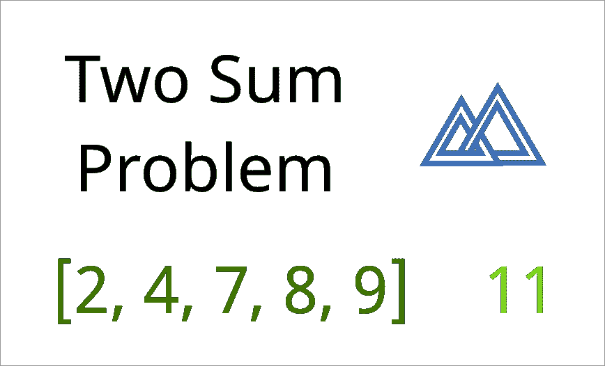
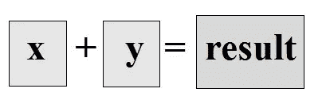

# 用 Javascript 解决二和问题，三种方法。

> 原文：<https://levelup.gitconnected.com/solving-the-two-sum-problem-in-javascript-three-ways-4d43067fcfc7>

## 这个 Github repo 包含我为所有三个解决方案模型完成的代码。

什么是二和问题？

> 给定一个整数数组和一个目标数，返回加起来等于目标数的两个整数

## **备注:**

*期望的结果可以以几种不同的形式返回——我见过查询要么询问* [*加数*](https://www.mathsisfun.com/definitions/addend.html) *的* [*索引*](https://en.wikipedia.org/wiki/Array_data_structure) *(也就是它们在数组中的位置)，要么询问加数本身。*

*此外，有些挑战的结构是这样的，只有一对数字加起来才是总数。*

*在我的解中，我将返回* ***所有离散成功的加数对*** *。*

*我将简要地说明调整我的解决方案以返回一个* ***单加数对*** *或* ***数组索引而不是加数本身的方法。***

我将使用**数组【2，3，4，3，6，7】**和**和整数 6** 来测试所有的解决方案。

# 1:蛮力

对于我的第一个解决方案，我没有优先考虑优雅或性能，只是试图破解一个可行的解决方案。一旦我有了一些可用的原材料，并且对寻找我想要的数字的机制有了初步的了解，那么我就可以用我的解决方案来解决时间复杂度等问题。

因为我知道我可能需要找到多个正确的数字组合，所以我从一个空数组开始，并计划将我成功的数字组合传递给它，然后返回数字组合的数组。

如果在挑战开始时确定每个 sum + array 组合只能有一个成功的解，我可以跳过这一步，一旦找到就返回正确的加数。

首先，我需要找到成功的组合。

我首先创建两个循环，允许我遍历数组中的每个数字组合。现在我可以测试组合，看看它们中是否有任何一个加起来达到 ***总和*** 。

如果是这样，我想把它们保存在我的容器数组中，我会在结束循环后返回这个数组。

如果我想要的是 ***索引*** 而不是 ***数字元素*** 本身，我可以将***x***&***y***推送到 ***nums*** 数组中。

当在控制台中运行时，该函数返回:

✔️这个函数查找并返回[2，4]和[3，3]。

✖️:每个人还会多次退货。不是我们想要的。

我可以尝试在推入新的数字组合之前检查 nums 数组，但是我使用的嵌套数组格式使这变得很麻烦。

*注意:检查当前元素的 nums.flat(Infinite)是完全合理的，但是我选择了一个计算开销稍小的选项。*

我添加了一个额外的数组 ***prevNums*** 用于存储找到的数字，现在可以在将一个数字推入 ***nums*** 之前检查是否已经找到添加的&数字。只有当 ***nums*** 不为空时，我才会这样做。

这个回报是什么？

太好了！这正是我想要的结果。🌟

# 2:二分搜索法

好了，我有了第一层。我可以在一个数组中找到给定总和的组合，并以清晰、可读、无冗余的格式返回它们。

但是，如果我的数组不是**【2，3，4，3，6，7】**，而是一个上千个数的数组呢？甚至可能上万？基于我的第一个解决方案模型，我将不得不迭代无数的数字组合，即使我的总和仍然只有 **6** 。

这是对计算能量的巨大浪费。

在这里，我不打算深入探讨[时间复杂度](https://www.geeksforgeeks.org/understanding-time-complexity-simple-examples/)的概念，但是我想找到一个比我最初的暴力模型更好的解决方案，因为需要更少的计算。

为了做到这一点，我将使用一个[二分搜索法](https://www.computerhope.com/jargon/b/binary-search.htm)。

我将编写一个帮助函数来执行二分搜索法本身，然后第二个函数将利用它来找到给定总和的正确加数。

我将把四个[参数](https://www.javascripttutorial.net/es6/javascript-default-parameters/)传递给 ***二进制搜索*** 助手函数:

*   ***数组*** : 这是我们一直在迭代的同一个数组。然而，传递给这个函数的任何数组都需要从低到高排序，这样这个函数才能工作！
*   ***目标*** :这是我们要寻找的数字——当应用于 ***二加和*** 解时，这将是一对中的第二个加数*。*
*   ****开始*** :我们开始迭代的索引。*
*   ****end*** :我们停止迭代的索引。*

*首先，我想找到数组的中间。如果它包含偶数个元素，我需要向下取整。*

*我正在使用*

> ****(start+(end—start)/2)****

*获得中点的方法，以避免一些潜在的边缘情况错误，如[此处](https://www.geeksforgeeks.org/start-end-start2-preferrable-method-calculating-middle-array-start-end2/)所述。*

*我想把中点向下舍入到最接近的整数。我可以用*

> ****math . floor(start+(end—start)/2)****

*来处理我的舍入，但是[位](http://rocha.la/JavaScript-bitwise-operators-in-practice)操作符 ***~~*** 可以更快地[完成舍入到最近的整数的相同工作。](// https://blog.blakesimpson.co.uk/page.php?id=58&title=fastest-alternative-to-math-floor-in-javascript)*

*因为我将在这个函数中测试几种不同的情况，所以我将使用一个 [switch 语句](https://www.w3schools.com/js/js_switch.asp)而不是一个 [if/else 语句](https://developer.mozilla.org/en-US/docs/Web/JavaScript/Reference/Statements/if...else)。*

*因为我试图让这种方法更有效，所以我从几个时间复杂度成本相对较低的案例开始。*

*我会检查以下情况:*

*   *1:第一个数字是目标数字。*
*   *2:中间的数字是目标数字。*
*   *3:最后一个数字是目标数字。*
*   *4:我要迭代的数组或数组段为空。*

*如果这些情况都不成立，我可以继续迭代。*

*为此，我将再添加两个案例:*

*如果中间数大于目标数，我知道我们的目标数介于 ***阵【开始】*** 和 ***阵【中点】*** 之间。因此，我[递归地](https://www.geeksforgeeks.org/recursion/)在一组新的数字上调用我们的 ***binarySearch*** 函数，这将只是 ***数组【开始】*** 和 ***数组【中点】*** 之间的元素。*

*此外，由于我们已经检查了 ***array[start]*** 和***array[midpoint]***是否与我们在初始情况下的目标数相匹配，我们可以从列表中排除这些元素，只留下在***array[start+1]***和***array[midpoint-1]***之间的元素。*

*这将找到一个新的起点、终点和中点，并对现在减半的元素集合重复该函数。*

*最后一种情况是如果中间数小于目标数。在这种情况下，我们在 ***【中点+1】******数组【end-1】***之间的元素集合上递归调用 ***binarySearch*** 。*

*其逻辑与前一种情况类似——如果目标数大于排序数组的中点，我们可以确信它不会在前半部分，并且可以跳过对它们的迭代，只查看数组的后半部分(减去中点和结尾，我们已经检查过匹配)。*

*使用这种递归方法，我们可以通过重复地将数组一分为二来找到数组中想要的数字，从而执行[比我们每次想要查看数组是否包含单个元素时遍历整个数组要少得多的计算](https://stackoverflow.com/questions/8185079/how-to-calculate-binary-search-complexity)。*

*最后，我添加了一个 return 语句，允许这个函数在所需的值不存在时返回 false。*

*如果该函数按预期工作，它将重复执行，直到找到并返回所需的元素，或者如果该元素不在给定的数组中，则返回 false。因此， ***二进制搜索*** 函数的[返回值](https://developer.mozilla.org/en-US/docs/Learn/JavaScript/Building_blocks/Return_values)要么是**想要的元素**(如果它存在)要么是**假的**。*

*太好了！现在我们有了工作助手方法🌟*

*但是，我们如何将它应用到我们的两和问题中呢？*

*我们知道，为了使用二分搜索法，我们需要从一个排序的数组开始，所以我们将从排序初始数组开始。*

*然后，我们可以通过创建两个空数组来建立与前面相同的基本结构:一个用于存储包含成功的加数组合的嵌套数组，另一个用于存储可访问的顶层组合中的元素，以供以后检查。*

*我们需要找到所有这些元素的组合，将它们存储在我们的 ***nums*** 数组中，然后像上次一样，在最后返回该数组。*

*然而，这一次，我们不会创建嵌套循环来迭代。*

*这一次，我们只遍历数组一次。*

*对于每个元素，值 ***加数*** 将被分配给等于 ***总和*** 减去该元素的数。*

*所以，对于 ***6*** 和 ***2*** 的一个元素的和，加数就是整数 ***4*** 。*

*这给了我们一个目标整数，这正是我们的 ***binarySearch*** 函数所需要的。*

*所以这一次，我们将使用 ***二进制搜索*** 助手函数来为我们完成这项工作。*

*这样，我们不用嵌套迭代器，而是找到任何给定组合中的第二个数字，然后使用更有效的二分搜索法方法来查看该数字是否在数组中的任何位置。*

*正如我们之前所做的，我们可以使用 ***prevNum*** 数组作为一个工具来存储和检查之前找到的解决方案，所以我们不会返回多余的组合。*

*太好了！这也返回了我们想要的结果🌟*

# *3:哈希*

*使用二分搜索法使我们的最后一个解决方案比强力嵌套循环解决方案更有效，但是还有可能改进更多吗？*

*还有另一个工具可以帮助我们有效地检查我们想要的加数是否存在于我们的数组中:一个[散列表](https://medium.com/javascript-in-plain-english/algorithm-in-javascript-hash-table-7b0464d2b81b)。*

*这一次，除了我们的空 ***nums*** 数组之外，我们从一个空的[对象](https://javascript.info/object)、 ***存储哈希*** 开始。*

*就像我们之前做的一样，我们想要遍历我们的数组，并找到 ***sum*** 减去每个元素的余数。然后，我们想看看那个余数是否存在于 ***数组*** 中。如果是这样，我们将把余数和元素都推入到 ***nums*** 数组中，我们最终将在循环结束后返回这个数组。*

*我们可以通过从 sum 中减去当前元素来找到所需的加数，但是如果不使用另一个嵌套循环或我们的二分搜索法函数，我们如何知道它是否存在于该区域中呢？*

*让我们开始使用 ***存储哈希*** 。*

*随着每一次迭代，我们将添加一个新的[键-值对](https://stackoverflow.com/questions/25955749/what-is-a-key-value-pair)到 ***storageHash*** :一个 ***数组【I】***(***元素)*** 的 ***键*和一个 ***i*** 的 ***值******

*现在，当我们发现一个新的加数，并想检查它是否存在于我们的数组中时，我们可以在 ***storageHash*** 中查找那个键。这是一个很好的操作，因为它只需要检查[内存](https://stackoverflow.com/questions/697918/what-does-o1-access-time-mean/697935)中的一个特定位置，而不需要遍历连接元素的集合。*

*如果 key 存在于 ***storageHash*** 中，那么我们知道 number 也存在于 ***数组*** 中。*

*因此，我们可以安全地将我们已经对照 ***storageHash*** 检查过的加数与我们当前的数组元素结合起来，并将它们添加到我们的 ***nums*** 数组中，以便以后返回。*

*让我们在[浏览器控制台](https://developers.google.com/web/tools/chrome-devtools/console/javascript)中测试一下:*

*太好了！这给出了我们想要的结果。🌟*

*我们现在可以使用哈希表直接查找每个潜在的加数，而不是遍历数组元素的每个可能的组合，或者甚至为每个元素找到所需的加数并在数组中搜索它(即使使用像二分搜索法这样相对高效的方法)。*

*这种方法也很好，因为它不需要对初始数组进行排序，也不需要从最终数组中去除多余的正确组合。*

*就是这样！希望这些解决方案可以帮助您解决寻找两个数组元素相加得到一个给定和的挑战。*

**

*如果你想阅读更多关于解决这个问题的各种方法及其各自的好处，我真的很喜欢这篇文章 ( **警告:自动 pdf 下载！**)。*