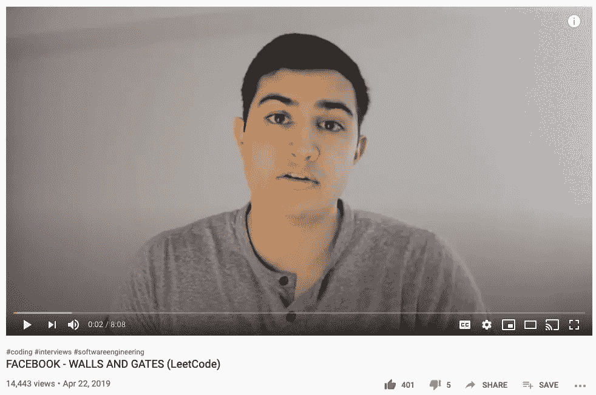
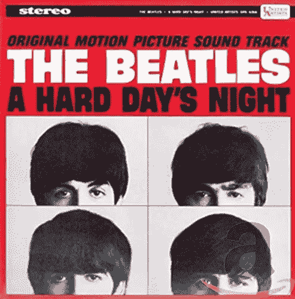
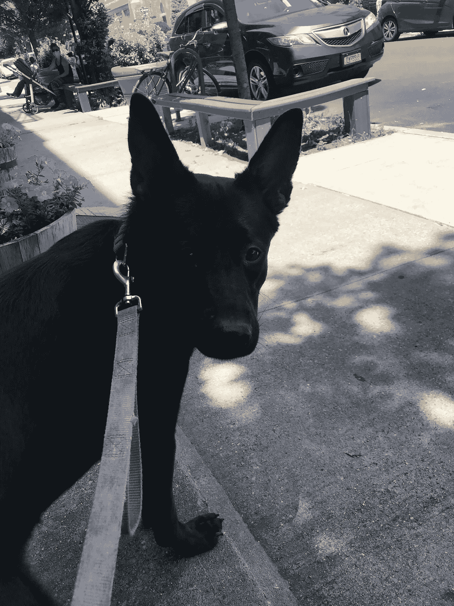

# 解决“威尔士排序”问题！

> 原文：<https://levelup.gitconnected.com/solving-the-welsh-sort-problem-30458a4dd6bc>

## 鲸鱼！—我是说威尔士！


不是这种腰！

最近，我一直在为顶级科技公司的硬编码面试做准备。大约两个月前，我发表了一篇文章，取笑了这些类型的编码问题,但随后我在一次采访中几乎立即被问到这些问题，所以我仍然认为它们既无用又必要，因为程序员需要向彼此证明他们是“S-M-E-R-T”。



Yaaas 英俊的 23 岁！教我编码！

最近我一直在像 [LeetCode](http://leetcode.com) 和 [HackerRank](http://hackerrank.com) 这样的网站上解决这些问题，尽管这两个网站最近都把它们的一些内容变得更加“高级”,以从我们这些失业的无业游民身上榨取金钱。但是如果(说实话:当)我在一个问题上卡住了，我会去看看这个家伙的视频，他指导我解决这个问题。

然后我把他用 Java 写的代码翻译成 JavaScript，如果不完全相同的话，这通常非常容易(帮助我认识到它们的相似之处！)并为问题的所有行写下注释，这样我就知道我理解了。

最后，如果可以的话，我会在 LeetCode 上测试它，看看它是否能运行，或者编写我自己的测试，然后如果我做错了，就像我有时害怕的骗子综合症 n00b 一样绝望地向朋友求助。

然而，最近我遇到了一个问题，没有任何视频或容易找到的公共信息。问题是这样的:

```
Given the Welsh Alphabet, which is slightly different than the English one, design a function that sorts a list of words by that alphabet:"*a b c ch d dd e f ff g ng h i j l ll m n o p ph r rh s t th u w y"*Note: "double" letters supersede single letters so "ng" would be considered in its current order and not as an "n g".
```

那些是英国音！人们甚至可以说，试图解决这个问题将是一个“艰难的夜晚”。



看我在那里做了什么。

不管怎样，既然没有 LeetCode 也没有视频，那就开始吧！

首先，让我们复制并粘贴威尔士字母表，使其成为一个好变量。

```
**const** welshAlphabet = 'a b c ch d dd e f ff g ng h i j l ll m n o p ph r rh s t th u w y'
```

接下来，我们知道我们需要一个函数来接受由我们的函数判断的单词的列表或数组。同时，让我们把那个大的旧字符串也变成一个数组！比较好对付！

```
**const** welshSort = (welshWordsArray) **=>** { *//turn the string into an array of welsh letters.* **let** welshArray = welshAlphabet.split(' ')
```

我喜欢尽可能描述性地给事物命名，以免自己被弄糊涂！

接下来让我们创建一个*字典*！在 JavaScript 中，我们称之为*映射、*哈希映射或*对象*。这将是一种尽可能快地跟踪字母表顺序的方法，因为在一个*对象*中查找值需要 O(1)时间！因此，要制作这个字典，我们只需将其初始化为一个变量，并使用 JavaScript *forEach* 循环来获取字母的*索引*或顺序，并将它们设置为威尔士字母的*键*的*值*。

```
*//create a map/dicitonary for the welsh letters with O(1) lookup.***const** welshDict = {}*//add each letter as a key in the dictionary with its value based on order.*welshArray.forEach((letter,i) **=>** welshDict[letter] = i)
```

现在重要的是，我想把一些逻辑抽象成一个帮助函数。我已经有了一个想法，我们将遍历每个单词，寻找那些威尔士双字母，我想创建一个函数，告诉我一个字母是否是其中之一。

因此，我将使用 *String.slice()* 方法一次查看字符串中的两个元素，看看它们是否可能是威尔士语，如果是，我们希望它们按照双字母值进行估值。否则，我们将只取字符串中任何位置*的单个字母*。

```
*//helper function to see if the letter we're checking is a two letter Welsh character or not.***const** isItWelsh = (word, position) **=>** { *//if it is a welsh letter, this slice of the word will be the letter.* **let** potentiallyWelsh = word.slice(position, position +2) *//if we're not at the end of the word and the two-letter character is in the welsh alphabet, return it* if(position < word.length-1 && potentiallyWelsh in welshDict) return potentiallyWelsh; *//otherwise return the single character letter* return word[position]}
```

太好了，我们已经完成了最难的部分。现在我们只需要进行实际的排序。现在在 JavaScript 中，我们可以调用 *Array.sort()* 或者我们可以添加一个选项*函数*来排序，给定数组中的两个值，这就是我们要做的。

这将是我们函数的*返回*值，因为它将被排序，我们还可以将我们的位置初始化为单词的第一个元素，在 JavaScript 中该元素的索引为 0。

最后，我们可以处理一个*边缘情况*，意思是不太可能发生但有可能发生的事情。在这种情况下，我们要处理的是这两个词是否完全相同，这意味着我们不需要做任何花哨的逻辑！

```
*//we need to sort these words by a custom method*return welshWordsArray.sort((a,b) **=>** {*//edge-case, if they're the same word, no need to manipulate the array!*if(a === b) return 0;*//initializing the position at the start of the word.***let** position = 0
```

好吧！现在让乐趣开始吧。

我们将想要迭代地查看这个数组*的每个字母*，这意味着我们将使用一个*循环*。为了简单起见，我只使用了一个 *while(true)* 循环，如果不告诉它停止，它将无限运行，所以我必须用 *return* 或 *break* 语句手动停止它。

此外，如果单词在某一点上完全相同，但是其中一个更长(例如:able，ableist)，我们将会把最短的那个放在比 T42 更长的那个后面。所以我们也会处理的。

```
*//using a loop to loop through the whole word with no condition so we can use custom returns.*while(true){ *//if we've reached the end of the first word and it's been equal thus far but shorter, it goes before.* if(position >= a.length) return -1; *//if we've reached the second word and it's been equal but shorter it goes before.* if(position >= b.length) return 1;
```

现在是简单的部分！我们需要检查每个字母和两个字母块，看看它是否是威尔士语！通常这涉及到很多逻辑，但是因为我们做了一个助手函数，所以很简单:

```
*//initializing what the letters are at the current position using our helper function***let** letterA = isItWelsh(a, position)**let** letterB = isItWelsh(b, position)
```

最后，我们还有最后一个条件。如果我们在相同的位置有相同的字母，一个或两个字符的字母，我们想移动到下一个位置，继续我们的循环。否则，我们可以用排序语法 *a-b* 按字母排序，这给出了一个*升序*和*返回值*的排序。

```
*//if they're letters are equal, go to the next letter, either 1 or 2 away!*if(letterA === letterB){ position += letterA.length} else { *//otherwise sort them by their welsh values comparing the first and second word.* return welshDict[letterA] - welshDict[letterB]}
```

我们完事了。最终的代码看起来像这样:

现在，最后，让我们来谈谈**时间和空间的复杂性**，因为这是一个面试问题，你很可能会被问到这个问题。

**空间复杂度**相当简单，因为无论函数有多长，我们都只创建一个数组和一个对象，这意味着如果**永不改变**，那么它就是**常量空间或 O(1)** 。

**时间复杂度**稍微难一点。据我所知，对于我们的**排序**算法，我们平均得到 **O(n log n)** 时间，[更多信息在这里，这实际上是非常酷的](https://blog.shovonhasan.com/time-space-complexity-of-array-sort-in-v8/#:~:text=Time%20and%20Space%20Complexity.,-There's%20nothing%20magical&text=Quicksort's%20space%20complexity%20is%20O,sorts%20the%20array%20in%20place.)。

但是，按照我的理解，**因为我们不仅要对每个单词进行排序，还要遍历它来确定一个字母是否是威尔士语**，**时间复杂度(最坏情况)是 O(最长单词的长度。* n log n)** 。

哇哦。汪汪。东盟地区论坛。

原来如此！虽然我认为威尔士是个好地方，但我没有关于它的事实。我只是不希望任何人在困境中被遗忘，这可能也不是威尔士人的事情。

这是艰难的，虽然我没有一个机智的 segue，所以，这里有一个可爱的狗！



影子！

这是最棒的男孩影子。他是个午夜小可爱。他超级聪明，知道什么时候拉你停止像变魔术一样拉你。他也很有情商，会舔和倾斜。一旦他在肖恩·卡西，我肯定他会被收养。

他很聪明，我打赌他能学会威尔士语。

尽管他是只狗。

尤其是因为他是只狗。

白现在来说，

网络信息中心(Network Information Center)ˌ网路界面卡(Network Interface Card)ˌ全国工业理事会(National Industrial Council)ˌ航行情报中心(Navigation Information Center)