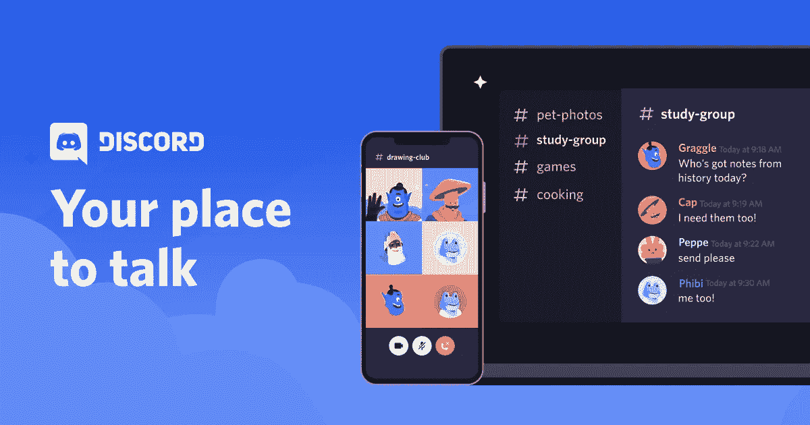

# 一些不和谐可能对医疗保健有益

> 原文：<https://levelup.gitconnected.com/some-discord-could-be-good-for-healthcare-468c76041121>

不和谐标志

当你读到这封信的时候，微软可能已经和消息服务公司[达成协议](https://discord.com/)。 *VentureBeat* [*彭博*](https://www.bloomberg.com/news/articles/2021-03-23/microsoft-said-to-be-in-talks-to-buy-discord-for-more-than-10b) 和 [*华尔街日报*](https://www.wsj.com/articles/microsoft-is-in-exclusive-talks-to-acquire-discord-11616715164) 各自很快透露出有意者是微软(也确认了可能的价格)。

我，我希望一家医疗保健公司——嘿， [TelaDoc](https://www.teladoc.com/) 和 [UnitedHealth Group](https://www.unitedhealthgroup.com/) ，我看着你呢！—在混合中。

让我们后退。如果你不是游戏玩家，你可能不知道不和谐。它于 2015 年推出，主要是作为游戏玩家的社区。最初，它专注于短信/聊天，但已经扩大了它的功能，包括音频和视频。 *The Verge* [对它的描述是](https://www.theverge.com/2021/3/26/22352028/microsoft-discord-acquisition-analysis-report):“Discord 是松散消息和缩放视频的伟大组合，结合了自由进入音频通话的独特能力。”

Zoom 遇上 Slack 遇上 Clubhouse。

正如你可能从潜在要价中推断的那样，Discord 做得相当不错。它拥有超过 1.4 亿的月用户，尽管没有广告并提供免费服务，但去年创造了 1.3 亿美元的收入(通过其“增强的不和谐体验”订阅服务 [Nitro](https://discord.com/nitro) )。好吧，它仍然没有盈利，但是 12 月的一轮融资给了它 70 亿美元的估值。

*GeekWire* [滔滔不绝](https://www.geekwire.com/2021/microsoft-want-acquire-discord-reportedly-exploring-10b-plus-sale/):

> 目前，在游戏领域，不和谐几乎是不可避免的。对于任何给定的主题，打开一个新的公共或私人 Discord 频道大约需要一分钟，包括语音聊天、图像托管和浏览器访问。

疫情有助于增长，就像它对整个游戏以及 Zoom 等服务所做的那样，但不和谐倾向于这一时刻，并扩大了它的影响范围。 [*NPR* 说](https://www.npr.org/2021/04/01/983159051/why-does-discord-not-use-ads-and-why-is-microsoft-interested-we-asked-discords-c):“一个最初为游戏玩家服务的社区，在过去的一年里已经成为几乎一切的中心:会议、卡拉 ok、读书俱乐部、集体治疗、家庭作业辅导、运动鞋交易和分析华尔街股票。”*科普* [相信](https://www.popsci.com/story/technology/introduction-discord-chat/):“如果你对一个话题感兴趣，几乎可以肯定，现在就有一部分人在不和谐地谈论它。”

Discord 首席执行官杰森·西特龙告诉 NPR:“你可以无缝地进行文本聊天、语音聊天、视频聊天，在你的手机或桌面上进行切换。它非常适合一起玩游戏、学习作业、举办在线读书俱乐部，甚至是卡拉 ok 之夜。”

他继续解释道:

> 我们调查了 20，000 名用户，问了他们一些问题，比如“人们对不和谐的最大误解是什么？”响亮的答案是，最大的误解是不和谐只用于游戏。
> 
> 因此，在 2020 年，我们重新启动了该公司，告诉世界人们如何在网上做得比玩视频游戏更多。COVID 发生的一切极大地加速了这一转变。

微软为什么想要不和是相当清楚的；它通过 Xbox 平台在游戏业务上很大，但在社交媒体领域很弱(特别是自从它收购抖音的努力似乎已经失败之后)。微软首席执行官塞特亚·纳德拉[最近在](https://www.bloomberg.com/news/articles/2021-03-24/microsoft-ceo-hunts-anew-for-creator-hub-in-discord-after-tiktok-bid-fails)告诉*彭博*:“创造，创造，创造——未来 10 年将是创造的十年，也将是消费和社区的十年，所以它不仅仅是创造。”

或者，正如 *VentureBeat* [所说](https://www.theverge.com/2021/3/26/22352028/microsoft-discord-acquisition-analysis-report)，微软的目标是“社区、社区、社区”不和有他们，微软想要他们。

虽然大多数对微软兴趣的分析都集中在游戏世界，但*[看到了](https://www.bloomberg.com/news/articles/2021-03-24/microsoft-ceo-hunts-anew-for-creator-hub-in-discord-after-tiktok-bid-fails)更广阔的领域:*

> *随着越来越多的年轻人在苹果(Apple)和谷歌(Google)等公司的操作系统、电子邮件、聊天应用和生产力软件的陪伴下成长，拥有一个受该年龄段欢迎的社区可以让他们熟悉微软，就像他们的长辈过去因为 Windows 和 Office 而熟悉微软一样。*

*这就是我用“微软”代替 TelaDoc、UnitedHealth Group 或其他医疗保健公司的地方。*

**

*医疗保健界对远程医疗充满了好感，相信疫情已经证明远程医疗的时代可能终于到来了。越来越多的人尝试了它，越来越多的医疗保健公司接受了它，越来越多的人认为它将在医疗保健的未来扮演重要角色。虚拟护理模式正在爆炸，既有 TelaDoc 或 AmWell 这样的现有模式，也有许多新的模式。*

*自从有了在线社区，患者社区就一直存在，比如 [PatientsLikeMe](https://www.patientslikeme.com/) 或一系列[脸书的患者社区](https://www.facebook.com/search/top?q=patient%20community)(尽管后者[并非没有争议](https://www.bbc.com/news/technology-47308655))。但社区建立在多方面的信息平台上，这在年轻人中很受欢迎——不，我们还没有在医疗保健领域看到这种情况。*

*人们可以使用 Discord 与他们的医生或其他医疗保健专业人员安全地传递消息，或者成为正在进行或偶尔发生的健康相关社区的一部分。它可能不是为医疗保健而设计的，但 2020 年向我们表明，不和谐很容易被采纳。*

*克里斯托夫·贾梅特，T2 聚集公司的董事总经理，告诉 T4 彭博:“微软收购 Discord 将是一个真正的战略举措——这表明微软理解在疫情背景下社区的力量。”*

*有医疗保健公司理解同样的事情吗？*

*对医疗保健更重要的是，记住不和谐是没有广告的，Citron 先生强调:*

> *从一开始，隐私就被认为是不和谐的…我们相信人们的数据就是他们的数据，人们应该感到舒适和安全地进行对话，他们的数据不会以任何不适当的方式被用来反对他们。*

*这就是我们应该期待医疗保健服务拥有的态度。*

*如果微软收购 Discord，它将面临许多挑战，特别是确保用户相信它将保持对游戏平台的不可知论，而不是(公开)青睐 Xbox。*雅虎财经* [说](https://finance.yahoo.com/news/microsoft-could-finally-be-the-king-of-gaming-if-it-spends-10-billion-on-discord-195915936.html):“通过继续提供不和谐的中立服务，微软可以从游戏玩家那里获得更多的好感，同时也让自己的名字出现在 PlayStation 和任天堂玩家面前。”*

*医疗保健版的说法可能是:“通过继续提供不和谐的中立服务，联合健康集团可以在 CVS/Aetna 和 Anthem 成员面前赢得更多患者的好感，同时也获得自己的名字。”*

*我长期以来一直主张，医疗保健迫切需要通过向游戏世界学习并找出如何吸引年轻人(他们可能尚未积极参与医疗保健系统)来为未来做准备。医疗保健公司收购 Discord 可以通过一次收购实现这两个目标。*

*然而，问题是:哪家医疗保健公司看到了这样的未来——并准备为不和而出价高于微软？*