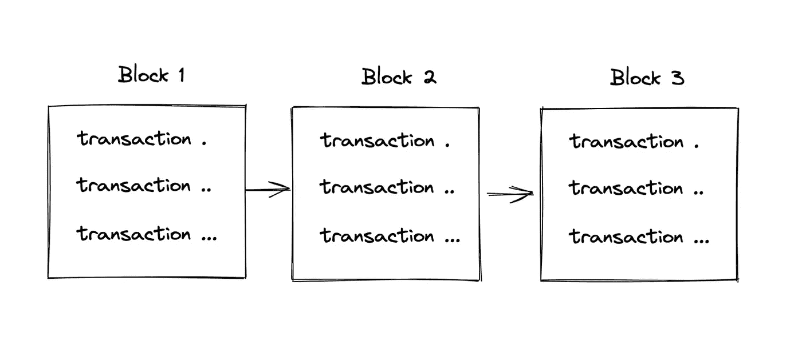
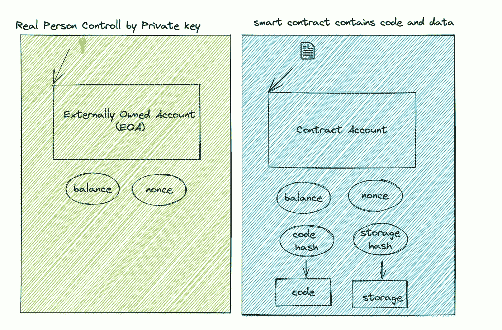
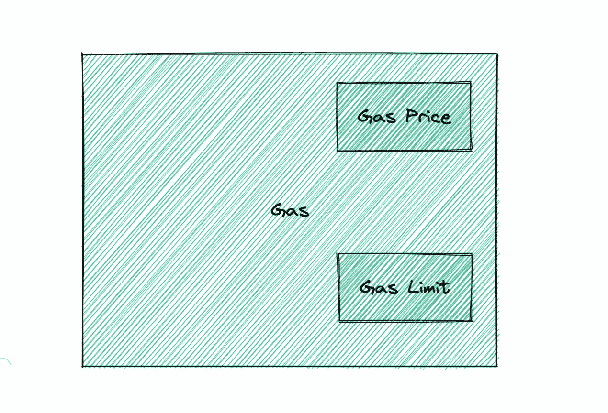

# 你需要知道的一些以太坊术语

> 原文：<https://levelup.gitconnected.com/some-ethereum-terms-you-need-to-know-65c6366e6569>

在以太坊，有太多的新名词需要学习。在本文中，我们将讨论最重要的以太坊术语。

现在让我们开始吧！

## 1.区块链

区块链是一种共享数据库，它存储信息的方式不同于典型的数据库；区块链将数据存储在通过加密技术链接在一起的块中。

区块链

## 2.非同质化通证

不可替换令牌是由 ERC-721 提案引入的令牌标准。

它通常用于表示独特资产的集合；令牌 ID 唯一地标识了每一个。

它们不像 ERC20 令牌那样可以互换。

非同质化通证

## 3.账户

它是一个包含地址、余额、随机数、可选存储和代码的对象。帐户可以是外部拥有的帐户(EOA)或合同帐户。

EOA 是一个普通账户，拥有私钥的所有者可以用它来发送交易。

合约账户包含从另一个账户(EOA 或合约)接收交易时执行的代码。

## 4.气体和气体限制

气体是以太坊用来执行智能合约的虚拟燃料。它用于控制事务可以使用的资源量。

以太坊的气价和气限

天然气不是以太——它是一种独立的虚拟货币，与以太有自己的汇率。汇率是**气价**。

**气体限制**定义了交易可以使用的气体的最大数量。标准 ETH 传输需要 21，000 单位气体的气体限制。

## 5.名人

*   中本聪:设计比特币的无名之辈。
*   Vitalik Buterin:以太坊的联合创始人和发明者，
*   加文·伍德:英国程序员，以太坊的联合创始人和前首席技术官

我希望你喜欢读这篇文章😄。如果你想支持我☕作为一个作家，考虑报名参加[成为一个媒体成员](https://jerryan.medium.com/membership)。你还可以无限制地访问媒体上的每个故事。