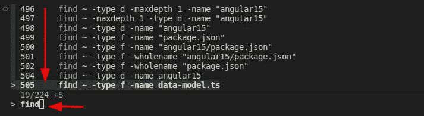

# 一些 Linux 命令可以显著提高你的工作效率

> 原文：<https://levelup.gitconnected.com/some-linux-commands-that-can-boost-your-work-efficiency-dramatically-9dc802a10618>

## 从实际例子中学习一些方便和高级的 Linux 命令


[加布里埃尔·海因策在 Unsplash 拍摄的图片](https://unsplash.com/photos/4Mw7nkQDByk)

作为一名软件开发人员，Linux 命令是必备的技能。尽管您可能使用 Windows 或 macOS，但您总会发现需要 Linux 命令的场合。例如，大多数 Docker 映像都是基于 Linux 系统的。你需要擅长 Linux，至少一些常用命令，才能进行 DevOps 的工作。

在本帖中，我将介绍一些我每天都会用到的命令。如果您是 Linux 新手，或者如果您想更新或提高 Linux 命令的知识，这篇文章会很有帮助。然而，这篇文章不会关注像`cd`或`ls`这样非常基础的东西，而是一些从实践中学到的更高级的东西。

## 自定义 bash 提示符

好吧，这个话题本身就是一篇冗长的文章。然而，我们不需要什么都学。在大多数情况下，我们只需要改变`PS1`变量，它指定了每个命令之前显示的内容。如果不改的话，它会在提示里显示路径，这在我们深入一个文件夹的时候非常不方便。我更喜欢在提示符下只显示用户名和当前文件夹，可以用以下命令设置:

```
export PS1="[\u@\W]\$"
```

这里`\u`代表当前用户名，`\W`代表当前工作目录。`[`、`]`和`@`按原样显示。对于`\$`，如果当前用户不是 root，则显示`$`，否则显示`#`。更多代码可在[这里](https://www.cyberciti.biz/tips/howto-linux-unix-bash-shell-setup-prompt.html)找到。

注意，如果您想保持更改，该命令和下面显示的命令应添加到`~/.bashrc`。如果你对`~/.bashrc`和`~/.bash_profile`、[感到好奇，这个](https://superuser.com/questions/183870/difference-between-bashrc-and-bash-profile)是一个很好的线程。

## 查找文件或文件夹

查找文件或文件夹是一个非常常见的请求，可以通过`find`命令完成:

```
# Find a file:
find ~ -type f -name data-model.ts

# Find a folder:
find ~ -type d -name angular15
```

请注意，第一个参数是查找目标文件或文件夹的路径。如果未指定，类型默认为文件。

这似乎有点太简单了😏。让我们做一些更复杂的事情。让我们找到一些文件，并计算每个文件的行数:

```
# Find all the .html files and count the number of lines for each file:
find src/app/ -name "*.html" -exec wc -l {} \;
```

注意这里的*魔法*语法。`-exec`为每个找到的文件指定一个运行的命令。花括号`{}`是找到的文件的占位符，转义分号`\;`用于防止 shell 解释命令。为此，我们也可以使用加号`+`:

```
find src/app/ -name "*.html" -exec wc -l {} +
```

输出会略有不同。如果命令以`+`结束，总数将被打印出来。

## 更改文件和文件夹的权限

更改文件/文件夹权限也是一项常见任务。我们很容易与许可代码混淆。[这篇文章](https://www.multacom.com/faq/password_protection/file_permissions.htm)很好地解释了许可代码和不同的组合。这里我们将只展示最常见的几种:

```
# Share a folder with others so they can check the contents in the folder:
chmod 755 <path-to-your-folder>

# Share a non-executable file with others:
chmod 644 <path-to-your-file>

# Share an executable file with others:
chmod 755 <path-to-your-file>

# Make a file read only:
chmod 400 <path-to-your-file>

# Make a file executable:
chmod +x <path-to-your-file>
```

建议检查[该位置](https://www.multacom.com/faq/password_protection/file_permissions.htm) t 的代码含义，此处不再赘述。

## 自定义`rm`将文件移至垃圾桶

如果您不小心删除了 Linux 系统上的一些文件，恢复它们将非常困难。因此，设置`rm`命令将文件或文件夹移动到垃圾箱而不是删除它们是一个安全的策略。我们可以在以后需要的时候倒垃圾。

这种定制可以通过别名来完成，别名在 Linux 上是一个非常方便的工具(稍后将详细介绍):

```
alias rm='gio trash'
```

## 使用别名来节省一些打字

如果您有一个带有许多参数的长命令，或者如果您有应该一起执行的链式命令，使用别名非常方便:

```
# Set aliases for long commands:
alias dc="docker compose"
alias prettier="npx prettier -w"
alias eslint="npx eslint --fix"
alias pre="pre-commit run --files"

# Chain some commands together:
alias update-container="docker-compose pull <service-name> && docker-compose stop <service-name> && yes | docker-compose rm <service-name> && docker-compose up -d <service-name>"
```

## 用`awk`从输入中提取数据

`awk`是 Linux 中非常强大的工具。您甚至可以用`awk`编写脚本，尽管可读性和维护性的问题是另一回事。作为软件开发人员，我们通常使用`awk`从输入文件或之前命令的输出中获取我们需要的字段。

例如，让我们*ping*google.com，并获得每次 ping 的时间:

```
ping google.com -c 2 | grep -iE 'time=.*ms' | awk 'BEGIN {FS="="} {print $NF}'
```

此命令的重要注意事项:

*   我们使用`-iE`为`grep`指定一个正则表达式，因此只有与模式匹配的消息才会被进一步处理。
*   对于`awk`，`BEGIN`表示在处理文本之前要执行的命令。这里，我们指定字段分隔符(`FS`)应该是等号。此外，`NF`代表字段的数量，`$NF`将返回最后一个字段。[这个](https://www.howtogeek.com/562941/how-to-use-the-awk-command-on-linux/)是`awk`很好的参考，如果你想了解更多的话。

上述命令也可以简化如下:

```
ping google.com -c 2 | grep -iE 'time=.*ms' | awk -F"=" '{print $NF}'
ping google.com -c 2 | awk -F"=" '/time=.*ms/ {print $NF}'
```

在这些简化版本中，我们利用了`awk`的另外两个特性:

*   可通过`-F`选项直接指定字段分隔符。
*   正则表达式模式也可以在花括号前的`awk`中指定。

## 用 xargs 链接命令

我们已经展示了`-exec`选项可以用来链接`find`命令的命令。一个更好的工具是`xargs`，它可以用来以更灵活的方式链接任何命令。

```
# Check the size of each file in the current folder:
ls | xargs -I % du -sh %

# Find some files and copy them to a new location:
find ~/Downloads/ -name "*.jpeg" | xargs -I {} cp {} ~/Pictures/

# Change the permissions of all folders and subfolders to 755:
find . -type d | xargs -I {} chmod 755 {}

# Change the permissions of all files in the current folder and subfolders to 644:
find . -type f | xargs -I {} chmod 644 {}
```

注意，`-I`选项指定了一个可以在任何需要的地方使用的占位符。占位符可以是任何有效的字符串，其中最常见的是`%`和`{}`。

## 为脚本传递变量

有时我们需要为脚本传递一些变量。这些变量可以在命令运行脚本之前在命令行上指定。例如:

```
# some_script.sh
echo mysql -u ${USERNAME} -p${PASSWORD}

# On the command line:
USERNAME=johndoe PASSWORD=12345 bash some_script.sh
```

这对于在一些云环境中运行的一些脚本来说尤其重要，比如 [Cloud Build](https://lynn-kwong.medium.com/build-a-docker-image-with-cloud-build-in-google-cloud-platform-5f6840af2c05) 中可以自动注入变量。

如果一个脚本需要很多变量，那么在命令行中指定所有变量就变得很麻烦。在这种情况下，它们可以存储在一个文件中，并在运行脚本时获取:

```
# variables.env
USERNAME=johndoe
PASSWORD=12345

# On the command line:
env $(grep -v '^#' variables.env | xargs) bash some_script.sh
```

注意，使用该命令，变量从目标文件中读取(不包括注释),并使用`xargs`命令执行。`env`命令用于在修改后的环境中运行脚本，而不是在当前的 shell 环境中。

## 重定向标准输出和标准错误

命令的输出和错误被写入标准输出(STDOUT)和标准错误(STDERR)。STDOUT 和 STDERR 的文件描述符分别是 1 和 2。默认情况下，STDOUT 和 STDERR 都指向控制台。但是，我们可以将它们重定向到一个文件或 void (/ `dev/null`)来丢弃它们。

```
# Let's assume existing.txt exists, whereas non-existing.txt does not.

# Redirect STDOUT to a file. This is the most common use case.
ls -al existing.txt 1>out.log
# The file descriptor for STDOUT is optional.
ls -al existing.txt >out.log

# Redirect STDOUT to a file and STDOUT to another file.
ls -al existing.txt non-existing.txt 1>out.log 2>error.log

# Rdirect both STDOUT and STDERR to the same file:
ls -al existing.txt non-existing.txt 1>combined.log 2>&1
# And it can be simplified as:
ls -al existing.txt non-existing.txt &>combined.log

# Ignore the output and error of the command:
ls -al existing.txt non-existing.txt 1>/dev/null 2>&1
ls -al existing.txt non-existing.txt &>/dev/null
```

注意，并不是所有的 shells 都支持`&>`语法。它由常用的 BASH 支持。

## 命令行模糊查找器

我们可以按下 **CTRL-R** 找到我们使用过的历史命令。但是默认情况下，我们输入的时候它只显示一条命令，不方便找到我们想要的那条。

幸运的是， [***fzf***](https://github.com/junegunn/fzf) 大幅增强了 CTRL-R 的功能。 *fzf* 是一个通用命令行模糊查找器，支持历史命令的模糊搜索。最重要的是，它将匹配的命令显示为一个列表，这使得找到我们想要的命令变得非常方便:



*fzf* 的[安装](https://github.com/junegunn/fzf#installation)非常简单:

```
# Linux:
git clone --depth 1 https://github.com/junegunn/fzf.git ~/.fzf
~/.fzf/install  # You can accept all the default settings.

# MacOS:
brew install fzf
$(brew --prefix)/opt/fzf/install
```

如果你以前从未尝试过 fzf，绝对值得一试，你会立刻爱上它😍。

在这篇文章中，介绍了一些方便的 Linux 命令，如果你还不知道它们，它们可以提高你的效率。不可能在一篇文章中涵盖所有的 Linux 命令。然而，我们不需要学习所有的东西，通常只需要学习我们工作中真正需要的东西。希望这篇帖子能对你的工作有所帮助。

## 相关文章:

*   [学习方便的 Vim 命令和操作，可以显著提高您的效率](https://medium.com/geekculture/common-vim-commands-and-operations-that-i-want-to-share-3b7fbc3d7ee9)
*   [使用谷歌云平台中的云构建功能自动构建 Docker 映像](https://lynn-kwong.medium.com/build-a-docker-image-with-cloud-build-in-google-cloud-platform-5f6840af2c05)

# 分级编码

感谢您成为我们社区的一员！在你离开之前:

*   👏为故事鼓掌，跟着作者走👉
*   📰查看[升级编码出版物](https://levelup.gitconnected.com/?utm_source=pub&utm_medium=post)中的更多内容
*   🔔关注我们:[Twitter](https://twitter.com/gitconnected)|[LinkedIn](https://www.linkedin.com/company/gitconnected)|[时事通讯](https://newsletter.levelup.dev)

🚀👉 [**加入升级人才集体，找到一份神奇的工作**](https://jobs.levelup.dev/talent/welcome?referral=true)