# 让你的 VS 代码更高效的一些技巧

> 原文：<https://levelup.gitconnected.com/some-tips-to-make-your-vs-code-more-efficient-db77ec7071f8>

## VS 代码可以比你想象的更友好

可以用来写 Python 代码的 ide 有很多，比如 Visual Studio Code (VS Code)、PyCharm、Atom、Spyder、IntelliJ IDEA 等。在过去，我尝试并使用了几种不同的 ide，最终改用 VS 代码来编写 Python 代码。我更喜欢 VS 代码，因为它使用起来非常简单，设置非常灵活，有大量的第三方扩展，有很大的社区等等。开始用的时候可以发现更多的优点。

然而，如果您是 VS 代码的新手，并且没有正确地设置它，您可能会发现它有时非常烦人，并且可能不像您期望的那样方便，尤其是当您已经习惯了其他一些 ide 时。在这篇文章中，我将分享一些我在过去几年中得到的关于 VS 代码的技巧。如果你已经开始使用 VS 代码并且还不太满意，这篇文章可以让你更有效地使用它并且更喜欢它。


图片来自 [Pixabay](https://pixabay.com/photos/engineer-engineering-computer-4904884/) 。

**提示 1 —禁用预览模式**。

默认情况下，当你从左边栏的文件浏览器或者通过 **Ctrl + P** 打开一个文件时，文件会以**预览**模式打开。当您打开另一个文件时，以前以预览模式打开的文件将被关闭，新文件将以预览模式打开。预览模式下标签的标题为*斜体*。如果你想编辑一个文件，你需要双击边栏或标签中的文件名。

我个人觉得预览模式很讨厌，一直禁用。如果你也想禁用预览模式，可以点击**文件** = > **首选项** = > **设置**，搜索“禁用预览”。然后取消选中选项以启用预览。

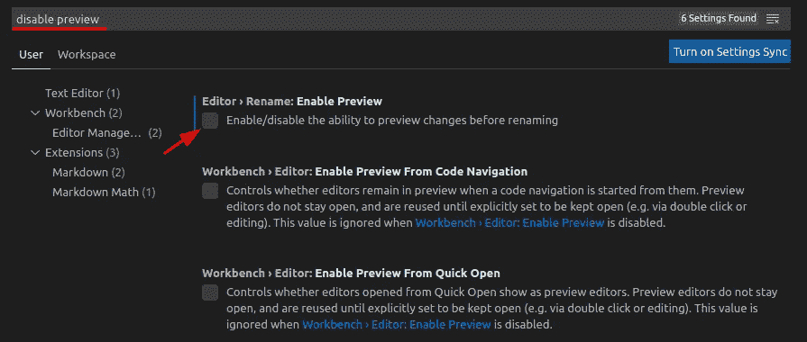

**提示 2 —安装 Python 扩展**。

Python 扩展为 Python 提供了丰富的支持，包括智能感知(Pylance)、林挺、调试、代码导航、代码格式化、重构、变量浏览器、测试浏览器等功能！

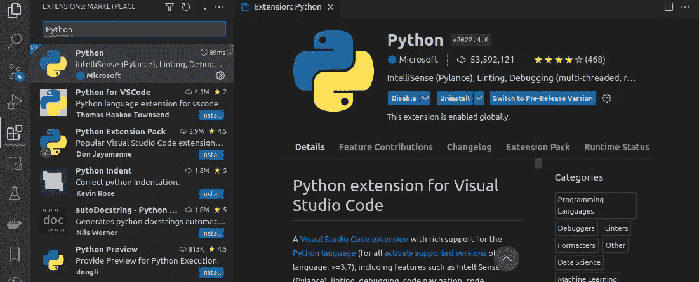

**提示 3 —安装材质图标主题扩展**。

材质图标主题扩展基于文件浏览器中的文件扩展名显示文件图标。

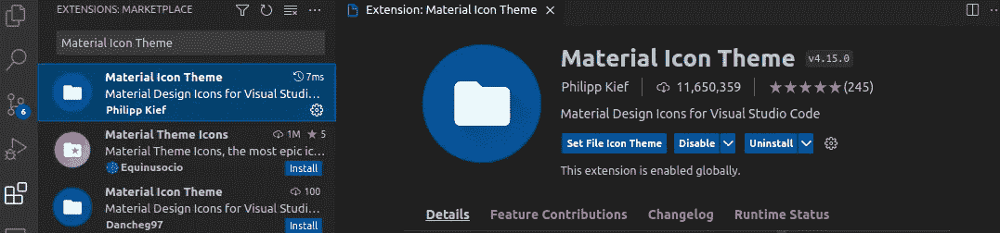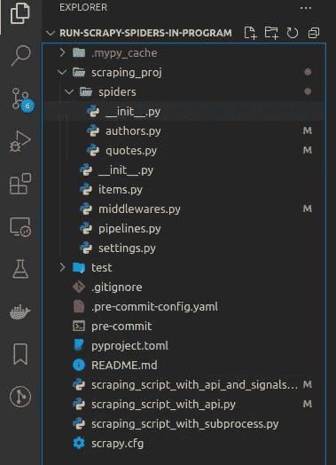

根据文件扩展名显示文件图标。

**提示 4—使用 Ctrl + P 查找文件，使用 Ctrl + Shift +P 查找设置。**

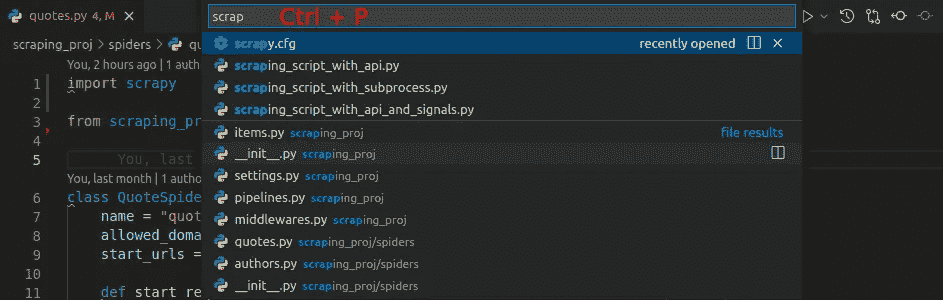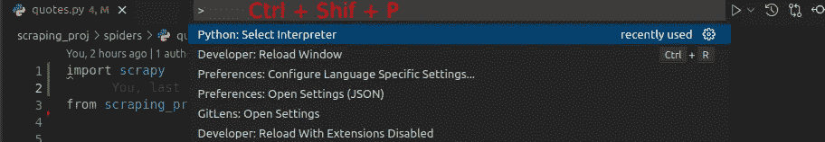

技巧 5——为你的编辑器设置标尺。

根据 PEP8，注释应该在 [72](https://realpython.com/python-pep8/#maximum-line-length-and-line-breaking) 字符处换行，在 [79](https://realpython.com/python-pep8/#maximum-line-length-and-line-breaking) 处编码。编辑器中有一些标尺会很有帮助，可以帮助您将注释或代码换行到相应的长度。

按 Ctrl + Shift +P，然后搜索“设置”，再选择“首选项:打开设置(JSON)”:


将`"editor.rulers": [72, 79]`添加到 JSON 文件的末尾，保存文件，然后您会看到标尺:

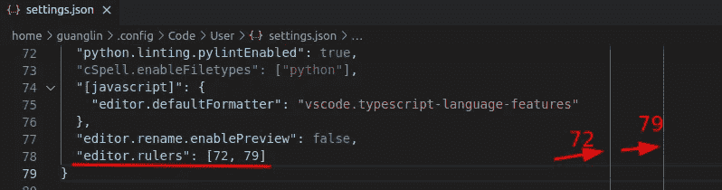

**提示 6——学会使用“查找所有推荐人”。**

我们通常需要检查整个存储库中某个函数或类的出现情况。这可以通过“查找所有引用”实用程序来实现。它可以通过三种方式触发:

1.  右键单击函数/类，然后选择“查找所有引用”。

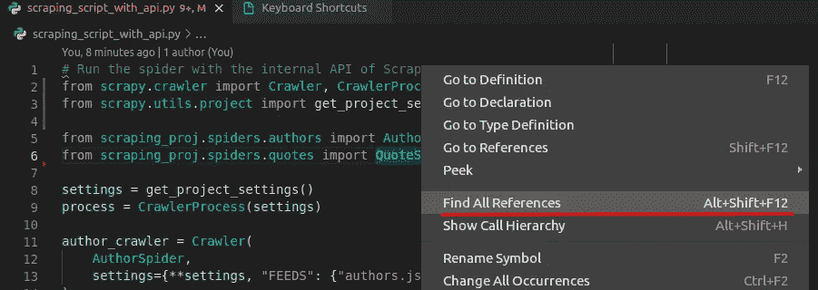

2.将鼠标放在函数/类上，然后按 Alt + Shift + F12。

3.按下 **Ctrl + Shif + F** ，然后搜索函数/类，或任何您想要搜索的内容:

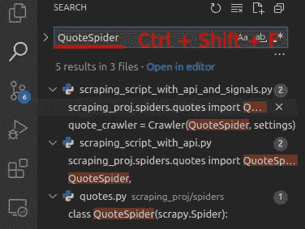

**提示 7 —以不同的方式打开定义。**

你可以用三种方式打开函数/类的定义。

1.  将鼠标放在函数/类上，然后按 F12，如果预览模式被禁用，定义将在同一窗口的不同选项卡中打开。
2.  按住 Ctrl 键，然后左键单击函数/类。它与上面的方式 1 具有相同的效果。
3.  按住 **Alt + Ctrl** 键，左键单击函数/类，定义将在新窗口中打开。这是首选方式，因为可以更方便地并排检查和比较代码。

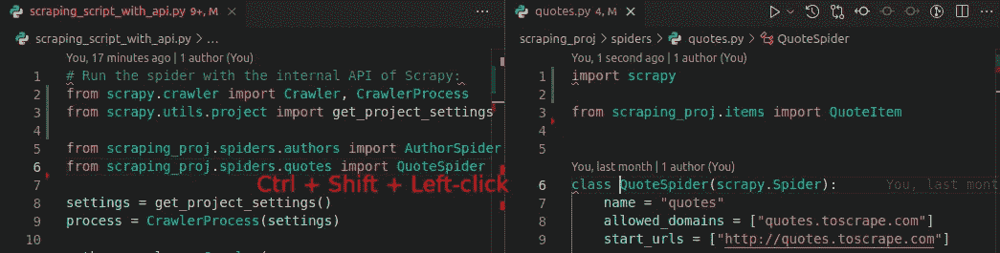

**提示 8 —从虚拟环境中选择一个 Python 解释器。**

您可以使用 *venv* 或 *conda* 创建[虚拟环境](https://lynn-kwong.medium.com/how-to-create-virtual-environments-with-venv-and-conda-in-python-31814c0a8ec2)，并在 VS 代码中选择相应的一个作为 Python 解释器。通常，VS 代码可以自动识别环境。如果没有，您需要输入解释器路径，这是您的虚拟环境中 python 可执行文件的路径。如果不选择虚拟环境，安装在其中的第三方库就无法被 VS 代码理解，也无法进行相应的着色。此外，您将无法检查第三方库的源代码。

要选择 Python 解释器，按 Ctrl + Shift + P，选择“Python:选择解释器”。

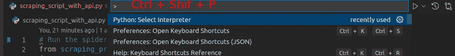

然后为您的项目选择一个虚拟环境。推荐使用 [*conda*](https://lynn-kwong.medium.com/how-to-create-virtual-environments-with-venv-and-conda-in-python-31814c0a8ec2) 创建一个虚拟环境，因为你可以在不同的环境下安装不同版本的 Python。

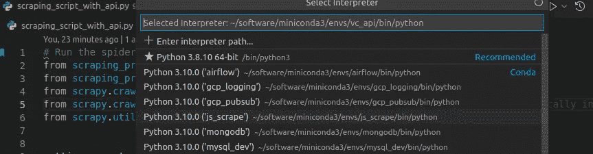

**提示 9—为 VS 代码设置** `**PYTHONPATH**` **，以便导入本地模块。**

如果您不能导入本地包或模块，您需要将包或模块的路径添加到特殊的环境变量`PYTHONPATH`，该变量用于将额外的目录添加到`sys.path`目录列表中。作为一种普遍适用的情况，您可以将当前文件夹及其父文件夹添加到`PYTHONPATH`，这将使当前文件夹中的所有模块和包以及当前文件夹本身可导入到您的 Python 代码中:

```
$ export PYTHONPATH=$PYTHONPATH:.:..
```

这个命令将使`PYTHONPATH`只在当前的 shell 中有效，如果你想让它在每个新的 shell 中都有效，你可以把它添加到`$HOME/.bashrc`。

**提示 10——创建自己的代码片段。**

如果你使用 *pdb* 或 *rpdb* 模块来[调试你的 Python 代码](https://lynn-kwong.medium.com/how-to-debug-python-scripts-and-api-code-in-the-console-and-in-vs-code-a0b825ad7d41)，你可能已经厌倦了反复设置断点。幸运的是，在 VS 代码中，您可以创建自己的代码片段来省去重复键入的工作。

要创建代码片段，请选择**文件** = > **首选项** = > **用户片段**。然后选择“python.json ”,因为我们将为 python 创建代码片段。将为您创建一个模板 JSON 文件，其中包含一个解释如何创建代码片段的大注释。通常我们不需要创建带有制表位和占位符的复杂代码片段。如果你有，你可能想在[官方页面](https://code.visualstudio.com/docs/editor/userdefinedsnippets#_create-your-own-snippets)上了解更多。

让我们创建两个代码片段，分别为 *pdb* 和 *rpdb* 库插入断点。在“python.json”中添加以下代码:

*   `prefix` —定义一个或多个触发字，显示 VS 代码中的代码片段。
*   `body` —一行或多行内容，插入后将连接成多行。
*   `description`—VS 代码中显示的代码片段的可选描述。

保存“python.json”。然后，您将能够创建用于插入调试断点的代码片段:

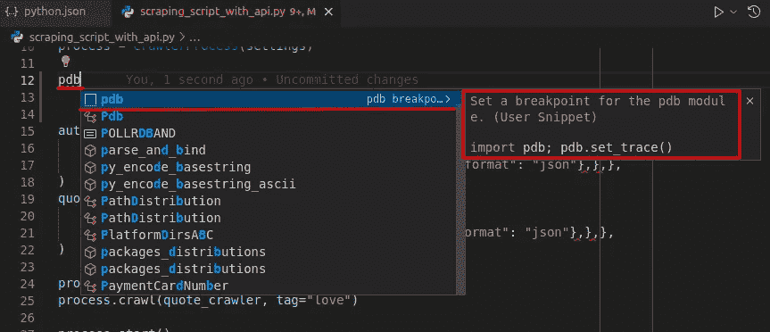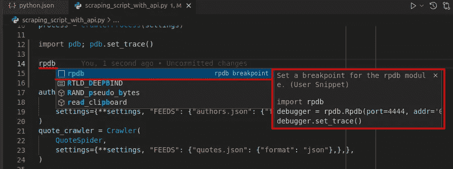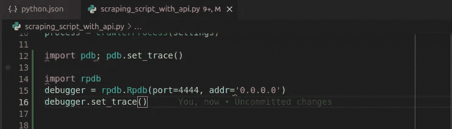

**提示 11——按 Ctrl K，Ctrl I 显示 VS 代码中警告和错误的悬停。**

有时候，当你把鼠标放在上面时，VS 代码中的警告和错误不会显示出来，特别是当你安装了多个 linters 的时候。在这种情况下，可以按 Ctrl K、Ctrl I(先按 Ctrl +K，再按 Ctrl +I)来显示警告或错误。

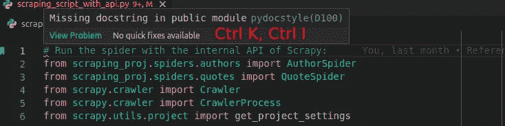

**提示 12 —在 VS 代码中使用*黑色*、*皮林*和 *mypy* 。**

VS 代码支持 Python 的各种格式化器和 linters，它们可用于在开发的早期阶段格式化和修复 Python 代码。建议按照[这篇文章](https://lynn-kwong.medium.com/use-black-mypy-and-pylint-to-make-your-python-code-more-professional-b594512f4362)在 VS 代码中设置不同的格式化器和 linters，这样可以让你的代码更加专业。

**提示 13 —在 VS 代码中调试 API 代码。**

你可以方便地在 VS 代码中调试你的 API 代码。您的 API 服务器可以在本地或远程运行。如果你想在 VS 代码中调试你的 API 代码，请查看这篇文章。

我们已经介绍了几个使用 VS 代码编写 Python 代码的技巧。本文并不打算面面俱到，而只是涵盖从实践经验中获得的最常见的技巧，这些技巧也可能显著提高您的效率。对于作者本人也是一个参考，尤其是从零开始重装 VS 代码的时候。将来可能会添加更多提示。

相关文章:

*   [如何在控制台和 VS 代码中调试 Python 脚本和 API 代码？](https://lynn-kwong.medium.com/how-to-debug-python-scripts-and-api-code-in-the-console-and-in-vs-code-a0b825ad7d41?source=your_stories_page----------------------------------------)
*   [使用 black、mypy、pylint 让你的 Python 代码更专业。](https://lynn-kwong.medium.com/use-black-mypy-and-pylint-to-make-your-python-code-more-professional-b594512f4362?source=your_stories_page----------------------------------------)