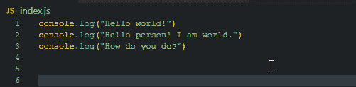

# 一些 Visual Studio 键盘快捷键(Windows 和 Mac)

> 原文：<https://levelup.gitconnected.com/some-visual-studio-keyboard-shortcuts-windows-and-mac-4b9cea38cbf6>

> 我总是选择一个懒惰的人去做一件困难的工作，因为一个懒惰的人会找到一个简单的方法去做。老弗兰克·吉尔布雷斯

编码的基础是以有效的方式解决问题。键入最少的代码行来完成最多的工作基本上是每个软件开发人员的心态。不是懒的问题，而是高效的问题。作为一名编程学生，我希望有人教过我一些我的导师和教练用来提高编码效率的小技巧。

以下是我学会的一些简单快捷方式，可以改善我使用 visual studio 代码的体验:

**快捷方式索引**

*作为 Windows 和 Mac 用户，两种快捷方式都会提供。
使用[* ***命令****]+[****F****](****Ctrl****]+[****F****)快速找到你需要的快捷方式！*

*   创建新文件
*   开放终端
*   移动代码行
*   复制当前行并粘贴(向上/向下复制行)
*   注释掉代码段
*   在代码段中进行注释
*   切换注释
*   更改标签
*   导航到顶部或底部
*   缩进/突出
*   查找匹配的括号
*   多重选择/编辑
*   放大/缩小
*   搜索

**创建新文件**

按[ **命令** ] + [ **N** ]创建一个新文件。按[ **命令**]+[**shift**]+[**N**在另一个窗口中创建一个新文件。对于 Windows:[**Ctrl**+[**N**]和[**Ctrl**]+[**Shift**]+[**N**。

**打开端子**

按[ **控制键** ] + [ **`** ]打开您的终端。对于 Windows:[**Ctrl**]+[**`**。

**新端子**

按[ **命令**]+[**shift**]+[**`**。对于 Windows:[**Ctrl**]+[**Shift**]+[**`**。

**移动代码行**

按[ **选项** ] + [ **向上**或[ **向下**箭头键移动代码。对于 Windows:[**Alt**]+[**Up**]或[ **down** ]。

对于多行也可以这样做。

**复制当前行并粘贴(向上/向下复制行)**

按[ **选项**+[**shift**+[**up**或[ **down** 复制并粘贴当前行到高亮显示的行的上方或下方。对于 Windows:[**Alt**]+[**Shift**]+[**Up**或[ **Down** 。

**注释掉代码段**

高亮显示文本后，按[ **命令**]+[**K**]+[**C**注释掉文本。对于 Windows:[**Ctrl**]+[**K**]+[**C**。

**在代码段中回注释**

高亮显示文本后，按[ **命令**]+[**K**]+[**U**]返回文本注释。对于 Windows:[**Ctrl**]+[**K**]+[**U**]。

**切换注释**

打开/关闭行注释的更简单的方法是:按[ **命令** ] + [ **/** 。对于 Windows:[**Ctrl**]+[**/**]。

**导航到顶部或底部**

按[**command**]+[**up**]或[ **down** ]导航到文件的顶部或底部。对于 Windows:[**Ctrl**]+[**Home**或[ **End** ]

**缩进/突出**

按[ **命令** ] + [ **[** ]或[ **]** 。对于 Windows:[**Ctrl**]+[**[**]或[ **]** ]

**找到匹配的支架**

按[**command**]+[**shift**]+[**\**]找到与高亮显示的括号匹配的括号。对于 Windows:[**Ctrl**]+[**Shift**]+[**\**]

**多重选择/编辑**

按住[ **选项**，点击您想要放置另一个光标的位置。要删除多选，只需单击窗口中的其他位置。对于 Windows:按住[ **Alt** ]。

**放大/缩小**

按[ **命令**+[**+**或[ **—** ]进行放大/缩小。对于 Windows:[**Ctrl**+[**+**]或[ **—** ]

**搜索**

按[ **命令** ] + [ **F** ]打开您的搜索栏。搜索词在整个文件中突出显示。对于 Windows:[**Ctrl**]+[**F**

我希望这有所帮助。当然，这些只是一小部分可用于 Visual Studio 代码的快捷方式。我鼓励你继续寻找其他方法成为一个更高效的程序员，并寻找更多的捷径来帮助改善你的工作流程！