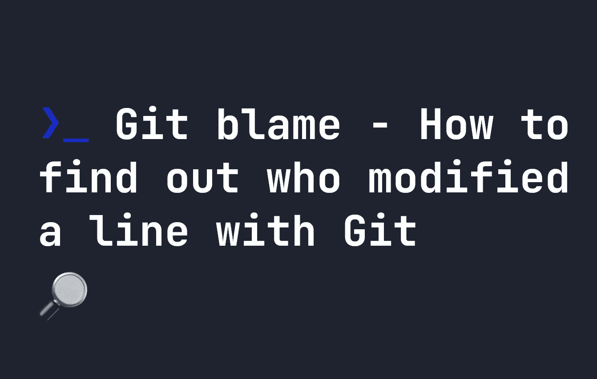

# Git 责备——如何找出谁用 Git 修改了一行

> 原文：<https://levelup.gitconnected.com/sometimes-a-single-line-breaks-your-code-and-you-want-to-find-the-perpetrator-be6ba42b195b>



你是否曾经在你的代码中发现一个导致代码行改变的 bug，并且想知道是谁对代码行进行了改变？**幸运的是，git 有一个针对那个**的命令！让你选择一个文件并显示谁最后修改了每一行。如果您想知道，它被称为`git blame`,因为它允许您为正在调查的代码破坏行分配责任。

要找出是谁修改了一行，只需运行下面的命令，其中`myfile.txt`是您想要检查的文件:

```
git blame myfile.txt
```

如果你对`git blame`的格式感兴趣，它是这样分解的:

```
^665221a (Johnny Simpson 2022-04-30 20:58:04 +0100  10) import { v4 as uuid } from 'uuid';
^          ^                                         ^
|          |                                         |
Commit ID  |                                     Line number
           |
         Author and timestamp
```

# 在特定行上使用 git 责备

这真的很有用，但是如果你想在一个特定的行上磨练，你可以使用`-L`选项。例如，如果您想查看第 1 行和第 5 行之间的更改历史，您可以执行以下操作:

```
git blame index.js -L 1,5
```

或者，如果您想要查找第 20 行和第 40 行之间的更改历史，您可以执行以下操作:

```
git blame index.js -L 20,40
```

# 其他有用的 git 责备选项

还有一堆其他有用的`git blame`选项，你可能想用。以下是我最常用的一些，以及它们的作用。

# 显示带有 git 责备的作者的电子邮件

您只需使用`-e`选项来显示作者的电子邮件地址:

```
git blame index.js -e
```

产生这样的输出:

```
^665221a (<some@email.com> 2022-04-30 20:58:04 +0100   8) import { fileURLToPath } from 'url'
```

# 用 git 责备忽略 whitepsace

如果您的代码包含大量空白，您也可以用`git blame`忽略空白。为此，您可以使用`-w`选项:

```
git blame index.js -w
```

# 使用 git 责备格式化带颜色的线条

默认情况下，`git blame`生成白色或黑色文本墙。如果您想用颜色区分不同的提交和变更，您可以使用`--color-lines`或`--color-by-age`:

*   `--color-lines`如果前一行是不同的提交，则对行着色。
*   `--color-by-age`颜色线条由年龄决定。

# 显示带有 git 责备的文件名

要用`git blame`显示文件名，使用`-f`选项。这将显示文件名以及提交 ID。

```
git blame index.js -f
```

将产生如下输出:

```
^665221a index.js (Johnny Simpson 2022-04-30 20:58:04 +0100  16) import dotenv from 'dotenv'
```

# 显示自下而上的行变化(反向),带有 git 责备

您也可以用`git blame`反向显示线条变化，意思是从底部开始向上。只需在命令中添加`--reverse`选项:

```
git blame index.js --reverse
```

# 分级编码

感谢您成为我们社区的一员！在你离开之前:

*   👏为故事鼓掌，跟着作者走👉
*   📰查看[级编码出版物](https://levelup.gitconnected.com/?utm_source=pub&utm_medium=post)中的更多内容
*   🔔关注我们:[推特](https://twitter.com/gitconnected) | [LinkedIn](https://www.linkedin.com/company/gitconnected) | [时事通讯](https://newsletter.levelup.dev)

🚀👉 [**加入升级人才集体，找到一份惊艳的工作**](https://jobs.levelup.dev/talent/welcome?referral=true)