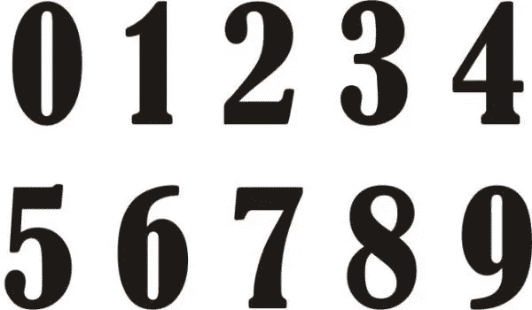

# Python 中的排序元素

> 原文：<https://levelup.gitconnected.com/sort-elements-in-python-817a0c2b810b>

**容器**是包含其他对象的对象。列表、元组或集合是 Python 中内置容器的例子。这些容器可以包含其他容器(嵌套列表)或其他对象(字符串、整数或浮点)。集合模块提供了内置容器的其他替代方法，在 Python 中编程时非常有用。

容器(以及一般的对象)有两个关键方面需要牢记在心:**可变性**和**顺序**。**可变性**指改变对象值的可能性。**可变对象**可以改变它们的值，而不可变对象不能被改变。例如，我们可以修改一个列表的第一个元素，赋予一个新的值，但是如果我们试图对一个元组做同样的事情，我们会得到一个 typeError，因为元组是不可变的；不能修改它们的值。同样的，我们在试图修改一个字符串的字符时得到一个错误，这是什么意思？这意味着字符串也是不可变的。😄

要考虑的第二个方面是**顺序**。对象可以是有序的(顺序定义的)，也可以是无序的元素序列(顺序未定义的)，我们只关心对象是否包含元素，而不关心它的位置。有序对象可以被索引和切片；例如，我们可以通过位置来访问列表或元组中的元素。同样，我们可以获得一个字符串的一个字符(或多个字符)来提供它的位置(记住 Python 中的索引是从 0 开始的)。相反，如果我们试图访问集合中的一个元素，我们会得到一个 TypeError 异常，因为元素在集合中没有特定的位置。

在这一点上，在开始解决如何在 Python 中对元素进行排序之前，您可能会问自己为什么会有这样的解释😆。事实是，**可变性**和**顺序**是正确理解我们如何对不同容器的元素进行排序的两个关键方面。现在让我们开始吧！💪

# 对列表中的元素排序

## 排序函数

一个**列表**是一个**可变有序**元素序列。为了对列表中的元素进行排序，我们可以同时使用**排序函数**和**排序方法**。**排序函数**返回一个排序列表，但提供给该函数的列表保持不变。

**排序函数**的语法如下:

> *已排序(iterable[，key][，reverse])*

第一个参数是我们想要排序的 **iterable** (在本例中是一个列表)。正如我们将在后面看到的，我们可以使用其他的可迭代对象，比如元组、字典或带有 sorted 函数的集合。以下两个参数，**键**和**反转**是可选的，允许我们进行更复杂的排序。我们稍后也会看到这一点！💪 😍

## 排序方法

与**排序函数**不同的是，**排序方法**就地对列表进行排序，返回 None。

sort 方法具有以下语法和两个可选参数: **key** 和 **reverse** 。

> *list.sort(key=…，reverse=…)*

通过下面的例子，我们可以更好地理解**排序函数**和**排序方法**如何对列表中的元素进行排序。

我们可以对列表元素进行排序，因为**列表**是**有序**容器。此外，我们可以就地排序元素，因为列表是可变的。我们可以改变它们的元素。

## 附加参数:反向和键控

**排序函数**和**排序方法**都以升序对元素进行排序，除非我们另外指明，提供参数 *reverse=True* 。

另一个重要参数是**键**。我们可以根据 key 参数中提供的函数返回的值对列表进行排序。我们将该函数应用于列表中的每个元素，并根据该函数返回的值对元素进行排序。**键**参数可以包含内置、匿名或普通函数以及方法。

在以下示例中，我们使用 key 参数来:

1.  按长度对字符串列表进行排序。

2.按照元音的数量对字符串列表进行排序。

3.按第三个值对嵌套列表进行排序。

# 对元组中的元素排序

**元组**是**不可变有序**元素序列的数据类型。为了对元组的元素进行排序，我们可以使用**排序函数**，提供元组作为第一个参数。这个函数从给定的 iterable 返回一个排序列表，我们可以很容易地使用内置函数 tuple 将这个列表转换成一个 tuple。

我们也可以使用两个可选参数(key 和 reverse)。

由于元组是**不可变的**，我们不能像之前对列表那样使用**排序方法**(引发了 AttributeError 异常)，因为这个方法就地修改了 iterable。

# 对集合中的元素进行排序

集合是唯一元素的**可变无序**集合的数据类型。我们可以使用**排序函数**对集合(排序列表)中的元素进行排序，就像我们之前对列表或元组中的元素进行排序一样。将返回的有序列表转换成集合是没有意义的，因为集合是无序的容器(元素的位置无关紧要)。

由于集合是**无序的**，我们不能使用**排序方法**(出现 AttributeError)，因为我们不能就地订购一个无序的容器。⚡️

# 对字典中的元素进行排序

字典是**可变**对象的数据类型，它存储唯一**键到值**的映射。我们可以像之前对其他可重复项一样，对字典使用排序函数**和**，获得字典键**和**的排序列表。

此外，我们可以通过**值**获得字典**键**的排序列表，应用**键**参数中的 **get** 方法如下:

在前两种情况下，我们获得的是一个列表，而不是一个字典。为了获得一个排序的字典，我们可以结合使用**排序函数**和**字典理解**。在下面的示例中，字典根据它的键和值进行排序。我们还可以将 reverse 参数应用于降序排序。

# 集合容器

**集合**模块为内置 python 容器提供了可选的容器数据类型:列表、元组、集合和字典。这些容器也可以使用**分拣功能**进行分拣。我们来看一个例子！

***OrderedDict*** 是收集模块提供的容器，由记住其内容添加顺序的 Dict 组成。它基本上像字典一样工作:)，接受字典方法和函数。

我们可以将**排序函数**与**排序字典**一起使用，就像我们之前对普通字典所做的一样，如下所示:

集合模块提供了替代容器，使我们的编程生活变得更加容易🍀。有关如何使用这些容器的更多信息，请参见文档😉

 [## 8.3.集合-高性能容器数据类型- Python 2.7.16 文档

### 是计算可散列对象的子类。这是一个无序的集合，其中的元素存储为字典…

docs.python.org](https://docs.python.org/2/library/collections.html) 

# 概观

1.  **容器**是可以包含列表、集合、元组或字典等其他对象的对象。
2.  可变性和**顺序**是理解容器如何排序的两个关键方面。
3.  **排序函数**可以应用于 iterables 来排序它们的元素。这个函数总是返回一个列表。
4.  列表也接受**排序方法**。此方法就地修改列表，不返回任何内容。
5.  由**收集模块**提供的**容器**也可以使用**分拣功能**进行分拣。

感谢阅读😍 🙌