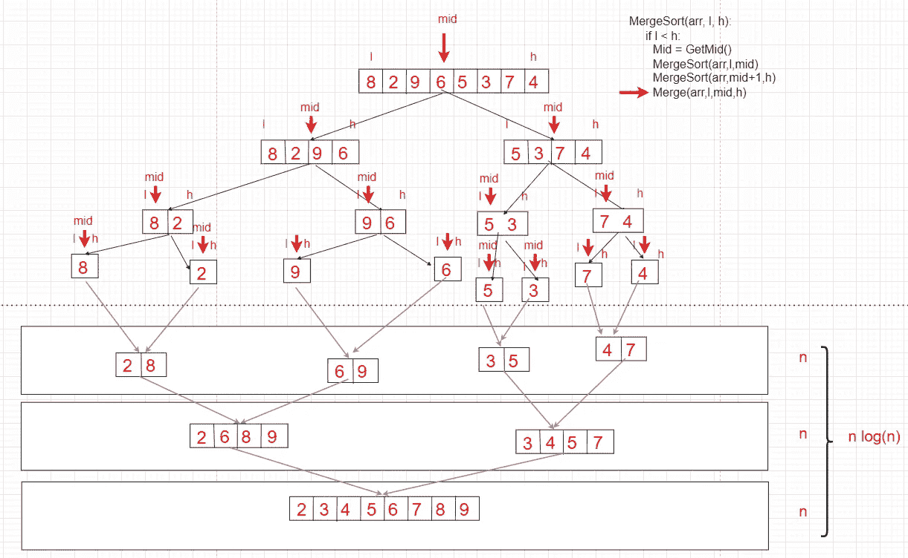
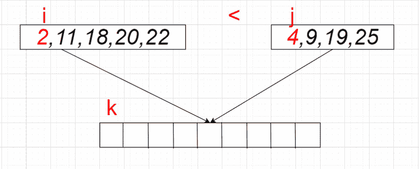
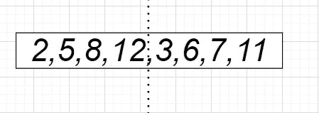
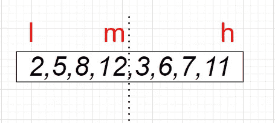
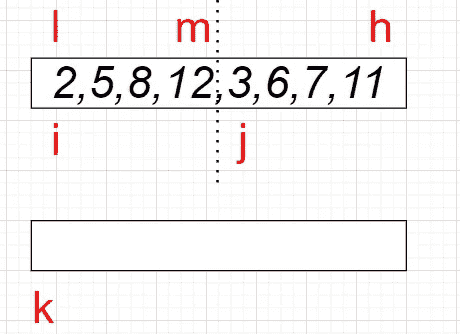
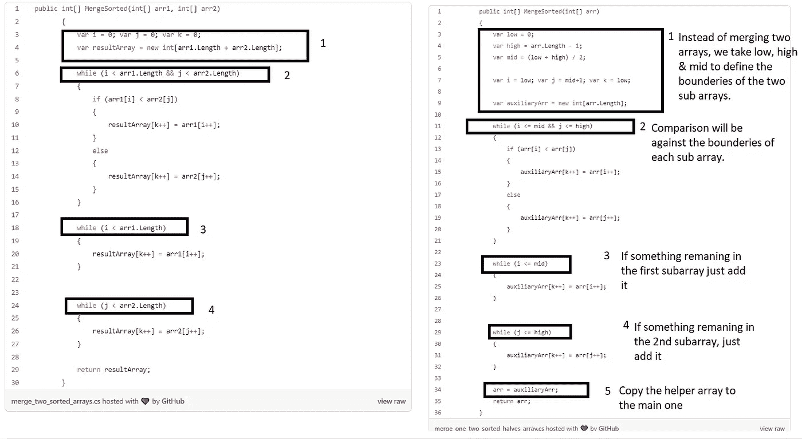
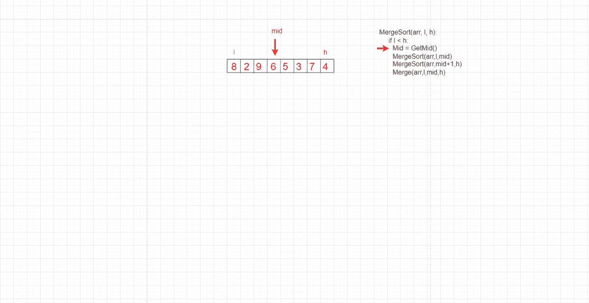
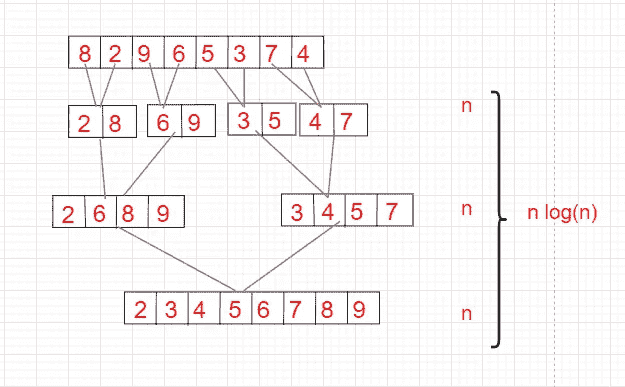

# 合并排序—数组和链表的自上而下和自下而上排序

> 原文：<https://levelup.gitconnected.com/sorting-algorithms-merge-sort-top-down-bottom-up-for-arrays-linked-lists-2426dcc39611>

合并排序是最有效和最流行的排序算法之一。它基于分而治之的方法，常用于计算机科学，实用，易于理解。我们将讨论实现细节，以及在使用合并排序时需要考虑和记住的最重要的事情。



合并排序简介

# 内容

*   什么是合并排序算法？
*   合并两个排序后的数组。
*   合并排序是如何工作的？
*   让我们写一个算法并分析它(自上而下&自下而上)
*   让我们看看它是如何处理链表的，而不仅仅是数组
*   常见问题解答
*   优势
*   不足之处

# 什么是归并排序算法？

和[快速排序](/sorting-algorithms-quick-sort-ed0fbbdd0d40)一样，归并排序是一种分治算法。它将输入数组分成两半，这个拆分数组的过程一直持续到我们得到一个项目的更小的数组，然后合并过程从比较更小的拆分数组开始，并按照排序顺序将它们合并在一起，最后我们将得到一个排序后的数组。

# 合并两个排序的数组

在了解如何使用 merge sort 对数组进行排序之前，我们先了解一下如何将两个数组合并在一起的基本思路？

假设我们有两个排序数组 arr 1:*【2，11，18，20，22】*&【arr 2:*【4，9，19，25】*，为了合并它们，我们需要一个额外的数组来存放合并结果。

我们合并这两个排序后的数组的方法非常简单，只需比较最少的两个元素，并将最小的元素复制到第三个数组中。

为了把这分成几个步骤:



合并两个排序的数组

1.  从第一个数组中的 *i* index 开始，第二个数组中的 *j* index 和第三个数组中的 *k* index 开始。
2.  比较*I*j 处的值
3.  将最小值放入 *k 中*将最小值索引移动到下一个。
4.  继续这样做，直到到达其中一个数组的末尾。
5.  如果其中一个数组中还有剩余的元素，就把它们原样移动到第三个数组中。

这里的合并复杂度是 O(n+m ),其中 n 是第一个数组的长度，m 是第二个数组的长度。我们可以说差不多是 O(n)了。

合并两个以上排序的数组可以用同样的方法，你可以选择两个数组，合并它们，等等，直到得到一个排序的数组。

## 如果我们刚刚合并的两个数组是一个数组的一部分呢？如何对它们进行排序？

该过程将与我们上面描述的非常相似。让我们以下面的数组为例。现在我们需要在逻辑上将它分成两个有序的数组，这样我们就可以合并它们了。



将合并排序数组概念应用于一个数组

为此，我们可以定义 low (l)、high (h)和 mid (m)，用来定义第一个和第二个子阵列的边界。



定义两个子阵列的边界

因此，要进行合并，我们需要另一个相同大小的数组来添加合并结果，最后，我们可以将结果从这个辅助数组复制回原始数组。

现在，非常类似于第一个合并两个排序数组的例子，我们将需要 I，j & k，如下所示。



初始化指针

然后做和第一个例子完全一样的过程，但是不是 I，j，&k 从 0 开始，只是确保 I 从 L 开始，j stats 在 m+1 & k 也从 L 开始。

将一个数组与两个排序后的数组合并

如果我们比较一下，合并两个排序数组的代码，以及将两个排序数组合并成一个数组的代码，我们会发现它们非常相似，如下所示:



比较，合并两个排序数组的代码，以及将两个排序数组合并成一个数组的代码

这是合并排序的基础。合并排序是简单地将一个数组分成更小的两半，直到每个数组只有一个项目(这是自然排序)，然后开始再次对这些子数组应用合并，直到我们到达一个排序后的数组。

# 它是如何工作的？

合并排序是一种递归算法，按照以下步骤工作:

1.  将输入分成两半。
2.  通过递归使用相同的过程对每一半进行排序。
3.  将排序后的两半合并在一起。

## 如何拆分数组使其排序？

只有一个元素的数组是按设计排序的，所以将数组分成两半，直到每个数组只有一个元素的基本情况将使数组排序。

# 让我们为合并排序编写算法

然而，合并排序被认为是递归的，但我们将通过如何写递归&迭代版本的它和什么是不同的。

在所有情况下，合并部分都是相同的&这与我们上面讨论的将一个数组与排序后的两半合并完全相似:

合并部分将如前所述:

## 递归方法(自顶向下)

递归方法的代码非常简单，我们只需要应用上面提到的三个步骤就可以了。

分割部分都是逻辑同步的，但要完成合并部分，您将需要我们前面讨论过的辅助数组。



**时间复杂度:**

在所有 3 种情况下(最差、平均和最好),合并排序的时间复杂度为 O(n Log n ),因为合并排序总是将数组分成两半，并花费线性时间来合并两半。


对数时间复杂度

**空间复杂度:**

当将两个排序后的数组合并成一个更大的数组时，我们需要空间来保存合并后的结果。

因为我们要组合的数组有 O(n)个元素，所以我们总共需要 O(n)个空间，但是因为我们在做递归调用，所以这个额外的数组将被复制 log (n)次，所以这里的空间复杂度是 O(n log n)。

**关于空间复杂性的注释:**

*   如果我们仔细观察，我们会发现有些合并需要的空间不到 O(n ),因为当我们合并两个各有一个元素的数组时，需要 O(1)的空间，但是，当我们进行最后的合并时，我们将有两个各有 n/2 项的一半，所以我们需要 O(n)的空间来合并结果。
*   如果你仔细观察，当前的实现比 O(n)使用更多的空间，O(n log(n))对于每个递归调用，我们传递的是输入的副本。而且，由于我们在遇到基本情况之前可能有 O(log(n))个递归调用，这是输入的 O(log(n))个副本，但是空间可以很容易地通过小的更改达到 O(n)。

## 迭代方法(自下而上)

迭代部分基于这样的想法，即一个单品数组已经排序，所以如果我们有一个特定的数组，我们可以将其中的每个元素视为一个排序的数组，然后像往常一样应用合并。



迭代合并排序

时间复杂度是 O(n log n ),因为我们对 log n 遍不进行 n 次合并&空间复杂度是 O(n ),因为我们在合并例程中使用辅助数组。这个版本比递归版本更好，因为我们提高了空间复杂度。

# 合并排序更适合于排序链表，而不仅仅是数组

除了插入排序之外，合并排序被推荐用于排序链表。链表缓慢的随机访问性能使得一些其他算法(比如快速排序)表现不佳，而另一些算法(比如堆排序)则无法实现。

我们将看到合并排序在链表中如何以 O(nlogn)时间复杂度执行，这与它在排序数组时的性能非常相似。

合并排序链表的思想与合并排序数组是一样的&它可以递归或迭代完成，就像我们处理数组一样。

## 递归方法

虽然链表的合并排序可以使用递归或迭代来完成，但这里我们将只讨论递归方法，以简化事情&不要让人们对许多实现感到困惑。

在这种方法中，我们将通过使链表中间节点的下一个值等于 null 来将输入链表分成两半，然后我们将在每一半上分别调用我们的递归排序函数，在每次调用结束时，我们将合并这两半排序后的链表来排序。

这与我们处理数组的方法完全相似。

**实施**

我们需要得到链表的中间部分，然后取消它的下一个部分，所以我们有两半，左半部分和右半部分，一旦我们把所有的链表分解成一个条目列表，我们将需要应用合并例程。所以这里有 3 个例程:

1.  获取链表的 mid。
2.  编写合并方法。
3.  通过将链接列表分成两半来应用合并排序，然后合并这两半来获得排序的链接列表。

这是单链表节点类:

```
public class SNode
{
public int Val;
public SNode? Next;
 public SNode(int val = 0, SNode? next = null)
  {
    this.Val = val;
    this.Next = next;
  }}
```

链表的合并排序将如下所示(我添加了一些注释来描述和阐明代码本身的更多内容，但总的来说，它是直截了当的，由我上面提到的三个步骤组成)

合并排序链表

**时间复杂度**

时间复杂度类似于我们在数组合并排序中讨论的。是 O(n log n)。

首先，GetMid(..)方法的复杂度为 O(n ),因为我们最多对列表的每个节点迭代一次。

第二，Merge 方法的复杂度为 O(n + m ),因为我们最多迭代每个列表的节点一次。

最后，主 MergeSort 方法的复杂度为 O(n log n ),因为在每次调用中，我们合并两个复杂度为 O(n)的列表，并且递归树的深度将为 log(n ),因为在每次调用中，我们将列表分成两半。

**空间复杂度**

空间复杂度也非常类似于数组方法，它是 O(n log n ),因为我们每次调用合并排序都创建一个新的链表，因为我们调用合并排序 log (n)次，所以空间复杂度是 O(n log n)。如果我们使用迭代方法达到 O(n ),空间复杂度可以得到改善，因为在合并期间不需要额外的列表副本。

# FQA

## 链表最好的排序算法有哪些？

有时候，人们更喜欢将链表的值复制到数组中，然后使用快速排序之类的方法对其进行排序，然后将其移回链表中，因为数组比链表具有更好的缓存性能。如果你要对一个链表进行排序，那么合并排序是很好的，插入排序也用于对链表进行排序，但是它的复杂度是 O(n)。

## 这个算法稳定吗？

如果两个具有相同键的对象在排序后的输出中出现的顺序与它们在要排序的输入数组中出现的顺序相同，则称排序算法是**稳定的**。**合并排序**是一种稳定排序，这意味着数组中的相同元素保持它们相对于彼此的原始位置。

## 这个算法适应性强吗？

简单地说，如果算法利用其元素的位置来最小化执行排序所需的操作数量，我们称之为自适应算法。自顶向下和自底向上合并排序都不是自适应的，因为它们总是进行 O(n log n)运算。即使对数组进行了排序，数组也会被细分，然后进行比较。有一种类型的合并排序称为自然合并排序，它具有自适应性，但这超出了本主题的范围。

## 这个算法到位了吗？

正如你在上面的例子中所看到的，合并排序并不在宫内，因为在所有情况下我们都需要辅助数组来执行合并部分。当我们通过递归来实现时，空间复杂度有时会达到 O(n log n ),因为调用激活记录中的额外数组会导致 log n 的额外复杂度，正如我们上面提到的，为了改善这一点，我们可以使用自底向上技术来确保空间复杂度为 O(n)。

## 这个算法适用于链表吗？

该算法适用于链表，因为它的时间复杂度为 O(n log n ),并且可以用与数组相似的过程来实现。

## 什么时候用或者不用？

如果获取额外空间的成本很高，就不要使用它，如果排序的稳定性很重要，就使用它。

## 优势

*   对于较大的列表，它的速度更快，因为它的时间复杂度为 O (n log n)
*   它具有一致的运行时间，在一个阶段中以相似的时间执行不同的位。
*   这是稳定的算法。

## 不足之处

*   对于较小的任务，与其他排序算法相比速度较慢。
*   它不是自适应的，所以即使列表被排序，它也会经历整个过程
*   它使用更多的内存空间来存储初始拆分列表的子元素。

# 最后

我希望你觉得这个例子有用。我试图包含尽可能多的清晰的例子和想法，同时保持简单，关注重要的东西。请随时留下您的意见、建议或任何反馈。