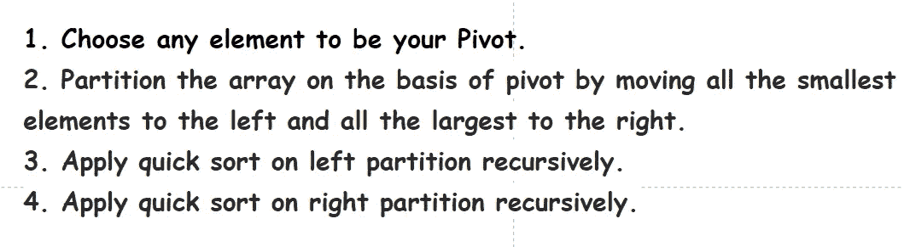
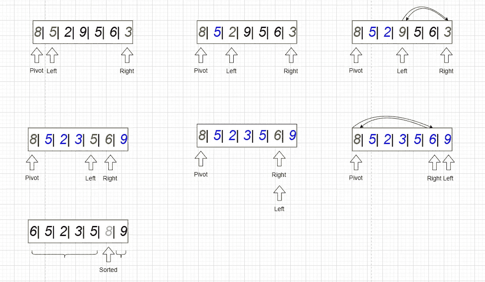
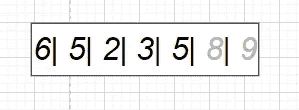
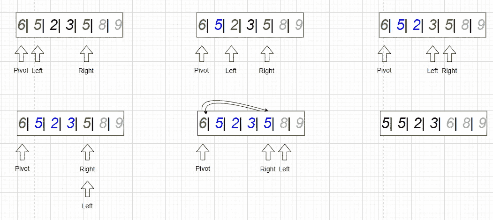
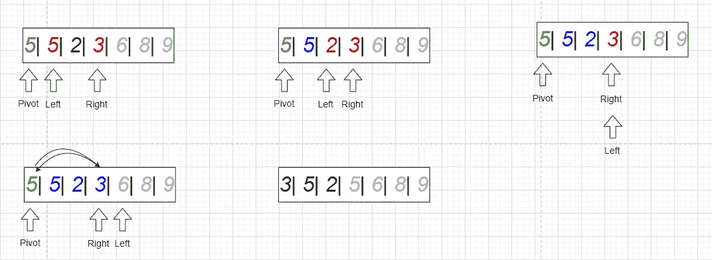
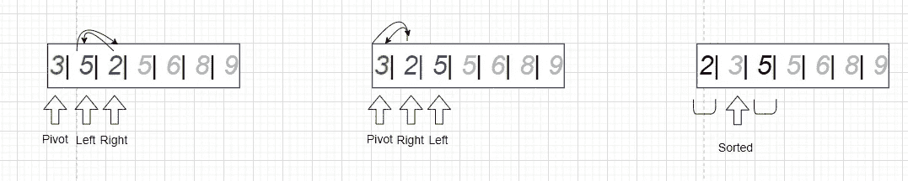
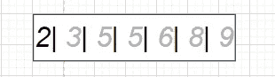
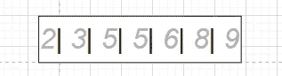
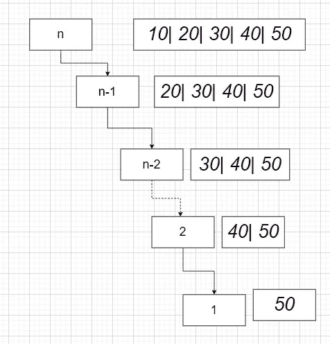
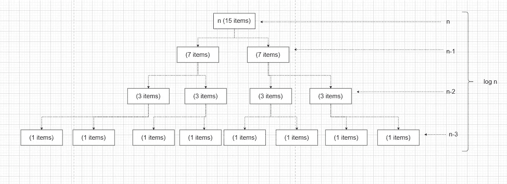

# 排序算法:快速排序——实用的深度分析

> 原文：<https://levelup.gitconnected.com/sorting-algorithms-quick-sort-ed0fbbdd0d40>

## 快速排序是有史以来最有趣和最流行的排序算法之一。它基于分而治之的方法，快速，实用，有趣。我们将讨论使用快速排序时的实现细节以及需要考虑和记住的最重要的事情。

快速排序介绍

# 内容

*   **什么是快速排序算法？**
*   **它是如何与详细的例子一起工作的？**
*   **让我们写一个快速排序的代码(递归&迭代)**
*   **时间复杂度与多示例**
*   **空间复杂度**
*   **常见问题解答**
*   **结论**

# 什么是快速排序算法？

快速排序类似于合并排序，基于分治法。它首先选择一个元素作为**枢轴**并使用它来划分数组。

**引自维基百科:**

> **快速排序**是一种就地排序算法。该算法由英国计算机科学家东尼·霍尔于 1959 年开发，并于 1961 年发表，至今仍是一种常用的排序算法。如果实现得好，它会比**合并排序**快一些，比**堆排序**快两到三倍。
> 
> **快速排序**是一种**分治算法**。它的工作方式是从数组中选择一个' **pivot** '元素，并根据其他元素是小于还是大于 pivot 将它们划分为两个子数组。由于这个原因，它有时被称为**分区交换排序**。然后对子数组进行递归排序。这可以就地完成，需要少量额外的内存来执行排序。
> 
> **Quicksort** 是一个**比较排序**，这意味着它可以对定义了“小于”关系(形式上是总订单)的任何类型的项目进行排序。快速排序的有效实现不是一种稳定的排序，这意味着相等排序项的相对顺序不会被保留。

# 它是如何工作的

理解任何算法的最好方法是把它分解成它的基础，并开始把它的所有步骤组合成一幅大图。我们将研究快速排序是如何工作的，然后进行一些变化和考虑，以确保我们完全理解它。

关于快速排序的工作原理，需要理解的重要一点是，在每次迭代中，我们需要选择 Pivot，然后把它放到正确的位置。

1.  选择任何元素作为 pivot(让我们首先假设 pivot 总是数组的第一个元素，但我们稍后将回到这个假设，看看选择 pivot 的最佳方式是什么，以及它如何影响算法性能。)
2.  通过将所有最小的元素向左移动，将所有最大的元素向右移动，根据 pivot 对数组进行分区。
3.  对左分区递归应用快速排序。
4.  对右分区递归应用快速排序。

## 例子

假设我们有这个数组: *[8，5，2，9，5，6，3]。*

在第一次迭代中，只需看一下下图就能理解每一步。第一次迭代的目标是将枢纽放在正确的位置，这样左边的所有项目都变小，右边的所有项目都变大。

我们选择了 8 个作为**支点**，5 个作为**左侧**，3 个作为**右侧**。因为 5 小于 8，所以它在左手边的正确位置，我们将把左边的指针移动到小于 8 的 2，所以我们将移动到大于枢轴 8 的 9，所以它需要与右边的指针交换。现在让我们看看是否需要交换正确的元素。右边的元素是 3，它比主元素小，所以它可以被交换，为此我们将 9 换成 3，并将两个指针移到下一个。依此类推，如下图所示，直到枢轴左边的元素最小，右边的元素最大。

第一次迭代

现在我们有了一个排序后的条目和两个子数组:*【6，5，2，3，5】*和*【9】，所以让我们再次对这两个子数组应用该算法。*

第二次迭代将应用于仅包含一个项目的最小数组，因此它被排序为没有其他项目:

第二次迭代

然后对数组的另一部分进行第三次迭代 *[6，5，2，3，5]:*

选择 6 作为轴心，5 作为左边，另外 5 作为右边。左侧小于 P，因此增加它以将其移动到项目 2，2 小于主元，因此继续移动到 3，它仍然小于主元，因此继续移动。现在，L & R 指向 5，5 小于枢轴，所以从左指针的角度来看，它是排序的，所以将 L 指针移动到下一项。现在 L & R 互相交叉，所以让我们用右指针交换支点。现在我们得到了它的排序位置的支点。

第三次迭代

第四次迭代:

第四次迭代

第五次迭代:

第五次迭代

然后是第 6 次和第 7 次迭代:

第 6 次迭代

第 7 次迭代

# 让我们为此编写一个代码

现在我们了解了这个算法是如何工作的，让我们把我们的想法放到工作代码中:

在下面的代码中，我们完全按照我上面的说明做了。我刚刚创建了另一个助手函数来方便调用主函数。main 函数接受 array，然后将它发送给带有开始和结束索引的 helper 方法。

然后，如您在第 15 行中所见，我们选择 pivot、left 和 right 索引，然后循环遍历数组，并完全按照我们之前指定的步骤进行分区(如果需要，选择 pivot、move 和 swap)，然后一旦循环结束，就将 pivot 放在正确的位置。

正如你在上面的第 39 行看到的，我们计算左子数组是否更小，所以我们首先调用它的分区，因为这将使算法更快，我们将在后面看到。

## 更标准…

上面的代码很容易理解，但是如果我们想编写更标准化的快速排序方法，我们需要对代码进行一些组织。

正如我们前面讨论的，快速排序的整个思想就是所谓的分区，它只是从选择枢轴开始，将所有最小的元素移到它的左边，将所有最大的项目移到它的右边。

因此，为了编写更标准的快速排序，我们可以封装选择枢纽的这一部分，并将元素移动到名为 Partition 的方法中。

我们先写分区方法:

正如您在上面看到的，这一次，我们没有选择枢轴作为数组的第一项，而是选择了中间元素(我们稍后将讨论选择枢轴的最佳实践以及它如何影响算法的性能，但现在，请记住，您可以选择任何随机枢轴，一些工程师为了便于说明，选择第一项作为枢轴，但这不是最佳实践)

在上面的代码中，我们做了和第一个例子完全一样的事情，但是用了一个稍微不同的方法(给你更多的想法)，我们选择了旋转，循环和交换，如果需要的话，直到两个指针(左和右)重叠。

在循环过程中，只要左元素小于 pivot，就保持它的位置，并将左指针移动到下一个元素(第 6 行)，然后只要右元素大于 pivot，就保持它的位置，并将右指针移动到下一个元素(第 7 行)。如果 left ≤ right，则交换位置并移动指针。下面从 3 到 17 的行与上面第一个例子中从 15 到 37 的行非常相似。

所以现在我们像你上面一样写了分区方法，让我们写调用者方法。

我们可以把它写成递归的:

或者我们可以把它写成迭代:

递归版本是标准版本，如果你要写一个快速排序方法，递归版本就足够了，但有时人们会要求将递归转换为迭代，为此我在这里展示了两者。我想说的是，递归版本和迭代版本在理论上没有真正的不同，因为迭代版本使用堆栈来模拟递归版本，所以理论上它在空间复杂度上应该非常相似，但实际上递归版本更有效，因为你将创建堆栈的任务委托给编译器，这比你在迭代部分创建的堆栈更好，此外迭代版本有一些额外的变量和操作，增加了时间和空间复杂度。所以并不是在所有情况下迭代版本都更有效。

最后，我写了上面的许多版本来与您分享关于如何实现该算法的许多想法，但如果有一种标准的方法，那将是使用分区方法的递归方法，下面是它的完整代码:

所以希望在这个阶段，你明白什么是快速排序，它是如何工作的，以及如何以多种方式实现它。

# 时间复杂度

我喜欢在每个部分重复这个想法，但从不同的角度来看，这样你就清楚了。现在让我们引用著名的破解编码访谈书中关于快速排序的这句话:

> 在快速排序中，我们选择一个随机元素并对数组进行分区，这样所有小于分区元素的数字都排在所有大于分区元素的数字之前。通过一系列交换，可以有效地执行分区。
> 
> 如果我们围绕元素重复划分数组(及其子数组),数组最终会被排序。然而，由于分区的元素不能保证是中间值(或任何接近中间值的位置)，我们的排序可能会非常慢。这就是`O(n^2)`最坏情况的原因。

简而言之，最好的情况是当分区*发生在中间时的`*O(n log n)*` *，最坏的情况是当*分区发生在任何边缘时的* `*O(n^2)*` *，如果数组已经按升序或降序排序，并且您选择 pivot 作为第一个元素，则可能会发生这种情况。T *他一般情况下是* `*O(n log n)*` *。**

## 此算法何时会给出最差结果的示例:

要从快速排序中调用的升序排序数组

如上所述，如果元素已经按升序或降序排序，例如[10，20，30，40，50]并且 pivot 是第一个元素，那么这是最糟糕的情况，因为如果你考虑一下，在第一次迭代中，让我们选择 10 作为 pivot，20 作为 left，50 作为 right，10 将与其自身交换，我们将有一个子数组称为[20，30，40，50]，它的长度为 n-1，那么下一次迭代将产生一个 sub 那就得出 1+2+3+…+n(n+1)/2 ≈ `*O(n^2)*` *。降序排序也会给出相同的结果。因此结论是，如果数组已经按升序或降序排序，并且枢轴是第一个元素，那么快速排序将给出最坏的情况，即* `*O(n^2)*` *。如果我们知道数组已经排序，我们可以通过选择中心元素作为中间元素来解决这个问题，这样会得到最好的结果，因为它会在每次迭代中将数组划分为两个子数组，如下所示。*

## 此算法何时能给出最佳结果的示例:

最好的结果将是`*O(n log n)*` *，如果列表在每次迭代中被分割**，这将会发生，我们有两个子数组，这将减少对 log n 的递归调用，因此总时间复杂度将是* `*O(n log n)*`

如果每次迭代从中间分裂阵列，将获得最佳的时间复杂度

如上图所示，这种情况下的分区将发生 log n-1 次，因为 log(15) ≈ 4，但我们看到分区发生了 3 次，所以 log n-1，但我们假设它是 log n，所以总的来说`*O(n log n)*`

对于这一点，现实生活中的版本，如果该算法使用一种**随机化**方式来选择枢轴，这种方式可以为每个分区提供两个子数组，因此我们平均达到最好的情况`*O(n log n)*`

# 空间复杂性

正如上一节所提到的，空间复杂度是根据递归堆栈中使用的空间来确定的。

如果列表已经排序，并且 pivot 是每次迭代的第一个元素，那么最坏情况下使用的空间将是`O(n)`。使用的平均案例空间将是`O(log n)`，因为这是每个分区有 2 个子数组时需要的递归调用的数量。

# FQA

## 这个算法稳定吗？

如果具有相同键的两个对象在排序输出中出现的顺序与它们在要排序的输入数组中出现的顺序相同，则称排序算法是**稳定的**。快速排序**不稳定**，因为元素的交换是根据 pivot 的位置发生的，而不考虑它们的原始位置。

## 这个算法适应性强吗？

快速排序不是自适应的。简单地说，如果算法利用其元素的位置来最小化执行排序所需的操作数量，我们称之为自适应算法。事实上，如果数组已经排序，快速排序在某些情况下会比以前表现得更差，正如我们之前提到的。所以不具有适应性。

## 这个算法到位了吗？

如果我们假设，就地意味着我们没有使用额外的数组来促进排序，所以它是就地的，但是如果我们假设我们使用递归，使用堆栈来增加额外的空间，所以我们可以判断它不是就地的，所以这取决于你对就地的理解。

## 如何改进快速排序算法？

可以对该算法进行许多改进，但最标准的一个是获得主元的随机化，因此我们可以实现 O(n log n)时间复杂度。

## 这个算法适用于链表吗？

该算法不适用于链表，因为它将给出 O(n)的时间复杂度，因为如果我们需要获得一个随机的枢轴来获得我们之前指定的最佳划分，我们需要迭代链表来获得枢轴。我们当然可以在链表上执行它，但是我们对主元的选择非常有限，或者我们将得到 O(n)来迭代链表以得到随机主元，这并不好。

## 这个算法比归并排序好吗？

视情况而定，合并排序的时间复杂度为 O(nlogn ),但它不是就地的，你必须至少有一个大小为 O(n)的腋窝数组才能执行它。

所以我会说，如果空间是关注，所以肯定快速排序是最好的。

它非常适合对数组进行排序，因为快速排序是一种就地排序算法。就地排序意味着不需要额外的存储空间来执行排序。**合并排序需要一个临时数组来合并排序后的数组，因此它不能就地给快速排序带来空间优势**。

没有我们上面指定的链表。

## 最坏的情况是 O(n)和人们如何建议使用它？

因为如果应用枢轴的随机化将使得平均情况时间复杂度为 O(n log n ),这对于排序技术来说是好的。

## 快速排序与选择排序？

在选择排序中，我们选择一个位置，并找出该位置的元素。在快速排序中，我们选择一个元素，并找出该元素的位置。

## 什么时候用或者不用？

这是一种快速算法，所以只要你想快速排序就用它，如果排序的稳定性很重要就不要用它，因为它不是一种稳定的算法。

# 最后

我希望你觉得这个例子有用。我试图包含尽可能多的清晰的例子和想法，同时保持简单，关注重要的东西。请随时留下您的意见、建议或任何反馈。