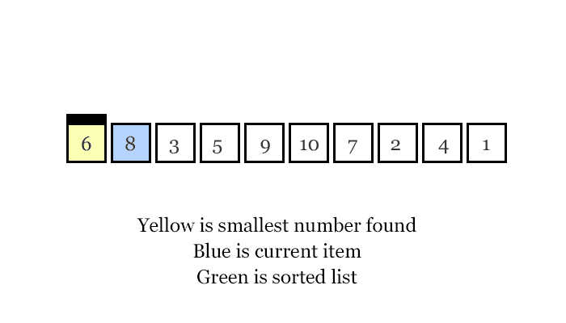
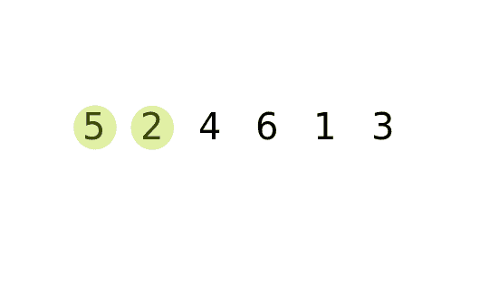
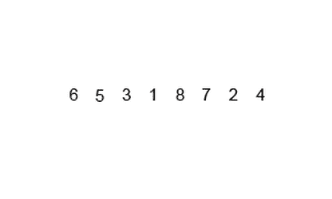
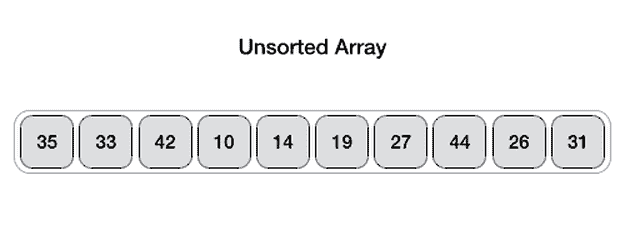

# 排序算法(选择排序、冒泡排序、合并排序和快速排序)

> 原文：<https://levelup.gitconnected.com/sorting-algorithms-selection-sort-bubble-sort-merge-sort-and-quicksort-75479f8f80b1>

## 介绍

在编程的世界里，我们总能找到不同的方法来解决不同的问题，我们可能遇到的一个非常重要的问题就是“排序”。

那么什么是排序呢？排序是指以有组织的方式放置元素的行为，如字母表或十进制记数法。我们知道“a”在“b”之前是一个空格，在“c”之前是两个空格，所以多亏了字母表，我们可以有组织地看待字母，或者我们可以想到的更实际的例子是按字母顺序排序的电话簿，以便我们可以更快地找到我们必须呼叫的人。如果我们要找一个叫“安德鲁”的人，我们知道我们会在电话簿的开头找到他，因为字母表中的第一个字母是“a”。

在这篇博客中，我将讨论 4 种非常常见的排序算法:选择排序、冒泡排序、合并排序和快速排序。

## 时间复杂性符号

在开始单独解释每一个之前，我想介绍几个可能不为人知的符号，用来表示时间复杂度。我们知道，根据给定的输入，算法将花费不同的时间，因此我们有三种不同的方式来使用[时间复杂度](/time-complexity-and-bigo-notation-linear-time-constant-time-and-quadratic-time-686c279ecd88)表示这些不同的场景。

1.  Ω.大ω用于表示算法的最佳情况。当给定一个算法最简单的数据结构作为输入时。
2.  O.BigO 用于表示算法的最坏情况。当给定算法一个非常大且复杂的数据集作为输入时。
3.  Θ.只有在最坏情况和最好情况下算法的时间复杂度相同时，才使用大θ。

## 选择排序

时间复杂度:θ(n)

选择排序操作非常简单；它逐个检查数据集中的所有元素，将一个元素的值与下一个元素的值进行比较，以查看该元素是否更小，然后保存在变量中找到的最小元素，当迭代完成时，它会将保存的元素插入到该数据集中相应的位置，与该位置的值交换位置。

这个算法有一个θ(n ),因为在最坏和最好的情况下，我们必须迭代数组中的所有 **n** 个元素，并重复这个过程 **n** 次，即使数据集已经排序，在算法中的所有迭代完成之前也不知道它是否排序。

在这个例子中，我们可以看到算法如何在每次迭代中找到下一个最小的数字，然后交换位置。

## 冒泡排序

时间复杂度:O(n)—ω(n)

我认为冒泡排序可能是最简单的排序算法。该算法处理输入的方式就像一个试图触及表面的气泡，在每次迭代中，该算法将通过比较数据集中的每对元素，找到最高值并将其放在数据集的末尾或该值所属的位置。因此，选择排序从最小的元素到最高的元素进行排序，冒泡排序从最高到最低。冒泡排序还将最低的元素排序为更靠近左侧，因为在每次迭代中，较高的值将与较低的值交换位置，因此它将较低的元素移到左侧，较高的元素移到右侧。

这种算法的最坏情况是，如果数据集中的所有元素都处于相反的顺序，使算法进行更多的“交换”，但我们确实看到，最好的情况没有选择排序那么糟糕，因为与选择排序不同，这种算法足够智能，可以在第一次迭代中意识到数据集已经排序。

在示例中，我们可以看到 Bubble 如何比较数据集中的每一对，如果值较大，则交换值的位置，将最大的值推到右边，将最小的值推到左边，从右到左构建输出。

## 米戈尔排序

时间复杂度:θ(n log n)

合并排序被认为是最快的排序算法之一，它比选择和冒泡排序稍微复杂一点，但效率更高。合并排序的思想是将数据集分成更小的数据集，对这些更小的数据集进行排序，然后将它们连接(合并)在一起。这种算法的表现方式是首先对数据集的左侧进行排序，然后对右侧进行排序，最后将它们合并。合并排序会将数据集一分为二，直到所有元素都分离，然后开始从左到右成对连接，然后这些对将从左到右合并，直到只有两个更大的对要连接。如果我们考虑一下，这使得合并变得容易，因为如果我们必须对数据集的两个部分进行排序，那么我们可以将一个数据集中的第一个元素与另一个数据集中的第一个元素进行比较，并确定哪一个较小，因此，将较小的元素首先推入新的数据集。

该算法对于最坏和最好情况都具有相同的时间复杂度，因为即使数组被排序(最好情况),该算法仍将必须执行完整的过程来确定数据集是否被排序。

## 快速排序

时间复杂度:ω(n log(n))—O(n)

快速排序也是最快的算法之一。为了执行快速排序，我们需要在数据集中选取一个元素，并将其用作所谓的“枢纽”，枢纽是用于比较数据集中其他元素并确定它们应该在什么位置的元素。第一个枢纽可以是数据集中的随机元素，但是按照惯例，使用第一个或最后一个元素。第一个目标是将第一个枢纽放在数据集中的正确位置，为了实现这一点，我们必须对元素进行排序，使得所有大于枢纽的元素都被发送到枢纽的右侧，而所有小于枢纽的元素都被发送到枢纽的左侧。

为了更好地理解这一点，让我们举一个例子，假设您需要按大小对一定数量的咖啡杯进行排序，快速排序的方法是将最后一个杯子作为枢纽，并开始进行两次比较，我们将第一次比较称为 A，第二次比较称为 b。 然后，比较 B 将检查最后一个杯子是否小于枢纽杯子。如果是，则第一个元素将交换位置，比较 A 将向右多移动一个空格，比较 B 将向左移动一个空格。 这一过程将继续，直到比较 A 和 B 彼此交叉。当这种情况发生时，我们知道比较 A 的最后位置现在将与枢纽杯交换，因此枢纽杯处于其正确的最终位置，因为其左侧的所有元素都较小，而右侧的所有元素都较大。

为了对其余的杯子进行分类，该算法将对左侧和右侧进行相同的过程。首先，它将为左侧获取一个新的枢轴，将其与左侧的其他元素进行比较，并相应地对它们进行排序，然后对右侧重复相同的过程，直到所有杯子都排序完毕。

这种算法最糟糕的情况是选取的初始枢轴非常小或非常大。最好的情况是，初始的枢纽正好在数据集的中间。

## 结论

排序算法能够做多种不同寻常的事情，想象一下，一个人要花多少时间来排序一个包含数千个名字的列表以制作一个电话簿，或者一个包含数千个食谱、档案、动物等的列表。诸如此类的事情让我感激所有在我之前发展出这些伟大的、令人震惊的、有用的概念的人。希望这篇帖子能帮助你更好的理解排序算法，感谢阅读！