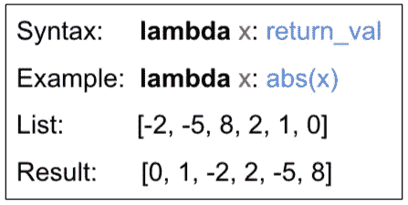

# Python 排序基础

> 原文：<https://levelup.gitconnected.com/sorting-in-python-using-keys-d2622edd7a92>

## 如何有效使用 Python 内置的排序算法

## Python 中用键和 Lambda 函数排序


由[弗洛里安·伯杰](https://unsplash.com/@bergerteam?utm_source=medium&utm_medium=referral)在 [Unsplash](https://unsplash.com?utm_source=medium&utm_medium=referral) 上拍摄的照片

作为一名高中计算机科学教师，我发现使用键对列表进行排序对学生来说常常是一个挑战。排序是几乎所有 Python 项目必不可少的例行编码任务，因此掌握它的使用对您的编程未来至关重要。

本文将带您了解 Python 中使用内置函数和方法对列表(和其他对象)进行排序的最常见和最有用的方法。本文是为使用 Python3 的程序员新手写的。

## 引擎盖下发生了什么？

Python 使用 Tim Peters 编写的内部算法(该算法被亲切地称为 TimSort)。它既快速又高效。它是合并排序和插入排序的组合，适用于任何常规排序任务。

Python 中有两种访问排序算法的方法:

*   `[sort() method](https://docs.python.org/3/library/stdtypes.html?highlight=sort#list.sort)`(应用于 iterable 对象对其进行排序)
*   `[sorted() function](https://docs.python.org/3/library/functions.html?highlight=sorted#sorted)`(返回一个排序后的对象)

如果你对其他类型的排序算法的工作原理和用途感兴趣，我建议从 Toptal 的这个[非常酷的互动](https://www.toptal.com/developers/sorting-algorithms)开始。我也喜欢 YouTube 频道上绝对奇异而可爱的算法，它通过传统的民族舞蹈展示了流行的排序算法。

# sort()方法

排序方法可以直接应用于现有列表，因为它是一种方法，所以它直接作用于对象并对其进行排序。字符串的默认排序根据 [ASCII 表](http://www.asciitable.com/)按字母顺序排列。请注意大写字母先于小写字母(即`‘apple’`先于`‘banana’`*，而`Apple’`先于*`‘banana’`*)。只需确保您使用的是相同的案例(`.upper()`或`.lower()`字符串方法)。对于文本和数字数据，它按从低到高(AtoZ 或 0，1，2，3)的顺序排列，如下所示。*

```
names = [**'Eve'**, **'Cam'**, **'Bev'**, **'Abe'**, **'Dan'**, **'Flo'**]
names.sort()
print(names)numbers = [5, 3, 0, 1, 4, 2]
numbers.sort()
print(numbers)-------OUTPUT-------
['Abe', 'Bev', 'Cam', 'Dan', 'Eve', 'Flo']
[0, 1, 2, 3, 4, 5]
```

如果您想按降序排列(ZtoA 或 3，2，1，0)，有一个可选的关键字参数`reverse`可以使用，如下所示:

```
names = [**'Eve'**, **'Cam'**, **'Bev'**, **'Abe'**, **'Dan'**, **'Flo'**]
names.sort(reverse=**True**)
print(names)-------OUTPUT-------
['Flo', 'Eve', 'Dan', 'Cam', 'Bev', 'Abe']
```

# 排序的()函数

通常，您希望保留原始列表(或其他可编辑对象)并创建一个新的排序列表。为此，使用`sorted()`功能。它的排序方式与`.sort()`方法相同，但是**返回**一个排序列表，而不是就地改变当前的列表。下面是我们返回并获取`sorted`函数结果的简单用法。

```
dogs = [**'dachshund'**, **'beagle'**, **'corgi'**, **'akita'**]
sorted_dogs = sorted(dogs)

print(dogs)
print(sorted_dogs)-------OUTPUT-------
['dachshund', 'beagle', 'corgi', 'akita']
['akita', 'beagle', 'corgi', 'dachshund']
```

该功能还接受关键字`reverse`。

# 使用键进行排序

您可能已经理解了本文，并在寻找上面简单分类之外的东西。如果您想按字母或数字以外的任何方式对列表进行排序，请使用关键字参数`key`进行排序。

`key`参数应该被分配一个函数作为参数。这通常是初学者第一次接触这个概念。事实证明，你可以把任何东西传递给一个函数，包括另一个函数。您作为`key`传入的函数，只需要能够接受每个列表项并返回一个您希望排序的值，如下所示。

## 使用 Python 内置函数作为密钥

现有的 Python 函数当然可以作为键传入`.sort()`或`sorted()`。这个简单的实现是我们学习如何使用`key`参数的一个好的开始。

```
dogs = [**'dachshund'**, **'beagle'**, **'corgi'**, **'akita'**, **'pug'**]
dogs.sort(key=len)
print(dogs)-------OUTPUT-------
['pug', 'corgi', 'akita', 'beagle', 'dachshund']
```

在上面的代码中，我们使用内置函数`len`对狗进行分类，该函数只返回单词的长度。新的排序列表现在有最短的狗的名字第一。

**注**:有平手的时候(柯基犬和秋田犬是同数字母)，保留单词原来的顺序。

## 使用用户定义的函数作为键

键也可以是用户定义的函数，如下所示。这是最通用的，因为在函数中可以做的事情没有限制。下面是一个函数，它接受一对数字，并使用勾股定理返回该点离原点的距离。

当用作关键点时，点列表按照它们与原点的接近程度进行排序。

```
**def** dist(point):
    *# distance from origin using c = sqrt(a**2 + b**2)* distance = (point[0]**2 + point[1]**2) ** 0.5
    **return** distance

points = [[5, 2], [4, 4], [1, 1], [3, 0], [0, 1]]

points.sort(key=dist)
print(points)-------OUTPUT-------
[[0, 1], [1, 1], [3, 0], [5, 2], [4, 4]]
```

## 使用 lambda 函数作为密钥

现在是经常让我的学生出错的部分 lambda 函数的介绍。有时候我觉得名字是这里最吓人的部分。

lambda 函数只是一个匿名函数(这意味着我们没有用`def`来命名它)。它是一个单一的表达式，我们不能在 lambda 函数中使用`return`。除了这两点之外，lambda 函数可以以与常规函数完全相同的方式使用。让它变得超级有用的额外好处是，它可以在一行代码中创建。在我们的例子中，我们可以直接在排序函数中创建它。Lambda 函数是编写更复杂的 Python 代码的关键构件，所以如果你打算在这门语言上走得更远，就要尽快掌握它们。

**示例 1:** 这是一个使用 lambda 函数按绝对值对数字列表进行排序的简单示例:

```
nums = [-2, -5, 8, 2, 1, 0]
nums.sort(key=**lambda** x: abs(x))

print(nums)-------OUTPUT-------
[0, 1, -2, 2, -5, 8]
```

我们添加了一些新的语法，如下图所示。它无非是一个简化的`def`。关键字`lambda`后面紧跟着您想要的函数的输入参数(在本例中我调用了 mine x)。冒号的另一边是函数的返回值。这就是 lambda 函数的全部，输入和输出由冒号分隔。



按绝对值排序

**例 2:按索引排序。**一个非常常见的任务是根据特定元素对列表进行排序。在下面的例子中，我们希望按照测验分数对`grades`列表进行排序。

```
grades = [('Cam', 88), ('Bev', 95), ('Abe', 88), ('Dan', 90)]

grades.sort(key=**lambda** x: x[1])
print(grades)-------OUTPUT-------
[('Cam', 88), ('Abe', 88), ('Dan', 90), ('Bev', 95)]
```

lambda 将 x 作为参数(我使用了 x，但是您可以在这里使用任何您想要的变量名称)。我们的等级列表中的每个元组都作为 x 发送到 lambda 函数中。我们返回 x[1]的值(数字等级)。然后，sort 方法使用返回值对列表进行排序。我们可以看到输出是一个按等级排序的列表，从最低到最高。如果您想颠倒顺序，只需包含 reverse=True 参数。

**例 3:按多个指标排序。**我从上一个示例中注意到，Abe 和 Cam 得分相同，但 Cam 名列第一，因为他们在原始列表中名列第一。让我们通过添加第二个索引来解决这个问题。

```
grades = [('Cam', 88), ('Bev', 95), ('Abe', 88), ('Dan', 90)]grades.sort(key=**lambda** x: (x[1], x[0]))
print(grades)-------OUTPUT-------
[('Abe', 88), ('Cam', 88), ('Dan', 90), ('Bev', 95)]
```

注意，lambda 返回一组值。您可以根据放入该元组中的项目进行排序。如果在第一个项目上有一个“tie ”,那么它将转到元组中的第二个项目。如果第一项和第二项出现平局，则进入第三项，以此类推。

**例 4:不区分大小写的排序。这是另一个相当常见的任务。我想在保留原始文本内容的同时，按字母顺序对文本列表进行排序。正如我们前面看到的，使用 ASCII 规则排序时，大小写很重要。通过执行以下操作，我可以在不改变列表内容的情况下解决这个问题:**

```
games = [**'Monopoly'**, **'Boggle'**, **'chess'**, **'backgammon'**, **'Sorry'**]# without lambda function
games.sort() 
print(games)# with lambda function
games.sort(key=**lambda** x: x.upper())
print(games)-------OUTPUT-------
['Boggle', 'Monopoly', 'Sorry', 'backgammon', 'chess']
['backgammon', 'Boggle', 'chess', 'Monopoly', 'Sorry']
```

当我们不使用 lambda 时，ASCII 顺序将大写单词放在前面。我们通过使用 lambda 对每个列表项的所有大写文本进行排序来纠正这一问题。(我们也可以使用`.lower()`按小写字母排序，效果相同)

**例 5:对类对象进行排序。**如果你正在处理一个对象列表，按属性或者甚至按方法的返回值对它们进行排序通常是很方便的。这里有一个更复杂的版本，是我们之前对分数排序所做的。这次我创建了一个`Student`类的实例来代表每个学生，并将这些实例放在一个名为`students`的列表中。

```
**class** Student:
    **def** __init__(self, name, grades):
        self.name = name
        self.grades = grades
    **def** get_average(self):
        *# get average of all grades* average = sum(self.grades) / len(self.grades)
        **return** average
    **def** __repr__(self):
        *# just here so we have something to print* **return** repr((self.name)) *# create a list of Student objects using names and all grades* students = [Student(**'Dan'**, [88, 89, 96]),
            Student(**'Bev'**, [95, 99, 88]),
            Student(**'Cam'**, [88, 75, 90]),
            Student(**'Abe'**, [90, 88, 88])]# sort the students by name
students.sort(key=**lambda** student: student.name)
print(students)# sort the students by average grade
students.sort(key=**lambda** student: student.get_average())
print(students)-------OUTPUT-------
['Abe', 'Bev', 'Cam', 'Dan']
['Cam', 'Abe', 'Dan', 'Bev']
```

当我们使用点标记法(在我们的例子中是 student.name)来使用对象属性时，我们使用返回的属性作为排序顺序。

当我们在 lambda 函数中使用一个方法时，我们使用该方法的返回值进行排序。

# 操作员功能

根据一个或多个列表索引进行排序是一项非常常见的任务，Python 有一个名为`operator`的“包含电池”库来帮助我们。`itemgetter`函数可以代替 lambda 用作键。您可以在函数中包含您想要排序的索引号，如下所示。`itemgetter`执行速度比 lambda 函数稍快，因此如果您正在处理一个大的 list/dict，它会很有用。然而，当您有更多的特殊排序需求时，它比使用 lambda 或用户定义的函数更受限制。

```
**from** operator **import** itemgetter

cities = [[**'Albuquerque'**, **'NM'**], [**'Decatur'**, **'IL'**], [**'Boston'**, **'MA'**], [**'Chicago'**, **'IL'**]]

cities.sort(key=itemgetter(1))
print(cities)

cities.sort(key=itemgetter(1, 0))
print(cities)-------OUTPUT-------
[['Decatur', 'IL'], ['Chicago', 'IL'], ['Boston', 'MA'], ['Albuquerque', 'NM']][['Chicago', 'IL'], ['Decatur', 'IL'], ['Boston', 'MA'], ['Albuquerque', 'NM']]
```

在第一次排序中，我使用 itemgetter(1)按州缩写排序。注意迪凯特和芝加哥的顺序。

在第二次排序中，我向 itemgetter(1，0)传递了两个索引。它先按州排序，然后按城市排序。现在芝加哥在迪凯特之前。

**注意**:还有一个叫做`attrgetter`的函数，用于按对象属性排序。

# 总结性的新闻报导

Python 是一种很好的数据排序语言。这是一项非常普通的任务，所以现在练习这项技能将会在以后获得回报。

在我的例子中，我主要使用了`.sort()`方法和`lists`。同样的`key`技术可转移到`sorted()`函数，也可用于其他可迭代类型(`dicts`、`tuples`)。python 文档对于排序非常有用；在那里可以找到对概念的进一步解释，我只包括了最常见的任务和更多的例子。

我知道这个话题对我的一些编程学生来说是个棘手的问题，所以我希望这里的解释能帮助到一些人。

如果您有问题，发现任何错误，或者对如何改进本文有建议，请告诉我。如果这篇文章对你有所帮助，一定要让我知道，这就是为什么我做它们。感谢阅读！

祝你好运🍀