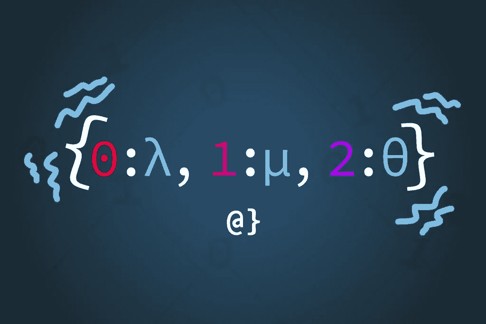

# 出于兴趣和利益对 Python 字典进行排序

> 原文：<https://levelup.gitconnected.com/sorting-python-dictionaries-for-fun-and-profit-fedb60951212>

## Python 字典是一个强大的数据结构，由非可变数据类型索引的键值对组成。它们本质上是无序的，但是会保留添加项目的顺序。没有办法直接对 python 字典进行排序，所以我们必须有点创意。



图片由[过度编码](https://www.overcoded.net)

幸运的是，我们可以通过将 Python 字典转换成可排序的类型(比如列表)来对其进行排序。这涉及到一个中间步骤，或者一个大胆的一行程序，但是相对简单。我将带您了解一些基本的问题、注意事项和值得注意的选项。对于那些从谷歌这里得到快速答案的人，请查看 TL；以下博士:

**TL；DR** —使用带有 lambda 表达式的内置排序函数作为键。

```
# Create a dictionary with randomly ordered keys
d = {5: 'f', 3: 'd', 0: 'a', 2: 'c', 6: 'g', 1: 'b'}# Sort by converting to list using lambda
d = sorted(d.items(), key=lambda x: x[0])>>> [(0, 'a'), (1, 'b'), (2, 'c'), (3, 'd'), (5, 'f'), (6, 'g')]# Covert back to a dictionary (if needed)
d = {k: v for k, v in d}>>> {0: 'a', 1: 'b', 2: 'c', 3: 'd', 5: 'f', 6: 'g'}
```

# 快速介绍

Python 字典是一种非常类似于传统哈希表的数据结构。它将不可变对象的集合(比如整数、字符串或浮点数)与成对的值配对，这些值*可以*是可变的，甚至是值的集合。

Python 字典是高效的，并且打包了大量有用的内置方法来帮助完成常见任务。在 Java 等其他语言中，字典有点像枚举，但是有一些显著的不同。

# 对 Python 字典进行排序

很像最初的 TL；例如，我们将从创建一个随机排序的字典开始。有了这些，我们将能够了解一些有效的方法，以及一些无效的方法。在我们开始之前，我会花一点时间建议您阅读官方 Python 字典文档。最好列出 Python 字典结构提供的许多方法，我们不会在这里讨论。

```
# Create a randomly-ordered dictionary
d = {5: 'f', 3: 'd', 0: 'a', 2: 'c', 6: 'g', 1: 'b'}# Sort the dictionary
sorted(d)>>> [0, 1, 2, 3, 5, 6]
```

哇哦。那个*几乎*看起来好像起作用了。在这个场景中，Python 将字典表示为键，因为(需要引用版本号。)同样值得注意的是，自从 [PEP448](https://www.python.org/dev/peps/pep-0448/) 以来，人们可以使用解包指令来产生这样的列表: `l = [*d]`这将产生一个列表，尽管没有排序:`[5, 3, 0, 2, 6, 1]`。只是一些有趣的事实。让我们看看这是什么样子:

# 理解排序

[Python 列表理解](https://docs.python.org/3/tutorial/datastructures.html#list-comprehensions)是我爱上这种[编程语言](https://www.overcoded.net/most-popular-programming-languages-184015/)的原因之一。它让人们以高度优化的方式使用一行逻辑实现令人印象深刻的工作负载。对我来说，还不清楚 Python 是否也支持开箱即用的字典理解。的确如此，我们还将展示如何用它来对 Python 中的字典进行排序！

```
# Create a randomly-ordered dictionary
d = {5: 'f', 3: 'd', 0: 'a', 2: 'c', 6: 'g', 1: 'b'}# Sort using dictionary comprehension
d = {k: v for k, v in sorted(d.items())}>>> {0: 'a', 1: 'b', 2: 'c', 3: 'd', 5: 'f', 6: 'g'}
```

这里，我们不仅通过 sorted(d.items())方法将字典转换成一个列表，从而对字典进行了排序，而且还将它转换回了字典。都在一条线上！**注意**:我们*技术上*把它转换成了一个中间生成器对象，而不是一个列表。

这看起来很不错，但是让我们更进一步，引入一个自定义键，我们的字典将根据这个键进行排序。例如，假设我们希望字典根据键的平均值按绝对值排序。

让我们看看我们是否能找到一个适合这个任务的一行程序！为此，我将使用一组稍长的值来引用通过字符串模块可用的 [ASCII 小写字母](https://www.overcoded.net/ascii-table-512119/):

```
# Create a randomly-ordered dictionary
alpha = {k: v for k, v in zip(range(len(string.ascii_lowercase)), list(string.ascii_lowercase))}>>> {0: 'a', 1: 'b', 2: 'c', 3: 'd', 4: 'e', 5: 'f', 6: 'g', 7: 'h', 8: 'i', 9: 'j', 10: 'k', 11: 'l', 12: 'm', 13: 'n', 14: 'o', 15: 'p', 16: 'q', 17: 'r', 18: 's', 19: 't', 20: 'u', 21: 'v', 22: 'w', 23: 'x', 24: 'y', 25: 'z'}# Order by distance from an calculated value
s = {k: v for k, v in sorted(alpha .items(), key=lambda x: abs(sum(alpha) / len(alpha) - x[0]))}>>> {12: 'm', 13: 'n', 11: 'l', 14: 'o', 10: 'k', 15: 'p', 9: 'j', 16: 'q', 8: 'i', 17: 'r', 7: 'h', 18: 's', 6: 'g', 19: 't', 5: 'f', 20: 'u', 4: 'e', 21: 'v', 3: 'd', 22: 'w', 2: 'c', 23: 'x', 1: 'b', 24: 'y', 0: 'a', 25: 'z'}
```

如您所见，关键参数、Python lambda 函数和字典理解的组合可以做很多工作。在这种情况下，我按照接近平均位置对字母表的字典进行了排序。为什么问这个问题？因为 Python 让它变得如此简单！

**注意** : [Python 集合模块中的 OrderedDict 类](https://docs.python.org/3/library/collections.html#collections.OrderedDict)是一个常用的对象替代物，因为它保留了插入顺序。从 3.7 开始，标准的`dict`对象已经提供了这个功能，并且在很多情况下已经取代了对`OrderedDict`的需求。`OrderedDict`在某些情况下仍然有一些性能优势，我认为不应该完全忽略。

# 逮到你了

Python 字典可以使用元组作为键，但是元组不能包含可变对象。例如，元组本身*是*不可变的，但是可能包含像列表或对象这样的结构。

# 最后的想法

Python 的字典结构是一个难以置信的散列映射工具，我一直在使用它们。当我在本地或云中存储凭证，处理查询时间比顺序更重要的集合，以及序列化数据时使用*尤其是*时，我通常会使用它们。Python 字典和 JSON 格式的字符串之间的转换非常容易(这里看一下 *you* Java。)

即使字典的用例很强大，我也发现需要得到一个集合的排序版本，或者至少从键的排序顺序中获得一些值。使用本文概述的方法，我发现可以有效地完成任务——通常是在一行程序中。我希望这篇文章对大家有所帮助，并敦促大家认识到我们只涉及了 Python 字典数据类型的一小部分用例、使用含义和方法。[还有*多*多了解他们](https://www.overcoded.net/python-set-update-method-044711/)！

文章 [*整理 Python 字典取乐&盈利*](https://www.overcoded.net/sorting-python-dictionary-291211/) 最初出现在[过度编码网站](https://www.overcoded.net)上，经允许在此转载。