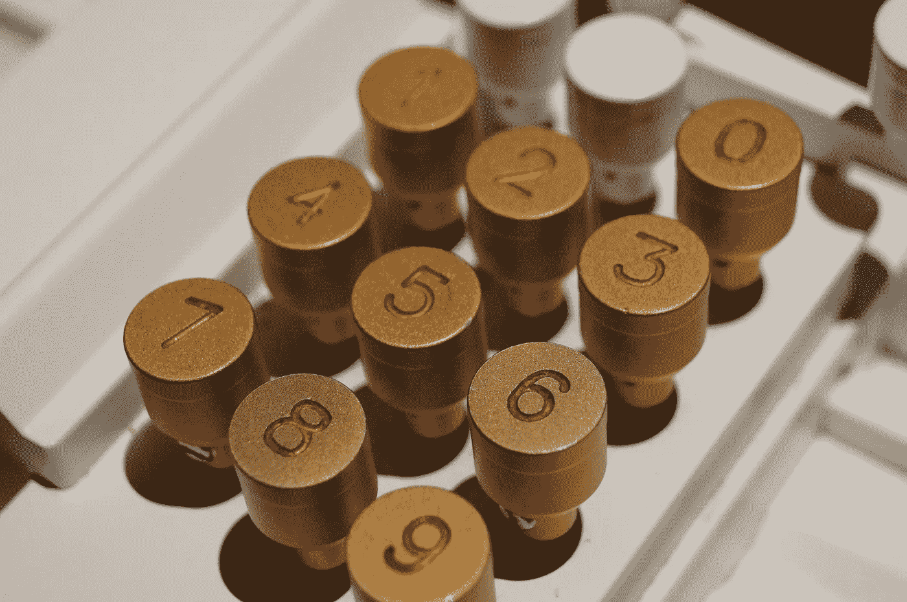

# Golang 中的分类训练

> 原文：<https://levelup.gitconnected.com/sorting-workout-in-golang-5b49cbe9154f>

## 对数据列表进行排序是最常见的任务之一，您可能会发现自己经常编写代码。本文探讨了 Golang 中的一些技术，这些技术应该可以简化任何数据集合的排序。



詹姆斯·奥尔在 [Unsplash](https://unsplash.com/s/photos/numbers?utm_source=unsplash&utm_medium=referral&utm_content=creditCopyText) 上的照片

所有编程语言通常都提供现成的工具来对集合进行排序，因为在解决编码任务时，这一任务非常普遍。Go 与它提供的用于执行所有可能的排序操作的排序包没有什么不同。

**注意:**在你进一步深入之前，我期望你对 go 语法和原语类型都有一个初级的了解，以理解源代码。

Go 有标准的`sort`包来进行排序。排序功能就地对数据进行排序。对于基本的数据类型，我们有内置的函数，比如`sort.Ints`和`sort.Strings`。对于更复杂的类型，我们需要通过实现`sort.Interface`来创建我们自己的排序。Golang 的`sort`这个包实现了对内置类型和用户自定义类型的排序。

## 对整数集合进行排序

`**sort.Ints**` 函数对一部分整数进行升序排序。

代码清单 1.1 — [点击运行](https://play.golang.org/p/jhPEyIVt21k)

`**sort.IntsAreSorted**`该方法还用于检查整数切片是否处于其排序形式。

## 对字符串集合进行排序

`**sort.Strings**` 函数对一段字符串进行升序排序。

代码清单 1.2 — [点击运行](https://play.golang.org/p/NCqPT7EVF3z)

`**sort.StringsAreSorted**`该方法还用于检查一个字符串片段是否处于其排序形式。

## 对浮点集合进行排序

`**sort.Float64s**` 函数对一片浮点值进行升序排序。

代码清单 1.3 — [点击运行](https://play.golang.org/p/YE38WrThlND)

`**math.NaN()**`返回一个 IEEE 754“非数字”值。`**Float64sAreSorted()**`报告切片 x 是否按升序排序，非数字(NaN)值在任何其他值之前。

## 使用匿名函数对结构集合进行排序

要对 Golang 中的一部分结构进行排序，需要使用一个`***less***`函数以及`***sort.Slice***`或`***sort.SliceStable***`方法。您需要提供`less`函数的实现来比较结构字段。下面是我们如何根据姓名和年龄对一部分人进行排序的方法，例如:

代码清单 1.4 — [点击运行](https://play.golang.org/p/_rYx_01GRmQ)

从`*less*`函数返回`*true*`将导致索引`*i*`处的元素被排序到比索引`*j*`更低的位置(索引`*i*`处的元素将出现在排序后的片的最前面)。否则，如果返回`*false*`，索引`*j*`处的元素将首先出现。

`*sort.Slice*`和`*sort.SliceStable*`的区别在于，后者会保持相等元素的原始顺序，而前者可能不会。

## 使用 Len、Less 和 Swap 对自定义数据结构进行排序

对于更复杂的类型，我们需要通过实现`sort.Interface`来创建我们自己的排序:

```
type Interface interface {
    Len() int
    Less(i, j int) bool
    Swap(i, j int)
}
```

下面的例子说明了这种类型的实现。

代码清单 1.4 — [点击运行](https://play.golang.org/p/7Y91NtIbrsK)

> **原列表**——[" rust-lang "、" golang "、" java "、" c "、" c++ "、" dot-net "、" perl"]
> 
> **排序列表**——[" c "、" c++ "、" perl "、" java "、" golang "、" dot-net "、" rust-lang"]

定义了一个新的类型 LengthBasedStrings 来保存字符串列表。这种类型实现了所需的接口，因此很容易与 *sort 一起使用。*排序()方法。Sort()方法的定义是

`**func sort.Sort(data sort.Interface)**`

## 排序映射键或值

Golang 中的地图是*无序集合*，所以没有使用`*sort*`包对地图进行排序的规定。然而，如果您真的需要对一个映射进行排序，您可以通过将 key&值分开来为它编写您的自定义实现。

## 结论

在 Golang 中，通过使用`*sort*`包对收集的数据进行排序是非常简单的，上面介绍的解决方案应该可以满足你将要面对的大多数情况。

> 感谢您的阅读，祝您编码愉快！😃