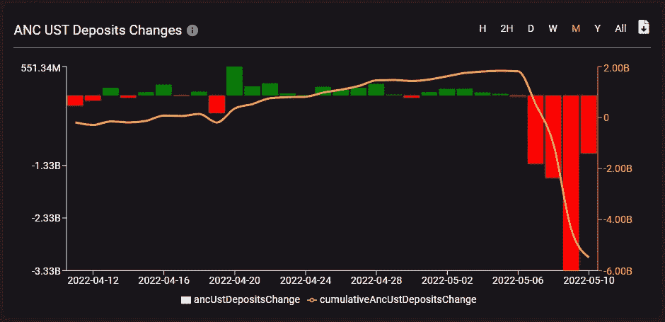

# 南韩因 UST 崩溃起诉 Terraform 实验室首席执行官

> 原文：<https://levelup.gitconnected.com/south-korea-sues-terraform-labs-ceo-over-ust-collapse-16bc001e6bfb>

南韩最大的律师事务所之一，LKB 律师事务所，正准备起诉 Terraform Labs 的首席执行官道权。当地媒体援引公司声明对此进行了报道。

LKB 指出，他们是代表普通投资者申请的。由于算法稳定币 [TerraUSD (UST)](https://coinmarketcap.com/currencies/terrausd/) 的崩溃而遭受损失的公司的几名员工可能会加入诉讼。

LKB 代表还计划向首尔警察厅金融调查部提起诉讼，并向该市[南区检察院](https://www.prokuratuur.ee/en/contacts/southern-district-prosecutors-office)请求扣押权的财产。

据韩联社报道，LKB 律师正在考虑对项目创始人 Daniel Shin 提起诉讼。

UST 和卢娜的价格在 5 月 10 日开始下跌。这是在由于存款回报率降至 17.87%而导致资产从锚定协议流出的背景下发生的。结果，早在 5 月 8 日，“稳定币”就在短时间内失去了与美元的挂钩。

由于这一事件，币安加密货币交易所暂时冻结了区块链的提款。用户注意到平台的空订单簿。

TerraUSD 是最大的美元稳定货币之一。据 CoinGecko 称，其资本总额超过 160 亿美元。由于本地加密货币 LUNA 的燃烧机制用于发行 UST，因此这两种资产的价格密切相关。

> *“这种关系的存在造成了显著的通胀风险，当稳定的玉米从土地生态系统中撤出时，这种风险就会出现。对市场过程的这种回顾表明，由于套利者，大量 UST 从流通中退出并不影响后者的价值，但是，这种操作刺激了 LUNA 价格的下降。在市场下跌和负面消息出现的情况下，可以观察到加密货币的价值显著下降。*

UST 与美元的平价模式在很大程度上依赖于套利者。如果一枚稳定币的价格跌破 1 美元，交易者可以买入并用卢纳兑换成 1 美元，从而获利。

然而，要使这一机制发挥作用，就必须确保对目标资产的需求。在 UST 的例子中，提供这种需求的平台是 Terra 生态系统中最大的协议——Anchor。后者在 UST 的存款年利率超过 19%。

根据 SmartStake 的消息，用户在 5 月 9 日从该协议中撤回了超过 33 亿 UST。5 月 10 日不到一天，资金又流出 11 亿 UST。

5 月 11 日继续下跌，随后是 LUNA algorithmic stablecoin，跌至 0.3 美元。

让我提醒你，5 月份，媒体报道了在 UST 和卢娜破产后，Terraform Labs 法律部的三名员工辞职。

该街区当时报道称，Terraform Labs 总法律顾问[马克·戈尔迪奇](https://www.linkedin.com/in/marcgoldich/)、总法律顾问[劳伦斯·弗洛里奥](https://www.linkedin.com/in/florio/details/experience/)和首席诉讼和监管法律顾问[诺亚·埃克斯勒](https://www.linkedin.com/in/noahaxler/)已经离职。根据他们的 LinkedIn 个人资料，他们在不到一年后于 5 月离开了该项目。

非常耸人听闻的故事，我们将进一步跟踪此案，请在评论中留下您的看法。

📰 ***订阅*** [***斐波那契***](https://medium.com/@unclefibonacci) ***保持最新***