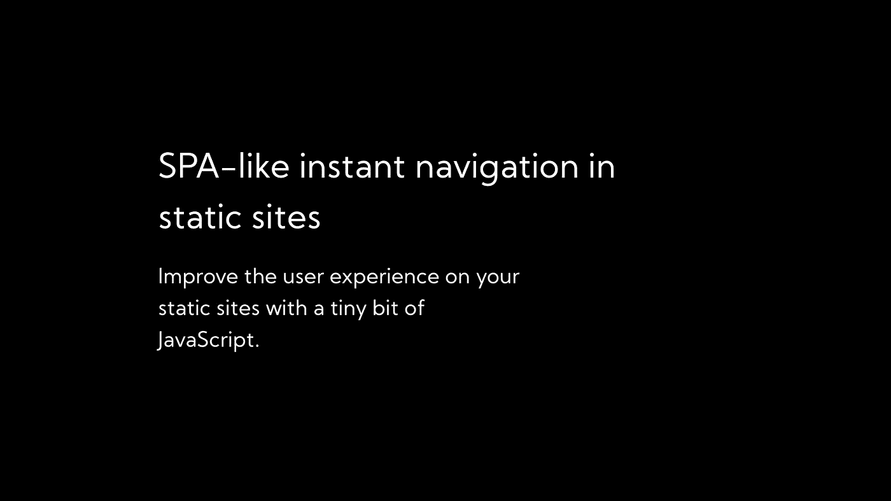

# 静态网站中类似 SPA 的即时导航

> 原文：<https://levelup.gitconnected.com/spa-like-instant-navigation-in-static-sites-69cc07671ac6>

## 用一点点 JavaScript 改进静态站点的用户体验。

单页应用程序具有即时导航功能。你点击一个链接，它立即改变观点。可能没有数据，你可能会看到一个加载屏幕，但导航本身是即时的，我总是在纯静态网站中错过这一点。所以，我想我会尝试实现一些非常简单的东西来实现用户体验的提升。

代码的想法非常简单。我们需要获得页面上的所有链接，检查它们是否是内部的，如果是，我们需要在它们上面添加一个 click 事件处理程序。这个 click 处理程序将阻止默认操作的发生，而是使用浏览器历史 API 推入一个新条目，同时用新内容更新 DOM。只有最后一部分有点复杂。所以我们先来看看浏览器历史 API。

它为我们提供了几个函数，我们可以使用这些函数来操作浏览器历史。它们是:

1.  `back()`
2.  `forward()`
3.  `go()`
4.  `pushState()`
5.  `replaceState()`

`back()`和`forward()`非常简单明了，它们基本上模仿了浏览器中的后退和前进按钮。`go()`是相同的，除了代替后退和前进，你可以精确地指定你想要从当前位置行进多远(负数表示后退，正数表示前进；想象一条数字线，其中 0 是当前位置)。让我们在历史上创造一个新的条目。这也是我们要用于链接的，我们不使用`replaceState()`的原因是它不会创建一个新的条目，它所做的只是更新当前的条目。这将意味着后退和前进按钮不会像预期的那样工作。

好了，让我们开始用代码实现它。首先，我们将监听页面负载，然后遍历所有链接。

现在，对于每个链接，我们必须检查它们是否是内部的。为此，我们可以使用每个`a`标签都有&的`host`属性，将其与`window.location.host`进行比较，如果它们相同，则链接是内部的。我们还将向链接添加一个`data-internal`或`data-external`属性，以便稍后分别设置它们的样式:

现在我们已经有了这个基本的设置，我们需要在内部链接被点击时进行拦截，然后使用`history.pushState()`向浏览器历史添加一个条目。但是`pushState()`有三个参数:状态、标题和 URL。在我们的例子中，我们将使用链接的`href`作为状态对象中的`route`，并将其作为标题& URL 传递。这是它的样子:

**快速注意:**使用`link.getAttribute("href")`而不是`link.href`来获取提供给 DOM 的实际 href。例如，一个类似这样的 a 标签:`<a href="/foo">To foo</a>`当被直接要求 href 时，会给出`http://localhost:5500/foo`(或者它当前所在的任何域)，但是`getAttribute("href")`会返回“/foo”。

很好，现在我们的链接改变了 URL 而没有页面刷新，但是我们的 DOM 没有更新，网页看起来完全一样。所以让我们来解决这个问题。

# 更新 DOM

为了更新 DOM，我们实际上需要获取新的 DOM。由于链接指向的页面确实存在，我们可以使用`fetch()`获取它的 HTML 内容&，然后用它替换我们当前的 HTML。因此，让我们用一个名为`updateDOM`的异步函数来做这件事:

如你所见，非常简单，当提供了像`/about`或`/blog/awesome-post.html`这样的路径时，我们将使用 fetch 获得响应&，然后使用`.text()`函数获得它的纯文本。一旦我们有了它，我们只需将 innerHTML 中的`html`元素设置为这个文本。

现在，当我们的链接被点击时，我们需要调用这个函数:

太好了！现在你应该已经看到你的链接工作。但是这有几个问题。这只适用于第一页。为了解决这个问题，你需要在所有的 html 文件中导入你的脚本，并且我们将在更新 DOM 后立即调用`updateLinks()`。我们还必须确保我们像一个普通的链接一样返回到顶部，否则我们可能会让用户感到困惑。所以现在我们的`updateDom`函数看起来像这样:

现在我们只差后退和前进按钮了。为了处理这个问题，我们需要实际监听一个名为`onpopstate`的窗口事件，这个事件是在点击后退或前进按钮时触发的&需要注意的重要一点是，它是在位置更新后触发的。这意味着我们可以使用`window.location.pathname`作为新路径来更新我们的 DOM。因此，让我们将它添加到代码中:

太好了，现在一切都像预期的那样工作。我们已经走了很长一段路。但是……我们还是可以做一些优化的。现在我们只是更新了整个 html，即使它的很多部分是完全相同的。虽然这对较小的网站来说没有太大的区别，但对较大的网站来说，这是相当不和谐的。这就是为什么我们要为此使用一个小的(550 字节的 minzipped)库。

*—*DOM diff 只是一个函数，它有 4 个参数(&第 5 个可选参数)。这是它需要的:

在我们的例子中，父元素将是`<html>`元素，`currentNodes`将是 html 元素的子节点，`futureNodes`将是我们从获取中接收的 html，&我们的回调可以只是一个简单的返回参数函数。

唯一的问题是我们获取的 html 是文本，而`udomdiff`期望它是一个节点数组。所以我们将使用`DOMParser`和它的`parseFromText()`函数将我们的文本转换成 DOM 节点。然后我们将使用`querySelector`来获取它的 html 元素的子节点。让我们从这个开始:

现在我们已经知道了，让我们使用`udomdiff`:

我们终于完成了！使用少量的 JavaScript 在静态页面之间进行平滑和即时的导航。如果你经常这样做，也许你应该看看像 TurboLinks 这样的已建立的库，但是对于更简单的网站，我还没有遇到任何使用它的边缘案例。

这是这篇文章的全部内容，希望对你有所帮助。你可以在这个 [GitHub Gist](https://gist.github.com/kartiknair/bd26bbc751332f64ba85095230c29314) 中找到完整的源代码。想打个招呼吗？我是推特上的 [@kartikajitnair](https://twitter.com/kartikajitnair) 随意 DM。我现在只有这些了，注意安全！

*原载于* [*我的博客*](https://kartikn.me/writing)